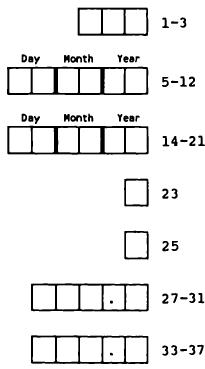

# 6 使用计算机  6 Using a computer  

好消息是统计分析变得更简单、更便宜。坏消息是统计分析变得更简单、更便宜。  
The good news is that statistical analysis is becoming easier and cheaper. The bad news is that statistical analysis is becoming easier and cheaper.  

Hofacker (1983)  
Hofacker (1983)  

## 6.1 引言  6.1 INTRODUCTION  

最近的技术进步使许多医学研究人员能够使用计算机。这一变化总体上是有益的，但应牢记Hofacker上述的话。计算机消除了统计分析中大部分繁琐的部分，并且应当能给出正确的答案，但它们并不能保证我们获得正确且有效的结果。本章将讨论使用计算机进行统计分析的优缺点，并提出数据分析的方法。我还将考虑用于计算机分析的数据收集表格设计。  
Recent technological advances have provided many medical researchers with access to a computer. This change has largely been beneficial, but Hofacker's words above should be borne in mind. Computers remove most of the tedious aspects of statistical analysis, and should give us correct answers, but they do not guarantee that we will obtain correct and valid results. In this chapter I shall consider the advantages and disadvantages of using computers for statistical analysis, and suggest ways to approach the analysis of data. I shall also consider the design of forms for collecting data to be analysed by computer.  

## 6.2 使用计算机的优点  6.2 ADVANTAGES OF USING A COMPUTER  

使用计算机进行统计分析有许多优点。最显而易见的是，它使我们能够完成否则无法完成的任务，但还有许多其他好处：  
There are many advantages in using a computer to carry out statistical analyses. Most obviously it enables us to do things we couldn't otherwise do, but there are many other benefits:  

### (a) 准确性和速度  (a) Accuracy and speed  

优秀的计算机程序（即软件）能快速给出正确答案。手工分析容易出现算术错误，且除最简单任务外速度极慢。  
Good computer programs (known as software) will give the correct answers quickly. Analysis by hand is prone to arithmetical errors, and is painfully slow for all but the simplest tasks.  

### (b) 多功能性  (b) Versatility  

计算机可以访问广泛的统计技术，远超过本书中描述的内容。即使是复杂的分析也能快速完成。  
A computer gives access to a wide range of statistical techniques, many more than are described in this book. Even complex analyses can be performed quickly.  

### (c) 图形  (c) Graphics  

(c) 图形 计算机程序可以轻松生成观察数据或统计结果的图形。应充分利用这一功能。直方图和散点图可用于检查原始数据（见第7章），图形也可用于研究分析结果。第6.8节讨论了与计算机绘图相关的一些实际问题。  
(c) GraphicsComputer programs enable plots of observations or statistical results to be obtained easily. Full advantage should be taken of this facility. Histograms and scatter diagrams can be used to inspect the raw data (see Chapter 7), and plots can also be used to study the results from an analysis. Section 6.8 discusses some practical issues relating to computer plots.  

### (d) 灵活性  (d) Flexibility  

(d) 灵活性 一个主要优点是能够进行小幅修改并重复分析。例如，经过数据变换后重新运行分析很简单，比如取对数（见第7章）；也可以对数据子集执行相同分析，或添加一些新观察值。  
(d) FlexibilityA major advantage is the ability to make small changes and repeat the analysis. For example, it is simple to rerun an analysis after transforming the data, perhaps by taking logs (see Chapter 7), to perform the same analysis on a subset of the data, or to add some new observations.  

### (e) 新变量  (e) New variables  

(e) 新变量 生成新变量非常简单。我们可以根据出生日期和研究日期计算受试者年龄，或者通过计算治疗前后测量值的差异来得出变化量，或统计患者症状的数量。此类计算应始终由计算机完成，因为计算机比手工计算更快、更准确。当然，如果创建新变量的指令错误或输入有误，所有观察值都会出错。  
(e) New variablesIt is simple to generate new variables. We may calculate a subject's age from their date of birth and the date of the study, or the change in a measurement by taking the difference between pre- and post-treatment values, or count the number of symptoms a patient has. Such calculations should always be done on the computer, which is faster and more accurate than doing the calculations by hand. Of course, if the instruction to create a new variable is incorrect or is typed wrongly all of the observations will be wrong.  

### (f) 数据量  (f) Volume of data  

(f) 数据量 可以处理海量数据。实际上，对于某些程序，分析的受试者（病例）数量没有限制。  
(V) Volume of dataVast amounts of data can be handled. Indeed for some programs there is no limit to the number of subjects (cases) that can be analysed.  

### (g) 数据轻松传输  (g) Easy transfer of data  

(g) 数据易于传输 一旦数据被输入到计算机文件中，就可以通过电子方式（如电话线）或邮寄“软盘”的方式轻松地在研究人员之间传输。通常不应重复输入相同的数据，但遗憾的是，不同计算机使用的磁盘格式和大小各异。  
(g) Easy transfer of dataOnce data have been entered into a computer file they can easily be transferred between researchers either electronically (by telephone line) or by sending a 'floppy disk' by post. It should never be necessary to enter the same data into a computer twice, but unfortunately computers use a variety of disk formats and sizes.  

## 6.3 使用计算机的缺点  6.3 DISADVANTAGES OF USING A COMPUTER  

为了平衡主要的优势，统计软件用户应注意几个潜在的问题。  
To counterbalance the major benefits there are several potential problems that users of statistical software should be aware of.  

### (a) 软件错误  (a) Errors in software  

(a) 软件错误 并非所有统计程序都编写得很好。有些程序在某些情况下可能会给出错误的结果，这可能是由于编程不良或对统计理论理解不足。建议使用声誉良好且存在时间较长、已被检验过的程序。  
(a) Errors in softwareNot all statistical programs are well-written. Some may give incorrect answers in certain circumstances, either through poor programming or inadequate understanding of the statistical theory. It is advisable to use programs that are reputable and have been around long enough for errors  

可以找到许多统计软件，其中最著名的有 BMDP、Minitab、SAS 和 SPSS。自微型计算机（PC）问世以来，市场上的统计程序数量大幅增加，其中有些质量较差，甚至存在错误（Bland 和 Altman，1988；Dallal，1988）。第6.4节和6.5节提供了关于选择和评估统计软件的建议。  
to be found, the best known of which are BMDP, Minitab, SAS and SPSS. Since the advent of microcomputers (PCs) there has been a huge increase in the number of statistical programs on the market, some of which are poor and some incorrect (Bland and Altman, 1988; Dallal, 1988). Sections 6.4 and 6.5 give advice about choosing and evaluating statistical software.  

### (b) 多功能性  (b) Versatility  

多功能性被认为是使用计算机的优点之一，但也可能带来困难。由于可用分析方法种类繁多，容易使用不恰当的方法。必须清楚自己统计知识的局限，只使用自己理解的方法。如果遇到需要不熟悉方法的问题，应寻求专家建议。  
Versatility was given as one of the advantages of using a computer, but it can lead to difficulties too. Because of the wide variety of analyses available, it is easy to use an inappropriate method. It is essential to be aware of the limits of your statistical knowledge, and to use only methods that you understand. If your problem seems to require methods you are not familiar with you should seek expert advice.  

### (c) 黑箱方法  (c) The black box approach  

使用计算机可能使你与数据产生距离感。统计分析可以自动完成：数据从一端输入，结果从另一端输出，完全不经过人工思考。由于许多统计分析关注的是平均效应，你可能无法感受到个体的具体反应方式。  
Using a computer may distance you from your data. It is possible to perform statistical analyses automatically: the data go in at one end and the results come out at the other, untouched by human thought. Because much statistical analysis is concerned with average effects you may get no feel for the way individuals respond.  

### (d) 垃圾进，垃圾出  (d) Garbage in garbage out  

“垃圾进，垃圾出”指的是只有合理的问题才能得到合理的答案。如果输入的数据或分析的设定错误，那么结果也会错误。例如，一个常见的问题是如何处理缺失的观测值。当数据输入计算机时，这些值有时会留空，这种情况下该值会自动被视为零，或者它们会被赋予一个数值“缺失代码”，如99。常用的缺失值代码有9、99、999等，或者是负数—只要明确该值不可能是真实观测值即可。  
'Garbage in garbage out' refers to the fact that sensible answers follow only from sensible questions. If the data input or the specification of the analysis was wrong then the results will be wrong. For example, a common problem is what to do about missing observations. When data are entered into the computer such values are sometimes left blank, in which case the value will automatically be taken as zero, or they are given a numerical 'missing value code', such as 99. It is common to use values like 9, 99, 999, etc. as missing values, or perhaps a negative number - any value will do as long as it clearly could not be a genuine observation.  

表3.1显示了25名囊性纤维化患者的PImax值；均值和标准差分别为92.6和24.92 cm $\mathrm{H}_2\mathrm{O}$。假设研究中还有另外5名患者的PImax未知。如果这些值留空（视为零）或编码为999，并将所有30个值用计算机程序分析，结果将如下：  
Table 3.1 showed the PImax values of 25 patients with cystic fibrosis; the mean and standard deviation were 92.6 and 24.92 cm  $\mathrm{H}_2\mathrm{O}$  respectively. Suppose that there had been five other patients in the study whose PImax was unknown. If their values were left blank (zero) or coded 999 and all 30 values analysed by a computer program then the results would have been as follows:  

<table><tr><td rowspan="2">缺失数据的取值</td><td colspan="2">30名受试者的结果</td></tr><tr><td>均值</td><td>标准差</td></tr><tr><td>0</td><td>77.2</td><td>41.79</td></tr><tr><td>999</td><td>243.7</td><td>344.32</td></tr></table>  
<table><tr><td rowspan="2">Value for missing data</td><td colspan="2">Result for 30 subjects</td></tr><tr><td>Mean</td><td>SD</td></tr><tr><td>0</td><td>77.2</td><td>41.79</td></tr><tr><td>999</td><td>243.7</td><td>344.32</td></tr></table>  

这两种结果都严重扭曲了事实。计算机会将0或999视为真实观测值，因此会给出错误的答案。缺失数据必须在程序中明确标识（参见第6.6节）。  
both of which are major distortions of the truth. The computer will accept the values 0 or 999 as genuine observations, and so will give false answers. Missing data must be identified as such to the program (see section 6.6).  

当信息对某些个体不适用而非真正缺失时，也可能出现类似问题。例如，怀孕次数只适用于女性，在研究中男性可能被记录为9或99。这些例子说明了在分析前检查数据的重要性，详见第6.6节和下一章。  
A similar problem may arise when information is not appropriate for some individuals rather than actually missing. For example, the number of pregnancies is only appropriate for women, and may be recorded as 9 or 99 for all males in a study. These examples show the importance of checking the data before analysis, as discussed in section 6.6 and in the next chapter.  

## 6.4 统计程序的类型  6.4 TYPES OF STATISTICAL PROGRAM  

市售统计软件通常能够执行多种统计分析。统计程序，通常称为软件包，其功能和工作方式各异。需要考虑的一些重要方面包括：  
Commercially available statistical software is generally capable of perform­ ing many types of statistical analysis. Statistical programs, often called packages, vary in their capability and the way in which they work. Some of the more important aspects to consider are:  

1. 可用的统计方法   
1. statistical methods available   
2. 准确性   
2. accuracy   
3. 可分析的数据最大容量   
3. maximum amount of data that can be analysed   
4. 数据处理功能（包括编辑）   
4. facilities for data manipulation (including editing)   
5. 处理缺失数据的能力   
5. ability to accept missing data   
6. 易用性（是否“用户友好”？）   
6. ease of use (is it 'user-friendly'？)   
7. 成熟度（是否经过验证和测试？）   
7. maturity (is it tried and tested？)   
8. 速度   
8. speed   
9. 文档支持   
9. documentation   
10. 错误处理   
10. error handling   
11. 图形功能   
11. graphics capability   
12. 输出质量   
12. quality of output   
13. 成本。  
13. cost.  

最重要的考虑因素是上述列表中的前两个，因为显然你需要一个能够执行所需分析并获得正确结果的软件包。然而，评估准确性并不容易。其他关键问题包括能否简单地创建图表，以及在你犯错时（这很常见）是否有有用的错误提示。此外，告诉程序你想要完成什么任务的方法也各不相同。在某些软件包中，需要输入诸如  
The most important considerations are the first two in the above list. because you obviously need a package that will perform the analyses desired and achieve correct results. However, assessing accuracy is not easy. Other key issues are the ability to create plots simply, and helpful error messages when you make a mistake, as you often will. In addition. there are different ways of telling the program what you want done. In some packages one enters commands such as  

 **绘制身高与年龄图**  
**plot height age**  

但在其他情况下，人们从选项菜单中选择。这被称为交互式系统。对于使用命令的程序，通常可以创建一个命令文件，然后作为一个整体执行。这种方法的优点是复杂的指令只需编写一次  
but in others one chooses from a menu of options. This is known as an interactive system. For programs that use commands it is usually possible to create a file of commands which can then be executed as a block. This has the advantage that possibly complicated instructions only have to be  

只需输入一次，且编辑文件以生成略有不同的分析非常容易。  
typed once, and that it is easy to edit the file to produce slightly different analyses.  

除了涵盖广泛分析的统计软件包外，还有一些针对特定用途的专用程序，如计算样本量或置信区间。这些程序也需满足上述某些要求，但主要应根据其完成常规软件包无法实现的特定功能的能力来评判。  
As well as statistical packages, which cover a wide range of analyses, there are also some specialized programs for particular purposes, such as calculating sample sizes or confidence intervals. These are subject to some of the above requirements too, but should be judged mainly on their specific ability to do things that cannot be done in the usual packages.  

在选择使用或购买软件包之前，值得向同事或统计学家寻求建议。我强烈建议你在所有分析中使用同一软件包，因为熟练掌握哪怕一个软件包都需要相当的努力。因此，谨慎选择软件非常重要。本书中涉及的所有分析几乎没有哪个软件包能全部完成，因此你需要了解可能进行的所有分析类型，而这并不容易。市面上有许多微型计算机统计程序（甚至免费软件）可能会产生错误结果（Dallal，1988），如果对某个统计程序有疑问，建议将其输出结果与其他程序进行比较。  
It is worth seeking advice from a colleague or from a statistician before choosing a package to use, or buy. I strongly recommend that you use the same package for all your analyses, as it takes a considerable effort to become fully acquainted with even one package. So it is important to choose your software carefully. Few, if any, packages will perform all the analyses in this book, so that it is necessary to know all the types of analysis you might wish to do, which is not at all easy. There are many microcomputer statistics programs on the market (or even free) that can give incorrect results (Dallal, 1988), so if you have doubts about a particular statistical program it is advisable to compare its output with that from another.  

下一节将讨论评估统计软件的一些方面。如果你确定拥有可靠的软件，可以直接跳到6.6节，那里描述了一般的分析策略。  
The next section discusses some aspects of evaluating statistical software. If you know that you have reliable software then you can go on to section 6.6, which describes a general strategy for analysis.  

## 6.5 评估统计软件包  6.5 EVALUATING A STATISTICAL PACKAGE  

（本节可省略，不影响连贯性。）  
(This section can be omitted without loss of continuity.)  

评估统计计算机程序时的主要关注点是：  
The main concerns when evaluating a statistical computer program are:  

【1】 它是否执行所有期望的功能？  
1. Does it perform all the desired functions？  

【2】 它是否易于使用？  
2. Is it easy to use？  

【3】 它是否给出正确的答案？  
3. Does it give the correct answers？  

同事或统计学家的建议在回答前两个问题时非常有帮助，因为只有熟悉一个软件包后，才能真正判断其价值和易用性。第6.4节中给出的功能列表可以辅助评估。本节的目的是在上述第（3）点上提供有限的帮助。  
Advice from colleagues or from a statistician can be of great assistance in answering the first two questions, because it takes some familiarity with a package before one can really judge its value and ease of use. The list of features given in section 6.4 can aid evaluation. The purpose of this section is to give limited assistance in relation to (3. ) above.  

计算机程序可能给出错误答案，原因要么是使用了错误的公式，要么是程序编写不良。前者虽不太可能，但仍有可能。更常见的问题是程序编写方式导致的。计算机程序执行特定计算的过程称为算法。有些算法在某些情况下会丧失精度，属于较差的算法。举一个简单的例子，可以证明三个数 $x$、$x + c$ 和 $x + 2c$ 的标准差是 $c$，无论 $x$ 和 $c$ 取何值。  
A computer program may give the wrong answers either because it uses an incorrect formula or because it is not well written. The former is unlikely but possible. More often problems occur because of the way in which the program was written. The procedure by which a computer program performs a given calculation is known as an algorithm. Some algorithms are inferior in that they lose accuracy in some circumstances. To take a simple example, it can be shown that the standard deviation of three numbers  $x$ ,  $x + c$  and  $x + 2c$  is  $c$ , whatever values we give  $x$  and  $c$ . I  

我使用两台袖珍计算器计算了多组三个数的标准差，其中 $\pmb{x}$ 增加，但 $c$ 固定为0.1。对于以下四组数字：  
calculated the standard deviations of sets of three numbers where  $\pmb{x}$  increases but  $c$  is held at 0.1 using two pocket calculators. For each of the four sets of numbers  

(a) 7.0 7.1 7.2  
(a) 7.0 7.1 7.2  

(b) 77.0 77.1 77.2  
(b) 77.0 77.1 77.2  

(c) 777.0 777.1 777.2  
(c) 777.0 777.1 777.2  

(d) 7777.0 7777.1 7777.2  
(d) 7777.0 7777.1 7777.2  

两者都给出了正确的答案0.1，但对于该组数据  
both gave the correct answer of 0.1, but for the set  

(e) 77777.0 77777.1 77777.2  
(e) 77777.0 77777.1 77777.2  

一个计算器给出的标准差是0.0，而另一个则显示错误—它无法计算标准差。问题的原因在于，在极端情况下，计算器会因为无法存储数据平方后得到的大数而丧失精度。有些算法可以避免这个问题，虽然我们不指望口袋计算器使用这些算法，但我们肯定期望计算机程序能给出这类数据的正确答案。然而，许多微型计算机软件包仍采用较差的算法（Dallal，1988）。在某些复杂分析中也存在数值精度丢失的风险；关于回归分析的问题将在第12章讨论。  
one calculator gave the standard deviation as 0.0 while the other gave an error - it would not calculate the standard deviation. The reason for this problem is that in extreme circumstances the calculator loses accuracy because it cannot store the large numbers obtained when the data are squared. There are algorithms that avoid this problem, and while we may not expect them to be used on a pocket calculator we would certainly expect a computer program to give the correct answers for such data. However,  many  microcomputer  packages  use  the  inferior  algorithm (Dallal, 1988). There is also a risk of losing numerical accuracy in some complex  analyses;  problems  with  regression  analysis  are  discussed in Chapter 12.  

电子表格软件在执行简单统计分析方面的使用日益增加。这些程序不太适合统计分析，可能使用较差或错误的方法。我不推荐它们用于严肃的统计工作。  
Increasing use is being made of spreadsheet software for performing simple statistical analyses. These programs are not well suited to statistics, and may use inferior or incorrect methods. I do not recommend them for serious statistics.  

对于某些类型的分析，还需考虑使用哪种形式的检验，尤其当存在多种形式时。后续章节将讨论单边和双边检验、连续性校正的使用以及秩次分析（非参数方法）中对平局的调整等问题。了解程序具体采用的方法非常重要，而这往往在手册中并不明确。实际上，有些手册甚至具有误导性（Bland 和 Altman，1988）。  
Another aspect to consider for some types of analysis is which form of a test is used when there are different forms available. Subsequent chapters will discuss matters such as one and two- sided tests, the use of continuity corrections, and the adjustment for ties in analyses of ranks (non- paramet­ ric methods). It is important to know precisely what method the program uses, and this is not always clear from the manual. Indeed some manuals are positively misleading (Bland and Altman, 1988).  

首次使用软件包进行特定分析时，建议先分析一些已知答案的数据集。本书尽可能提供了示例的原始数据，方便读者进行此类练习。  
When using a package to perform a particular analysis for the first time it is advisable to begin by analysing some sets of data for which you already know the answers. In this book the raw data are given for the worked examples wherever possible to enable you to do this.  

## 6.6 计算机辅助分析策略  6.6 STRATEGY FOR COMPUTER-AIDED ANALYSIS  

本节包含在计算机上分析数据的总体策略。请注意，在进入数据分析之前，需要经过若干步骤。  
This section contains a broad strategy for analysing data on a computer. Notice that there are several steps to pass through before moving to the analysis of the data.  

### (a) 数据收集  (a) Data collection  

(a) 数据收集  
第6.7节描述了为将要输入计算机的数据准备编码表的几个方面。如果有一个设计良好的编码表，数据录入将更快且更准确。  
(a) Data collectionSection 6.7 describes several aspects of preparing a coding sheet for data that are going to be typed into a computer. Data entry will be much quicker and more accurate if there is a well-designed coding form to work from.  

### (b) 数据录入  (b) Data entry  

(b) 数据录入  
数据应输入到计算机中的文件中。这可以在统计软件包内完成，也可以使用通用编辑程序。存储数据的原因是你常常需要在以后进行进一步分析，而且只需输入一次数据。同时，列出数据并检查数值是否正确录入也很方便。第6.7节讨论了数据文件的格式。无法读取文件中数据的统计软件包应被淘汰。  
(b) Data entryData should be typed into a file on the computer. This may be possible within the statistics package or using a general purpose editing program. The reason for storing the data is that you will often need to carry out further analyses at a later date, and you only want to enter the data once. Also it is easy to list the data and check that the values have been entered correctly. I consider formats for data files in section 6.7. A statistical package that cannot read data from a file should be rejected.  

### (c) 数据检查  (c) Data checking  

(c) 数据检查  
人们往往认为数据一旦输入计算机就是正确的。实际上，无论多么小心，输入（键入）数据时都很容易出错。无论多么繁琐，必须检查数据是否正确录入。减少错误的最好方法是让两个人分别录入数据两遍。此时，使用文件比较程序非常有用。检查两个文件间的差异，并确定正确的数值。第7.2节讨论了数据检查。  
(c) Data checkingThere is a tendency to believe that once the data are on the computer they must be correct. In fact it is all too easy to make errors when entering (typing) data, however careful one is. It is essential to check that the data have been typed correctly, however tedious this may be. The best way to minimize errors is to have the data entered twice, preferably by two different people. Here it is useful to have a program for comparing files. Any differences between the two files are checked and the correct value obtained. Data checking is discussed in section 7.2.  

### (d) 数据筛选  (d) Data screening  

(d) 数据筛选  
在开始主要统计分析之前，重要的是先观察数据。制作每个变量的直方图是简单的任务，变量对之间可以通过散点图进行检查。这些图表能初步展示平均值、变异性、分布形态，以及是否存在异常值或缺失值。第7.5节讨论了数据筛选。  
(d) Data screeningBefore starting the main statistical analysis it is important to look at the data. It is a simple task to produce a histogram of each variable, and pairs of variables can be inspected by scatter diagrams. These plots will give a first idea of the average value, the variability, the shape of the distribution, and whether there are any outlying or missing values. Data screening is discussed in section 7.5.  

### (e) 数据分析  (e) Data analysis  

适当的统计分析形式通常直接来源于研究设计。特别是，变量的数值可能在组间或组内进行比较，如第5章所述。组内比较必须使用针对该类型数据设计的技术。  
The appropriate form of statistical analysis will often follow directly from the design. In particular, values of a variable may be compared between groups or within a group, as discussed in Chapter 5. Within group comparisons must make use of techniques intended for that type of data.  

研究目标应指明几个主要感兴趣的分析。虽然预先指定的分析最为重要，但对数据的观察可能提示一些额外的有趣分析。这些“探索性”分析的结果应谨慎解读（见第8章）。  
The objectives of the study should indicate a few main analyses of interest. Although the pre- specified analyses are the most important ones, inspection of the data may suggest some additional analyses of interest. The results of these 'exploratory' analyses should be interpreted cautiously (see Chapter 8).  

许多统计方法基于对数据的某些假设。  
Many statistical methods are based on certain assumptions about the  

这些假设可能需要通过进一步分析来验证。  
data. These may require further analyses to verify them.  

我强烈建议如果软件支持，保持一个计算会话的“日志”，其中同时显示输入命令和结果。尤其当命令未保存到文件时，这一点尤为重要。  
I strongly recommend that you keep a 'log' of the computing session if the software has the facility, in which both the input commands and results are shown. This is especially important when the commands are not stored on a file.  

### (f) 结果检查  (f) Checking results  

(f) 结果检查 你应检查结果是否对应正确的观测数量—无意中丢失或多出几个病例是很容易的。重要的是要认识到，计算机给出的结果不应被自动视为正确。对数据进行简单的初步检查应能让你对预期结果有所了解。如果结果与预期明显不同，则应检查数据是否有错误，以及是否进行了正确的分析。分析数据时容易出错，尤其是复杂分析。计算机只有在你提出正确问题时才会给出正确答案。显然，如前所述，有分析日志时检查结果会容易得多。  
(f) Checking resultsYou should check that the results relate to the correct number of observations – it is surprisingly easy to lose or gain a few cases unwittingly. It is important to appreciate that the results obtained from a computer should not be taken as automatically correct. Simple preliminary inspection of the data should give you some idea of what results to expect. If the results obtained differ markedly from expectation, then you should check that there are no errors in the data, and that the proper analysis has been performed. It is easy to make mistakes when trying to analyse data, especially with complex analyses. The computer will give you the correct answer only if you ask the correct question. Clearly it is much easier to check results when there is a log of the analysis, as suggested above.  

### (g) 结果解释  (g) Interpretation  

(g) 结果解释 结果的解释将在后续章节讨论。  
(g) InterpretationInterpretation of results is discussed in subsequent chapters.  

## 6.7 数据收集表格  6.7 FORMS FOR DATA COLLECTION  

当数据将用于计算机后续分析时，使用带有每位数字指定框的标准表格是个好主意。这适用于从现有记录（如医院病历）中提取数据的研究，也适用于前瞻性研究。尤其当每个个体收集许多变量信息时，这一点非常重要。  
When data are to be collected for subsequent analysis using a computer, it is a good idea to use a standard form with assigned boxes for each digit. This applies to studies where data are to be extracted from existing records, such as hospital notes, as well as to prospective studies. It is especially important when information on many variables is collected for each individual.  

我将先考虑计算机程序从文件接收（读取）数据的不同方式，然后讨论表格设计的相关方面。关于表格设计的进一步讨论见Pocock（1983，第160-166页）、De Pauw和Buyse（1984）（特别针对癌症试验）以及Armitage和Berry（1987，第8-14页）。  
I shall first consider alternative ways in which computer programs can accept (read) data from a file, and then aspects of form design. Further discussion of form design is given by Pocock (1983, pp. 160- 6), De Pauw and Buyse (1984) (with special reference to cancer trials) and Armitage and Berry (1987, pp. 8- 14).  

### 6.7.1 计算机程序输入格式  6.7.1 Formats for input to computer programs  

6.7.1 计算机程序输入格式 大多数软件包能读取的一种标准格式（称为自由格式）如图6.1所示，该图展示了一项比较两种降压药的试验中部分数据。这里文件的每一行包含一个个体的多个变量，每个信息项之间用一个或多个空格分隔。列不必像示例中那样垂直对齐，但我建议这样做，  
6.7.1 Formats for input to computer programsA standard format (called free format) that most packages will read is shown in Figure 6.1 which illustrates the first part of the data from a trial comparing two antihypertensive drugs. Here each row of the file contains several variables for one individual and each item of information is separated from the next by one or more spaces. There is no necessity for the columns to line up vertically as in this example, but I recommend this  

001 17 02 89 25 11 33 1 2 170.2 77.1 141 82 129 79 002 21 02 89 02 02 44 1 1 162.3 80.8 150 85 144 81 003 28 02 89 14 06 40 2 2 151.9 72.2 142 79 142 76 004 05 03 89 01 12 28 1 1 178.8 91.4 181 101 155 87 005 11 03 89 18 05 48 1 1 166.0 81.8 170 90 158 84 006 12 03 89 24 09 37 2 1 171.4 73.3 139 82 134 78 007 17 03 89 07 04 36 2 2 155.8 61.5 184 107 177 102 008 20 03 89 12 02 38 1 2 185.2 100.6 157 93 150 88  

等等  
etc  

图6.1 一种普遍适用的数据布局样式示例，用于输入统计计算机程序。不同项目由一个或多个空格分隔，每列数字对齐。各列依次包含患者编号、入组日期、出生日期、性别、治疗方案、身高、体重、初始血压（收缩压和舒张压）及最终血压。  
Figure 6.1 An example of a generally applicable style of data layout for entry into a statistical computer program. Different items are separated by one or more spaces and the figures in each column are aligned. The columns contain, in sequence, patient number, date of entry to study, date of birth, sex, treatment, height, weight, initial blood pressure (systolic and diastolic) and final blood pressure.  

这种做法便于目视检查所有信息是否正确录入。我强烈建议使用代码编号来标识每位受试者，如图6.1所示。这便于核查可疑值、后续添加变量、确认无重复受试者等。  
practice as it makes it easy to check visually that all information has been entered correctly. I strongly recommend that a code number is used to identify each subject, as in Figure 6.1. This makes it easy to check any suspicious values, to add extra variables at a later date, to check that nobody is in the study twice, and so on.  

自由格式的替代方案是固定格式，数据文件中项目间不需空格分隔。此格式的缺点是必须告知程序具体格式，若不熟悉编程则较复杂。固定格式可用空白表示缺失数据，但这并不理想，因为空白无法区分是故意缺失还是疏漏。此外，大多数程序会将空白解释为零，这可能导致严重错误（见6.3节）。固定格式文件占用的磁盘空间稍小，但实际影响不大。并非所有软件包都支持固定格式，且自由格式更易处理。  
The alternative to free format is fixed format, in which items need not be separated by spaces in the data file. The disadvantage of this format is that it is necessary to tell the program the precise format used, and this can be complicated if you are unused to computer programming. With fixed format you can use blanks to indicate missing data, but this is a bad idea as a blank cannot be distinguished from an omission due to oversight. Also, most programs will interpret blanks as zero, which is potentially disastrous (as shown in section 6.3). Fixed format files occupy slightly less space on the disk, but this is of no real practical consequence. Not all packages can accept data in fixed format, and in any case free format is easier to deal with.  

统计程序要求每个受试者每个变量都有值，自由格式的一个优点是即使缺失值也需输入某个数值。不能用空白，因为空白用于分隔相邻项目。有些程序允许用特殊符号（如 ？ 或 *）表示缺失数据，否则必须用该变量不可能出现的数值（如 -1 或 99）代替，并且要记得在程序中指定该缺失值代码。  
Statistical programs require a value for every variable for each subject, so a good feature of free format is that you will need to enter some quantity even when a value is missing. A blank cannot be used because blanks are used to separate adjacent items. Some programs have the useful facility of letting you indicate missing data in the file by a special symbol, such as ？ or *. Otherwise you must give missing data a numerical value which is impossible for that variable, perhaps - 1 or 99, and then remember to give the appropriate instruction to the program to indicate  

若无缺失值代码功能，统计软件包将不可接受。  
the missing value code. The absence of a missing value code facility would make a statistical package unacceptable.  

当每个个体的数据太多，无法在屏幕宽度（80字符）内显示时，程序处理方式多样，需查阅手册。  
There is a variety of ways in which programs can handle the situation where you have too much data for each individual to fit onto the width of your screen (80 characters). You will need to consult your manual.  

### 6.7.2 表单设计  6.7.2 Form design  

图6.2展示了一个可用于收集图6.1中数据的表格。其部分特征已在前文描述过，如受试者的识别代码。每组方框旁的数字表示数据输入计算机时，从行首开始的字符数。缺失的数字表示每条信息之间有空格，说明数据采用自由格式。注意，患者姓名不应录入计算机文件。  
Figure 6.2 shows a form that could have been used to collect the data shown in Figure 6.1. Some of its features have been described already, such as the subject's identifying code number. The numbers associated with each group of boxes indicate the number of characters from the start of the line when the data are typed into the computer. The missing numbers mean that there is a blank between each piece of information, indicating that the data will be in free format. Note that the patient's name should not be entered into the computer file.  

患者姓名  
Patient's name  

患者编号  
Patient's number  

入组日期  
Date of entry to study  

出生日期  
Date of birth  

性别（1=男，2=女）  
Sex (1=Male, 2=Female)  

药物（1=Andreprevin，2=Doryprevin）  
Drug (1=Andreprevin, 2=Doryprevin)  

身高（厘米）  
Height (cm)  

体重（千克）  
Weight (kg)  

初始血压（毫米汞柱）  
Initial Blood Pressure (mm Hg)  

末次血压（毫米汞柱）  
Final Blood Pressure (mm Hg)  

  

  
图6.2 用于收集比较两种降压药试验数据的表格部分，对应图6.1中的数据。  
Figure 6.2 Part of a form to collect data for a trial comparing two antihypertensive drugs, corresponding to the data in Figure 6.1.  

设计用于记录数据的表格需要仔细考虑。分类变量和连续变量带来不同的问题。  
The way in which forms are designed for recording data needs careful thought. Categorical and continuous variables pose different problems.  

#### (a) 分类数据  (a) Categorical data  

应该给每个可能的类别分配一个数字，如以下示例：  
A number should be assigned to each possible category, as in the following examples:  

糖尿病：$\mathbf{1} = \mathbf{是}$ $2 = \mathbf{否}$ 血型：$\mathbf{1} = \mathbf{A}$ $2 = \mathbf{B}$ $3 = \mathbf{AB}$ $4 = 0$  
Diabetes:  $\mathbf{1} = \mathbf{Y}\mathbf{e}\mathbf{s}$ $2 = \mathbf{N}\mathbf{o}$  Blood group:  $\mathbf{1} = \mathbf{A}$ $2 = \mathbf{B}$ $3 = \mathbf{A}\mathbf{B}$ $4 = 0$  

我强烈建议所有编码都直接写在表格上，而不是放在单独的纸张上。图6.2展示了两个简单的例子。如果必须使用大于9的编码，则需要第二个方框。  
I strongly recommend that all the codes are on the form itself rather than on a separate sheet. Two simple examples are shown in Figure 6.2. If it is necessary to use codes higher than nine, a second box will be needed.  

当使用固定格式时，建议避免使用0作为编码，因为某些程序无法区分0和未填写的空白框。自由格式输入则不存在此问题，因为每个变量都必须输入一个数值。  
It is advisable to avoid zero as a code when fixed format is used, as some programs do not distinguish 0 from a blank corresponding to a box which has not been filled in. This is not a problem for free format input, as some number must be entered for every variable.  

有些变量可能有多个非互斥的答案，如既往或同时用药。此时需要为每个感兴趣的答案设置一个是/否的方框。尽可能保持编码一致是理想的，例如所有是/否问题应使用相同的编码。  
Some variables have several possible non- mutually exclusive answers, such as prior or concomitant therapy. Here it is necessary to have one yes/no box for each possible answer of interest. It is desirable to have consistent codes where possible. For example, all questions with yes or no answers should use the same codes.  

有些程序允许用字母代替数字作为分类数据的编码。例如性别可用M或F表示，药物可用A或D表示。这有一定优势，但意味着数据文件不一定能被所有程序接受。  
It is possible with some programs to use letters instead of numbers for categorical data. Thus sex could be entered as M or F, and drug as, say, A or D. This has some advantages, but means that the data file will not be acceptable to all programs.  

#### （b）连续数据  (b) Continuous data  

测量值应记录到与测量精度相同的程度—在记录前四舍五入数值没有任何优势。通常也不建议在记录数据时将连续变量分类，例如通过给数值范围分配数字代码。为了统计分析，最好尽可能精确地记录数据。每个数字应占一个方格，且如果相关，应显示小数点的位置，如图6.2中身高和体重所示。小数点不必占用单独的方格；如果此处省略小数点，分析前我们需要将所有身高和体重除以10。表格上标明所用单位很有用，尤其是在常用单位有多种选择时。  
Measurements should be recorded to the same accuracy as that to which they are measured - there is no advantage in rounding values before recording them. Nor is it usually a good idea to categorize continuous variables when recording data, for example by allocating numeric codes to ranges of values. For statistical analysis it is desirable to have the data recorded as precisely as possible. One box should be allowed for each digit, and the location of the decimal point should be shown if relevant, as for height and weight in Figure 6.2. The decimal point does not have to have its own box; if it were omitted here we would need to divide all heights and weights by 10 before analysis. It is useful to indicate on the form the units used, especially where there are alternatives in common use.  

每个方格只能放一个数字，因此必须为可能记录的最大值预留足够的方格。例如，成人体重以千克计，应在小数点前预留三个方格，因为有人体重超过100千克。即使第一个方格最终未被使用，也无妨。  
Only one digit should go in each box, so it is essential to allow enough boxes for the largest value that could be recorded. Thus we ought to allow three boxes before the decimal point for adult body weight in kg because some people weigh more than  $100\mathrm{kg}$  . It will not matter if it turns out that the first box is never used.  

填写表格的人应理解在不需要使用所有方格时，使用右侧方格的重要性。  
Whoever fills in the forms should understand the importance of using the  

因此，舒张压低于100时，必须填写在三个可用方格中的第二和第三个方格内。  
right- hand boxes when not all boxes are needed. Thus diastolic blood pressure below 100 must be written in the second and third of the three available boxes.  

#### (c) 日期  (c) Dates  

英国通常的日期顺序是日、月、年，如图6.2所示，但在美国则是月、日、年。表格上注明所需的顺序非常重要。  
The usual British ordering of dates is day, month, year, as shown in Figure 6.2, but in the USA it is month, day, year. It is important to indicate on the form which order is required.  

事实上，年、月、日的顺序是一个不错的选择，尽管不太常见，但它允许通过将日期视为六位数字来简单排序数据。  
In fact the order year, month, day is a good option, apart from its unfamiliarity, as it allows the data to be sorted simply by using the date as a six digit number.  

#### (d) 缺失数据  (d) Missing data  

如果你的程序接受用于此目的的符号，比如\*，那么可以使用，但这意味着你的文件可能无法被其他统计程序读取。否则，应使用特殊的数字代码。最常用的方法是用数字9填满每个格子，例如未知的血压记录为999，未知的性别记录为9。  
If your program will accept a symbol for this purpose, such as \*, then this can be used, but it will mean that your file may not be readable by any other statistical program. Otherwise a special numeric code should be used. The most common method is to fill each box with nines, so that unknown blood pressure is recorded as 999 and unknown sex as 9.  

### 6.7.3 多重形式  6.7.3 Multiple forms  

临床数据通常是在每次见到受试者时收集的，例如在怀孕期间。当患者的随访次数不均等时，研究对象之间的信息量也会有所不同。图6.1中隐含的假设是每个受试者的信息量应相同。虽然可以使用一种称为数据库的软件存储每个受试者不等量的数据，但大多数统计软件只能处理所有受试者均有相同信息的数据集（称为矩形数据）。在开始分析之前，通常需要对这类数据集进行一定的汇总。  
Clinical data are often obtained from a subject each time they are seen, for example during pregnancy. When patients are not seen equally often there will be varying amounts of information among the subjects being studied. It is implicit in Figure 6.1 that there should be the same amount of information about each subject. Although unequal amounts of data per subject can be stored using a type of software known as a database, most statistical computer programs can only deal with data sets where the same information is available for all subjects (called rectangular data). Some summarizing of such data sets will be necessary before analysis can begin.  

绝不应简单地将每次随访视为独立的数据集—将来自同一患者的多条记录当作多名患者的数据是完全无效的。在研究设计阶段，即使是基于回顾性病例记录的研究，也应考虑数据量的差异。这类数据在组织成适合统计分析的形式时可能极为复杂。如果必须从每个受试者收集多组数据，我建议寻求专家协助。  
The simple expedient of treating each visit as a separate data set should never be adopted - it is completely invalid to treat multiple records from one patient as if they were from several patients. The amount of data should be considered when the study is being planned, even for retrospective studies based on examining case notes. This type of data can be extremely difficult to organize appropriately for statistical analysis. I recommend expert assistance if it is necessary to collect multiple sets of data from each subject.  

### 6.7.4 文件中数据的分析  6.7.4 Analysis of data on a file  

上述格式的一个结果是，计算机文件中的每一行代表一个个体，不同的变量分布在各列。许多分析中我们希望比较受试者的亚组，因此有必要  
A consequence of the formats described above is that on the computer file each row represents an individual, with different variables in columns. In many analyses we wish to compare subgroups of subjects, so it is necessary  

程序能够接受所有数值都在同一列中，而子组指示符在另一列中的数据。例如，对于图6.1和6.2中显示的数据，我们希望比较接受不同治疗的患者的最终血压值。一些程序要求比较的数据集必须位于不同的列中，这种情况下它们不适合对以所述方式存储的文件数据进行统计分析。这是评估统计软件时需要考虑的另一个特点。  
for the program to accept data where all the values are in a single column, and an indicator of the subgroup is in a different column. For example, for the data shown in Figures 6.1 and 6.2 we would wish to compare final blood pressures for patients receiving the different treatments. Some programs expect sets of data to be compared to be in different columns, in which case they would be unsuitable for statistical analysis of data stored in files in the manner described. This is a further feature to be considered when evaluating statistical software.  

## 6.8 绘图  6.8 PLOTTING  

使用计算机的一个主要优势是能够绘制数据图。无论是在屏幕上还是纸上绘图，都可以生成两种类型的图—折线图或高分辨率图。第一种方法使用常见的“字母数字”字符集，将每个点尽可能准确地放置在其正确位置，而第二种方法利用计算机的图形功能，提供更精确的绘图。图6.3显示了图11.4中数据的折线图；大多数统计软件包都能生成折线图。重合的点通常通过显示点的数量（最多9个）来表示。指定坐标轴的比例和区分不同组别通常较为困难。大多数统计软件包可以绘制直方图和散点图，有些还能生成箱线图或茎叶图。折线图在数据分析中非常有用，但质量不是最高。直到最近，少数统计软件包能生成高分辨率图，但改进的图形功能正变得越来越普遍。本书中的图形  
The ability to plot data is a major advantage of using a computer. There are two types of plot that can be produced, whether plotting on the screen or on paper - a line plot or a high- resolution plot. The first method uses the usual 'alphanumeric' character set and places each point as near as possible to its correct location, while the second uses the graphical capability of the computer to give a much more accurate plot. Figure 6.3 shows a line plot of the data shown in Figure 11.4; line plots can be produced by most statistical packages. Coincident points are usually indicated by showing the number of points (up to 9). It is often difficult to specify the scaling of axes and to indicate different groups. Most statistical packages can plot histograms and scatter diagrams, and some can produce box- and- whisker or stem- and- leaf plots. Line plots are very useful when analysing data, but they are not of top quality. Until recently few statistical packages could produce high- resolution plots, but improved graphical facilities are becoming more common. The figures in this book were  

  
图6.3 显示了图11.4中数据的折线图，涉及哺乳动物母体体重对胎儿体重的对数关系。  
Figure 6.3 Line plot of data shown in Figure 11.4 relating log maternal weight to log fetal weight in mammals.  

是在个人计算机上（使用STATA软件包）生成，并通过高分辨率激光打印机打印的。  
produced on a personal computer (using the package STATA) and printed on a high- resolution laser printer.  

## 6.9 计算机的其他用途  6.9 OTHER USES OF COMPUTERS  

计算机在统计学上的显著主要价值在于数据分析，如前所述，还包括绘制图表。然而，还有一些其他应用也很有用，主要涉及随机数。  
The obvious main statistical value of computers is in the analysis of data and, as just indicated, for producing graphs. However, there are some other applications which can be useful, mostly relating to random numbers.  

我们在第5章中看到随机分配在研究中的重要性，尤其是在临床试验中分配治疗。表B13可用于此目的，它是由计算机程序通过一种算法生成的，该算法产生的数字序列几乎具有随机数的所有特性。使用表的缺点是每次必须使用同一组数字，尽管可以从表中的任意位置开始。更好的方法是每次使用合适的算法生成新的随机数，许多统计程序都能做到这一点。算法的质量各异，但都足以满足治疗分配的需要。  
We saw in Chapter 5 the importance of random allocation in research, especially for allocation of treatments in clinical trials. Table B13, which can be used for this purpose, was generated by a computer program using an algorithm that produces a sequence of numbers which have virtually the same properties as random numbers. The disadvantage of using a table is that you must use the same set of numbers each time, although you can start at an arbitrary place in the table. It is better to generate new random numbers each time using a suitable algorithm, and many statistical programs can do this. Algorithms vary in quality, but all are likely to be good enough for treatment allocation.  

表B13中的数字是0到9之间的数字，因此是均匀分布的随机样本，如第4章所述。有时我们希望从其他分布中获得随机样本，特别是正态分布，以便在已知条件下研究变异性。第4.7图展示了从标准正态分布中抽取的50个随机样本，这就是这种用法的一个例子。多个程序可以生成来自正态分布的随机样本。  
The numbers in Table B13 are digits in the range 0 to 9, and are thus a random sample from a Uniform distribution, as described in Chapter 4. Sometimes we wish to obtain a random sample from some other distribution, especially the Normal distribution, in order to study variability under known conditions. An example of this use was seen in Figure 4.7 which showed random samples of size 50 from a standard Normal distribution. Several programs can generate random samples from a Normal distribution.  

研究在特定情境下发生的情况是称为模拟法的一种简单方法。其思想是研究在对过程性质做出某些假设下会发生什么，以及改变假设的影响。第8章中使用模拟来说明从具有特定特征的总体中抽取样本的变异性。  
Investigating what happens in a defined situation is a simple example of an approach known as simulation. The idea is to study what happens under certain assumptions about the nature of a process, and what the effect is of varying the assumptions. Simulation is used in Chapter 8 to illustrate variability among samples drawn from a population with specified characteristics.  

## 6.10 计算机的误用  6.10 MISUSES OF THE COMPUTER  

本章前面已经提到使用计算机的一些缺点。还有三个应避免的计算机误用。  
Some disadvantages of using computers were given earlier in this chapter. There are three further misuses of computers that should be avoided.  

### (a) “数据挖掘”  (a) 'Data-dredging'  

许多研究有明确的目标，但也会收集其他“可能有趣”的信息。在没有明确目标的研究中，很容易进行大量统计分析，希望能发现一些有趣的结果。正如我们将在第8章看到的，当总体中不存在真实关系时，仅凭样本数据就有很大可能偶然发现某种表面关系。  
Many studies have clearly defined objectives, but other information is collected because it 'may be interesting'. It is easy to perform a large number of statistical analyses in the hope that something interesting will turn up, especially in studies without clear objectives. As we will see in Chapter 8, there is a good chance of finding some apparent relationship in  

因此，我在第5章强调，主要目标及主要分析应事先明确。任何探索性分析最多只能作为生成假设的手段，供后续研究验证。  
a sample purely by chance when there is no real relationship in the population. For this reason I stressed in Chapter 5 that the main objectives, and thus the principal analyses, should be clearly identified in advance. Any exploratory analyses should be considered as useful, if at all, only for generating hypotheses for examination in further studies.  

### (b) 过度复杂  (b) Over-complexity  

由于方法学可用，可能会诱使你对数据进行复杂的统计分析，但这并非良好的统计实践。分析应限制在回答相关问题所需的最低限度。保持分析简洁的重要原因之一是，更容易向其他研究者解释你所做的工作和发现。  
It may be tempting to subject your data to a complex statistical analysis because the methodology is available, but this is not good statistical practice. The analysis should be restricted to the minimum necessary to answer the relevant questions. One important reason for keeping analyses simple is that it is much easier to explain to other researchers what you did and what you found.  

### (c) 虚假的精确度  (c) Spurious precision  

计算机通常会给出多位有效数字的结果，但报告前几乎总应进行四舍五入。我曾见过发表的方程，声称能预测出生体重精确到 $1 / 10000 \mathrm{g}$，妊娠期长短精确到十分钟，这些结果看起来直接来自计算机输出。第2.8节提供了关于统计分析结果适当数值呈现的一些指导，后续章节也有进一步评论。  
Computers usually produce results to many significant figures, but they should nearly always be rounded before being reported. I have seen published examples of equations purporting to predict birthweight to the nearest  $1 / 10000 \mathrm{g}$  and length of gestation to the nearest ten minutes, results which appeared to have come straight from computer output. Some guidance on the appropriate numerical presentation of the results of statistical analysis was given in section 2.8, and there are further comments in subsequent chapters.  

## 6.11 结语  6.11 CONCLUDING REMARKS  

除极小的数据集外，统计分析最好使用计算机，因为它带来了诸多好处。然而，虽然计算机消除了手工计算的繁琐和错误，但存在原始数据未被适当检查的风险。下一章将讨论数据的初步检查。此外，统计分析易被执行而缺乏对所用方法的真正理解。正确使用计算机对统计分析极为有益，但在必要时仍需专家指导。  
For all but the smallest data sets it is desirable to use a computer for statistical analysis because of all the benefits indicated. However, while computers remove the drudgery and errors associated with hand calculations, there is a danger that the raw data are never examined properly. The next chapter discusses the preliminary inspection of data. Also, it is easy to perform statistical analyses without a true understanding of the methods used. Properly used, computers are enormously beneficial for statistical analysis, but they do not obviate the need for expert advice when appropriate.  
