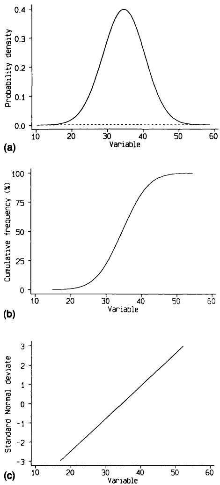
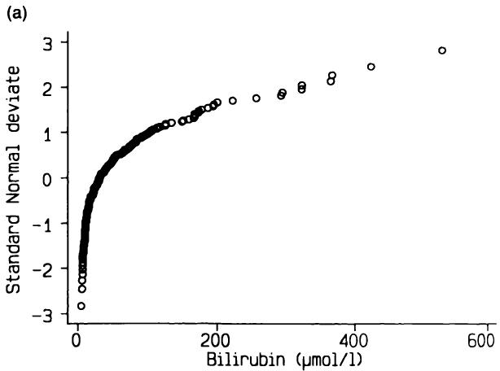
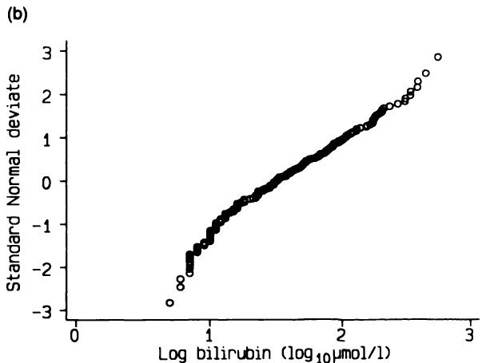

# 7 准备分析数据  7 Preparing to analyse data  

没有任何统计技术能从质量可疑的数据中得出“良好”的结果。  
No statistical technique will ever yield 'good' results from data of dubious quality.  

Buyse (1984)  
Buyse (1984)  

## 7.1 引言  7.1 INTRODUCTION  

在分析一组数据之前，尽可能检查数据是否正确非常重要。测量时、最初记录数据时、从原始来源（如病历）转录时，或输入计算机时，都可能出现错误。我们通常无法确定什么是正确的，因此我们只关注确保记录的数值合理。这个过程称为数据检查（或数据清理）。我们不能指望发现所有转录和数据录入错误，但希望能发现主要错误。正如我们将看到的，正是这些大错误会影响统计分析。如果数据是在计算机上分析的，那么检查应在数据输入计算机后进行。对于非常大的调查或临床试验，数据清理可能是一个漫长的过程。  
Before analysing a set of data it is important to check as far as possible that the data seem correct. Errors can be made when measurements are taken, when the data are originally recorded, when they are transcribed from the original source (such as from hospital notes), or when being typed into a computer. We cannot usually know what is correct, so we restrict our attention to making sure that the recorded values are plausible. This process is called data checking (or data cleaning). We cannot expect to spot all transcription and data entry errors, but we hope to find the major errors. As we will see, it is the large errors that can influence statistical analyses. If the data are being analysed on a computer, then checking should take place after the data have been entered into the computer. For very large surveys or clinical trials cleaning the data may be a lengthy process.  

同时，筛选数据以识别可能在分析过程中引起困难的特征也很重要。本章考虑三个具体方面—缺失数据、异常值以及可能需要的数据转换。检查和筛选的内容相似，实际操作中可以同时进行。  
It is also important to screen the data to identify features that may cause difficulties during the analysis. Three specific aspects are considered in this chapter - missing data, outlying values, and the possible need for data transformation. Aspects of checking and screening are similar and in practice they can be carried out at the same time.  

本章的思想特别针对变量多或受试者多（或两者兼有）的研究，但一般原则适用于任何研究。开始实质性分析前，仔细检查数据至关重要。  
The ideas in this chapter are particularly aimed at studies with many variables or subjects or both, but the general principles apply to any study. It is important to examine the data carefully before proceeding to the substantive analysis.  

## 7.2 数据检查  7.2 DATA CHECKING  

记录数据中错误很常见。例如，记录的数值可能因单位混淆而错误。  
Errors in recorded data are common. For example the recorded values may be wrong because of confusion over the correct units of measurement.  

数字在转录时可能被颠倒，或在输入计算机时被错误键入。数据检查旨在识别并尽可能纠正数据中的错误。显然，原始数据中的错误通常无法纠正，但如果查阅原始记录，可以纠正后期引入的错误。  
digits may be transposed when data are transcribed, or data may be mistyped when being entered onto a computer. Data checking aims to identify and, if possible, rectify errors in the data. Clearly errors in the original data cannot usually be rectified, but errors introduced at a later stage can be put right if the original record is consulted.  

如第6.6节所述，一个重要的第一步是检查数据是否已正确输入计算机文件。对于大型文件，最好采用双重录入，即重新输入数据并与第一版进行比较，最好使用专门设计的计算机程序。对于小型数据集，最简单的方法是由一人朗读计算机中的数据，另一人对照原始数据进行核对。  
As noted in section 6.6, an important first step is to check that the data have been typed into the computer file correctly. For large files double entry is best, whereby the data are retyped and compared with the first version, preferably using a computer program designed for this purpose. For small data sets the simplest way is for one person to read aloud the data from the computer with another person checking against the original data.  

数据检查可能会发现一些观察值虽然合理，但远离数据的主要部分。也可能发现一些预期的观察值缺失。这些问题将在第7.3节和7.4节中讨论。  
Checking the data is likely to reveal some observations that, while plausible, are distant from the main body of the data. It is also likely to reveal that a number of intended observations are missing. These problems are discussed in sections 7.3 and 7.4.  

### 7.2.1 分类数据  7.2.1 Categorical data  

对于分类变量，检查所有记录的数据值是否合理很简单，因为预先指定的值数量是固定的。例如，如果我们有四个血型编码，如下所示：  
For categorical variables it is simple to check that all recorded data values are plausible because there is a fixed number of pre- specified values. For example, if we have four codes for blood group, as follows  

$$  
\begin{array}{l}1 = \mathbf{A} \\ 2 = \mathbf{B} \\ 3 = \mathbf{O} \\ 4 = \mathbf{AB} \end{array}  
$$  

那么我们期望数据中只出现值1、2、3或4，除非有受试者信息缺失。如果缺失值按照第6章的建议编码为9，那么任何编码为0、5、6、7或8的血型显然是错误的。  
then we expect to find only values 1, 2, 3 or 4 in the data, except for any subjects with missing information. If missing values are coded as 9, as recommended in Chapter 6, then we know that any blood group coded as 0, 5, 6, 7, or 8 is clearly wrong.  

计算机分析中得到的0值可能表示血型未填写—大多数计算机程序无法区分空白和零。在此例中，O型可能被编码为0而非3。应尽可能核查错误值（必要时追溯至原始信息来源）。如果发现错误，应将值更改为有效编码之一，即1、2、3或4；若无法确认，则应使用缺失值编码。  
Values of 0 obtained from computer analysis may indicate that the blood group was left blank - most computer programs do not distinguish blanks and zeros. In this example it is possible that O might be coded as 0 rather than 3. Erroneous values should be checked as far as is possible (if necessary, back to the original source of the information). If a mistake is found the value should be changed to one of the valid codes, here 1, 2, 3, or 4; if not, the missing value code should be used.  

### 7.2.2 连续型数据  7.2.2 Continuous data  

对于连续测量值，我们通常无法精确判断哪些值合理，哪些不合理，且这并不重要。然而，应始终能够为变量指定合理的上下限。例如，在妊娠研究中，母亲年龄的合理范围可能设为14至45岁；在成年男性研究中，收缩压的合理范围可能设为70至$250 \mathrm{mmHg}$。接着需要识别超出该范围的值，这一过程称为范围检查。  
For continuous measurements we cannot usually identify precisely which  

然而，与分类数据不同，这些超出范围的值不一定是错误的。应对可疑值进行核查，发现错误应予以纠正。剩余的超出预设范围的值，若被认为不可能而非仅仅不太可能，应保留原值或标记为“缺失”。因此，建议为每个变量设定两套界限，分别表示可疑（或不太可能）值和不可能值。定义“不可能”可能非常困难。母亲年龄或收缩压的哪些值是不可能的？又在何处界定“不可能”？  
values are plausible and which are not, and it is not important to do so. It should, however, always be possible to specify lower and upper limits on what is reasonable for the variable concerned. For example, in a study of pregnancy we might put limits of 14 and 45 on maternal age, or in a study of adult males we may use limits of 70 and  $250 \mathrm{mmHg}$  for systolic blood pressure. We then need to identify values outside the limits, a procedure known as range checking. Unlike the categorical data case, however, these values are not necessarily wrong. Suspicious values should be checked and any errors found should be corrected. Values remaining outside the prespecified range must either be left as they are, or recorded as 'missing' if they are felt to be impossible rather than just unlikely. It may, therefore, be advisable to have two sets of limits for each variable, denoting suspicious (or unlikely) values and impossible values. Defining what is impossible may be extremely difficult. What values of maternal age or systolic blood pressure are impossible？ And at what point is 'impossible' reached？  

一个常见的错误原因是小数点位置错误，可能是由于对正确计量单位的混淆或抄录错误。通常，十倍的错误会导致不可能的数值，但如果记录的数值看似合理，小数点错位可能不会被发现。只有在有错误证据时，才应纠正看似合理但不太可能的数值。  
A common cause of error is misplacing the decimal point, perhaps because of confusion over the right units of measurement to use or a transcription error. Often an error by a factor of ten will give an impossible value, but if the recorded value is plausible a misplaced decimal point may well go undetected. Plausible but unlikely values should be corrected only if there is evidence of a mistake.  

### 7.2.3 逻辑检查  7.2.3 Logical checks  

当一个变量的合理取值依赖于另一个变量的值时，数据检查会更复杂。我们称之为逻辑检查。首先，某些信息通常只在特定情况下采集。例如，在一项肾移植后生存研究中，既往妊娠次数的信息仅对女性相关，因此男性应将该值设为缺失或用不同代码表示“无适用性”。（一些计算机程序允许不同类型的缺失信息。）  
Checking the data is more complicated when the values of a variable that are reasonable depend on the value of some other variable. We call these logical checks. Firstly, it is common for some information to be sought only in certain cases. For example, in a study of survival after a kidney transplant, information on number of previous pregnancies is relevant only for women, and so for men should be set to missing or to a different code indicating 'not applicable'. (Some computer programs allow for different types of missing information.)  

如果对研究对象有入选限制（例如临床试验的入组标准—见第15章），则应尽可能检查数据，确保所有人确实符合资格。一个常见例子是在抗高血压药物研究中，入组对象的血压有一定范围。许多研究还限制参与者的年龄。  
If there were restrictions on who should be in the study (for example, entry criteria in a clinical trial - see Chapter 15), then the data should be checked as far as possible to see that everyone really was eligible. A common example is in studies of anti- hypertensive agents, in which there is a range of blood pressures for which subjects can be entered in the study. Many studies have restrictions on the age of participants.  

另一个问题是当两个变量用来构造另一个变量时。新变量的值可能不可能，尽管原始两个变量的值都合理。例如，一个常用的体型指标（粗略的肥胖度测量）是  
A different problem occurs when two variables are used to construct another variable. The value of the new variable may be impossible even though the values of the original variable were both reasonable. For example, a common measure of body size (a crude measure of fatness) is  

“体质指数”或“Quetelet指数”，定义为体重除以身高的平方。如果此类派生变量特别重要，应在主分析开始前与记录变量一起检查。  
the 'body mass index' or 'Quetelet's index', defined as Weight/Height². If such derived variables are especially important they should be checked along with recorded variables before beginning the main analysis.  

更普遍地说，可能存在某些受试者的两个变量值组合极不可能，尽管各自都在可接受范围内。如果我们有两个密切相关的变量，如收缩压和舒张压，我们不期望一个人在收缩压分布的第5百分位，而在舒张压分布中却处于第95百分位。在大型研究中，逐对变量检查不现实，但对于重要变量，如抗高血压药物试验中的血压，应重点关注，最简单的方法是检查散点图。  
More generally, there may be subjects who have a combination of values of two variables that is very unlikely even though each is within acceptable limits. If we have two closely related variables, such as systolic and diastolic blood pressure, we do not expect a subject at the 5th centile of the distribution of systolic pressure to be at the 95th centile for diastolic pressure. In a large study it is impracticable to consider all pairs of variables in this way, but those of major importance, such as blood pressure in anti- hypertensive drug trials, should be studied closely, most simply by examining scatter diagrams.  

本节最后一种情况是同一变量在每个受试者身上测量多次。绘制每个人的测量序列图很有价值，以确保其变化合理。有时我们期望每次测量值都大于上一次，比如儿童的年度身高测量，这种情况易于验证。不幸的是，使用统计软件制作此类图表可能较难，因为少数程序能处理每个受试者的序列数据。  
Lastly in this section, there is the case where the same variable is measured several times on each subject. It is valuable to plot each person's sequence of recorded values to ensure that they behave reasonably. Sometimes we will expect each measurement to be larger than the previous one, such as annual height measurements of children, and this is easily verified. Unfortunately it may be difficult to produce such plots using statistical software, as few programs can cope with serial data on each subject.  

### 7.2.4 日期  7.2.4 Dates  

记录日期在计算两个事件之间时间时非常重要。例如，我们可以根据事件日期和受试者出生日期计算其在某事件（如手术或死亡）时的年龄。其他常见计算包括事件与患者死亡之间的时间（生存时间）或首次症状与疾病诊断之间的时间。如第6章所建议，最好记录所有相关日期，因为心算时间间隔极不可靠。然而，记录日期也带来问题，因为日期特别容易出现抄录错误。  
Recorded dates are important when they are used to calculate the time between two events. For example, we can calculate a subject's age at some event, such as surgery or death, from the date of the event and the subject's date of birth. Other common calculations are the time between an event and the patient's death (their survival time) or the time between the first symptom and the diagnosis of the disease. As recommended in Chapter 6, it is preferable to record all the relevant dates, as mental calculation of time intervals is extremely unreliable. However, recording dates also causes problems as they are especially prone to transcription errors.  

日期应按以下方式检查：  
Dates should be checked as follows:  

【1】检查所有日期是否在合理的时间范围内。出生日期可能与研究纳入的年龄范围相关。注意，包含老年人的研究可能包括1900年以前的出生日期。其他事件的日期，如手术或死亡，通常会在研究的时间范围内。  
1. Check that all dates are within a reasonable time span. Dates of birth may relate to the age range for inclusion in a study. Note that studies including elderly people may include dates of birth before 1900. Dates of other events, such as surgery or death, will probably lie within the time span of the study.  

【2】检查所有日期是否有效。月份中的日期应在1到31之间，依此类推，但诸如2月30日之类的日期是不可能存在的。一些计算机程序具有检查日期有效性的功能。  
2. Check that all dates are valid. The day of month should lie in the range 1 to 31, and so on, but dates such as 30 February are impossible. Some computer programs have routines for checking the validity of dates.  

【3】检查日期的正确顺序。不同事件的日期通常应按一定顺序排列，例如出生、手术和死亡的日期。  
3. Check that dates are correctly sequenced. Often dates of different events should fall in a certain sequence, such as dates of birth, surgery, and death.  

【4】检查推导的年龄和时间间隔。在完成检查（1）和（2）后，应利用日期计算感兴趣的年龄和时间间隔，如手术时的年龄或手术与死亡之间的时间。然后应对这些结果进行范围检查，如前所述。  
4. Check derived ages and time intervals. After checks (1) and (2) the dates should be used to calculate ages and time intervals of interest, such as age at surgery or time between surgery and death. These should then be range checked as described earlier.  

## 7.3 异常值  7.3 OUTLIERS  

对连续变量的数据进行检查时，可能会发现一些与其他数据不符的异常值。通常，某些变量可能存在一两个异常值，而大多数变量则不会有异常值。  
Checking the data for continuous variables may reveal some outlying values that are incompatible with the rest of the data. Typically there may be one or two outliers for a few variables, although for most variables there will not be any.  

如前所述，应仔细检查可疑值。如果没有错误证据且该值合理，则不应更改。该规则的例外情况是值正确但调查发现该个体有特殊情况，如合并疾病。在这种情况下，排除该观察值可能是合理的。相反，仅仅因为值最大或最小就删除它们是非常危险的。也没有理由采用自动化程序，如删除所有偏离均值三倍标准差以上的值。统计技术可以用来检测可疑值，但不应决定如何处理这些值。  
As already discussed, suspicious values should be carefully checked. If there is no evidence of a mistake, and the value is plausible, then it should not be altered. An exception to this rule is where the value is correct but investigation reveals that there is something special about that individual, such as a concurrent illness. Here it may be reasonable to exclude the observation. In contrast, it is especially dangerous to remove values simply because they are largest or smallest. Also, there is no justification behind automated procedures such as removing all values more than three standard deviations away from the mean. Statistical techniques can be used to detect suspicious values, but should not be used to determine what happens to them.  

异常值尤其重要，因为它们可能对统计分析结果产生显著影响。由于定义上它们是极端值，包含或排除它们会对分析结果产生明显影响。举一个简单例子，表7.1显示了20名霍奇金病缓解患者血液样本中每立方毫米$\mathbf{T_{4}}$细胞的数量。值的均值为823.2，标准差为566.4。如果认为最高值2415是异常值并剔除它，剩余19个值的均值为739.4，标准差为436.4—这两个指标在剔除最大值后均下降。剔除单个观察值的影响，如此例所示，可能非常显著，这就是为什么应在完整分析开始前决定哪些数据将被分析。  
Outliers are particularly important because they can have a considerable influence on the results of a statistical analysis. Because by definition they are extreme values, their inclusion or exclusion can have a marked effect on the results of an analysis. To take a simple example, Table 7.1 shows numbers of  $\mathbf{T_{4}}$  cells per  $\mathbf{mm}^{3}$  in blood samples from 20 patients in remission from Hodgkin's disease. The mean of the values is 823.2 and the standard deviation is 566.4. If we consider that the highest value of 2415 is an outlier and discard it, the mean of the remaining 19 values is 739.4 and the standard deviation is 436.4 - both must fall when the largest value is omitted. The effect of excluding a single observation can, as here, be quite marked, which is why decisions about which data are to be analysed should be made before the full analysis starts.  

$\mathbf{T_{4}}$数据的直方图显示分布偏斜（图7.1a），而细胞计数对数的分布则对称（图7.1b）。此外，在对数尺度上，明显的异常值看起来非常合理。变换方法将在7.6节讨论。  
A histogram of the  $\mathbf{T_{4}}$  data shows that the distribution is skewed (Figure 7.1a), whereas that for the logarithm of the cell counts is symmetric (Figure 7.1b). Further, the apparent outlier is seen in the log scale to be very reasonable. Transformations are considered in section 7.6.  

异常值在回归分析中可能具有较大影响，这种技术在第11章中介绍，用于寻找描述两个连续变量关系的最佳直线。  
Outliers can be influential in regression analysis, a technique described in Chapter 11 for finding the best straight line describing the relation  

表7.1 20例霍奇金病缓解期患者和20例弥漫性恶性肿瘤（非霍奇金）缓解期患者血液样本中 $\mathbf{T_{4}}$ 细胞数目（单位：$/\mathrm{mm}^{3}$）（Shapiro 等，1986）。  
Table 7.1 Numbers of  $\mathbf{T_{4}}$  cells  $/\mathrm{mm}^{3}$  in blood samples from 20 patients in remission from Hodgkin's disease and 20 patients in remission from disseminated malignancies (nonHodgkin's) (Shapiro et al., 1986)  

<table><tr><td></td><td>霍奇金病</td><td>非霍奇金病</td></tr><tr><td>171</td><td>116</td><td></td></tr><tr><td>257</td><td>151</td><td></td></tr><tr><td>288</td><td>192</td><td></td></tr><tr><td>295</td><td>208</td><td></td></tr><tr><td>396</td><td>315</td><td></td></tr><tr><td>397</td><td>375</td><td></td></tr><tr><td>431</td><td>375</td><td></td></tr><tr><td>435</td><td>377</td><td></td></tr><tr><td>554</td><td>410</td><td></td></tr><tr><td>568</td><td>426</td><td></td></tr><tr><td>795</td><td>440</td><td></td></tr><tr><td>902</td><td>503</td><td></td></tr><tr><td>958</td><td>675</td><td></td></tr><tr><td>1004</td><td>688</td><td></td></tr><tr><td>1104</td><td>700</td><td></td></tr><tr><td>1212</td><td>736</td><td></td></tr><tr><td>1283</td><td>752</td><td></td></tr><tr><td>1378</td><td>771</td><td></td></tr><tr><td>1621</td><td>979</td><td></td></tr><tr><td>2415</td><td>1252</td><td></td></tr><tr><td>均值</td><td>823.2</td><td>522.1</td></tr><tr><td>标准差</td><td>566.4</td><td>293.0</td></tr></table>  
<table><tr><td></td><td>Hodgkin&#x27;s</td><td>non-Hodgkin&#x27;s</td></tr><tr><td>171</td><td>116</td><td></td></tr><tr><td>257</td><td>151</td><td></td></tr><tr><td>288</td><td>192</td><td></td></tr><tr><td>295</td><td>208</td><td></td></tr><tr><td>396</td><td>315</td><td></td></tr><tr><td>397</td><td>375</td><td></td></tr><tr><td>431</td><td>375</td><td></td></tr><tr><td>435</td><td>377</td><td></td></tr><tr><td>554</td><td>410</td><td></td></tr><tr><td>568</td><td>426</td><td></td></tr><tr><td>795</td><td>440</td><td></td></tr><tr><td>902</td><td>503</td><td></td></tr><tr><td>958</td><td>675</td><td></td></tr><tr><td>1004</td><td>688</td><td></td></tr><tr><td>1104</td><td>700</td><td></td></tr><tr><td>1212</td><td>736</td><td></td></tr><tr><td>1283</td><td>752</td><td></td></tr><tr><td>1378</td><td>771</td><td></td></tr><tr><td>1621</td><td>979</td><td></td></tr><tr><td>2415</td><td>1252</td><td></td></tr><tr><td>Mean</td><td>823.2</td><td>522.1</td></tr><tr><td>SD</td><td>566.4</td><td>293.0</td></tr></table>  

图7.2显示了12例慢性肾功能衰竭患者血液透析后血浆蛋白水平的变化，其中最年轻的患者可能是异常值。图中同时显示了包括所有数据和排除该患者后的拟合回归线。它们说明回归线会被异常值“拉拽”，无论其余数据的分布如何，尤其是在样本量较小时。单个异常点对视觉印象的影响很大。如果遮盖该可疑值，其他数据中明显无相关关系。第11章建议回归分析应始终配合散点图使用。  
between two continuous variables. Figure 7.2 shows the change in plasma protein levels after haemodialysis in 12 patients with chronic renal failure, in which the youngest patient is a possible outlier. Also shown are the fitted regression lines for all the data and with that patient excluded. They illustrate that the regression line gets 'pulled' towards outlying values, regardless of the distribution of the rest of the data, especially in small samples. A single outlying point can have a considerable effect on the visual impression. If we cover the suspicious value it is clear that there is no apparent relation in the rest of the data. In Chapter 11 I suggest that a scatter diagram should always accompany regression analyses.  

异常值会影响多种统计分析，常通过增加观测值的方差而掩盖感兴趣的效应。识别异常值是数据检查的重要附带收益。  
Outliers can affect many types of statistical analysis, often by inflating the variance of a set of observations and so obscuring the effect of interest. Awareness of any outliers is a highly beneficial spin- off from checking the data.  

  

  

  

  
非霍奇金病 图7.1显示了表7.1中有无霍奇金病患者的 $\mathbf{T_{4}}$ 细胞计数（单位：$/\mathbf{mm}^{3}$）的直方图，（a）原始数据；（b）$\log_{2}$ 转换后数据。  
Non-Hodgkin's disease  Figure 7.1 Histograms of  $\mathbf{T_{4}}$  cell counts  $/\mathbf{m}\mathbf{m}^{3}$  in patients with and without Hodgkin's disease shown in Table 7.1 (a) raw data; (b) after  $\log_{2}$  transformation.  

  
图7.2展示了12例慢性肾功能衰竭患者血液透析后血浆蛋白（单位：$g/l$）变化与年龄的关系，图中给出了所有数据的回归线（—）和排除最年轻患者后的回归线（- - - - - -）。数据来源：Toulon 等（1987）。  
Figure 7.2 Data showing the relation between change in plasma protein  $(g / l)$  after haemodialysis and age in 12 patients with chronic renal failure, showing regression lines for all data (—) and excluding the youngest patient (- - - - - -). Data from Toulon et al. (1987).  

分析数据时，一个有用的策略是同时进行包含和排除可疑值的分析，如图7.2所示。如果结果差异不大，则异常值影响较小；反之，则应考虑采用替代分析方法。第8章介绍的秩次方法可能是一个合适的选择。此类问题建议寻求统计专家的帮助。  
A useful strategy to adopt when analysing data is to carry out the analysis both including and excluding the suspicious value(s), as in Figure 7.2. If there is little difference in the results obtained then the outlier(s) had minimal effect, but if excluding them does have an effect it may be better to find an alternative method of analysis. Rank methods, introduced in Chapter 8, may be a good approach here. This is an area where expert statistical advice is valuable.  

## 7.4 缺失数据  7.4 MISSING DATA  

数据检查的另一个副产品是发现缺失观测值。如第6章所述，常用的做法是根据变量性质使用9、99、999或99.9等代码表示缺失，虽然少数统计软件允许用*或其他符号标示缺失值。如果用数值表示，必须在分析前告知统计软件该值为缺失，否则容易忽视一两个被编码为999的缺失值，导致分析结果严重偏差，详见第6.3节。  
Another by- product of checking your data is that any missing observations will be identified. As noted in Chapter 6, the most common device is to use codes such as 9, 99, 999, or 99.9, according to the nature of the variable, although some computer programs (unfortunately few) allow * or some other symbol to indicate a missing observation. If a numeric value is used it is essential to identify the value as a missing value to the statistical software before analysing the data. It is very easy to forget that one or two values are missing, perhaps coded as 999, when carrying out an analysis. The effect on the analysis can be severe, as was illustrated in section 6.3.  

使用 $\clubsuit$ 的优点在于不会有后续分析将缺失值代码误当作真实观测值的风险。  
The advantage of using  $\clubsuit$  is that there is no danger that subsequent analysis will treat the missing value code as a real observation.  

对于分类变量，缺失值只是一个额外的类别，因此这些个体可以包含在任何交叉列联表中。然而，在进行统计分析时，仍然重要的是计算机程序能识别该代码（如9）为缺失值。对于连续变量，识别缺失数据尤为关键。  
For categorical variables missing is just an additional category and so these individuals can be included in any cross- tabulations. However, it is still important that the code (say 9) is identified as missing in a computer program when performing a statistical analysis. For continuous variables it is essential that missing data are identified.  

创建新的“衍生”变量时，必须记住缺失值代码的可能性。例如，如果我们用身高和体重来计算体质指数（BMI）（见7.2.3节），且其中一个或两个变量缺失，如果未将代码识别为缺失，结果可能非常误导：  
It is important to remember the possibility of missing value codes when creating a new 'derived' variable. For example, if we use height and weight to derive the body mass index (BMI) (described in section 7.2.3), and either or both variables are missing we can get very misleading answers if we have not identified the codes as missing:  

<table><tr><td>身高（米）</td><td>体重（公斤）</td><td>BMI（体重/身高²）</td></tr><tr><td>1.62</td><td>68.2</td><td>26.0</td></tr><tr><td>1.62</td><td>999.9</td><td>381.0</td></tr><tr><td>9.99</td><td>68.2</td><td>0.7</td></tr><tr><td>9.99</td><td>999.9</td><td>10.0</td></tr></table>  
<table><tr><td>Height (m)</td><td>Weight (kg)</td><td>BMI (Wt/Ht²)</td></tr><tr><td>1.62</td><td>68.2</td><td>26.0</td></tr><tr><td>1.62</td><td>999.9</td><td>381.0</td></tr><tr><td>9.99</td><td>68.2</td><td>0.7</td></tr><tr><td>9.99</td><td>999.9</td><td>10.0</td></tr></table>  

在这种情况下，如果任一变量缺失，衍生值将是不可能的，但情况并非总是如此。应在构建衍生变量之前识别缺失值代码。优秀的计算机程序会在任何组成部分缺失时，将衍生变量的值设为缺失。  
In this case the derived values if either variable is missing are impossible, but this will not always be the case. Missing value codes should be identified before derived variables are constructed. Good computer programs will set the value of a derived variable to missing if any of its components is missing.  

日期有时只部分记录。如果缺少日期，可以将其设为15（平均月份的中间），缺少月份则可设为6或7（年中），以减少可能的误差。如果这种替代对所研究的时间跨度影响极小，则是合理的。然而，应注意这种替代不会导致两个日期顺序的颠倒。例如，手术日期为08-89，缺少日期，而死亡日期为13-08-89，如果将手术日期的日期设为15，则患者的生存时间将变为负2天。  
Dates are sometimes only partially recorded. If the day is missing it can be set to 15 (halfway through an average month), and a missing month can be set to 6 or 7 (halfway through the year) to minimize the possible error. Substitutions like these are reasonable if the effect is very small compared with the time span being investigated. However, care should be taken that this substitution does not result in a reversal of the sequence of two dates. For example, if date of surgery is given as 08- 89, with the day missing, and date of death is 13- 08- 89, then setting the day of surgery to 15 will make the patient's survival time - 2 days.  

### 7.4.1 为什么数据会缺失？  7.4.1 Why are data missing？  

值得思考数据缺失的原因；特别是我们应了解是否与研究性质相关。与不可能的值一样，可能需要核实原始信息来源，确认缺失观测确实缺失。  
It is worth thinking about why the data are missing; in particular we ought to know if there is a reason related to the nature of the study. As with impossible values, it may be possible to check with the original source of  

缺失值往往是随机的，与研究无关。例如，某些患者可能未被询问特定问题，或血样丢失或损坏。大多数大型研究都会因类似原因存在缺失数据。然而，缺失信息可能具有信息性。在多次收集患者信息的研究中，后期缺失可能是因为患者因副作用退出研究，甚至死亡。另一种可能是患者因感兴趣变量异常反应而退出研究。例如，高血压研究中，若患者血压超过预设水平，常被撤出研究，这必然影响血压变化分析。关于此类数据的进一步讨论见14.6节。  
the information that missing observations are really missing. Frequently values are missing essentially at random, for reasons not related to the study. For example, some patients may not have been asked a particular question, or a blood sample may have been lost or destroyed. Most large studies will have some missing data for reasons like these. The lack of information may, however, be informative. In a study in which information about a patient is collected on several occasions, lack of information for the later times may be because the patient was withdrawn from the study due to side- effects, or even because they died. Another possibility is that they may have been withdrawn from the study because the variable of interest responded inappropriately. For example, it is common in studies in hypertension to withdraw patients if their blood pressure rises above a pre- selected level, which must compromise an analysis of change in blood pressure. There is further discussion of this type of data in section 14.6.  

对于“是”或“否”编码的信息，如特定症状的存在，可能会想将缺失值替换为“否”，理由是若症状存在信息应已被记录。但这一假设通常不成立，不应轻易做出。此问题在回顾性研究中尤为突出，例如从患者住院记录中获取数据时。  
For information that is coded as 'yes' or 'no', such as the presence of a particular symptom, it may be tempting to consider replacing missing values by 'no', on the grounds that the information would have been recorded if the symptom had been present. This assumption is usually unwarranted, and should not be made lightly. This problem is most likely in retrospective studies, for example when data are obtained from patients' hospital notes.  

## 7.5 数据筛查  7.5 DATA SCREENING  

到目前为止，本章我已经讨论了尽可能检查数据正确性的各个方面。初步数据检查的另一个重要方面是评估数据是否适合预期的分析类型，这一过程有时称为数据筛查。如前所述，一个或多个异常值的存在可能显著影响甚至使分析无效。数据筛查主要关注连续数据的分布，异常值只是本节考虑的一个方面。  
So far in this chapter I have considered various aspects of checking, as far as possible, that the data are correct. The other important aspect of preliminary data examination is to see how suitable the data are for the type of analysis that is intended, a process sometimes called data screening. As already indicated, the presence of one or more outliers can markedly affect, and perhaps invalidate, an analysis. Data screening is concerned largely with the distribution of continuous data, outliers being just one of the aspects considered in this section.  

### 7.5.1 观察值的分布  7.5.1 The distribution of observations  

正如后续章节将展示的，许多连续数据的统计分析方法都基于数据来自正态分布总体的假设。基于秩的替代方法通常可用，且不依赖该假设，但它们存在一定的缺点。在基于正态性假设进行分析之前，了解数据的分布非常重要。不符合正态分布的数据通常可以  
As subsequent chapters will show, many types of statistical analysis of continuous data are based on the assumption that the data are a sample from a population with a Normal distribution. Alternative methods based on ranks are usually available that do not make that assumption, but they have certain disadvantages. It is important to know the distribution of the data before embarking on an analysis based on the assumption of Normality. Data that are not compatible with a Normal distribution can often be  

通过变换使其接近正态分布，具体方法见第7.6节。  
transformed to make them acceptably near to Normal, as described in section 7.6.  

对于每个连续变量，应计算其均值和标准差（SD）。如果可能，应绘制直方图以观察分布形态。如果无法绘制直方图，则可检查分布的分位数（例如，第10、第50和第90百分位数）以判断分布是否对称。  
For each continuous variable the mean and standard deviation (SD) should be calculated. If possible a histogram should be produced to see the shape of the distribution. If this is not possible then quantiles of the distribution (for example, the 10th, 50th and 90th centiles) can be examined to see if the distribution appears symmetric.  

尤其对于小样本，判断数据的正态性可能较为困难。如图4.7所示，即使是来自正态分布的50个样本也可能看起来不符合正态分布。下面介绍的称为正态概率图的图形技术能更好地判断正态性。  
For small samples especially it may be difficult to judge the degree of Normality of a set of data. As Figure 4.7 showed, even samples of size 50 from a Normal distribution may look non- Normal. The graphical technique called a Normal plot, described below, gives a much better idea of Normality.  

检查多个变量的一个好方法是绘制所有变量两两之间的散点图矩阵。图12.2中给出了一个示例。  
A good way of checking many variables visually is to produce a 'matrix' of scatter plots of all pairs of variables. An example is given in Figure 12.2.  

### 7.5.2 正态概率图  7.5.2 The Normal plot  

正态概率图基于两个思想。首先，累积频率分布比频率分布更能反映数据的形态。它受图4.7中小波动的影响较小。正态分布数据的累积频率分布呈S形，如图4.6所示。然而，仅凭累积频率分布难以判断正态性，这时第二个思想派上用场。因为所有正态分布的形态完全相同（图4.4），我们可以拉伸纵轴，使累积分布函数在数据为正态时成为一条直线。样本数据偏离正态性即表现为偏离直线。  
The Normal plot is based on two ideas. First, the cumulative frequency distribution gives a better idea of the shape of the data than does the frequency distribution. It is much less affected by the small fluctuations that were seen in Figure 4.7. The cumulative frequency distribution for data that are Normally distributed has an S shape, as shown in Figure 4.6. It is, however, difficult to judge Normality from the cumulative frequency distribution, which is where the second idea comes in. Because all Normal distributions are precisely the same shape (Figure 4.4) we can stretch the vertical scale to make the cumulative distribution function a straight line if the data are Normal. Departures of the sample data from Normality are thus easily seen as departures from a straight line.  

假设我们有一个变量，其总体值服从均值为34.46、标准差为5.84的正态分布。图7.3显示了(a)频数分布，(b)累计频数分布，以及(c)正态图。正态图的横轴表示观测值的数值，纵轴表示相对于均值的标准差数的相对频率。正态图纵轴标注的值对应累计百分比为 $0.1\%$、$2.3\%$、$16\%$、$50\%$、$84\%$、$97.7\%$ 和 $99.9\%$（见第4.5.1节）。绘图坐标的计算方法将在下文说明。图7.3展示了理论情况，图7.4则展示了从同一总体随机抽取的216个样本的相同过程。顶部面板显示数据的直方图，表现出一些不规则性。第二个面板显示累计频数分布，最后一个是正态图。数据在正态图中接近一条直线。  
Suppose we have a variable whose values in the population have a Normal distribution with a mean of 34.46 and a standard deviation of 5.84. Figure 7.3 shows (a) the frequency distribution, (b) the cumulative frequency distribution, and (c) the Normal plot. The horizontal axis of the Normal plot shows the numerical value of the observation, and the vertical axis gives the relative frequency in terms of the number of standard deviations from the mean. The values labelled on the vertical axis of the Normal plot correspond to cumulative percentages of  $0.1\%$ ,  $2.3\%$ ,  $16\%$ ,  $50\%$ ,  $84\%$ ,  $97.7\%$  and  $99.9\%$  (see section 4.5.1). The calculation of the plotting coordinates is explained below. Figure 7.3 shows what happens in theory, and Figure 7.4 shows the same process for a sample of size 216 chosen at random from the same population. The top panel shows a histogram of the data, which exhibits some irregularities. The second shows the cumulative frequency distribution and the last the Normal plot. The data are close to a straight line in the Normal plot.  

  

  

既然我们知道了当数据确实来自正态分布时应有的图像，我们便有了判断真实数据的依据。图7.5给出了先前讨论的216例原发性胆汁性肝硬化患者血清白蛋白值的正态图。这些数据的均值为 $34.46 \mathrm{g} / \mathrm{l}$，标准差为 $5.84 \mathrm{g} / \mathrm{l}$。因此，图7.3、7.4和7.5是可以直接比较的。当我们为某组数据绘制正态图时，实际上就是在做这样的比较。图7.5(c)中的正态图非常接近直线，表明这些患者血清白蛋白值的分布接近正态分布，与图4.5一致。下面我将考虑如何量化这种接近程度。  
Now that we know what sort of picture to expect when the data really do come from a Normal distribution, we have some basis for judging some real data. Figure 7.5 gives a Normal plot for the serum albumin values from the study of 216 patients with primary biliary cirrhosis previously discussed. These data had a mean of  $34.46 \mathrm{g} / \mathrm{l}$  and the standard deviation was  $5.84 \mathrm{g} / \mathrm{l}$ . Figures 7.3, 7.4 and 7.5 are thus directly comparable. When we produce a Normal plot for some data this is the comparison that is implicitly being made. The Normal plot in Figure 7.5(c) is very near to a straight line, indicating that the distribution of serum albumin values in these patients is near to a Normal distribution, in agreement with Figure 4.5. I shall consider below how we can quantify the nearness.  

相比之下，同一患者群体的血清胆红素值分布在图4.8中显示高度偏斜，远非正态分布。图7.6(a)中数据的明显弯曲的正态图证实了这一点。然而，如第4章所述，经过对数转换后，数据近似正态分布，如图7.6(b)的正态图所示。为什么我们可能希望通过变换数据来获得近似正态分布的原因将在第7.6节讨论。  
By contrast, the distribution of serum bilirubin values in the same patients was shown in Figure 4.8 to be highly skewed and not near to a Normal distribution. The markedly curved Normal plot of the data in Figure 7.6(a) confirms this finding. However, as described in Chapter 4, after log transformation the data have a nearly Normal distribution, as shown by the Normal plot in Figure 7.6(b). The reasons why we might wish to transform a set of data to get an approximately Normal distribution are discussed in section 7.6.  

虽然正态图是判断一组数据是否服从正态分布的非常有用的图形工具，但它仅提供主观评估。由于抽样变异，我们知道来自正态分布的样本不会完全正态（见图4.7），尤其当样本量较小时。若数据需接近正态，量化偏离正态的程度是一种有用的方法。  
While the Normal plot is a very useful graphical device for judging the Normality of a set of data, it only allows for a subjective assessment. Because of sampling variation we know that samples from Normal distributions will not be exactly Normal (see Figure 4.7) especially if the sample is small. Where it is important for the data to be close to Normal it is useful to have a method for quantifying the deviations from Normality.  

### 7.5.3 评估偏离正态分布的程度  7.5.3 Evaluating departures from a Normal distribution  

测量非正态性的一种方法是计算所谓的“高阶矩”。前两个矩已描述过—即均值和方差。然而，这些值不能反映分布的形状。我们可以通过基于以下公式的量来测量形状  
One way of measuring non- Normality is to calculate what are called 'higher moments' of the distribution of data. The first two moments have already been described - they are the mean and variance. However, these values give no information about the shape of the distribution. We can measure shape by means of quantities based on  

$$  
\sum \frac{(x_{i} - \bar{x})^{3}}{n - 1} \qquad \text{和} \qquad \sum \frac{(x_{i} - \bar{x})^{4}}{n - 1}  
\sum \frac{(x_{i} - \bar{x})^{3}}{n - 1} \qquad \text{and} \qquad \sum \frac{(x_{i} - \bar{x})^{4}}{n - 1}  
$$  

这显然是方差公式的扩展。由此我们可以导出称为偏度的量，衡量分布的非对称性，以及峰度，衡量分布的平坦或尖峰程度。然后可以将这些值与正态分布的理论值进行比较。然而，我不推荐这种方法，因为更理想的是用单一指标来评估正态性，而不是两个。  
which are obvious extensions to the formula for the variance. From these we can derive quantities called skewness, which is a measure of asymmetry. and kurtosis, which is a measure of flatness or peakedness. These values can then be compared with the theoretical values for a Normal distribution. I do not recommend this approach, however, as it is preferable to have a single assessment of Normality rather than two.  

评估一组数据正态性的情形  
Situations in which we may wish to assess the Normality of a set of data  

  
图7.5 216例原发性胆汁性肝硬化患者的血清白蛋白值，表示为(a)频数直方图；(b)累计频数分布；(c)正态图。  
Figure 7.5 Serum albumin values of 216 patients with primary biliary cirrhosis expressed as (a) frequency histogram; (b) cumulative frequency distribution; (c) Normal plot.  

  

  

在后续章节中会出现。对于许多目的来说，仅凭目测检查正态图就足够了，但如果需要更深入的分析，则更有用的方法是测量正态图的直线程度。然后我们可以计算如果总体服从正态分布，样本中出现此类值的概率。如果该概率足够大，比如大于0.05（即1/20），我们就可以认为数据与正态分布相当接近。此过程是标准统计推断方法的一个例子，下一章将正式介绍并详细讨论。  
arise in subsequent chapters. For many purposes it is not necessary to do more than check the Normal plot by eye, but if something more is required then a more useful approach is based on measuring the straightness of the Normal plot. We can then calculate the probability that such a value would be obtained in a sample if the population had a Normal distribution, and if this probability is large enough, say greater than 0.05 (1 in 20), we conclude that the data are reasonably near to a Normal distribution. This procedure is an example of a standard statistical approach to inference which is introduced properly and discussed in detail in the next chapter.  

Shapiro-Wilk W 正态性检验在多个统计软件中均可使用。然而，如果该检验不可用，可以相对容易地计算密切相关的 Shapiro-Francia $W^{\prime}$ 检验。但该检验直到第11.6节才会介绍，因为需要本章引入的分析方法。对于图7.5中的白蛋白数据，Shapiro-Wilk W检验得到的概率较大，为0.76；而图7.6中的胆红素数据概率非常小（见表7.2）。显然，血清白蛋白数据符合正态分布，而原始血清胆红素值则不符合。对数转换后的血清胆红素值的正态图（图7.6b）除少数低值外基本呈直线，但W检验显示数据仍与正态分布不符（见表7.2）。这说明在大样本中，该检验能够检测到少量非正态性，而这在大多数情况下并不重要。正如图4.9所示，log胆红素数据与正态分布非常相似。因此，在评估正态图和W检验结果时需要一定判断力。  
The Shapiro- Wilk W test for Normality is available in several statistical computer programs. However, if it is unavailable the closely related Shapiro- Francia  $W^{\prime}$  can be calculated fairly easily. It is, however, not described until section 11.6 as it requires a method of analysis introduced in that chapter. For the albumin data shown in Figure 7.5 the Shapiro- Wilk W test yields a large probability of 0.76, while the bilirubin data in Figure 7.6 yield a very small probability (Table 7.2). Clearly the serum albumin data are compatible with a Normal distribution, while the raw serum bilirubin values are not. The Normal plot of the log serum bilirubin values (Figure 7.6b) is straight except for a few values at the lower end, but the W test shows that the data are not at all compatible with a Normal distribution (Table 7.2). This illustrates the fact that in large samples the test is able to detect small amounts of non- Normality, that in most circumstances would be unimportant. As Figure 4.9 showed, the log bilirubin data are very similar to a Normal distribution. Thus some judgement is required in assessing the Normal plot and the W test.  

表7.2 Shapiro和Wilk的W检验应用于216个血清白蛋白、血清胆红素及其对数值（来源：Christensen等，1985年）  
Table 7.2 Shapiro and Wilk's W test applied to 216 values of serum albumin, serum bilirubin and log serum bilirubin (from the study by Christensen et al., 1985)  

<table><tr><td>变量</td><td>W</td><td>概率 (P)</td></tr><tr><td>血清白蛋白</td><td>0.986</td><td>0.76</td></tr><tr><td>血清胆红素</td><td>0.668</td><td>&lt; 0.0001</td></tr><tr><td>对数血清胆红素</td><td>0.956</td><td>&lt; 0.0001</td></tr></table>  
<table><tr><td>Variable</td><td>W</td><td>Probability (P)</td></tr><tr><td>Serum albumin</td><td>0.986</td><td>0.76</td></tr><tr><td>Serum bilirubin</td><td>0.668</td><td>&amp;lt; 0.0001</td></tr><tr><td>Log serum bilirubin</td><td>0.956</td><td>&amp;lt; 0.0001</td></tr></table>  

非正态性通常在分布的尾部最为明显。异常值在正态图上表现为一个或多个点偏离其余数据的线性趋势。即使只有一个异常值，也可能导致数据未通过Shapiro-Wilk检验。系统性曲线，如图7.6(a)所示，表明分布偏右（偏斜）；而S形曲线则表示分布两端的值过多或过少，相较于正态分布，如图7.7和7.8所示。  
Non- Normality is usually most marked in the tails of the distribution. Outliers will show up in a Normal plot as one or more points lying away from the general linear trend of the rest of the data. Even one outlier can make the data fail the Shapiro- Wilk test. Systematic curvature, as seen in Figure 7.6(a), indicates skewness (to the right), while an S shaped plot will indicate either too many or too few values in both tails of the distribution in comparison with a Normal distribution, as shown in Figures 7.7 and 7.8  

  

  

  

  
图7.8 分布尾部值过少的数据 $(n = 400$，均值 $= 80$，标准差 $= 9.7)$ (a) 直方图；(b) 正态图。  
Figure 7.8 Data with too few values in the tails of the distribution  $(n = 400$ , mean  $= 80$ , SD  $= 9.7)$  (a) histogram; (b) Normal plot.  

正态图还可以揭示数据中两种分布的混合。图7.9展示了一窝猪仔出生体重的正态图，显示一组正常生长的猪仔和三只体重较轻的“弱仔”猪仔（Royston等，1982）。不同的斜率表明两组假定数据的标准差不同。  
respectively. Normal plots can also reveal a mixture of two distributions in the data. Figure 7.9 shows a Normal plot of birth weights of one litter of piglets, suggesting a normally grown group and a group of three 'runt' piglets with lower weights (Royston et al., 1982). The different slopes indicate different standard deviations in the two putative groups.  

### 7.5.4 构建正态图  7.5.4 Constructing a Normal plot  

（本节较为技术性，略读不会影响连贯性。）  
(This section is more technical and can be omitted without loss of continuity.)  

图7.7等正态图中，$Y$轴的刻度是以观测值标准差的倍数线性排列。构建正态图时，先将观测值按升序排列，然后将数据点绘制在对应的正态分数上。正态分数是指在给定样本大小的正态分布中，排名为第$i$的观测值相对于均值的标准差数。许多统计软件能计算正态分数并绘制正态图，有些甚至能轻松生成。手工绘制正态图时，可使用特殊的正态概率纸，其刻度对应正态分布的百分位数。先对观测值排序，然后绘制第$i$个  
The scale of the  $Y$  axis in the Normal plots such as Figure 7.7 is linear in multiples of the standard deviation of the observations. The Normal plot is constructed by sorting the observations into ascending order and then plotting the data against the corresponding Normal scores. The Normal score is the number of standard deviations below or above the mean that we expect to find the observation with a given rank from a sample from a Normal distribution of a given size. Many statistical programs can calculate Normal scores for plotting against the data, and some can produce Normal plots easily. For drawing a Normal plot by hand there is special Normal probability paper with divisions corresponding to the percentage points of the Normal distribution. The observations are sorted and then the ith  

  
图7.9 猪仔出生体重的正态概率图（Royston 等，1982）。  
Figure 7.9 Normal plot of piglet birth weights (Royston et al., 1982).  

观测值与对应百分比 $P_{i}$ 的正态分数作图，计算公式为  
observation is plotted against the Normal score corresponding to the percentage  $P_{i}$ , given by  

$$    
P_{i} = \frac{i - 3 / 8}{n + 1 / 4} \times 100.  
$$  

## 7.6 为什么要转换数据？  7.6 WHY TRANSFORM DATA？  

### 7.6.1 转换为正态分布  7.6.1 Transforming to Normality  

正如接下来几章将看到的，大多数用于分析连续数据的统计方法（参数方法）都包含了关于样本所抽取总体数据的假设。特别是，它们假设数据来自一个值服从正态分布的总体。因此，我们期望数据符合这一假设，这也是为什么需要第7.5节中描述的正态性检验。我们常发现对数据进行变换后，分布会更接近正态分布。其中最常见的是对数变换。第4.6节介绍了对数正态分布，即通过取对数可以转化为正态分布的分布。图7.6中的血清胆红素数据和图7.1中的$\mathbf{T_{4}}$细胞计数就是例子。  
As will be seen in the next few chapters, most statistical methods (parametric methods) for analysing continuous data incorporate assumptions about the data in the population from which the sample was drawn. In particular they include an assumption that the data come from a population where the values are Normally distributed. Thus we expect the data to be consistent with that assumption, which is why we need the test of Normality described in section 7.5. We often find that a transformation of the data will yield a distribution that is much nearer to a Normal distribution. By far the most common is the logarithmic or log transformation. The Lognormal distribution was introduced in section 4.6, as the distribution that can be transformed to a Normal distribution by taking logs. The serum bilirubin data shown in Figure 7.6 are an example, as are the  $\mathbf{T_{4}}$  cell counts in Figure 7.1.  

对某些方法而言，分布假设并非特别关键，尤其是在样本量较大时。然而，仍有其他原因希望数据接近正态分布。许多参数方法的另一个重要假设是不同观察组具有相同的标准差。非正态数据往往伴随标准差的变化，而通过数据变换可以更好地满足这两个要求。例如，表7.1中霍奇金病和非霍奇金病患者的$\mathbf{T_{4}}$数据标准差分别为566.4和397.9，相差较大，但$\log_{e} \mathbf{T_{4}}$的标准差更为接近，分别为0.708和0.632，且分布更接近正态（见图7.1）。如果几个观察组的标准差与均值的比值相近，通常对数变换效果较好。该比值只对原始数据有意义，且对于只有两组数据时参考价值有限。$\mathbf{T_{4}}$数据的比值分别为0.69和0.56，相当接近。  
For some methods the distributional assumption is not too critical, especially if the sample size is large. There are other reasons, however, for wishing data to be near to a Normal distribution. Another important assumption of many parametric methods is that different groups of observations have the same standard deviations. It is often the case that variation in standard deviations accompanies non- Normal data, and both requirements can be met more closely after transforming the data. For example, the  $\mathbf{T_{4}}$  data in Table 7.1 for Hodgkin's and non- Hodgkin's disease patients have rather different standard deviations of 566.4 and 397.9, but the standard deviations of  $\log_{e} \mathbf{T_{4}}$  are much more similar, being 0.708 and 0.632, and the distributions are much nearer to Normal (Figure 7.1). The log transformation is likely to work well if the ratio of the standard deviation to the mean is similar among several groups of observations. This calculation has meaning only for the raw data, and may not be very helpful with just two groups. For the  $\mathbf{T_{4}}$  data the ratios are 0.69 and 0.56, which are reasonably similar.  

其他有时使用的变换包括平方根变换和倒数变换。图7.10展示了血清胆红素数据在不同变换前后的直方图。平方根变换（图7.10c）效果不如对数变换显著，通常用于变量为计数（频数）且预期服从泊松分布的情况。  
Other transformations sometimes used are the square root and reciprocal transformations. Figure 7.10 shows histograms of the serum bilirubin data before and after different transformations. The square root transformation (Figure 7.10c) is less dramatic than taking logs. It is particularly used when the variable is a count (frequency) and thus would be expected to follow a  

  

倒数变换（图7.10d）效果比对数变换更剧烈（注意它会颠倒观察值的顺序），当数据极度偏斜时可能有用。Gore（1982）描述了对肾移植患者血浆肌酐值使用倒数变换，以及对肿瘤大小测量使用平方根变换的情况。然而，这些变换使用不普遍，且只要对数变换能取得满意结果，通常优先采用对数变换（见第9.7节）。有时使用特定变换有强烈的逻辑理由，例如立方根变换适用于体积数据，某段距离行走时间的倒数则表示速度。  
Poisson distribution. The reciprocal transformation (Figure 7.10d) has a much more drastic effect than taking logs (note that it reverses the order of the observations), and may be useful if the observed data have an extremely skewed distribution. The use of the reciprocal transformation for plasma creatinine values of kidney transplant patients and the square root transformation for tumour size measurements were described by Gore (1982). Their use is not common, however, and there are certain reasons for using the log transformation in preference to any other as long as it yields satisfactory results (see section 9.7). Sometimes there may be a strong logical reason for using a particular transformation. For example, the cube root may be appropriate for data that are volumes and the reciprocal of a recorded time to walk a certain distance will yield the speed.  

变换为正态分布的另一个原因是减少异常值（即非典型值）对分析结果的影响，这一问题在图7.2中有所展示。Armitage和Berry（1987，第368页）对此总结道：“如果连续变量不过分偏离正态分布，通常更为方便。”当无法实现时，可以采用秩次（非参数）分析方法（后续章节介绍），但总体上这些方法不如参数方法理想。  
Another reason for transforming to Normality is to reduce the influence of outlying (and thus atypical) values on the results of analysis, a problem illustrated in Figure 7.2. The overall picture has been well summarized by Armitage and Berry (1987, p. 368): 'It is usually convenient if continuous variables do not depart too drastically from Normal'. When this cannot be achieved we can use rank (non- parametric) methods of analysis (described in subsequent chapters), but these are in general less satisfactory than parametric methods.  

对数据进行变换有时被认为是统计学家使用的技巧，这种看法基于这样一种观念：测量的自然尺度在某种程度上是神圣不可侵犯的。事实并非如此，实际上某些测量，如 $\mathbf{pH}$ 值和滴度，实际上已经是对数变换后的值。然而，最好还是以原始测量尺度来呈现结果。在后续章节中，我将展示如何做到这一点。  
Transforming the data is sometimes felt to be a trick used by statisticians, a belief that is based on the idea that the natural scale of measurement is in some way sacrosanct. This is not really the case, and indeed some measurements, such as  $\mathbf{pH}$  values and titres, are effectively already log transformed values. It is, however, always best to present results in the original scale of measurement. In later chapters I show how this is done.  

### 7.6.2 比例的变换  7.6.2 Transforming proportions  

变换的另一个主要用途是在比例分析中。观察到的比例在0.2到0.8范围内具有相似的不确定性，但非常小或非常大的比例不确定性较小，因为它们在尺度的两端（零和一）受到一定限制。为了统计分析，我们常希望所有比例都具有相等的不确定性，这可以通过logit变换实现，定义为  
The other main use of transformations is in the analysis of proportions. Observed proportions in the range 0.2 to 0.8 have similar uncertainty but very small or large proportions have smaller uncertainty as they are somewhat constrained towards the ends of the scale (zero and one). For statistical analyses we often wish to have equal uncertainty attached to all proportions, and we can achieve this by the logit transformation, which is defined by  

$$
\mathrm{logit}(p) = \mathrm{log}_{\mathrm{e}}\left(\frac{p}{1 - p}\right)。
$$  

logit变换将比例拉伸，就像正态概率图中正态分布的百分位数被拉伸一样，  
The logit transformation stretches out proportions in the same way as the percentiles of the Normal distribution are stretched out in the Normal plot,  

如表7.3所示。logit变换主要用于涉及比例的回归分析（第12章讨论），以及用比值比比较不同组风险（第10章描述）。  
as Table 7.3 shows. The logit transformation is mainly used in regression analysis involving proportions, discussed in Chapter 12, and with the use of odds ratios to compare risks in different groups, described in Chapter 10.  

表7.3 比例 $\pmb{p}$ 的logit变换效果  
Table 7.3 Effect of logit transformation of a proportion  $\pmb{p}$  

<table><tr><td>p</td><td>logit(p)</td></tr><tr><td>0.01</td><td>-4.60</td></tr><tr><td>0.05</td><td>-2.94</td></tr><tr><td>0.10</td><td>-2.20</td></tr><tr><td>0.25</td><td>-1.10</td></tr><tr><td>0.50</td><td>0.00</td></tr><tr><td>0.75</td><td>1.10</td></tr><tr><td>0.90</td><td>2.20</td></tr><tr><td>0.95</td><td>2.94</td></tr><tr><td>0.99</td><td>4.60</td></tr></table>  
<table><tr><td>p</td><td>logit(p)</td></tr><tr><td>0.01</td><td>-4.60</td></tr><tr><td>0.05</td><td>-2.94</td></tr><tr><td>0.10</td><td>-2.20</td></tr><tr><td>0.25</td><td>-1.10</td></tr><tr><td>0.50</td><td>0.00</td></tr><tr><td>0.75</td><td>1.10</td></tr><tr><td>0.90</td><td>2.20</td></tr><tr><td>0.95</td><td>2.94</td></tr><tr><td>0.99</td><td>4.60</td></tr></table>  

## 7.7 数据的其他特征  7.7 OTHER FEATURES OF THE DATA  

本章前面几节讨论了分析前筛选数据时应关注的主要特征。本节考虑两个不那么明显但能为研究提供洞见的数据检查方面。  
The previous sections of this chapter have discussed the main features to look for when screening data before analysis. This section considers two less obvious aspects of data examination that can shed light on a study.  

### 7.7.1 数字偏好  7.7.1 Digit preference  

当人们测量某个量时，可能不会非常准确。测量越困难，观察者内部的变异性越大，同时潜意识偏差的可能性也越高。数字偏好是指个体在记录观察值时无意识地施加个人偏见的现象。我们可以在测量值的最后一位数字中观察到数字偏好。例如，身高通常以整厘米为单位测量，血压通常以最接近的 $2 \mathrm{mmHg}$ 为单位测量。在大量观察中，我们期望每个终止数字（0到9）的身高测量次数大致相等，血压测量的终止数字（0、2、4、6、8）次数也应大致相等。实际上，我们常常观察到明显偏离预期均匀分布的情况。有时这是因为观察者未按照研究方案规定的精度进行测量。例如，他或她可能将血压测量精度定为最接近的 $5 \mathrm{mmHg}$。然而，很多时候分布的偏离没有明确原因—仅仅是因为某人似乎偏好某些数字，  
When people measure something they may not do so accurately. The harder the quantity is to measure the greater will be the within- observer variability and also the possibility of subconscious biases. Digit preference is the name given to the way individuals can impose their personal (subconscious) prejudice on the way they record observations. We see digit preference in the final recorded digit of a measurement. For example, height is usually measured in whole centimetres, and blood pressure to the nearest  $2 \mathrm{mmHg}$ . In a large series of observations we would expect to see equal numbers of height measurements with each terminating digit from 0 to 9, and equal numbers of blood pressure measurements ending in 0, 2, 4, 6 or 8. In practice we often see marked deviations from the expected Uniform distribution. Sometimes this is because the observer does not make the measurements to the precision specified in the study protocol. For example, he or she might measure blood pressure to the nearest  $5 \mathrm{mmHg}$ . Often, however, the distribution varies from expected for no definable reason - it is simply that the person seems to have a preference  

比如偏好以3或7结尾的数字。最常见的数字偏好形式导致数字出现过多的是  
for numbers ending in, say, 3 or 7. The most common forms of digit preference lead to an excess of  

1. 0   
1. zeros   
2. 0和5   
2. zeros and fives   
3. 偶数。  
3. even digits.  

对于（1），则会导致1和9的数字出现不足。  
For (1) there will be a consequent shortage of ones and nines.  

表7.4中的数据展示了这些特征，表中列出了一个病例对照研究中三组血压读数的末尾数字。病例组测量了两次，而对照组只测量了一次。三组数字中有两组显示出非常相似的模式，表明是同一人测量的。然而，第三组显示出不同的模式，说明测量者不同。（我后来向研究组织者确认了这一点。）注意，两位观察者都出现了0的过多现象，但他们记录血压的精度明显不同。  
Several of these features can be seen in the data in Table 7.4, which shows terminal digits from three sets of blood pressure readings from a case- control study. The cases were measured twice while the controls were measured only once. Two of the three sets of digits show closely similar patterns, indicating that they were made by the same person. However, the third set shows a different pattern, showing that they must have been made by a different person. (I subsequently verified with the study organizer that this had happened.) Notice that both observers had an excess of zeros, but that they were clearly recording blood pressure to different accuracy.  

表7.4 病例对照研究中记录血压的末尾数字  
Table 7.4 Final digits of recorded blood pressures in a case-control study  

<table><tr><td>末尾数字</td><td>第一次测量</td><td>病例组   
第二次检查</td><td>对照组</td></tr><tr><td>0</td><td>71</td><td>23</td><td>23</td></tr><tr><td>1</td><td>0</td><td>0</td><td>0</td></tr><tr><td>2</td><td>0</td><td>15</td><td>17</td></tr><tr><td>3</td><td>0</td><td>0</td><td>0</td></tr><tr><td>4</td><td>0</td><td>18</td><td>14</td></tr><tr><td>5</td><td>21</td><td>1</td><td>9</td></tr><tr><td>6</td><td>0</td><td>10</td><td>9</td></tr><tr><td>7</td><td>0</td><td>1</td><td>0</td></tr><tr><td>8</td><td>0</td><td>24</td><td>28</td></tr><tr><td>9</td><td>0</td><td>0</td><td>2</td></tr><tr><td>总计</td><td>92</td><td>92</td><td>102</td></tr></table>  

<table><tr><td>Final digit</td><td>First exam</td><td>Cases  
Second exam</td><td>Controls</td></tr><tr><td>0</td><td>71</td><td>23</td><td>23</td></tr><tr><td>1</td><td>0</td><td>0</td><td>0</td></tr><tr><td>2</td><td>0</td><td>15</td><td>17</td></tr><tr><td>3</td><td>0</td><td>0</td><td>0</td></tr><tr><td>4</td><td>0</td><td>18</td><td>14</td></tr><tr><td>5</td><td>21</td><td>1</td><td>9</td></tr><tr><td>6</td><td>0</td><td>10</td><td>9</td></tr><tr><td>7</td><td>0</td><td>1</td><td>0</td></tr><tr><td>8</td><td>0</td><td>24</td><td>28</td></tr><tr><td>9</td><td>0</td><td>0</td><td>2</td></tr><tr><td>Total</td><td>92</td><td>92</td><td>102</td></tr></table>  

血压的情况尤其有趣。血压测量非常困难，因为它涉及在观察快速下降的水银柱的同时，听取声音的变化。由于血压测量中数字偏好的问题非常严重，设计了几种特殊的仪器来解决这一问题。最著名的是  
The case of blood pressure is particularly interesting. Blood pressure is a very difficult measurement to take as it involves listening for a change in sound while observing a rapidly falling column of mercury. Because digit preference was such a problem with blood pressure several special machines were designed to get round the problem. The best known is the  

“随机零点血压计”，它包含一个高度随机的隐藏水银柱，在每次测量前调整。记录的血压是观察到的水银柱高度与随后测量的隐藏水银柱高度的总和。然而，即使使用该仪器，也可能无法消除数字偏好的强烈影响（Silman，1985）。  
'random- zero sphygmomanometer' which incorporates a second, hidden column of mercury of random height which is adjusted before each measurement. The recorded blood pressure is then the sum of the heights of the observed column of mercury and the subsequently measured hidden column. However, even the use of this machine may not remove the strong effect of digit preference (Silman, 1985).  

另一个数字偏好的例子见于图7.5中的白蛋白数据。第二和第三个图中的阶梯状变化是因为许多值被记录为整数（单位为$\mathbf{g} / \mathbf{l}$），而非保留一位小数。  
Another example of digit preference is seen in the albumin data in Figure 7.5. The steps in the second and third plots are due to many values having been recorded as a whole number (in  $\mathbf{g} / \mathbf{l}$ ) rather than to one decimal place.  

数字偏好的一个奇特特征是，即使你知道这一现象，它仍可能存在于你的测量中。数字偏好很少会对数据分析产生重要影响，但它是数据筛查的一个有用产物，可以帮助你了解测量是如何进行的。  
A curious feature of digit preference is that even if you know about the phenomenon it is still likely to be present in your measurements. Digit preference will rarely have an important influence on the data analysis, but it is another useful product of data screening that you may see how the measurements were made.  

### 7.7.2 隐藏的时间效应  7.7.2 Hidden time effects  

许多研究是在一段时间内进行的。通常隐含假设不同时间收集的数据是可比的，但情况并非总是如此。可能存在两种主要的隐藏时间效应。较为人知的是季节性或昼夜节律（24小时）变化。例如，许多疾病的发病率具有明显的季节性，许多激素水平呈现昼夜“节律”。这类效应广为人知，设计研究时避免相关问题并不困难。例如，建议在同一时间对同一受试者重复测量血压，因为血压具有明显的昼夜节律，早晨最高。关于此类数据的进一步讨论见第14.7节。  
Many studies are carried out over a period of time. It is usually implicitly assumed that the data collected at different times are comparable, but this will not always be the case. Two main types of hidden time effect may exist. The better known effect is that of seasonal or circadian (24 hour) changes. For example, incidence rates of many diseases are strongly seasonal, and the levels of many hormone levels display a circadian 'rhythm'. Many effects of this nature are well- known, and it is not difficult to design studies to avoid problems. For example, it is advisable to take repeat measurements of blood pressure from the same subject at the same time of day because blood pressure has a strong circadian rhythm, being highest in the morning. There is further discussion of this type of data in section 14.7.  

另一种可能的隐藏时间效应较少被认识到。在受试者在数月或数年内招募的研究中，受试者特征或测量值可能发生变化。例如，在之前讨论的原发性胆汁性肝硬化研究中（Christensen等，1985），发现患者入组时的血清胆红素值在7年招募期间逐渐下降（Altman和Royston，1988）。血清胆红素是肝功能的良好指标，因此后期入组的患者比早期入组的患者病情较轻。由于这是一个随机试验，患者在整个期间随机接受硫唑嘌呤或安慰剂，患者特征的时间趋势并不重要。（但这说明了临床试验中使用同期对照的原因之一—见第15章。）  
There is a second type of possible hidden time effect that is not widely recognized. In a study in which subjects are recruited over some months or years it is possible that there may be changes in the characteristics of the subjects or in the measurements made on them. For example, in the study of primary biliary cirrhosis previously discussed (Christensen et al., 1985) it was found that the serum bilirubin values of patients entering the trial steadily declined over the 7 years of patient recruitment (Altman and Royston, 1988). Serum bilirubin is a good indicator of liver function, so patients joining the study towards the end of the trial were rather less ill than those joining at the beginning. As this was a randomized trial, with patients given azathioprine or placebo at random throughout the period, the time trend in patient characteristics was not important. (It indicates however, one of the reasons for using concurrent controls in clinical trials - see Chapter 15. )  

如果知道观察日期（我建议记录），则可以简单地将数据绘制成时间序列，观察是否存在趋势。Altman和Royston（1988）对此问题有更深入的讨论并给出其他实例。  
If the date of observations is known (and I recommend that it is recorded) then it is simple to plot the data against time to see if there are any trends. Altman and Royston (1988) discuss this issue further and give other examples.  

## 7.8 结论性评论  7.8 CONCLUDING REMARKS  

本章讨论了检查数据集一致性以及在可能的情况下准确性的方法，以及在分析前对数据进行筛选的步骤。这些程序对任何研究都很重要，尤其适用于大型数据集。没有计算机，这些步骤不太实用，但分析数据本身也需要计算机，因此先用计算机生成上述描述性统计表和图形是一个相对简单的延伸。唯一可能的例外是正态概率图（Normal plot），并非所有统计软件都能绘制。关于这些内容以及大型研究中质量控制的其他方面，Buyse（1984）有进一步讨论。  
This chapter has dealt with ways of checking the consistency and, where possible, the accuracy of a set of data, and of screening the data prior to analysis. These procedures are important for any study, although perhaps particularly relevant to large data sets. They are not terribly practical without a computer, but a computer will also be needed to analyse the data, so it is a relatively simple extension to use the computer first to produce the descriptive tabulations and graphs described above. The possible exception is the Normal plot, which cannot be performed by all statistical programs. Further discussion of these matters, together with other aspects of quality control in large studies, is given by Buyse (1984).  

为了清晰起见，本章将数据检查和筛选的各个方面分别讨论。然而在实际操作中，可以在一次分析中同时进行范围检查、异常值和缺失值的查找，以及数据分布形态的检验。  
For clarity the various aspects of data checking and screening have been considered separately. In practice, however, it is possible to perform range checks, look for outliers and missing values, and examine the shape of the distribution of a set of data in a single analysis.  

尽管这些方法不总被视为统计方法学的一部分，但它们是统计分析的必要环节，帮助你核实数据的正确性。前期花时间检查数据是非常值得的；如果数据错误直到主要分析阶段才被发现，就必须重新开始。数据筛选还能帮助你熟悉数据。这个想法有些抽象，但通过熟悉数据，你能更好地选择合适且有效的分析方法。  
Although not always discussed as part of statistical methodology the methods described in this chapter are an essential part of statistical analysis, allowing you to check the correctness of your data. Time spent at the beginning checking the data is time well spent; errors in the data that are not detected until the main analysis is under way will require everything to be redone. Screening the data also allows you to get a feel for the data. This last idea is rather nebulous, but by familiarizing yourself with the data you should be much better equipped to choose appropriate and valid methods of analysis.  

## EXERCISES  <!-- 非数字开头标题 -->  

【7】1 下页表格显示了一项涉及20名慢性充血性心力衰竭患者的研究数据（Caruana 等，1988）。表中展示了两项测量值—射血分数（ejection fraction），反映左心室功能障碍，以及肺动脉楔压（pulmonary arterial wedge pressure）：  
7.1 The table overleaf shows data from a study of 20 patients with chronic congestive heart failure (Caruana et al., 1988). Two measurements are shown - ejection fraction, which is a measure of left ventricular dysfunction, and pulmonary arterial wedge pressure:  

<table><tr><td>患者</td><td>射血分数（%）</td><td>楔压（毫米汞柱）</td></tr><tr><td>1</td><td>28</td><td>15</td></tr><tr><td>2</td><td>26</td><td>14</td></tr><tr><td>3</td><td>42</td><td>15</td></tr><tr><td>4</td><td>29</td><td>12</td></tr><tr><td>5</td><td>16</td><td>37</td></tr><tr><td>6</td><td>21</td><td>30</td></tr><tr><td>7</td><td>25</td><td>7</td></tr><tr><td>8</td><td>35</td><td>14</td></tr><tr><td>9</td><td>30</td><td>28</td></tr><tr><td>10</td><td>36</td><td>13</td></tr><tr><td>11</td><td>37</td><td>5</td></tr><tr><td>12</td><td>41</td><td>13</td></tr><tr><td>13</td><td>20</td><td>24</td></tr><tr><td>14</td><td>26</td><td>8</td></tr><tr><td>15</td><td>38</td><td>13</td></tr><tr><td>16</td><td>26</td><td>17</td></tr><tr><td>17</td><td>10</td><td>27</td></tr><tr><td>18</td><td>18</td><td>29</td></tr><tr><td>19</td><td>10</td><td>8</td></tr><tr><td>20</td><td>31</td><td>5</td></tr></table>  
<table><tr><td>Patient</td><td>Ejection fraction (%)</td><td>Wedge pressure (mm Hg)</td></tr><tr><td>1</td><td>28</td><td>15</td></tr><tr><td>2</td><td>26</td><td>14</td></tr><tr><td>3</td><td>42</td><td>15</td></tr><tr><td>4</td><td>29</td><td>12</td></tr><tr><td>5</td><td>16</td><td>37</td></tr><tr><td>6</td><td>21</td><td>30</td></tr><tr><td>7</td><td>25</td><td>7</td></tr><tr><td>8</td><td>35</td><td>14</td></tr><tr><td>9</td><td>30</td><td>28</td></tr><tr><td>10</td><td>36</td><td>13</td></tr><tr><td>11</td><td>37</td><td>5</td></tr><tr><td>12</td><td>41</td><td>13</td></tr><tr><td>13</td><td>20</td><td>24</td></tr><tr><td>14</td><td>26</td><td>8</td></tr><tr><td>15</td><td>38</td><td>13</td></tr><tr><td>16</td><td>26</td><td>17</td></tr><tr><td>17</td><td>10</td><td>27</td></tr><tr><td>18</td><td>18</td><td>29</td></tr><tr><td>19</td><td>10</td><td>8</td></tr><tr><td>20</td><td>31</td><td>5</td></tr></table>  

有一个数值在论文中被错误抄录。哪位患者的数据最可能有误？  
One value has been mistranscribed from the paper. Which patient's data is most likely to be wrong？  

【7】2 使用第7.5.4节中描述的方法，绘制表7.1第一列中20名霍奇金病患者的 $\log_{e}T_{4}$ 细胞计数的正态概率图。  
7.2 Use the method described in section 7.5.4 to construct a Normal plot of the  $\log_{e}T_{4}$  cell counts for 20 Hodgkin's disease patients given in the first column of Table 7.1.  

【7】3 评论练习3.1表格中三变量的末位数字。  
7.3 Comment on the terminal digits of the three variables shown in the table in Exercise 3.1.  

【7】4 调查以下血清孕酮数据（同为表14.13中第2组）末位数字是否存在数字偏好现象。  
7.4 Investigate the possibility of digit preference in the final digits of the following serum progesterone data (also shown as Group 2 in Table 14.13).  

<table><tr><td rowspan="2">时间</td><td colspan="6">患者</td></tr><tr><td>1</td><td>2</td><td>3</td><td>4</td><td>5</td><td>6</td></tr><tr><td>0</td><td>1.0</td><td>1.0</td><td>1.0</td><td>3.0</td><td>8.3</td><td>6.2</td></tr><tr><td>1</td><td>1.5</td><td>1.0</td><td>1.0</td><td>2.5</td><td>7.5</td><td>5.9</td></tr><tr><td>3</td><td>5.0</td><td>6.5</td><td>7.3</td><td>2.0</td><td>9.6</td><td>6.8</td></tr><tr><td>5</td><td>11.0</td><td>20.0</td><td>7.5</td><td>2.7</td><td>11.0</td><td>7.7</td></tr><tr><td>10</td><td>16.0</td><td>22.5</td><td>18.0</td><td>3.4</td><td>11.5</td><td>9.0</td></tr><tr><td>15</td><td>23.0</td><td>27.8</td><td>20.0</td><td>3.6</td><td>15.7</td><td>9.3</td></tr><tr><td>30</td><td>15.0</td><td>19.0</td><td>18.9</td><td>14.0</td><td>15.2</td><td>12.1</td></tr><tr><td>45</td><td>9.0</td><td>9.0</td><td>12.8</td><td>7.3</td><td>15.8</td><td>12.2</td></tr><tr><td>60</td><td>6.0</td><td>8.2</td><td>6.3</td><td>7.7</td><td>14.0</td><td>11.0</td></tr><tr><td>120</td><td>5.0</td><td>8.0</td><td>4.8</td><td>4.7</td><td>11.5</td><td>9.0</td></tr></table>  
<table><tr><td rowspan="2">Time</td><td colspan="6">Patient</td></tr><tr><td>1</td><td>2</td><td>3</td><td>4</td><td>5</td><td>6</td></tr><tr><td>0</td><td>1.0</td><td>1.0</td><td>1.0</td><td>3.0</td><td>8.3</td><td>6.2</td></tr><tr><td>1</td><td>1.5</td><td>1.0</td><td>1.0</td><td>2.5</td><td>7.5</td><td>5.9</td></tr><tr><td>3</td><td>5.0</td><td>6.5</td><td>7.3</td><td>2.0</td><td>9.6</td><td>6.8</td></tr><tr><td>5</td><td>11.0</td><td>20.0</td><td>7.5</td><td>2.7</td><td>11.0</td><td>7.7</td></tr><tr><td>10</td><td>16.0</td><td>22.5</td><td>18.0</td><td>3.4</td><td>11.5</td><td>9.0</td></tr><tr><td>15</td><td>23.0</td><td>27.8</td><td>20.0</td><td>3.6</td><td>15.7</td><td>9.3</td></tr><tr><td>30</td><td>15.0</td><td>19.0</td><td>18.9</td><td>14.0</td><td>15.2</td><td>12.1</td></tr><tr><td>45</td><td>9.0</td><td>9.0</td><td>12.8</td><td>7.3</td><td>15.8</td><td>12.2</td></tr><tr><td>60</td><td>6.0</td><td>8.2</td><td>6.3</td><td>7.7</td><td>14.0</td><td>11.0</td></tr><tr><td>120</td><td>5.0</td><td>8.0</td><td>4.8</td><td>4.7</td><td>11.5</td><td>9.0</td></tr></table>  
