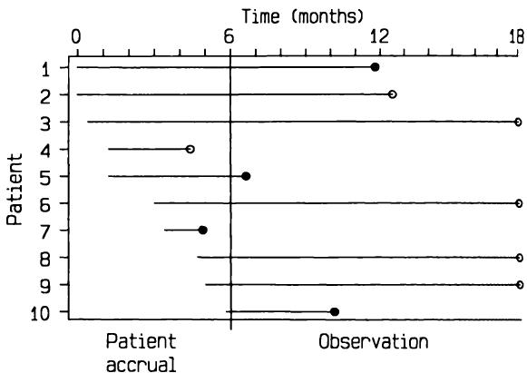
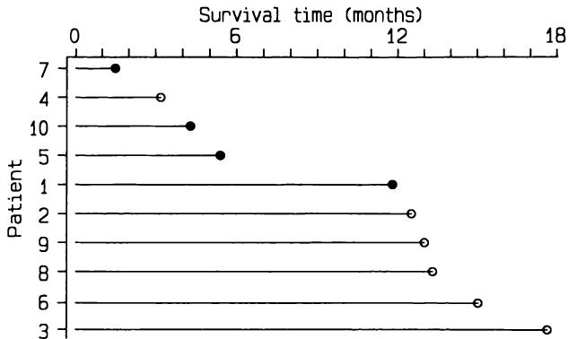
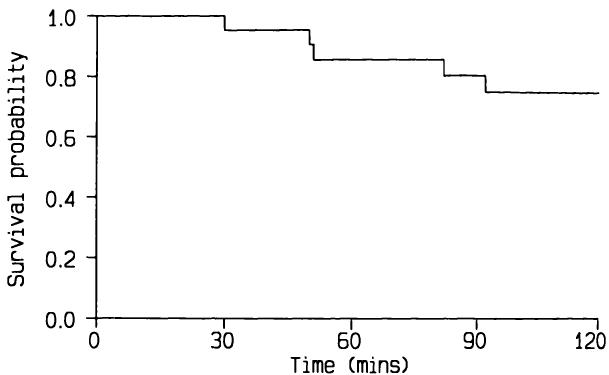
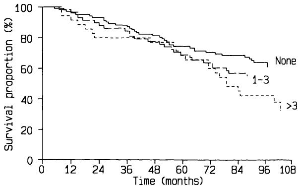

# 13 生存时间分析  13 Analysis of survival times  

## 13.1 引言  13.1 INTRODUCTION  

在大多数研究中，数据是测量值和属性的混合。前面四章介绍了各种研究设计中定量和定性数据的分析方法。另一类数据则是关注某事件发生所需时间。当我们记录从某一固定起点（如手术）到受试者死亡的时间时，最常见的数据来源即为此。因此，我们通常称之为生存时间或生存数据，对生存时间的统计处理称为生存分析。正如我们将看到的，类似数据也出现在其他情境中，但通常仍使用相同的术语。  
In most studies the data are a mixture of measurements and attributes. The preceding four chapters have presented methods for the analysis of both quantitative and qualitative data for various study designs. Another type of data arises when interest is focused on the time taken for some event to occur. One of the most common sources of such data is when we record the time from some fixed starting point, such as surgery, to the death of the subject. For this reason we usually refer to survival times or survival data and the statistical treatment of survival times is known as survival analysis. As we shall see, similar data arise in other situations, but it is customary to stick to the same terminology.  

在临床研究中，生存时间通常指死亡时间、某特定症状出现时间，或疾病缓解后复发时间。尽管研究期结束时间通常定义明确，但起始时间则可能较模糊。例如，通常无法准确知晓某人患病多久，因此诊断日期常作为最佳替代。对于某些疾病，这两个日期可能相差甚远。  
In clinical studies survival times often refer to the time to death, to development of a particular symptom, or to relapse after remission of disease. Although there is usually a clear definition of the end of the time period of interest, the start may be less well defined. It is, for example, rarely possible to know how long somebody has had a disease, so the date of diagnosis is often the best alternative. For some diseases these two dates can be very different.  

生存时间有一个固有特征，使其不适合用前几章介绍的任何方法分析，即我们几乎从未在所有受试者身上观察到感兴趣的事件。例如，在比较不同乳腺癌手术患者生存情况的研究中，尽管患者会被随访数年，但许多人在研究结束时仍然存活。对于这些患者，我们不知道他们何时死亡，只知道他们在研究结束时仍然存活。因此，我们也不知道他们从手术开始的生存时间，只知道生存时间至少超过了他们在研究中的随访时间。我们称这种生存时间为删失时间（censored），表示观察期在感兴趣事件发生前被截断。注意，感兴趣事件通常是不良事件，如死亡，因此“感兴趣”是科学上的，而非临床上的。  
There is one inherent feature of survival times that makes them unsuitable for analysis by any of the methods described in the preceding chapters, which is that we almost never observe the event of interest in all subjects. For example, in a study to compare the survival of patients having different types of surgery for breast cancer, although the patients will be followed up for several years there will be many who are still alive at the end of the study. For these patients we do not know when they will die, only that they are still alive at the end of the study. Nor, therefore, do we know their survival time from surgery, only that it will be longer than their time in the study. We call such survival times censored, to indicate that the period of observation was cut off before the event of interest occurred. Note that as the event of interest is usually something that is undesirable, such as death, the 'interest' is scientific, not clinical.  

如果所有受试者的随访时间完全相同，或许可以使用第9章介绍的秩次方法分析生存时间，并将所有删失时间赋予相同的最高秩次。  
If all subjects were followed for exactly the same length of time it would perhaps be possible to use the rank methods introduced in Chapter 9 for analysing survival times, giving all censored times the equal highest rank.  

然而，患者的随访时间几乎总是不同。此外，患者可能在研究结束前退出，例如迁居他处。退出导致另一种类型的删失观察。  
However, patients are nearly always followed for varying lengths of time. In any case patients may leave the study before the end, perhaps moving to a different area. Withdrawals thus lead to censored observations of a different type.  

图13.1展示了患者在研究中的不同进展方式。图中显示了一个六个月的招募期和随后12个月的观察期。患者的观察时间因此介于12至18个月之间，最近招募的患者观察时间最短。图13.1显示四名患者死亡，四名患者在研究结束时仍存活。另有两名患者在研究结束前退出。因此，我们有四个确切的生存时间和六个删失时间，如表13.1所示，星号表示删失生存时间。分析生存数据时，我们忽略不同的起始时间，通常将观察数据按生存时间排序。图13.2展示了这些调整的效果。  
Figure 13.1 illustrates the different ways in which patients can proceed through a study. It shows a six month period during which patients are recruited to the study, and a further 12 months of observation. The patients are thus observed for between 12 and 18 months, the most recently accrued patients being observed for the shortest time. Figure 13.1 shows that four patients died and four were still alive at the end of the study. Two other patients withdrew from the study before the end. We thus have four firm survival times and six censored times, as shown in Table 13.1, where the asterisk denotes a censored survival time. We ignore the different starting times when analysing survival data, and it helps to order the observations by survival time. Figure 13.2 shows the effect of these changes.  

对于此类数据，我们常希望估计个体在给定时间段（如一年）内存活的概率。若有两个或更多组，还会关注比较它们的生存情况。本章介绍解决这些及其他生存数据相关问题的方法。为方便起见，假设数据已按生存时间升序排序。（计算机程序可能要求如此。）  
With data of this type we often wish to estimate the probability of an individual surviving for a given time period such as one year. With two or more groups we will also be interested in comparing their survival experience. This chapter introduces methods to answer these and other questions relating to survival data. For convenience, I shall assume that the data have already been sorted into ascending order of survival times. (Computer programs may require this.)  

医学生存数据的分析自  
The analysis of medical survival data has become widespread since the  

  
图13.1 显示患者在不同时间进入研究以及已知生存时间 $(\bullet)$ 和删失生存时间 $(\circ)$ 的示意图。  
Figure 13.1 Diagram showing patients entering a study at different times and the observation of known  $(\bullet)$  and censored  $(\circ)$  survival times.  

表13.1 图13.1中患者的生存时间  
Table 13.1 Survival times for patients shown in Figure 13.1  

<table><tr><td>患者</td><td>入组时间（月）</td><td>死亡或删失时间（月）</td><td>死亡或删失</td><td>生存时间</td></tr><tr><td>1</td><td>0.0</td><td>11.8</td><td>D</td><td>11.8</td></tr><tr><td>2</td><td>0.0</td><td>12.5</td><td>C</td><td>12.5*</td></tr><tr><td>3</td><td>0.4</td><td>18.0</td><td>C</td><td>17.6*</td></tr><tr><td>4</td><td>1.2</td><td>4.4</td><td>C</td><td>3.2*</td></tr><tr><td>5</td><td>1.2</td><td>6.6</td><td>D</td><td>5.4</td></tr><tr><td>6</td><td>3.0</td><td>18.0</td><td>C</td><td>15.0*</td></tr><tr><td>7</td><td>3.4</td><td>4.9</td><td>D</td><td>1.5</td></tr><tr><td>8</td><td>4.7</td><td>18.0</td><td>C</td><td>13.3*</td></tr><tr><td>9</td><td>5.0</td><td>18.0</td><td>C</td><td>13.0*</td></tr><tr><td>10</td><td>5.8</td><td>10.1</td><td>D</td><td>4.3</td></tr></table>  
<table><tr><td>Patient</td><td>Time at entry (m)</td><td>Time at death or censoring (m)</td><td>Dead or censored</td><td>Survival time</td></tr><tr><td>1</td><td>0.0</td><td>11.8</td><td>D</td><td>11.8</td></tr><tr><td>2</td><td>0.0</td><td>12.5</td><td>C</td><td>12.5*</td></tr><tr><td>3</td><td>0.4</td><td>18.0</td><td>C</td><td>17.6*</td></tr><tr><td>4</td><td>1.2</td><td>4.4</td><td>C</td><td>3.2*</td></tr><tr><td>5</td><td>1.2</td><td>6.6</td><td>D</td><td>5.4</td></tr><tr><td>6</td><td>3.0</td><td>18.0</td><td>C</td><td>15.0*</td></tr><tr><td>7</td><td>3.4</td><td>4.9</td><td>D</td><td>1.5</td></tr><tr><td>8</td><td>4.7</td><td>18.0</td><td>C</td><td>13.3*</td></tr><tr><td>9</td><td>5.0</td><td>18.0</td><td>C</td><td>13.0*</td></tr><tr><td>10</td><td>5.8</td><td>10.1</td><td>D</td><td>4.3</td></tr></table>  

*删失观察  
*censored observation  

  
图13.2 图13.1重新组织以对应分析方法。  
Figure 13.2 Figure 13.1 reorganized to correspond to method of analysis.  

1970年代初期，当时开发了新的方法。 本章中描述的大多数方法在Peto等人（1976年和1977年）的两篇优秀论文中有更详细的讨论，尤其是第二篇论文。这些论文还包含了大量关于生存时间研究设计和执行的实用建议。  
early 1970s when new methods were developed. Most of the methods described in this chapter are discussed in much more detail in two excellent papers by Peto et al. (1976 and 1977), especially in the second paper. These papers also contain a wealth of practical advice about the design and execution of studies of survival times.  

## 13.2 生存概率  13.2 SURVIVAL PROBABILITIES  

从一组观察到的生存时间（包括删失时间）样本中，我们可以估计在相同条件下该人群中存活超过某一特定时间的比例。  
From a set of observed survival times (including censored times) from a sample of individuals we can estimate the proportion of the population of  

例如，我们可以利用肝移植患者的研究数据估计新患者在移植后存活超过某一时间的概率（前提是原始样本具有代表性）。该方法巧妙之处在于不仅正确处理删失观察，还利用了删失前的全部信息。该方法生成的图表有多种名称：生命表、生存曲线、Kaplan-Meier曲线。  
such people who would survive a given length of time in the same circumstances. For example, we can use data from a study of patients having liver transplants to estimate the probability of new patients surviving a given length of time after transplantation (with the usual proviso about the representativeness of the original sample). The method is clever in that it not only makes proper allowances for those observations that are censored, but also makes use of the information from these subjects up to the time when they are censored. The method yields a graph or a table, which goes under various names: life table, survival curve, Kaplan- Meier curve.  

### 13.2.1 Kaplan-Meier生存曲线  13.2.1 Kaplan-Meier survival curve  

通过将时间划分为许多小区间，可以计算出存活特定时间长度的概率。例如，肝移植患者存活两天的概率可以看作是存活第一天的概率，乘以在存活第一天的条件下存活第二天的概率。第二个概率称为条件概率。如果我们用 $p_{100}$ 表示在已经存活前99天的条件下存活第100天的概率，那么肝移植后存活100天的总体概率为  
The probability of surviving a given length of time can be calculated by considering time in many small intervals. For example, the probability of a patient surviving two days after a liver transplant can be considered to be the probability of surviving one day, multiplied by the probability of surviving the second day given that the patient survived the first day. This second probability is known as a conditional probability. If we write  $p_{100}$  as the probability of surviving the hundredth day conditional on having already survived the first 99 days, then the overall probability of surviving 100 days after a liver transplant is given by  

$$  
p_{1} \times p_{2} \times p_{3} \times \ldots p_{99} \times p_{100}
$$  

存活第100天的概率简单地估计为在已知第99天仍存活的样本中，第100天仍存活的比例。因此，在无人死亡的日子里，概率 $p$ 为1，这简化了计算，因为只需计算至少有一人死亡的日子的概率。  
The probability of surviving the 100th day is estimated simply as the proportion of the sample surviving that day of those still known to be alive after 99 days. The probability  $p$  is thus 1 on days when nobody dies, so the calculations are simplified by the fact that it is only necessary to calculate the probabilities for days on which at least one person dies.  

存活曲线的计算将在一个小数据集上进行说明，该数据来自一个旨在预测海上晕动症的研究项目（Burns, 1984）。受试者被置于一个安装在液压活塞上的立方形舱内，接受为期两小时的垂直运动（称为“升沉”）。研究终点是受试者首次呕吐的时间（称为“明显呕吐”）。部分受试者虽然未呕吐但请求提前终止实验，产生删失观察；其他人成功存活两小时。共研究了21名受试者，运动频率为 $0.167 \mathrm{~Hz}$，加速度为 $0.111 \mathrm{~G}$，其中14人两小时内未呕吐存活。其余7人的存活时间（分钟）如下：  
The survival curve calculations will be illustrated on a small data set arising from a research programme aimed at the prediction of motion sickness at sea (Burns, 1984). Subjects were placed in a cubical cabin mounted on a hydraulic piston and subjected to vertical motion (known as 'heave'!) for two hours. The endpoint of interest was the time when the subject first vomited (known as 'frank emesis'). Some subjects requested an early stop to the experiment although they had not vomited, yielding censored observations, while others successfully survived two hours. Twenty- one subjects were studied with a frequency of  $0.167 \mathrm{~Hz}$  and acceleration of  $0.111 \mathrm{~G}$ , 14 of whom survived two hours without vomiting. The survival times (in minutes) of the other seven subjects were  

其中标记为 * 的两次观察为删失。其他14次观察在120分钟时删失。  
where the two observations marked * were censored. The other 14 observations were censored at 120 minutes.  

表13.2 显示了频率为 $0.167 \mathrm{Hz}$、加速度为0.111 G的垂直运动实验中晕动症数据的生命表（Burns, 1984）（实验1）  
Table 13.2 Life table for motion sickness data from an experiment with vertical movement at a frequency of  $0.167\mathrm{Hz}$  and acceleration 0.111 G (Burns, 1984) (Experiment 1)  

<table><tr><td>受试者编号</td><td>存活时间（分钟）</td><td>存活比例</td><td>标准误</td></tr><tr><td>1</td><td>30</td><td>0.952</td><td>0.045</td></tr><tr><td>2</td><td>50</td><td>0.905</td><td>0.062</td></tr><tr><td>3</td><td>50*</td><td></td><td></td></tr><tr><td>4</td><td>51</td><td>0.855</td><td>0.077</td></tr><tr><td>5</td><td>66*</td><td></td><td></td></tr><tr><td>6</td><td>82</td><td>0.801</td><td>0.089</td></tr><tr><td>7</td><td>92</td><td>0.748</td><td>0.097</td></tr><tr><td>8</td><td>120*</td><td></td><td></td></tr><tr><td>9</td><td>120*</td><td></td><td></td></tr><tr><td></td><td></td><td></td><td></td></tr><tr><td></td><td></td><td></td><td></td></tr><tr><td></td><td></td><td></td><td></td></tr><tr><td></td><td></td><td></td><td></td></tr><tr><td></td><td></td><td></td><td></td></tr><tr><td></td><td></td><td></td><td></td></tr><tr><td></td><td></td><td></td><td></td></tr></table>  
<table><tr><td>Subject number</td><td>Survival time (min)</td><td>Survival proportion</td><td>Standard error</td></tr><tr><td>1</td><td>30</td><td>0.952</td><td>0.045</td></tr><tr><td>2</td><td>50</td><td>0.905</td><td>0.062</td></tr><tr><td>3</td><td>50*</td><td></td><td></td></tr><tr><td>4</td><td>51</td><td>0.855</td><td>0.077</td></tr><tr><td>5</td><td>66*</td><td></td><td></td></tr><tr><td>6</td><td>82</td><td>0.801</td><td>0.089</td></tr><tr><td>7</td><td>92</td><td>0.748</td><td>0.097</td></tr><tr><td>8</td><td>120*</td><td></td><td></td></tr><tr><td>9</td><td>120*</td><td></td><td></td></tr><tr><td></td><td></td><td></td><td></td></tr><tr><td></td><td></td><td></td><td></td></tr><tr><td></td><td></td><td></td><td></td></tr><tr><td></td><td></td><td></td><td></td></tr><tr><td></td><td></td><td></td><td></td></tr><tr><td></td><td></td><td></td><td></td></tr><tr><td></td><td></td><td></td><td></td></tr></table>  

* 删失观察  
\* censored observation  

表13.2显示了这些数据的生命表，给出了每个非删失存活时间点的存活比例。由于只有五名受试者呕吐，因此只有五个估计的存活概率。注意，存活概率在第一次事件（30分钟）之前保持为1，且我们无法估计超过最后观测时间120分钟的存活率。通常以图形方式展示存活概率，如图13.3所示。  
Table 13.2 shows the life table for these data, giving the survival proportion at each uncensored survival time. Because only five subjects vomited there are only five estimated survival probabilities. Note that the survival probability remains 1 up to the time of the first event (30 minutes), and we cannot estimate survival beyond the last observation of 120 minutes. It is usual to present survival probabilities as a graph, as shown in Figure 13.3.  

从存活曲线可以计算对应于样本任一比例的存活时间。例如，曲线与概率0.5交叉的时间对应估计的中位存活时间。然而，在本例中，由于曲线未降至0.5，我们无法估计中位数。  
From the survival curve we can calculate the survival time corresponding to any proportion of the sample. For example, the time when the curve crosses the probability of 0.5 corresponds to the estimated median survival time. In this example, however, we cannot estimate the median as the curve does not fall to 0.5.  

生存曲线绘制为“阶梯函数”：在事件发生之间，存活比例保持不变，即使存在一些中间的删失观察值。用斜线连接计算点是错误的。删失观察的时间有时用刻度线标示在生存曲线上，一目了然地显示存活对象的生存时间。  
The survival curve is drawn as a 'step function': the proportion surviving remains unchanged between events, even if there are some intermediate censored observations. It is incorrect to join the calculated points by sloping lines. The times of censored observations are sometimes indicated by ticks on the survival curve, which shows at a glance the survival times of the surviving subjects.  

我们可以计算生存比例的置信区间。如果没有删失值，可以使用推导比例置信区间的标准方法（见第10.2节），但通常我们  
We can calculate a confidence interval for the survival proportion. If there are no censored values we can use standard methods for deriving a confidence interval for a proportion (see section 10.2), but in general we  

  
图13.3 显示了与表13.2中晕动病数据相对应的生存曲线。  
Figure 13.3 Survival curve corresponding to the motion sickness data in Table 13.2.  

需要对删失进行调整。第13.4.1节给出了计算标准误的方法；表13.2显示了晕动病数据的标准误。一些计算机程序会提供标准误，尽管这些标准误可能是用比第13.4.1节更复杂的方法计算的。  
will need to make a modification to allow for the censoring. Section 13.4.1 gives a method for calculating the standard error; Table 13.2 shows standard errors for the motion sickness data. Some computer programs will provide standard errors, although these may have been produced by a more complex method than is given in section 13.4.1.  

依据标准误，我们可以计算置信区间，假设大样本中生存比例服从正态抽样分布。例如，90分钟内未呕吐的存活比例为0.801，标准误为0.089。则95%的置信区间为  
From the standard error we can calculate a confidence interval, assuming a Normal sampling distribution for the survival proportion in large samples. For example, the proportion surviving 90 minutes without vomiting was 0.801 with a standard error of 0.089. The  $95\%$  confidence interval is thus  

$$  
【0】801 - 1.96\times 0.089\qquad \mathrm{到}\qquad 0.801 + 1.96\times 0.089  
0.801 - 1.96\times 0.089\qquad \mathrm{to}\qquad 0.801 + 1.96\times 0.089  
$$  

或者0.63到0.98。像往常一样，小样本时置信区间较宽。注意，当存活比例接近1或0时，计算出的置信区间可能包含大于1或小于0的不可能值。如果发生这种情况，我们可以将上限设为1，下限设为0。然而，这表明正态近似并不合适，可能需要采用其他方法。存在更好的标准误计算方法，但它们也更复杂。  
or 0.63 to 0.98. As usual, with a small sample the confidence interval is wide. Note that when the proportion surviving is near 1 or 0 the calculated confidence interval may include impossible values above 1 or less than 0. If this happens we can take 1 as the upper limit or 0 as the lower limit. However, this occurrence indicates that the Normal approximation is not really appropriate and some other method may be preferable. Better methods exist for calculating standard errors, but they are also more complicated.  

本例数据来自固定时长的实验，因此大多数删失观察发生在同一时间点。在观察性研究中，如肝移植患者研究，通常在特定日期终止观察期。由于受试者在不同日期进入（如图13.1所示），存活者的随访时间差异较大，生存时间的删失点也不同。  
The data used in this example are from an experiment of fixed duration, so that most of the censored observations are at the same time. In observational studies, such as the study of liver transplant patients, it is customary to stop the period of observation on a specific day. Because subjects enter on different days (as shown in Figure 13.1) survivors have widely varying periods of follow up and thus survival times censored at  

本章描述的所有方法在这两种情况下均适用。  
different points. All of the methods described in this chapter apply equally in both circumstances.  

### 13.2.2 生命周期表分析  13.2.2 Life table analysis  

虽然 Kaplan-Meier 生存曲线常被称为生命表，但“生命表”这一术语也经常用来描述将结果分组到时间区间（通常长度相等）中的数据。这种方法通常被称为精算法。其计算方法在原理上与 Kaplan-Meier 方法相似，但由于时间记录的不精确而产生差异。详细内容见 Armitage 和 Berry (1987，第424页)。  
Although the Kaplan- Meier survival curve is often called a life table, the term life table is also frequently used to describe data where the results are grouped into time intervals, often of equal length. This method is often described as actuarial. The method of calculation is similar in principle to the Kaplan- Meier method, but differences arise because of the lack of precision of recording of times. Details are given by Armitage and Berry (1987, p. 424).  

生命表也用于人口统计学中，利用当前的年龄和性别特异性死亡率估计从出生开始的某一队列的生存曲线。这些队列生命表的计算方法略有不同（Armitage 和 Berry，1987，第422页；Bland，1987，第302页）。  
Life tables are also used in demography to estimate the survival curve for a cohort of people from birth using current age and sex specific mortality rates. These cohort life tables are calculated somewhat differently (Armitage and Berry, 1987, p. 422; Bland, 1987, p. 302).  

## 13.3 两组生存曲线的比较  13.3 COMPARING SURVIVAL CURVES IN TWO GROUPS  

对于旨在比较两组受试者生存情况的研究，我们可以分别计算每组的 Kaplan-Meier 曲线。任一时间点存活比例的差异标准误可以计算，并据此获得置信区间。这种方法的缺点是，它不能比较两组的整体生存情况，而仅在某些任意时间点进行比较。选择比较时间点应在分析前确定，而非在观察生存曲线后选择；否则所选时间点的比例比较无效。使用多个时间点会带来解释上的更多问题，尤其当曲线在某些时间点显著不同而在其他时间点不同时。然而，比较生存概率作为其他分析的补充是有用的，后文将进行描述。首先，我将考虑比较两组或多组独立观察的完整生存曲线的方法。  
For studies in which the aim is to compare the survival experience of two groups of subjects we can calculate the Kaplan- Meier curves separately for each group. The standard error of the difference in the proportions surviving at any time can be calculated, and a confidence interval obtained. The weakness of this approach is that it does not provide a comparison of the total survival experience of the two groups, but rather gives a comparison at some arbitrary time point(s). The choice of the time point to make a comparison should really be made in advance of the analysis, not after inspection of the survival curves: the comparison of proportions thus chosen is invalid. The use of multiple time points creates further problems of interpretation, especially if the curves are significantly different at some points but not at others. Comparing survival probabilities can be useful as an adjunct to other analyses, however, and is described later. First I shall consider methods for comparing the complete survival curves for two or more independent sets of observations.  

比较独立组生存时间的最常用方法是对数秩检验。顾名思义，对数秩检验是一种假设检验—原假设是各组来自相同总体。本章后面将讨论一些估计方法，但目前尚无同样广泛使用的估计方法。  
The most common method of comparing independent groups of survival times is the logrank test. As its name indicates, the logrank test is a hypothesis test - the null hypothesis is that the groups come from the same population. There is no similarly widely used method of estimation, but some possibilities are considered later in this chapter.  

### 13.3.1 对数秩检验  13.3.1 The logrank test  

对数秩检验是一种非参数方法，用于检验比较组是否来自相同总体的原假设，  
The logrank test is a non- parametric method for testing the null hypothesis that the groups being compared are samples from the same population as  

该方法基于一个简单的思想，避免了上述任意决策。  
regards survival experience. The method is based on a simple idea which avoids the arbitrary decisions referred to above.  

表13.3展示了第二次晕动病实验的数据（及生命表），该实验使用不同受试者，且频率和加速度均为第一次实验的两倍。对数秩检验可用于比较这两次实验的数据。  
Table 13.3 shows the data (and the life table) from a second motion sickness experiment using different subjects in which both the frequency and acceleration were doubled in comparison with the first experiment. The logrank test can be used to compare the data from the two experiments.  

对数秩检验的原理是将生存时间尺度划分为若干区间，这些区间依据观察到的不同生存时间确定，且忽略删失的生存时间。第一次实验中在30、50、51、82和92分钟发生了五次明确事件（呕吐）。第二次实验中共有14次事件，分别发生在5、13、24、63、65、79、102和115分钟各一次，11、69和82分钟各两次。两次实验合并后共有15个不同的记录生存时间。图13.4展示了时间尺度被划分为15个时间区间，每个区间包括  
The principle of the logrank test is to divide the survival time scale into intervals according to the distinct observed survival times, ignoring censored survival times. There were five definite events (vomiting) in the first experiment at 30, 50, 51, 82 and 92 minutes. In the second experiment there were 14 events, one each at 5, 13, 24, 63, 65, 79, 102 and 115 minutes, and 2 each at 11, 69 and 82 minutes. For the two experiments combined there were 15 distinct recorded survival times. Figure 13.4 shows the time scale divided into 15 time intervals, each of which includes the  

表 13.3 运动病数据的生命表，来自频率为 $0.333\mathrm{Hz}$、加速度为 $0.222\mathrm{G}$ 的垂直运动实验（Burns, 1984）（实验 2）  
Table 13.3 Life table for motion sickness data from an experiment with vertical movement at a frequency of  $0.333\mathrm{Hz}$  and acceleration  $0.222\mathrm{G}$  (Burns, 1984) (Experiment 2)  

<table><tr><td>受试者编号</td><td>生存时间（分钟）</td><td>生存比例</td><td>标准误</td></tr><tr><td>1</td><td>5</td><td>0.964</td><td>0.034</td></tr><tr><td>2</td><td>6*</td><td></td><td></td></tr><tr><td>3</td><td>11</td><td></td><td></td></tr><tr><td>4</td><td>11</td><td>0.890</td><td>0.058</td></tr><tr><td>5</td><td>13</td><td>0.853</td><td>0.067</td></tr><tr><td>6</td><td>24</td><td>0.816</td><td>0.073</td></tr><tr><td>7</td><td>63</td><td>0.779</td><td>0.078</td></tr><tr><td>8</td><td>65</td><td>0.742</td><td>0.082</td></tr><tr><td>9</td><td>69</td><td></td><td></td></tr><tr><td>10</td><td>69</td><td>0.668</td><td>0.086</td></tr><tr><td>11</td><td>79</td><td>0.631</td><td>0.090</td></tr><tr><td>12</td><td>82</td><td></td><td></td></tr><tr><td>13</td><td>82</td><td>0.556</td><td>0.090</td></tr><tr><td>14</td><td>102</td><td>0.519</td><td>0.093</td></tr><tr><td>15</td><td>115</td><td>0.482</td><td>0.093</td></tr><tr><td>16</td><td>120*</td><td></td><td></td></tr><tr><td>17</td><td>120*</td><td></td><td></td></tr><tr><td>.</td><td>.</td><td></td><td></td></tr><tr><td>28</td><td>120*</td><td></td><td></td></tr></table>  
<table><tr><td>Subject number</td><td>Survival time (min)</td><td>Survival proportion</td><td>Standard error</td></tr><tr><td>1</td><td>5</td><td>0.964</td><td>0.034</td></tr><tr><td>2</td><td>6*</td><td></td><td></td></tr><tr><td>3</td><td>11</td><td></td><td></td></tr><tr><td>4</td><td>11</td><td>0.890</td><td>0.058</td></tr><tr><td>5</td><td>13</td><td>0.853</td><td>0.067</td></tr><tr><td>6</td><td>24</td><td>0.816</td><td>0.073</td></tr><tr><td>7</td><td>63</td><td>0.779</td><td>0.078</td></tr><tr><td>8</td><td>65</td><td>0.742</td><td>0.082</td></tr><tr><td>9</td><td>69</td><td></td><td></td></tr><tr><td>10</td><td>69</td><td>0.668</td><td>0.086</td></tr><tr><td>11</td><td>79</td><td>0.631</td><td>0.090</td></tr><tr><td>12</td><td>82</td><td></td><td></td></tr><tr><td>13</td><td>82</td><td>0.556</td><td>0.090</td></tr><tr><td>14</td><td>102</td><td>0.519</td><td>0.093</td></tr><tr><td>15</td><td>115</td><td>0.482</td><td>0.093</td></tr><tr><td>16</td><td>120*</td><td></td><td></td></tr><tr><td>17</td><td>120*</td><td></td><td></td></tr><tr><td>.</td><td>.</td><td></td><td></td></tr><tr><td>28</td><td>120*</td><td></td><td></td></tr></table>  

* 截尾观察  
\* censored observation  

  
图 13.4 两个不同运动病实验中事件时间 $(\bullet)$ 和截尾时间 $(\circ)$，显示用于计算对数秩检验的时间区间。实验 1 见表 13.2，实验 2 见表 13.3。  
Figure 13.4 Times of events  $(\bullet)$  and censoring  $(\circ)$  for two different motion sickness experiments, showing the time intervals used for calculating the logrank test. Experiment 1 was described in Table 13.2 and Experiment 2 in Table 13.3.  

事件时间位于上限。第一个时间区间是 0 到 5 分钟，第二个是 6 到 11 分钟，依此类推。对于每个时间段，我们将观察到的数据与在零假设（即实验间无真实差异）成立时的预期数据进行比较。  
time of an event at the upper limit. The first interval is from 0 to 5 minutes, the second is from 6 to 11 minutes, and so on. For each time period we compare the observed data with what we would expect if the null hypothesis that there is no real difference between the experiments is true.  

对 $k$ 组进行比较的对数秩检验，为每组产生观察事件数 $(O)$ 和预期事件数 $(E)$。通过计算 $\sum (O - E)^2 / E$，称为 $X^{2}$，并将结果与自由度为 $k - 1$ 的 $\chi^{2}$ 分布进行比较。  
The logrank test to compare  $k$  groups produces for each group an observed  $(O)$  and an expected  $(E)$  number of events. These are compared in a familiar way by calculating the sum of  $(O - E)^{2} / E$ , called  $X^{2}$ , comparing the result to a  $\chi^{2}$  distribution with  $k - 1$  degrees of freedom.  

运动病数据给出  
The motion sickness data give  

$$  
O_{1} = 5, E_{1} = 8.8607, O_{2} = 14 \text{ and } E_{2} = 10.1393  
$$  

因此对数秩统计量为  
so that the logrank statistic is  

$$  
X^{2} = \frac{(5 - 8.8607)^{2}}{8.8607} + \frac{(14 - 10.1393)^{2}}{10.1393} = 3.152.  
$$  

将该值与自由度为1的  $\chi^{2}$  分布进行比较，得到  $\mathbf{P} = 0.08$ ，因此有一定证据表明两次实验结果存在差异。图13.5显示实验1中无呕吐的生存率更好。  
Comparing this value to a  $\chi^{2}$  distribution with one degree of freedom gives  $\mathbf{P} = 0.08$ , so there is some evidence to suggest a difference between the results of the two experiments. Figure 13.5 shows that the survival without vomiting was better in experiment 1.  

注意观察值和期望值的总和是相同的：在手工计算时检查这一点非常重要。同样需要注意的是，量  $E$  更应被视为受试者暴露程度的度量，而非事件的期望数。原因在于在某些特殊情况下，  $E$  可能大于样本量。  
Note that the sum of the observed and expected numbers is the same: it is important to check this when performing the calculation by hand. Note too that the quantity  $E$  is better thought of as a measure of the extent of exposure of the subjects rather than the expected number of events. The reason is that under some unusual circumstances  $E$  can be larger than the sample size.  

对数秩检验可用于比较多个受试者组。  
The logrank test can be used to compare several groups of subjects.  

  
图13.5 显示了表13.2和表13.3中数据的生存曲线。  
Figure 13.5 Survival curves for data shown in Table 13.2 and Table 13.3.  

然而，定义这些组的类别通常具有自然顺序，我们应考察组间生存趋势的更具体可能性。例如，我们可能希望比较不同年龄组的生存情况，或与疾病分期相关，或与某些疑似环境危害（如吸烟）的暴露量相关。该方法是标准对数秩检验的简单扩展。  
Often, however, the categories defining those groups will have a natural ordering, and we should examine the more specific possibility of a trend in survival across the groups. We might, for example, wish to compare survival in several age groups, or in relation to stage of disease, or in relation to amount of exposure of some suspected environmental hazard (such as smoking). The method is a simple extension of the standard logrank test.  

  
图13.6 显示了乳腺癌患者的Kaplan-Meier曲线，按阳性淋巴结数分类：无阳性结节  $(n = 102)$ ，1-3个  $(n = 58)$ ，超过3个  $(n = 35)$ （数据来自Barnes等，1988年）。  
Figure 13.6 Kaplan-Meier curves for patients with breast cancer with none  $(n = 102)$ , 1-3  $(n = 58)$ , or more than 3  $(n = 35)$  positive nodes (data from Barnes et al., 1988).  

图13.6 展示了三组乳腺癌手术女性的生存曲线，按阳性淋巴结数分类。普通对数秩检验得  $X^{2} = 5.59$ ，自由度为2，  $(\mathbf{P} = 0.06)$ 。但由于组间有序，应使用趋势检验，结果为  $X_{trend}^{2} = 5.26$ ，自由度为1，  $(\mathbf{P} = 0.02)$ 。因此，生存率与阳性淋巴结数之间存在显著的（负向）关联。  
Figure 13.6 shows survival curves for three groups of women operated on for breast cancer, classified by the number of positive nodes found. An ordinary logrank test gives  $X^{2} = 5.59$  on 2 degrees of freedom  $(\mathbf{P} = 0.06)$ . Because the groups are ordered, however, the trend test should be used, which gives  $X_{t r e n d}^{2} = 5.26$  on 1 degree of freedom  $(\mathbf{P} = 0.02)$ . There is thus a significant (negative) association between survival and number of positive nodes.  

对数秩检验还可扩展以调整其他变量。例如，在比较不同手术类型乳腺癌患者生存的随机试验中，我们可能希望在分析中考虑乳腺癌分期或其他预后变量。在这种分层分析中，受试者根据预后变量（癌症分期）分为亚组，计算每个分层内各治疗组的  $O$  和  $E$  值。然后将每个治疗组各分层的  $O$  和  $E$  相加，使用常规对数秩公式比较这些总和以计算  $X^{2}$ 。如果某治疗组恰巧包含更多预后较差的受试者，分层分析将调整这种不平衡。同样方法可用于多中心研究中不同中心数据的合并。第15章进一步讨论了调整比较的必要性。第13.4节详细展示了对数秩检验的执行方法，并给出了更准确的对数秩统计量  $X^{2}$  公式，同时描述了趋势检验和分层分析。多款计算机程序可执行对数秩分析，手工计算除小数据集外较为繁琐，但这些程序的结果输出信息并不总是充分（见第13.8节）。Peto等（1977年）详尽讨论了本节涉及的所有方法及更多内容，其论文为必读资料。  
The logrank test can also be extended to allow an adjustment to be made for other variables. For example, in a randomized trial to compare survival in groups of breast cancer patients given different types of surgery we may wish to allow for the stage of breast cancer in the analysis, or for some other prognostic variable. In this stratified analysis, the subjects are divided into subgroups according to the prognostic variable (stage of cancer) and the values of  $O$  and  $E$  calculated for each treatment group within each stratum (subgroup). For each treatment group the values of  $O$  and  $E$  from each stratum are added up and then these sums are compared using the usual logrank formula to get  $X^{2}$ . If, by chance, one treatment group includes more subjects with a poor prognosis this stratified analysis will adjust for the imbalance. The same method can be used to combine data from different centres in a multicentre study. There is further discussion of the need to make adjusted comparisons in Chapter 15. The method for performing the logrank test is shown in detail in section 13.4, which also gives a rather more accurate formula for the logrank statistic  $X^{2}$ . The test for trend and stratified analysis are also described. Several computer programs can perform the logrank analysis, which is tedious by hand except for very small data sets, but they do not all give enough information in their output of results (see section 13.8). Peto et al. (1977) give detailed discussion of all the methods discussed in this section, and much else besides - their paper is essential reading.  

### 13.3.2 危险比  13.3.2 The hazard ratio  

对数秩检验广泛用于比较两个或多个组的生存情况，但它仅是一个假设检验。它不直接提供组间差异的具体信息。  
The logrank test is very widely used for comparing survival in two or more groups, but it is solely a hypothesis test. It provides no direct information of how different the groups were.  

衡量两组相对生存率的一种方法是比较观察到的事件数与预期事件数。比值 $O_{1} / E_{1}$ 表示第一组观察到的事件率占在零假设成立时预期事件率的比例，因此比值  
One way to measure the relative survival in two groups is to compare the observed number of events with the expected numbers. The ratio  $O_{1} / E_{1}$  gives the observed event rate in the first group as a proportion of that expected if the null hypothesis were true, and so the ratio  

$$  
R = \frac{O_{1} / E_{1}}{O_{2} / E_{2}}  
R = \frac{O_{1} / E_{1}}{O_{2} / E_{2}}  
$$  

给出了两组事件率的相对估计值。该比值也称为风险比（hazard ratio）。对于晕动病数据，我们有  
gives an estimate of the relative event rates in the two groups. This ratio is also called the hazard ratio. For the motion sickness data we have  

$$  
R = \frac{5 / 8.8607}{14 / 10.1393} = 0.4087  
R = \frac{5 / 8.8607}{14 / 10.1393} = 0.4087  
$$  

因此，实验1条件下呕吐的相对风险或风险比估计为实验2的0.41（41%）。  
so that the estimated relative risk or hazard of vomiting under the conditions of experiment 1 is 0.41  $(41\%)$  of that for experiment 2.  

我们可以计算 $R$ 的近似置信区间，如第13.4.5节所述。在本例中，95%置信区间为0.18到1.08，包含了对应于风险相等的值1。正如我们预期的，由于样本量较小，置信区间非常宽。样本量和检验效能将在第13.7节讨论。  
We can calculate an approximate confidence interval for  $R$  , as described in section 13.4.5. In this case the  $95\%$  confidence interval is from 0.18 to 1.08, and thus includes the value of 1 corresponding to equal hazards. As we should expect from this small sample, the confidence interval is very wide. Sample size and power are discussed in section 13.7.  

两组相对风险的计算基于整个研究期间。两组的相对风险在整个期间保持不变并非必然。实际上，相对风险很可能变化，此时风险比不适用于整个研究期。生存曲线图能直观反映效应的一致性，是生存数据分析的关键组成部分。对于大样本，我们可以计算各组在多个时间段的风险及风险比，并检查风险比随时间的一致性。  
The calculation of the relative hazard in the two groups is based on the complete period studied. It is not necessarily true that the relative hazard stays much the same in the two groups throughout that period. Indeed it is quite likely that it will vary, in which case the hazard ratio will not apply throughout the period studied. The plot of survival curves will give a visual impression of the consistency of the effect and is an essential component of the analysis of survival data. With large samples we can calculate the hazards in each group, and thus the hazard ratio, for each of several time periods, and examine the consistency of the hazard ratio over time.  

### 13.3.3 生存概率比较  13.3.3 Comparison of survival probabilities  

正如我们可以为单组个体计算的生存概率获得置信区间一样，也可以计算两组个体生存概率差异的置信区间。计算此类置信区间的方法见第13.4.6节。  
Just as we can obtain a confidence interval for a survival probability calculated from a single group of individuals, so we can calculate a confidence interval for the difference between the survival probabilities calculated from two groups of individuals. The method for calculating such a confidence interval is given in section 13.4.6.  

例如，我们可以计算前述两个实验中，存活60分钟且未发生呕吐的估计生存概率差异的置信区间。两组生存概率（见表13.2和13.3）分别为0.855和0.816，差值为 $0.855 - 0.816 = 0.039$，95%置信区间为 $-0.17$ 到0.25。  
For example, we can calculate the confidence interval for the difference between the estimated probabilities of surviving 60 minutes without being sick for the two experiments already described. The two survival probabilities, as shown in Tables 13.2 and 13.3, are 0.855 and 0.816. The difference is  $0.855 - 0.816 = 0.039$  , and the  $95\%$  confidence interval is from  $- 0.17$  to 0.25.  

该方法的主要缺点是置信区间仅适用于某一时间点。为了有效，该时间点必须在观察数据之前预先确定—从生存曲线中选择时间点是错误的。可以计算多个（甚至所有）时间点的置信区间，但结果难以解释。除非有事先理由比较某一特定时间点的生存比例，否则更好使用风险比来估计两组间生存差异。无论如何，风险比是比较生存的更自然方式。另一种选择是计算中位生存时间的比值；该方法在第13.4.7节中描述。  
The main disadvantage of this method is that the confidence interval applies only to one time point. To be valid, that time point must be chosen in advance of seeing the data - it is wrong to choose the time from an inspection of the survival curves. It is possible to calculate confidence intervals for several (or even all) times, but there is no easy way to interpret the results. Unless there is a prior reason for comparing survival proportions at a particular time point it is probably better to use the hazard ratio to derive an estimate of the difference in survival between two groups. In any case, the hazard ratio is a more natural way of comparing survival. Another option is to calculate the ratio of the median survival times; this method is described in section 13.4.7.  

## 13.4 数学计算与实例分析  13.4 MATHEMATICAL CALCULATIONS AND WORKED EXAMPLE  

（本节可省略，且不影响内容连贯性。）  
(This section can be omitted without loss of continuity.)  

大多数统计软件不包含生存时间分析方法。此外，即使包含，也无法完成第13.2和13.3节中描述的所有计算，尤其是置信区间的计算。方法本身数学上不复杂，但操作较为繁琐。  
Most statistical computer programs do not include methods for analysing survival times. Further, those that do cannot perform all of the calculations described in sections 13.2 and 13.3, especially those needed to produce confidence intervals. The methods are not mathematically complex, but they can be somewhat fiddly.  

### 13.4.1 生存曲线（Kaplan-Meier法）  13.4.1 Survival curve (Kaplan-Meier)  

生存概率计算的原理已在13.2节中概述。某一时间点（如100天）的生存比例，是通过乘积计算从起始到该时间点每天的生存概率。我们只需考虑发生事件或“失败”（如死亡）的日子。如果第100天有死亡事件，则第100天的生存比例等于第99天的生存比例乘以第99天存活者中第100天仍存活者的比例。设$p_k$为存活$k$天的概率，$r_k$为第$k$天前仍处于风险中的个体数（即仍在随访中），$f_k$为第$k$天观察到的失败数，则有  
The principle behind the calculation of survival probabilities was outlined in section 13.2. The proportion surviving a given length of time, say 100 days, is calculated by multiplying the probabilities of surviving each day up to that time. We need only consider days on which there is an event or 'failure' (e.g. death). If there is a death at 100 days, then we estimate the proportion surviving 100 days as the proportion surviving 99 days multiplied by the proportion of those surviving 99 days who also survive 100 days. If  $p_{k}$  is the probability of surviving  $k$  days,  $r_{k}$  is the number of subjects still at risk (i.e. still being followed up) immediately before the  $k$ th day, and  $f_{k}$  is the number of observed failures on day  $k$ , then we have  

$$  
p_{k} = p_{k - 1} \times \frac{r_{k} - f_{k}}{r_{k}}.  
$$  

这就是上一句的数学表达。  
This is a mathematical representation of the statement in the previous sentence.  

对表13.2中的数据，时间单位为分钟，“失败”定义为呕吐。无呕吐生存比例在29分钟内为1，因此$p_{29}=1$，且$r_{30}=21$，因为30分钟前所有受试者仍处于风险中。30分钟时发生一次失败，故$f_{30}=1$，可计算30分钟的生存比例为  
For the data in Table 13.2 the time unit is minutes, and a 'failure' was vomiting. The proportion surviving without vomiting is 1 up to 29 minutes. We therefore have  $p_{29} = 1$ , and  $r_{30} = 21$  because all subjects are still at risk at 30 minutes. There was one failure at 30 minutes, so  $f_{30} = 1$  and we can calculate the proportion surviving 30 minutes as  

$$  
p_{30} = p_{29} \times \frac{(21 - 1)}{21} = 0.952  
$$  

如表13.2所示。估计的存活比例保持不变，直到下一个失败时间，即50分钟。我们假设在同一分钟被删失的受试者3在受试者2“失败”时仍处于风险中，因此我们有  
as shown in Table 13.2. The estimated proportion surviving stays the same until the next failure time, which is 50 minutes. We assume that subject 3 who was censored at the same minute was still at risk at the time when subject 2 'failed', so we have  

$$  

p_{50} = p_{30} \times \frac{(20 - 1)}{20} = 0.905  
$$  

因为在50分钟时仍有20名受试者处于风险中。一个受试者在50分钟时退出，因此其时间被删失，风险人数  
because there were only 20 subjects still at risk at 50 minutes. One subject withdrew at 50 minutes so their time was censored, and the number at risk  

表13.4 计算表13.2中数据的存活概率（Kaplan-Meier存活曲线）  
Table 13.4 Calculation of survival probabilities (Kaplan-Meier survival curve) for data in Table 13.2  

<table><tr><td>受试者编号 (k)</td><td>存活时间（分钟）</td><td>风险人数 (r_k)</td><td>观察失败数 (f_k)</td><td>（r_k - f_k）/ r_k</td><td>存活比例 (p_k)</td></tr><tr><td>1</td><td>30</td><td>21</td><td>1</td><td>0.9524</td><td>0.9524</td></tr><tr><td>2</td><td>50</td><td>20</td><td>1</td><td>0.9500</td><td>0.9048</td></tr><tr><td>3</td><td>50*</td><td></td><td></td><td></td><td></td></tr><tr><td>4</td><td>51</td><td>18</td><td>1</td><td>0.9444</td><td>0.8545</td></tr><tr><td>5</td><td>66*</td><td></td><td></td><td></td><td></td></tr><tr><td>6</td><td>82</td><td>16</td><td>1</td><td>0.9375</td><td>0.8011</td></tr><tr><td>7</td><td>92</td><td>15</td><td>1</td><td>0.9333</td><td>0.7476</td></tr><tr><td>8</td><td>120*</td><td></td><td></td><td></td><td></td></tr><tr><td>9</td><td>120*</td><td></td><td></td><td></td><td></td></tr><tr><td>.</td><td>.</td><td></td><td></td><td></td><td></td></tr><tr><td>.</td><td>.</td><td></td><td></td><td></td><td></td></tr><tr><td>21</td><td>120*</td><td></td><td></td><td></td><td></td></tr></table>  
<table><tr><td>Subject number (k)</td><td>Survival time (min)</td><td>Number at risk (rk)</td><td>Observed failures (fk)</td><td>rk - fk/rk</td><td>Survival proportion (pk)</td></tr><tr><td>1</td><td>30</td><td>21</td><td>1</td><td>0.9524</td><td>0.9524</td></tr><tr><td>2</td><td>50</td><td>20</td><td>1</td><td>0.9500</td><td>0.9048</td></tr><tr><td>3</td><td>50*</td><td></td><td></td><td></td><td></td></tr><tr><td>4</td><td>51</td><td>18</td><td>1</td><td>0.9444</td><td>0.8545</td></tr><tr><td>5</td><td>66*</td><td></td><td></td><td></td><td></td></tr><tr><td>6</td><td>82</td><td>16</td><td>1</td><td>0.9375</td><td>0.8011</td></tr><tr><td>7</td><td>92</td><td>15</td><td>1</td><td>0.9333</td><td>0.7476</td></tr><tr><td>8</td><td>120*</td><td></td><td></td><td></td><td></td></tr><tr><td>9</td><td>120*</td><td></td><td></td><td></td><td></td></tr><tr><td>.</td><td>.</td><td></td><td></td><td></td><td></td></tr><tr><td>.</td><td>.</td><td></td><td></td><td></td><td></td></tr><tr><td>21</td><td>120*</td><td></td><td></td><td></td><td></td></tr></table>  

* 删失观察  
\* censored observation  

在51分钟时风险人数因此只有18。完整数据的计算见表13.4。感兴趣的列，即存活比例，是前一列从表顶开始所有条目的乘积。注意删失观察的唯一影响是改变下一个未删失存活时间的风险人数。  
at 51 minutes was thus only 18. The calculations for the complete set of data are shown in Table 13.4. The column of interest, the survival proportion, is simply the product of all the entries from the top of the table in the previous column. Note that the only effect of the censored observations is to alter the number at risk at the next uncensored survival time.  

存活比例的标准误可以用多种方法计算，尽管不同公式结果非常相近。一个简单的公式是  
The standard error of the survival proportion can be calculated in various ways, although the different formulae give very similar results. A simple formula is  

$$  

SE(p_{k}) = p_{k}\sqrt{(1 - p_{k}) / r_{k}}  
$$  

其中 \( p_k \) 是时间点 \( k \) 的估计存活比例。表13.2和13.3中的标准误即用此公式计算。假设 \( p_k \) 近似服从正态分布，我们可以计算 \( p_k \) 的95%置信区间为  
where  $p_{k}$  is the estimated proportion surviving at time  $k$ . The standard errors in Tables 13.2 and 13.3 were calculated using this formula. On the assumption that  $p_{k}$  will have an approximately Normal sampling distribution we can calculate a  $95\%$  confidence interval for  $p_{k}$  as  

$$  
p_{k} - 1.96SE(p_{k}) \qquad \text{to} \qquad p_{k} + 1.96SE(p_{k}).  
$$  

对于小样本量或极大或极小的概率（例如超出0.2到0.8的范围），这种近似并不准确，在这种情况下置信区间可能会超出0到1的范围。虽然置信区间可以在边界处截断（例如将范围“0.75到1.10”改为“0.75到1.0”），但这表明数据量不足。  
This is not a good approximation for small sample sizes or for very large or small probabilities, say outside the range 0.2 to 0.8, under which circumstances the confidence interval can go outside the range 0 to 1. While the confidence interval can be curtailed at the limit (e.g. change the range  

对估计的生存概率的标准误差有许多替代公式，其中最著名的是格林伍德公式：  
'0.75 to 1.10' to '0.75 to 1.0') this is an indication of an inadequate amount of data. There are many alternative formulae for the standard error of an estimated survival probability, the best known being due to Greenwood:  

$$  
SE(p_{k}) = p_{k}\sqrt{\sum_{j = 1}^{k}\left[\frac{f_{j}}{r_{j}(r_{j} - f_{j})}\right]}.  
$$  

计算机程序可能会使用比示例中更准确的公式。表13.2和13.3显示了随着仍处于风险中的人数减少，运动病数据的标准误差如何增加，这与一般预期一致。  
Computer programs are likely to use a more accurate formulae than the one used in the example. Tables 13.2 and 13.3 show how the standard errors for the motion sickness data increase as the number still at risk falls, as we would expect in general.  

### 13.4.2 对数秩检验  13.4.2 The logrank test  

对两个或多个组的受试者生存经历相同的原假设进行对数秩检验，涉及计算不同时间区间内的观察失败数和期望失败数，并将它们相加。该方法通过表13.2和13.3中显示的两组观察数据进行说明。  
The logrank test of the null hypothesis of the same survival experience in two or more groups of subjects involves calculating the observed and expected numbers of failures in separate time intervals, and summing these. The method is illustrated using the two groups of observations shown in Table 13.2 and 13.3.  

如图13.4所示，研究时间跨度被划分为以一个或多个失败事件结束的时间区间，尽管这等同于仅考虑失败发生的时间点，就像计算生存概率时一样。对于每个失败时间点，我们计算每组的风险人数（\(r_{1}\) 和 \(r_{2}\)）以及观察到的失败人数（\(f_{1}\) 和 \(f_{2}\)）。基于原假设为真，计算每组的期望失败人数。每个时间点我们有一个如下的 \(2 \times 2\) 表：  
As shown in Figure 13.4, the time span of the study is divided into time intervals ending with one or more failures, although this is equivalent to considering only the minutes of failures, as for the calculation of survival probabilities. For each minute with a failure we calculate the numbers at risk in each group  $(r_{1}$  and  $r_{2}$  ) and the numbers of observed failures  $(f_{1}$  and  $f_{2})$  . From these we calculate the expected number of failures assuming the null hypothesis is true. At each time we have a  $2\times 2$  table as follows:  

<table><tr><td></td><td>组1</td><td>组2</td><td>总计</td></tr><tr><td>失败</td><td>f1</td><td>f2</td><td>f</td></tr><tr><td>未失败</td><td>r1 - f1</td><td>r2 - f2</td><td>r - f</td></tr><tr><td>总计</td><td>r1</td><td>r2</td><td>r</td></tr></table>  
<table><tr><td></td><td>Group 1</td><td>Group 2</td><td>Total</td></tr><tr><td>Failures</td><td>f1</td><td>f2</td><td>f</td></tr><tr><td>Not failures</td><td>r1 - f1</td><td>r2 - f2</td><td>r - f</td></tr><tr><td>Total</td><td>r1</td><td>r2</td><td>r</td></tr></table>  

我们按照第10章的方法计算期望失败数，即 \(e_{1} = r_{1}f / r\) 和 \(e_{2} = r_{2}f / r\)。然后对整个表的观察值和期望值求和，得到 \(O_{1} = \sum f_{1}\)、\(E_{1} = \sum e_{1}\) 等。注意 \(O_{1} + O_{2} = E_{1} + E_{2}\)，这一等式应在手工计算时加以验证。计算对数秩检验统计量的最简单方法是通过  
We calculate expected numbers of failures as in Chapter 10, so that  $e_{1} = r_{1}f / r$  and  $e_{2} = r_{2}f / r$  . We then sum the observed and expected values for the whole table to get  $O_{1} = \Sigma f_{1}$  ,  $E_{1} = \Sigma e_{1}$  , etc. Note that  $O_{1} + O_{2} = E_{1} + E_{2}$  , an equivalence that should be verified for hand calculations. The simplest way to calculate the logrank test statistic is by  

$$   
X^{2} = \frac{(O_{1} - E_{1})^{2}}{E_{1}} +\frac{(O_{2} - E_{2})^{2}}{E_{2}}.  
$$  

然而，通过计算每个时间点 \(f_{1} - e_{1}\) 的方差，可以得到稍微更好的结果：  
However, a slightly better answer can be obtained by calculating the variance of  $f_{1} - e_{1}$  at each time as  

$$   
v = \frac{r_{1}r_{2}f(r - f)}{r^{2}(r - 1)}  
$$  

并将这些值累加得到总方差 \(V = \Sigma v\)。检验统计量的另一种形式为：  
and summing these values overall to get  $V = \Sigma v$ . The alternative form of the test statistic is given by  

$$
X^{2} = \frac{(O_{1} - E_{1})^{2}}{V}.  
$$  

实际应用中，这两种方法通常给出相似的结果。  
In practice the two methods usually give similar answers.  

表13.5展示了晕动病数据的计算过程。11分钟和69分钟时有两次失败，82分钟时有三次失败，因此使用两种logrank检验方法不会得到相同结果。第一种方法计算得：  
The calculations for the motion sickness data are shown in Table 13.5. There were two failures at 11 and 69 minutes and three at 82 minutes, so we will not get the same answer using the two versions of the logrank test. The first method gives  

$$   
X^{2} = \frac{(-3.8607)^{2}}{8.8607} +\frac{(3.8607)^{2}}{10.1393} = 3.152  
$$  

表13.5 计算晕动病数据的logrank检验统计量。下标指代实验1和实验2。  
Table 13.5 Calculating the logrank test statistic for the motion sickness data. The subscripts refer to Experiments 1 and 2  

<table><tr><td>时间（分钟）</td><td>r1</td><td>r2</td><td>r</td><td>f1</td><td>f2</td><td>f</td><td>e1 = r1f/r</td><td>f1 - e1</td><td>v = \frac{r1 r2 f (r - f)}{r^{2} (r - 1)} </td></tr><tr><td>5</td><td>21</td><td>28</td><td>49</td><td>0</td><td>1</td><td>1</td><td>0.4286</td><td>-0.4286</td><td>0.2449</td></tr><tr><td>6*</td><td>21</td><td>27</td><td>48</td><td></td><td></td><td></td><td></td><td></td><td></td></tr><tr><td>11</td><td>21</td><td>26</td><td>47</td><td>0</td><td>2</td><td>2</td><td>0.8936</td><td>-0.8936</td><td>0.4836</td></tr><tr><td>13</td><td>21</td><td>24</td><td>45</td><td>0</td><td>1</td><td>1</td><td>0.4667</td><td>-0.4667</td><td>0.2489</td></tr><tr><td>24</td><td>21</td><td>23</td><td>44</td><td>0</td><td>1</td><td>1</td><td>0.4773</td><td>-0.4773</td><td>0.2495</td></tr><tr><td>30</td><td>21</td><td>22</td><td>43</td><td>1</td><td>0</td><td>1</td><td>0.4884</td><td>0.5116</td><td>0.2499</td></tr><tr><td>50</td><td>20</td><td>22</td><td>42</td><td>1</td><td>0</td><td>1</td><td>0.4762</td><td>0.5238</td><td>0.2494</td></tr><tr><td>50*</td><td>19</td><td>22</td><td>41</td><td></td><td></td><td></td><td></td><td></td><td></td></tr><tr><td>51</td><td>18</td><td>22</td><td>40</td><td>1</td><td>0</td><td>1</td><td>0.4500</td><td>0.5500</td><td>0.2475</td></tr><tr><td>63</td><td>17</td><td>22</td><td>39</td><td>0</td><td>1</td><td>1</td><td>0.4359</td><td>-0.4359</td><td>0.2459</td></tr><tr><td>65</td><td>17</td><td>21</td><td>38</td><td>0</td><td>1</td><td>1</td><td>0.4474</td><td>-0.4474</td><td>0.2472</td></tr><tr><td>66*</td><td>16</td><td>21</td><td>37</td><td></td><td></td><td></td><td></td><td></td><td></td></tr><tr><td>69</td><td>16</td><td>20</td><td>36</td><td>0</td><td>2</td><td>2</td><td>0.8889</td><td>-0.8889</td><td>0.4797</td></tr><tr><td>79</td><td>16</td><td>18</td><td>34</td><td>0</td><td>1</td><td>1</td><td>0.4706</td><td>-0.4706</td><td>0.2491</td></tr><tr><td>82</td><td>16</td><td>17</td><td>33</td><td>1</td><td>2</td><td>3</td><td>1.4545</td><td>-0.4545</td><td>0.7025</td></tr><tr><td>92</td><td>15</td><td>15</td><td>30</td><td>1</td><td>0</td><td>1</td><td>0.5000</td><td>0.5000</td><td>0.2500</td></tr><tr><td>102</td><td>14</td><td>15</td><td>29</td><td>0</td><td>1</td><td>1</td><td>0.4828</td><td>-0.4828</td><td>0.2497</td></tr><tr><td>115</td><td>14</td><td>14</td><td>28</td><td>0</td><td>1</td><td>1</td><td>0.5000</td><td>-0.5000</td><td>0.2500</td></tr><tr><td>总计</td><td></td><td></td><td></td><td>5</td><td>14</td><td>19</td><td>8.8607</td><td>-3.8607</td><td>4.6478</td></tr><tr><td></td><td></td><td></td><td></td><td>O1</td><td>O2</td><td></td><td>E1</td><td>O1 - E1</td><td>V</td></tr></table>  
<table><tr><td>Time (mins)</td><td>r1</td><td>r2</td><td>r</td><td>f1</td><td>f2</td><td>f</td><td>e1 = r1f/r</td><td>f1 - e1</td><td>v = r1r2f(r - f)/r2(r - 1)</td></tr><tr><td>5</td><td>21</td><td>28</td><td>49</td><td>0</td><td>1</td><td>1</td><td>0.4286</td><td>-0.4286</td><td>0.2449</td></tr><tr><td>6*</td><td>21</td><td>27</td><td>48</td><td></td><td></td><td></td><td></td><td></td><td></td></tr><tr><td>11</td><td>21</td><td>26</td><td>47</td><td>0</td><td>2</td><td>2</td><td>0.8936</td><td>-0.8936</td><td>0.4836</td></tr><tr><td>13</td><td>21</td><td>24</td><td>45</td><td>0</td><td>1</td><td>1</td><td>0.4667</td><td>-0.4667</td><td>0.2489</td></tr><tr><td>24</td><td>21</td><td>23</td><td>44</td><td>0</td><td>1</td><td>1</td><td>0.4773</td><td>-0.4773</td><td>0.2495</td></tr><tr><td>30</td><td>21</td><td>22</td><td>43</td><td>1</td><td>0</td><td>1</td><td>0.4884</td><td>0.5116</td><td>0.2499</td></tr><tr><td>50</td><td>20</td><td>22</td><td>42</td><td>1</td><td>0</td><td>1</td><td>0.4762</td><td>0.5238</td><td>0.2494</td></tr><tr><td>50*</td><td>19</td><td>22</td><td>41</td><td></td><td></td><td></td><td></td><td></td><td></td></tr><tr><td>51</td><td>18</td><td>22</td><td>40</td><td>1</td><td>0</td><td>1</td><td>0.4500</td><td>0.5500</td><td>0.2475</td></tr><tr><td>63</td><td>17</td><td>22</td><td>39</td><td>0</td><td>1</td><td>1</td><td>0.4359</td><td>-0.4359</td><td>0.2459</td></tr><tr><td>65</td><td>17</td><td>21</td><td>38</td><td>0</td><td>1</td><td>1</td><td>0.4474</td><td>-0.4474</td><td>0.2472</td></tr><tr><td>66*</td><td>16</td><td>21</td><td>37</td><td></td><td></td><td></td><td></td><td></td><td></td></tr><tr><td>69</td><td>16</td><td>20</td><td>36</td><td>0</td><td>2</td><td>2</td><td>0.8889</td><td>-0.8889</td><td>0.4797</td></tr><tr><td>79</td><td>16</td><td>18</td><td>34</td><td>0</td><td>1</td><td>1</td><td>0.4706</td><td>-0.4706</td><td>0.2491</td></tr><tr><td>82</td><td>16</td><td>17</td><td>33</td><td>1</td><td>2</td><td>3</td><td>1.4545</td><td>-0.4545</td><td>0.7025</td></tr><tr><td>92</td><td>15</td><td>15</td><td>30</td><td>1</td><td>0</td><td>1</td><td>0.5000</td><td>0.5000</td><td>0.2500</td></tr><tr><td>102</td><td>14</td><td>15</td><td>29</td><td>0</td><td>1</td><td>1</td><td>0.4828</td><td>-0.4828</td><td>0.2497</td></tr><tr><td>115</td><td>14</td><td>14</td><td>28</td><td>0</td><td>1</td><td>1</td><td>0.5000</td><td>-0.5000</td><td>0.2500</td></tr><tr><td>Total</td><td></td><td></td><td></td><td>5</td><td>14</td><td>19</td><td>8.8607</td><td>-3.8607</td><td>4.6478</td></tr><tr><td></td><td></td><td></td><td></td><td>O1</td><td>O2</td><td></td><td>E1</td><td>O1 - E1</td><td>V</td></tr></table>  

注意：$E_{2} = O_{1} + O_{2} - E_{1} = 10.1393$  
NB:  $E_{2} = O_{1} + O_{2} - E_{1} = 10.1393$  

而第二种更精确的方法给出  
while the second, more precise, method gives  

$$   
X^{2} = \frac{(-3.8607)^{2}}{4.6478} = 3.207.  
$$  

显然这里的差异可以忽略不计，通常第一种统计量 $X^{2}$ 的公式是足够的。它的优点是不需要计算较为复杂的方差。  
There is clearly a negligible difference here, and in general the first formula for the statistic  $X^{2}$  will be satisfactory. It has the advantage of not requiring the calculation of the rather complicated variances.  

在原假设下，当有 $m$ 组观察时，统计量 $X^{2}$ 服从自由度为 $m - 1$ 的卡方分布。因此，在本例中应将计算得到的 $X^{2}$ 值与自由度为1的卡方分布进行比较，得到 $P = 0.07$。  
Under the null hypothesis the statistic  $X^{2}$  has a  $x^{2}$  distribution with  $m - 1$  degrees of freedom when there are  $m$  groups of observations. Thus for the example we should compare the calculated value of  $X^{2}$  with a  $x^{2}$  distribution with 1 degree of freedom, which gives  $P = 0.07$  

Logrank检验可以用于两个以上的数据集。统计量 $X^{2}$ 通过扩展上述第一个公式计算，对每个组都包含一项。如果有 $m$ 组，则有  
The logrank test can be carried out with more than two sets of data. The statistic  $X^{2}$  is calculated using an extension of the first equation above with a term for each group. If we have  $m$  groups we have  

$$   
X^{2} = \sum_{i = 1}^{m}\frac{(O_{i} - E_{i})^{2}}{E_{i}}.  
$$  

$X^{2}$ 的值与自由度为 $m - 1$ 的卡方分布比较。然而，如果各组存在自然顺序，则应进行趋势检验，如下所述。  
The value of  $X^{2}$  is compared with a  $x^{2}$  distribution with  $m - 1$  degrees of freedom. If there is a natural ordering of the groups, however, then a test for trend should be performed, as described below.  

### 13.4.3 趋势的logrank检验  13.4.3 The logrank test for trend  

对于三个或更多有序组，更合适的检验是考虑组间生存率是否存在趋势。例如，我们可能想比较不同年龄组，或不同癌症分期的患者。该检验同样适用于研究被划分为三个或更多组的连续变量的可能影响。其分析原则类似于第10.8.2节中描述的 $2 \times k$ 频数表的趋势卡方检验。  
With three or more ordered groups, a more appropriate test is to consider the possibility that there is a trend in survival across the groups. We may, for example, wish to compare age groups, or patients with different stages of cancer. This test is also appropriate for studying the possible effect of continuous variables which have been separated into three or more groups. The analysis is similar in principle to the Chi squared test for trend for a  $2\times k$  frequency table, described in section 10.8.2.  

使用前一节中给出的方法，我们可以获得每个组的 $O_{g}$ 和 $E_{g}$，其中 $g$ 表示组号 $(g = 1,2,\ldots ,m)$。如果我们给每个组赋予一个代码 $h_{g}$（不必等距），那么我们可以计算每个组的  
Using the method given in the previous section, we can obtain  $O_{g}$  and  $E_{g}$  for each group where  $g$  denotes the group's number  $(g = 1,2,\ldots ,m)$  If we give a code  $h_{g}$  to each group (not necessarily equally spaced), then we can calculate for each group  

$$   
A_{g} = h_{g}(O_{g} - E_{g});\qquad B_{g} = h_{g}E_{g};\qquad C_{g} = h_{g}^{2}E_{g}.  
$$  

趋势检验的统计量计算如下：  
The test statistic for trend is obtained as  

$$   
X_{t r e n d}^{2} = \left(\sum A_{g}\right)^{2} / V_{T}  
$$  

其中  
where  

$$   
V_{T} = \sum C_{g} - \left(\sum B_{g}\right)^{2} / \sum E_{g}.  
$$  

统计量 $X_{\text{trend}}^{2}$ 与自由度为1的卡方分布进行比较，无论分析多少组。注意，统计量 $X_{\text{trend}}^{2}$ 必须介于零和通常用于评估组间总体异质性的logrank统计量 $X^{2}$ 之间。该方法本质上是一个假设检验。  
The test statistic  $X_{t r e n d}^{2}$  is compared with the  $x^{2}$  distribution with one degree of freedom, however many groups are being analysed. Note that the statistic  $X_{t r e n d}^{2}$  must lie between zero and the usual logrank statistic  $X^{2}$  which is used to evaluate general heterogeneity among the groups. Again the method is purely a hypothesis test.  

下面以图13.6中195名乳腺癌女性的生存数据为例。根据是否有阳性淋巴结，将女性分为三组：无阳性结节、少量（1-3个）和大量（超过3个）。各组的 $O$ 和 $E$ 值如下：  
An example is given by the survival data from 195 women with breast cancer shown in Figure 13.6. Women were divided into three groups according to whether they had no positive nodes, a few (1- 3) or many (more than 3). The values of  $o$  and  $E$  for each group were as follows:  

<table><tr><td>阳性淋巴结</td><td>女性人数</td><td>死亡人数 (Og)</td><td>预期死亡数 (Eg)</td><td>Og - Eg</td></tr><tr><td>无</td><td>102</td><td>38</td><td>46.41</td><td>-8.41</td></tr><tr><td>少量 (1-3)</td><td>58</td><td>26</td><td>25.21</td><td>0.79</td></tr><tr><td>大量 (&gt; 3)</td><td>35</td><td>22</td><td>14.38</td><td>7.62</td></tr></table>  
<table><tr><td>Positive nodes</td><td>Number of women</td><td>Number of deaths (Og)</td><td>Expected (Eg)</td><td>Og - Eg</td></tr><tr><td>none</td><td>102</td><td>38</td><td>46.41</td><td>-8.41</td></tr><tr><td>few (1-3)</td><td>58</td><td>26</td><td>25.21</td><td>0.79</td></tr><tr><td>many (&amp;gt; 3)</td><td>35</td><td>22</td><td>14.38</td><td>7.62</td></tr></table>  

对这些数据进行常规logrank检验得到 $X^{2} = 5.59$，自由度为2，$(\mathbf{P} = \mathbf{0.06})$。然而，组是有序的，因此应使用logrank趋势检验。如果给三组赋予代码 $-1, 0$ 和 $1$，则得到如下结果：  
The usual logrank test on these data yields  $X^{2} = 5.59$  on 2 degrees of freedom  $(\mathbf{P} = \mathbf{0.06})$  . However, the groups are ordered so the logrank test for trend should be used. If we give the groups codes of  $- 1, 0$  and  $1$ , we get the following:  

<table><tr><td>阳性淋巴结</td><td>Ag组</td><td>Bg组</td><td>Cg组</td></tr><tr><td>无</td><td>8.41</td><td>-46.41</td><td>46.41</td></tr><tr><td>少量</td><td>0.00</td><td>0.00</td><td>0.00</td></tr><tr><td>大量</td><td>7.62</td><td>14.38</td><td>14.38</td></tr><tr><td>总计</td><td>16.03</td><td>-32.03</td><td>60.77</td></tr></table>  
<table><tr><td>Positive nodes</td><td>Ag</td><td>Bg</td><td>Cg</td></tr><tr><td>none</td><td>8.41</td><td>-46.41</td><td>46.41</td></tr><tr><td>few</td><td>0.00</td><td>0.00</td><td>0.00</td></tr><tr><td>many</td><td>7.62</td><td>14.38</td><td>14.38</td></tr><tr><td>Total</td><td>16.03</td><td>-32.03</td><td>60.77</td></tr></table>  

（注意，上述代码的选择简化了计算。）  
(Note how the above choice of codes simplifies the arithmetic.)  

根据这些数值，我们可以计算出 $V_{T} = 60.77 - (- 32.03)^{2} / 86 = 48.84$ 和 $X_{trend}^{2} = 5.26$ 。因此，几乎所有组间的变异都可归因于趋势；统计量 $X_{trend}^{2}$ 与自由度为1的卡方分布进行比较，得到 $\mathbf{P} = 0.02$  
From these values we can calculate  $V_{T} = 60.77 - (- 32.03)^{2} / 86 = 48.84$  and  $X_{t r e n d}^{2} = 5.26$  . Thus almost all of the variation among the groups can be attributed to a trend; the statistic  $X_{t r e n d}^{2}$  is compared with the Chi squared distribution with one degree of freedom, giving  $\mathbf{P} = 0.02$  

### 13.4.4 分层logrank检验  13.4.4 Stratified logrank test  

我们可以将子集数据合并，以获得对主要感兴趣组更敏感的比较。例如，如果我们想比较接受不同治疗的两组，可能希望按年龄或其他预后变量进行分层，特别是当高风险受试者数量在组间存在差异时。  
We can combine data for subsets of subjects to get a more sensitive comparison of the groups of main interest. For example, if we are interested in comparing two groups given different treatments we may wish to stratify by age or some other prognostic variable, especially if the  

这里分层的作用类似于多元回归分析中对其他变量的调整（见12.4节）。同样的方法可用于合并相同治疗的独立试验数据。在任一情况下，分层分析都比简单合并所有数据的分析更可靠。  
numbers of high risk subjects differ between the groups. The effect of stratification here is much the same as adjusting for other variables in a multiple regression analysis (see section 12.4). The same method can be used to combine data from independent trials of the same treatments. In either case the stratified analysis will be more reliable than an analysis simply pooling all the data.  

分层logrank检验非常简单。如果我们有两组受试者，那么对于每个感兴趣的子组（层），计算 $O_{1}, E_{1}, O_{2}$ 和 $E_{2}$ 。然后对所有层求和，计算logrank统计量为  
The stratified logrank test is very simple. If we have two groups of subjects, then for each subgroup (stratum) of interest we calculate  $O_{1}, E_{1}, O_{2}$  and  $E_{2}$ . These are then summed over all strata and the logrank statistic calculated as  

$$   
X^{2} = \frac{(\Sigma O_{1} - \Sigma E_{1})^{2}}{\Sigma E_{1}} +\frac{(\Sigma O_{2} - \Sigma E_{2})^{2}}{\Sigma E_{2}}.  
$$  

如果原假设成立，统计量 $X^{2}$ 服从自由度为 $m - 1$ 的卡方分布，其中 $m$ 是组数。  
If the null hypothesis is true the statistic  $X^{2}$  has a  $\chi^{2}$  distribution with  $m - 1$  degrees of freedom, where there are  $m$  groups.  

### 13.4.5 危险比  13.4.5 The hazard ratio  

如第13.3.2节所述，两个组的相对生存经验可以表示为  
As noted in section 13.3.2, the relative survival experience of two groups can be expressed as  

$$  
R = \frac{O_{1} / E_{1}}{O_{2} / E_{2}}  
$$  

这称为风险比。我们可以计算  $\log_{e}R$  的近似置信区间，从而得到  $R$  的置信区间（Simon，1986）。我们使用第13.4.2节中第二个公式推导的方差，计算  
which is termed the hazard ratio. We can calculate an approximate confidence interval for  $\log_{e}R$  and so obtain a confidence interval for  $R$  (Simon, 1986). We use the variance derived from the second formula given in section 13.4.2 and calculate  

$$  
K = \frac{O_{1} - E_{1}}{V}  
$$  

这是对对数风险比的估计（与观察到的风险比的对数相似）。该估计的标准误差约为  $1 / \sqrt{V}$ ，因此  $\log_{e}R$  的95%置信区间为  $K - 1.96 / \sqrt{V}$  到  $K + 1.96 / \sqrt{V}$ 。通过对这些值取反对数即可轻松得到  $R$  的95%置信区间。  
which is an estimate of the log hazard ratio (and will be similar to the log of the observed hazard ratio). The standard error of this estimate is approximately  $1 / \sqrt{V}$ , so a  $95\%$  confidence interval for  $\log_{e}R$  is given by  $K - 1.96 / \sqrt{V}$  to  $K + 1.96 / \sqrt{V}$ . A  $95\%$  confidence interval for  $R$  is thus obtained easily by antilogging these values.  

对于晕动症数据，我们有  
For the motion sickness data we had  

$O_{1} = 5, E_{1} = 8.8607, O_{2} = 14, E_{2} = 10.1393$  和  $V = 4.6478$  
$O_{1} = 5, E_{1} = 8.8607, O_{2} = 14, E_{2} = 10.1393$  and  $V = 4.6478$  

因此我们得到  
so we have  

$$   
\begin{array}{l}{{R=\frac{5/8.8607}{14/10.1393}=0.41;}}\\ {{K=\frac{5-8.8607}{4.6478}=-0.8307;}}\end{array}  
$$  

$$  
\begin{array}{l}{{K-1.96/\sqrt{4.6478}=-1.7398;}}\\ {{K+1.96/\sqrt{4.6478}=0.0785.}}\end{array}  
$$  

危险比 $R$ 的 $95\%$ 置信区间因此是从 $e^{-1.7398}$ 到 $e^{0.0785}$，即从 0.18 到 1.08。  
The  $95\%$  confidence interval for the hazard ratio  $R$  is thus from  $e^{- 1.7398}$  to  $e^{0.0785}$ , that is from 0.18 to 1.08.  

### 13.4.6 生存概率的比较  13.4.6 Comparison of survival probabilities  

使用第 13.4.1 节中给出的方法，我们可以分别估计两个独立个体组在某一时间点的生存概率及其标准误，记为 $p_{1}$、$SE(p_{1})$、$p_{2}$ 和 $SE(p_{2})$。$p_{1} - p_{2}$ 的标准误，按惯例，计算公式为  
Using the method given in section 13.4.1 we can estimate the survival probability and its standard error at some time point separately for two independent groups of individuals, say  $p_{1}$ ,  $SE(p_{1})$ ,  $p_{2}$  and  $SE(p_{2})$ . The standard error of  $p_{1} - p_{2}$  is, as usual, given by  

$$  
SE(p_{1} - p_{2}) = \sqrt{SE(p_{1})^{2} + SE(p_{2})^{2}}。  
SE(p_{1} - p_{2}) = \sqrt{SE(p_{1})^{2} + SE(p_{2})^{2}}.  
$$  

因此，生存比例差异的 $95\%$ 置信区间为  
A  $95\%$  confidence interval for the difference in survival proportions is thus given by  

$$  
(p_{1} - p_{2}) - 1.96SE(p_{1} - p_{2}) \qquad \text{到} \qquad (p_{1} - p_{2}) + 1.96SE(p_{1} - p_{2})。  
(p_{1} - p_{2}) - 1.96SE(p_{1} - p_{2}) \qquad \text{to} \qquad (p_{1} - p_{2}) + 1.96SE(p_{1} - p_{2}).  
$$  

例如，我们可以比较两次晕动病实验中 60 分钟时的生存比例。数据为  
For example, we can compare the survival proportion at 60 minutes in the two motion sickness experiments. We have  

$$  
p_{1} = 0.855，SE(p_{1}) = 0.078，p_{2} = 0.816，且 SE(p_{2}) = 0.074  
p_{1} = 0.855, SE(p_{1}) = 0.078, p_{2} = 0.816 \text{and} SE(p_{2}) = 0.074  
$$  

因此  
SO  

$$  
p_{1} - p_{2} = 0.855 - 0.816 = 0.039  
p_{1} - p_{2} = 0.855 - 0.816 = 0.039  
$$  

和  
and  

$$  
标准误差 
SE(p_{1} - p_{2}) = \sqrt{0.078^{2} + 0.074^{2}} = 0.1075,  
$$  

因此，60分钟时 $p_{1} - p_{2}$ 的 $95\%$ 置信区间为  
and thus the  $95\%$  confidence interval for  $p_{1} - p_{2}$  at 60 minutes is  

$$  
0.039 - 1.96 \times 0.1075 \qquad \text{to} \qquad 0.039 + 1.96 \times 0.1075,  
$$  

即从 $-0.17$ 到 0.25。虽然对数秩检验整体上显示出一些差异的证据，但在60分钟时两组数据之间的差异并不明显。  
that is, from  $- 0.17$  to 0.25. There is little apparent difference between the two sets of data at 60 minutes, although the logrank test showed some evidence of a difference overall.  

### 13.4.7 比较中位生存时间  13.4.7 Comparing median survival times  

如前所述，从Kaplan-Meier生存曲线中很容易得到中位生存时间的估计值。Simon（1986）给出了计算中位生存时间置信区间的方法。  
As I observed earlier, it is easy to derive an estimate of the median survival time from the Kaplan- Meier survival curve. Simon (1986) gives a method for calculating a confidence interval for the median survival time.  

Simon还提出了一个简单方法，用于计算两个独立估计中位生存时间比值的近似置信区间。  
Simon also gives the following simple method for calculating an approximate confidence interval for the ratio of two independent estimated median survival times.  

如果 $m_{1}$ 和 $m_{2}$ 是两个独立样本的中位生存时间，  
If  $m_{1}$  and  $m_{2}$  are the median survival times of two independent samples.  

则近似的 $95\%$ 置信区间为  
the approximate  $95\%$  confidence interval is  

$$  
\frac{m_{1}}{m_{2}} -\mathbf{e}^{-1.96s}\qquad \mathrm{至}\qquad \frac{m_{1}}{m_{2}} +\mathbf{e}^{-1.96s}  
\frac{m_{1}}{m_{2}} -\mathbf{e}^{-1.96s}\qquad \mathrm{to}\qquad \frac{m_{1}}{m_{2}} +\mathbf{e}^{-1.96s}  
$$  

其中  
where  

$$  
s = \sqrt{\frac{1}{O_{1}} + \frac{1}{O_{2}}}.  
s = \sqrt{\frac{1}{O_{1}} + \frac{1}{O_{2}}}.  
$$  

该方法假设失败时间服从指数分布；快速检验该假设的方法是查看每个计算出的中位数是否与假设成立时的预期值相近，即生存时间总和（无论是否删失）除以事件数乘以 $\sqrt{2}$。例如，表13.3中的观察中位数为115分钟，而若分布为指数分布，预期值为 $2356 / (14\sqrt{2}) = 119$ 分钟。然而，我们无法比较两次晕动病实验的中位数，因为表13.2的数据没有估计中位数。  
The method assumes that the failure times have an exponential distribution; a quick check of this assumption is to see if each calculated median is similar to that expected if the assumption is true, namely the sum of the survival times (whether censored or not) divided by  $\sqrt{2}$  times the number of events. For example, the observed median for the data in Table 13.3 is 115 minutes whereas the expected value if the distribution was exponential is  $2356 / (14\sqrt{2}) = 119$  minutes. We cannot compare the medians for the two motion sickness experiments, however, as we have no estimated median for the data in Table 13.2.  

### 13.4.8 评述  13.4.8 Comment  

生存分析最重要的部分是绘制各组感兴趣的生存曲线，但差异的评估应基于统计分析。对数秩检验是最常用的统计分析方法，但它是一个假设检验，不提供相对生存的估计。虽然提出的估计方法各有缺陷，但只要曲线显示相对生存率随时间变化不大，风险比是最具吸引力的指标。例如，对于交叉的生存曲线，这种假设就不成立。风险比还与第13.6节中描述的更复杂的生存数据回归分析方法相关，其中一个重要假设是风险比随时间保持恒定。  
The most important part of survival analysis is to produce a plot of the survival curves for each group of interest, but assessment of possible differences should be based on statistical analysis. The logrank test is the most common form of statistical analysis, but it is a hypothesis test and yields no estimate of relative survival. None of the estimates proposed is without problems, but the hazard ratio is the most appealing as long as the curves suggest that the relative survival rates do not vary greatly over time. This would not be so, for example, for survival curves that crossed. The hazard ratio also gives a link with the more complex regression approach to the analysis of survival data, described in section 13.6, where an important assumption is that the hazard ratio is constant over time.  

所有生存分析的一个假设是删失时间不包含信息。在晕动病例子中，我们可能会质疑那些提前请求停止实验的个体是否接近发病状态。这里有理由将提前停止视为失败事件，而非删失观察。  
An assumption of all survival analyses is that there is no information in the times of censored observation. In the motion sickness example, we may question whether those individuals who requested an early stop to the experiments would have been near to being sick. There is a case here for regarding an early stop as a failure rather than as a censored observation.  

## 13.5 错误的分析方法  13.5 INCORRECT ANALYSES  

Peto 等人（1977）描述了几种错误的生存数据分析方法，以下将讨论其中一些。其他一些则涉及临床试验的一般问题，见第15章。我还将解释为何比较对治疗有反应与无反应者的生存率是不合理的。  
Peto et al. (1977) describe several incorrect approaches to the analysis of survival data, some of which are discussed below. Some others relate to clinical trials in general and are discussed in Chapter 15. I also explain why it is invalid to compare the survival of those who do or do not respond to treatment.  

### 13.5.1 生存总结  13.5.1 Summarizing survival  

一个常见的错误是用某个合适时间点后仍存活的受试者比例（或其他类似指标）来总结生存情况。例如，在一项针对心肌梗死（MI）男性患者使用β受体阻滞药的研究中，我们可能计算服药一年内再次发生MI的比例。除了选择一年这一时间点的任意性外，这种分析忽略了受试者在无复发期间的具体生存时间信息，如果并非所有受试者都被随访满一年，这种分析还会产生偏倚。更糟糕的是计算平均生存时间，因为当部分生存时间被删失时，平均生存时间无法给出合理的结果。  
A common error is to summarize survival by the proportion of subjects still alive (or whatever) at some suitable time after the start of the study. For example, in a study of a beta- blocking drug given to men who had suffered a myocardial infarction (MI) (heart attack) we could calculate the proportion who had had another MI within a year of being on the drug. Apart from the arbitrary choice of one year, such an analysis ignores information about exactly how long the subjects survived without another attack and it will give a biased answer if, as is likely, not all subjects were followed up for a year. An even worse approach is to calculate the mean survival time, as this cannot provide a sensible answer when some of the survival times are censored.  

计算中位生存时间是合理的，但必须基于Kaplan-Meier曲线，而非原始数据（除非没有删失数据）。中位生存时间可以直接从绘制的生存曲线上读取，即对应生存比例为0.5的时间。不幸的是，除非生存曲线跌破0.5，否则无法计算样本中位数；即使跌破，这个估计在样本量不大时也不够精确，无法准确反映总体的中位生存时间。  
The calculation of the median survival time is sensible, but it must be derived from the Kaplan- Meier curve, and not from the raw data unless there are no censored observations. The median survival time can easily be read from the plotted survival curve, being the time corresponding to a survival proportion of 0.5. Unfortunately, the sample median cannot be calculated unless the survival curve drops below 0.5, and even if it does it is an imprecise estimate of the median survival time in the population except in large samples.  

### 13.5.2 生存曲线  13.5.2 Survival curves  

生存曲线应绘制为“阶梯函数”，如图13.3至13.6所示；仅用斜线连接每个死亡时间点的生存概率估计是不正确的。  
The survival curve should be drawn as a 'step function' as in Figures 13.3 to 13.6; it is incorrect simply to join the estimated survival probabilities at each time of death with sloping lines.  

对生存曲线的误解常表现为对曲线右端部分的过度解读。生存曲线通常会在一段时间后趋于平缓，因为事件发生率降低。除非仍有大量受试者处于风险中，否则不应将这种平缓视为有意义的现象。相反，如果最后一次死亡发生在最后一次删失时间之后（这并不罕见），生存曲线会骤降至零，我们不应因此断定无人能存活至该时间之后。比较两条生存曲线时，研究期末曲线间距常大于起始时，这本身不应被视为曲线分歧。上述情况多因尾部样本量小导致曲线不稳定。对此有两种简单对策：始终在固定时间间隔（如每月或每年）显示风险人数，并在风险人数仅剩5人时截断生存曲线。两条生存曲线的比较应基于先前描述的方法，特别是使用包含全部数据的对数秩检验，而非仅凭视觉印象。  
Mistaken interpretation of survival curves often involves over- interpretation of the right- hand part of the curve. It is common for survival curves to flatten out after a while, as events become less frequent. It is unwise to interpret this flattening as meaningful unless there are many subjects still at risk. In contrast, if the last death occurs after the last censored time, not a rare occurrence, the survival curve will plunge to zero. We should not take this as an indication that nobody will survive beyond that time. When two survival curves are compared there is frequently a larger gap between the curves at the end of the period under study than at the beginning. This should not of itself be taken as an indication that the curves diverge. All of these situations often occur simply because the tail of the curve is very unstable due to small numbers at risk. There are two simple remedies: always show the numbers at risk at regular time intervals (e.g. every month or year, as appropriate) and curtail the survival curve when there are, say. only five subjects still at risk. The comparison of two survival curves should be based upon the methods already described, especially the logrank test using all the data, not upon visual impression.  

此处重申之前的警告：不要在通过观察生存曲线后选择某时间点来比较存活比例。比较只有在时间点预先确定的情况下才有效。  
This is an appropriate place to repeat the earlier warning about not comparing the proportions surviving a certain period when the time point for the comparison is chosen by inspecting the survival curves. The comparison is only valid if the time was chosen in advance of collecting the data.  

### 13.5.3 比较应答者与非应答者  13.5.3 Comparing responders and non-responders  

许多临床研究中，患者可根据是否观察到治疗反应进行分类。例如，在癌症药物试验中，通常观察肿瘤是否缩小。此时自然想比较应答者与非应答者的生存情况。不幸的是，这种分析无效（Oye和Shapiro，1984），因为分组依据是治疗开始时未知的因素。分析存在偏倚，应答者必须存活一定时间才能表现出反应；此外，即使未治疗，应答者本身可能更可能存活更长时间。应答者生存更长并不意味着治疗有效。一些癌症期刊已明确禁止此类分析。  
In many clinical studies it is possible to categorize patients according to whether or not there is some observed response to treatment. For example, in cancer drug trials it is usual to see if the tumour has responded (shrunk) following treatment. It is then natural to wish to compare the survival of responders and non- responders. Unfortunately, this analysis is not valid (Oye and Shapiro, 1984) because the groups are defined by a factor not known at the start of treatment. The analysis is biased because the responders must have survived for a certain period in order to achieve a response. Also, the patients who respond may have been more likely to survive longer even if not treated. The fact that responders survive longer does not mean that the treatment is useful. Some cancer journals have specifically banned this type of analysis.  

更好的方法是比较非应答者从治疗开始时的生存与应答者从应答时点的生存。但这种分析也可能产生误导（Simon和Makuch，1984）。若考虑此类分析，强烈建议寻求专业统计咨询。  
A better approach is to compare the survival of non- responders from the start of treatment with that of responders from the time of response. This analysis too may give misleading results, however (Simon and Makuch, 1984). Expert statistical advice is strongly recommended if this type of analysis is contemplated.  

### 13.5.4 多重比较  13.5.4 Multiple comparisons  

与其他简单分析方法（如 $t$ 检验和相关分析）一样，当我们希望探讨多个变量与生存的关系时，logrank 检验应谨慎使用。虽然观察哪些变量似乎与更好的预后相关是有用的，但这些变量之间往往也存在相关性。此外，20 个变量中就有一个变量可能仅因偶然而显著，从而看似重要。因此，更好的方法是类似于多元回归分析的方法；下一节将介绍这种方法。  
As with other simple analyses (such as the  $t$  test and correlation) the logrank test should be used with care when we wish to explore the relation of numerous variables to survival. While it is useful to see which variables seem to be associated with a better prognosis, these variables are likely to be correlated with each other too. Also, one variable in 20 will be significant and thus appear important just by chance. A better approach, therefore, is one that is analogous to multiple regression analysis; such an approach is described in the next section.  

## 13.6 生存建模—Cox 回归模型  13.6 MODELLING SURVIVAL - THE COX REGRESSION MODEL  

（本节内容较本书其他部分更为复杂。）  
(This section is more complex than the others in the book.)  

logrank 检验是一种非参数方法，用于比较两个或多个组的生存情况。它不能用于探讨多个变量对生存的影响。Cox（1972）提出的回归方法在需要同时研究多个变量时被广泛使用。  
The logrank test is a non- parametric method for comparing the survival experience of two or more groups. It cannot be used to explore the effects of several variables on survival. The regression method introduced by Cox  

该方法也被称为比例风险回归分析。  
(1972) is used widely when it is desired to investigate several variables at the same time. It is also known as proportional hazards regression analysis.  

Cox 方法是一种“半参数”方法—对生存时间不假定特定的分布类型，但强烈假设不同变量对生存的影响随时间保持恒定，并且在特定尺度上是加性的。该方法本身过于复杂，无法在本书中详细讨论；本节旨在介绍该方法的基本思想，帮助理解此类分析结果。进行 Cox 回归时存在许多潜在困难，因此我不建议非统计学专业人员使用该方法。  
Cox's method is a 'semi- parametric' approach - no particular type of distribution is assumed for the survival times, but a strong assumption is made that the effects of the different variables on survival are constant over time and are additive in a particular scale. The actual method is too complex for detailed discussion in this book; this section is intended to give an introduction to the ideas of the method, which should help when reading the results of such analyses. There are many potential difficulties when performing Cox regression, and I do not recommend that the method is used by non- statisticians.  

风险函数与生存曲线密切相关，表示在给定时间之后的极短时间内死亡的风险，前提是假设至此仍存活。因此，它可以解释为时间 $t$ 时刻的死亡风险。Cox 方法在功能上等同于第 12.4 节描述的多元回归分析，区别在于回归模型定义的是某一时刻的风险。如果我们有多个感兴趣的自变量，记为 $X_{1}$ 到 $X_{p}$，则时间 $t$ 时的风险 $h(t)$ 可以表示为  
The hazard function is closely related to the survival curve, representing the risk of dying in a very short time interval after a given time, assuming survival thus far. It can therefore be interpreted as the risk of dying at time  $t$ . Cox's method is equivalent in its capability to multiple regression analysis as described in section 12.4, except that the regression model defines the hazard at a given time. If we have several independent variables of interest, say  $X_{1}$  to  $X_{p}$ , we can express the hazard at time  $t$ ,  $h(t)$ , as  

$$  
h(t) = h_{0}(t) \times \exp (b_{1}X_{1} + b_{2}X_{2} + \ldots + b_{p}X_{p})。  
h(t) = h_{0}(t) \times \exp (b_{1}X_{1} + b_{2}X_{2} + \ldots + b_{p}X_{p}).  
$$  

式中 $h_{0}(t)$ 是从数据中估计得到的，显然对应于所有变量均为零时的风险（因为 $e^{0} = 1$），称为基线或基础风险函数。回归系数 $b_{1}$ 到 $b_{p}$ 也需要估计。如果只有一个感兴趣的变量，比如年龄，则有  
The quantity  $h_{0}(t)$  in the equation is estimated from the data, and clearly corresponds to the hazard when all the variables are zero (because  $e^{0} = 1$ ). It is called the baseline or underlying hazard function. The regression coefficients,  $b_{1}$  to  $b_{p}$ , also have to be estimated. If we have just one variable of interest, such as age, then we have  

$$  
h(t) = h_{0}(t) \times \exp (b_{age} \times age)。  
h(t) = h_{0}(t) \times \exp (b_{age} \times age).  
$$  

在此模型下，年龄的比例变化，例如从40岁增加到60岁，即增加50%，会导致风险对数的比例变化。实际上，比例风险回归模型常被发现非常适合用于生存数据建模，但比例风险的假设可以且应当被检验。  
Under this model a proportional change in age, such as a  $50\%$  increase from 40 to 60 years, results in a proportional change in the log of the hazard. In practice the proportional hazards regression model is often found very suitable for modelling survival data, but the assumption of proportional hazards can and should be tested.  

风险函数表示在时间 $t$ 死亡的风险，因此我们可以将时间0到时间 $t$ 的所有风险累加，得到在这段时间内死亡的风险。这称为累积风险，记为 $H(t)$。其定义为  
The hazard gives the risk of dying at time  $t$ , so we can add all the hazards up to time  $t$  to get the risk of dying between time 0 and time  $t$ . This is called the cumulative hazard,  $H(t)$ . It is defined as  

$$  
H(t) = H_{0}(t) \times \exp (b_{1}X_{1} + b_{2}X_{2} + \ldots + b_{p}X_{p})  
$$  

其中 $H_{0}(t)$ 是基础累积风险函数。由于 $H(t)$ 的计算方式，可以证明生存到时间 $t$ 的概率 $S(t)$ 可估计为 $\exp [- H(t)]$。因此，我们可以估计具有模型中具体变量值的个体的生存概率。  
where  $H_{0}(t)$  is the cumulative underlying hazard function. Because of the way  $H(t)$  is calculated it can be shown that the probability of surviving to time  $t$ ,  $S(t)$ , can be estimated by  $\exp [- H(t)]$ . We can thus estimate the survival probability for any individual with specific values of the variables in the model.  

### 13.6.1 解释  13.6.1 Interpretation  

Cox模型必须使用合适的计算机程序进行拟合。有些程序支持逐步选择变量。Cox回归分析的最终模型将给出风险作为多个协变量函数的方程。我们如何解释结果？  
The Cox model must be fitted using an appropriate computer program. Some allow for stepwise selection of variables. The final model from a Cox regression analysis will yield an equation for the hazard as a function of several covariates. How can we interpret the results？  

选择纳入模型的变量完全按照第12.4节中描述的方法进行。因此，我假设我们已经获得了一个模型，并希望对其进行解释，特别是针对具有模型中某些变量值（通常称为协变量）的新患者的预后。  
The selection of variables for inclusion in the model follows exactly the same lines as described in section 12.4. I shall thus assume that we have obtained a model and wish to interpret it, especially in relation to the prognosis of a new patient with certain values of the variables in the model (often called covariates).  

对一项长期随机试验数据进行了Cox回归分析，该试验比较了硫唑嘌呤与安慰剂在治疗原发性胆汁性肝硬化（PBC）患者中的效果。所选模型包含表13.6中显示的六个变量，每个变量在5%显著性水平下至少是统计显著的。模型见表13.7。一个近似的  
Cox regression analysis was performed on the data from a long randomized trial comparing azathioprine and placebo in the treatment of patients with primary biliary cirrhosis (PBC). The chosen model included the six variables shown in Table 13.6, each of which was statistically significant at the  $5\%$  level at least. The model is shown in Table 13.7. An approximate  

表13.6 纳入Cox回归模型的变量，模型拟合于一项临床试验数据，该试验比较硫唑嘌呤与安慰剂对216例原发性胆汁性肝硬化患者生存的影响（Christensen等，1985）。第二列显示了回归分析中使用的变量评分。  
Table 13.6 Variables included in Cox regression model fitted to data from a clinical trial comparing the effects of azathioprine and placebo on the survival of 216 patients with primary biliary cirrhosis (Christensen et al., 1985). The second column shows the scoring of the variables used in the regression analysis  

<table><tr><td>变量</td><td>评分</td></tr><tr><td>血清胆红素</td><td>log10(μmol/l的数值)</td></tr><tr><td>年龄</td><td>exp[(年龄（岁）- 20)/10]</td></tr><tr><td>肝硬化</td><td>0 = 否；1 = 是</td></tr><tr><td>血清白蛋白</td><td>g/l的数值</td></tr><tr><td>中心性胆汁淤积</td><td>0 = 否；1 = 是</td></tr><tr><td>治疗方案</td><td>0 = 硫唑嘌呤；1 = 安慰剂</td></tr></table>  
<table><tr><td>Variable</td><td>Scoring</td></tr><tr><td>Serum bilirubin</td><td>log10(value in μmol/l)</td></tr><tr><td>Age</td><td>exp[(age in yrs - 20)/10]</td></tr><tr><td>Cirrhosis</td><td>0 = No; 1 = Yes</td></tr><tr><td>Serum albumin</td><td>value in g/l</td></tr><tr><td>Central cholestasis</td><td>0 = No; 1 = Yes</td></tr><tr><td>Therapy</td><td>0 = Azathioprine; 1 = Placebo</td></tr></table>  

表13.7 Cox回归模型拟合于PBC试验中硫唑嘌呤与安慰剂的数据 $(n = 216)$  
Table 13.7 Cox regression model fitted to data from PBC trial of azathioprine versus placebo  $(n = 216)$  

<table><tr><td>变量</td><td>回归系数 (b)</td><td>标准误 (SE(b))</td><td>e^b</td></tr><tr><td>血清胆红素</td><td>2.510</td><td>0.316</td><td>12.31</td></tr><tr><td>年龄</td><td>0.00690</td><td>0.00162</td><td>1.01</td></tr><tr><td>肝硬化</td><td>0.879</td><td>0.216</td><td>2.41</td></tr><tr><td>血清白蛋白</td><td>-0.0504</td><td>0.0181</td><td>0.95</td></tr><tr><td>中心性胆汁淤积</td><td>0.679</td><td>0.275</td><td>1.97</td></tr><tr><td>治疗</td><td>0.520</td><td>0.207</td><td>1.68</td></tr></table>  
<table><tr><td>Variable</td><td>Regression coefficient (b)</td><td>SE(b)</td><td>e^b</td></tr><tr><td>Serum bilirubin</td><td>2.510</td><td>0.316</td><td>12.31</td></tr><tr><td>Age</td><td>0.00690</td><td>0.00162</td><td>1.01</td></tr><tr><td>Cirrhosis</td><td>0.879</td><td>0.216</td><td>2.41</td></tr><tr><td>Serum albumin</td><td>-0.0504</td><td>0.0181</td><td>0.95</td></tr><tr><td>Central cholestasis</td><td>0.679</td><td>0.275</td><td>1.97</td></tr><tr><td>Therapy</td><td>0.520</td><td>0.207</td><td>1.68</td></tr></table>  

每个变量的显著性检验通过将回归估计值除以其标准误，然后与标准正态分布进行比较得到。  
test of significance for each variable is obtained by dividing the regression estimate by its standard error and comparing the result with the standard Normal distribution.  

这种表格中首先需要注意的是回归系数的符号。正号表示该变量值较高的受试者风险更高，因此预后更差。因此，从表13.7来看，较高的血清胆红素和年龄与较差的生存率相关，而较高的血清白蛋白值则有益。三个二元（0-1）变量显示无肝硬化（PBC中不一定存在）和无中心性胆汁淤积的受试者预后更好，且接受硫唑嘌呤治疗者预后优于安慰剂组。  
The first feature to note in such a table is the sign of the regression coefficients. A positive sign means that the hazard is higher, and thus the prognosis worse, for subjects with higher values of that variable. Thus, from Table 13.7 higher serum bilirubin and age are associated with poorer survival, but higher values of serum albumin are beneficial. The three binary (0- 1) variables show better prognosis for subjects without cirrhosis (not necessarily present in PBC) and without central cholestasis, and also for subjects treated with azathioprine rather than placebo.  

单个回归系数的解释相当简单。对于协变量 $X$ 的两个不同取值 $x_{1}$ 和 $x_{2}$ ，其回归系数为 $b$ 时，两个值的风险比为  
An individual regression coefficient is interpreted quite easily. The ratio of the estimated hazards for two different values of a covariate  $X$  , say  $x_{1}$  and  $x_{2}$  , with regression coefficient  $^b$  , is given by  

$$  
\frac{h_{1}(t)}{h_{2}(t)} = \frac{h_{0}(t) \times \exp(b x_{1})}{h_{0}(t) \times \exp(b x_{2})} = \exp (b x_{1} - b x_{2}) = \exp [b(x_{1} - x_{2})].  
\frac{h_{1}(t)}{h_{2}(t)} = \frac{h_{0}(t) \times \exp(b x_{1})}{h_{0}(t) \times \exp(b x_{2})} = \exp (b x_{1} - b x_{2}) = \exp [b(x_{1} - x_{2})].  
$$  

注意，由于模型中的假设，该结果不依赖于时间 $t$ 的选择。同时我们也不需要知道基线风险函数 $h_{0}(t)$ 的值。在二元变量（编码为0或1）的特殊情况下，风险比等于 $\exp (b)$ （见表13.7）。因此，安慰剂组的估计风险为 $\exp (0.52) = 1.68$ （即168%）相对于硫唑嘌呤组。等效地，硫唑嘌呤的作用是将风险降低到 $\exp (- 0.52) = 0.59$ （即59%）相对于安慰剂组。然而，生存概率的影响不能简单描述，因为它依赖于患者模型中其他变量的取值，如下所述。对于连续协变量，回归系数表示协变量值增加1时对数风险的增加。由于线性效应假设，这意味着白蛋白从30增加到 $31 \mathrm{g} / \mathrm{l}$ 的风险变化与从40增加到 $41 \mathrm{g} / \mathrm{l}$ 的变化相同，均为 $\exp (- 0.050) = 0.95$ ，即降低5%。对于血清胆红素， $\exp (2.51)$ 表示对数刻度增加1时的风险变化。因此，如果胆红素增加10倍，估计风险增加12.3倍。注意，估计的风险比 $\exp (b)$ 类似于第13.3.2节中描述的风险比，不同之处在于此风险比已调整模型中其他变量的影响。  
Note that because of the assumption in the model this result is not dependent upon the choice of time t. Notice too that we do not need to know the value of the baseline hazard function,  $h_{0}(t)$  . In the special case where we have a binary variable coded 0 or 1 the hazard ratio is equal to  $\exp (b)$  (see Table 13.7). Thus the estimated hazard with placebo is  $\exp (0.52) = 1.68$  (or  $168\%$  ) of that with azathioprine. Equivalently, the effect of azathioprine is to reduce the hazard to  $\exp (- 0.52) = 0.59$  (or  $59\%$  ) of that with placebo. The effect on the survival probability, however, cannot be described simply as it depends on the patient's values of the other variables in the model, as described below. For continuous covariates the regression coefficient refers to the increase in log hazard for an increase of 1 in the value of the covariate. Because of the assumption of a linear effect this means that the estimated change in hazard of albumin increasing from 30 to  $31 \mathrm{g} / \mathrm{l}$  is the same as a change from 40 to  $41 \mathrm{g} / \mathrm{l}$  , and is equal to  $\exp (- 0.050) = 0.95$  , i.e. a reduction of  $5\%$  . For serum bilirubin the value of  $\exp (2.51)$  corresponds to the change in hazard for an increase of 1 in the log scale. Thus the estimated hazard increases 12.3 times if bilirubin is higher by a factor of 10. Notice that the estimated hazard ratio  $\exp (b)$  is analogous to that described in section 13.3.2. The difference is that this hazard ratio is adjusted for the effects of the other variables in the model.  

与普通多元线性回归和逻辑回归（均在第12章讨论）类似，回归系数与变量值的组合可用作预后指数。风险函数括号内的部分给出预后指数（PI）：  
As with ordinary multiple linear regression and logistic regression (both discussed in Chapter 12), the combination of regression coefficients and values of variables can be used as a prognostic index. The part of the equation for the hazard function within brackets gives a prognostic index (PI) as  

$$  
\mathbf{PI} = b_{1}X_{1} + b_{2}X_{2} + \ldots +b_{p}X_{p}.  
\mathbf{PI} = b_{1}X_{1} + b_{2}X_{2} + \ldots +b_{p}X_{p}.  
$$  

任何时间点的风险和估计生存概率仅依赖于PI，而不依赖于单个变量的具体值。因为时间 $t$ 的生存概率为 $S(t) = \exp [- H(t)]$ ，我们有  
The hazard and the estimated survival probability at any time depend only upon PI, not upon the values of the individual variables. Because the survival probability at time  $t$  is  $S(t) = \exp [- H(t)]$  we have  

$$  
S(t) = \exp [-H_{0}(t)\times \exp (\mathrm{PI})]。  
S(t) = \exp [-H_{0}(t)\times \exp (\mathrm{PI})].  
$$  

累计的基础风险函数 $H_{0}(t)$ 是随时间变化的阶梯函数，应由计算机程序输出给出。因此，我们也可以将 $S(t)$ 表示为阶梯函数。一些程序可能直接给出对应于 $H_{0}(t)$ 的生存函数，即 $S_{0}(t) = \exp [- H_{0}(t)]$。任意协变量组合的生存函数为  
The cumulative underlying hazard function,  $H_{0}(t)$ , is a step function over time, and should be given in the output of the computer program. We can thus express  $S(t)$  as a step function too. Some programs may instead give the survival function corresponding to  $H_{0}(t)$ , i.e.  $S_{0}(t) = \exp [- H_{0}(t)]$ . The survival function for any set of covariates is given by  

$$  
S(t) = S_{0}(t)^{\exp (\mathrm{PI})}。  
S(t) = S_{0}(t)^{\exp (\mathrm{PI})}.  
$$  

图13.7展示了基于表13.7中模型且将其他变量设为均值的情况下，接受硫唑嘌呤和安慰剂治疗患者的估计生存曲线。通过固定最后一式中的 $t$（可选几个感兴趣的时间点），可以考察生存概率与预后指数（PI）之间的关系。图13.8展示了PBC试验中，2年、5年和8年生存概率随PI变化的估计曲线。对于新患者，可以轻松估计其在特定时间内的生存概率。不幸的是，计算该估计生存概率的置信区间较为困难。  
Figure 13.7 shows estimated survival curves for patients given azathioprine and placebo, based on the model shown in Table 13.7 and setting all other variables to their mean values. The relation between survival probability and prognosis can be examined by fixing  $t$  in the last equation, perhaps at a few values of interest. Figure 13.8 shows estimated 2, 5 and 8 year survival probability as a function of PI derived from the PBC trial. For any new patient it is easy to estimate the probability of surviving a given time. Unfortunately, it is difficult to calculate a confidence interval for the estimated survival probability.  

  
图13.7 基于表13.7中Cox模型的硫唑嘌呤与安慰剂治疗患者的估计生存曲线（摘自Christensen等，1985）。  
Figure 13.7 Estimated survival curves for patients treated with azathioprine or placebo based on the Cox model in Table 13.7 (from Christensen et al., 1985).  

  
图13.8 PBC试验中，2年、5年和8年生存概率随预后指数（PI）变化的估计曲线。注意治疗方案已包含在PI中（摘自Christensen等，1985）。  
Figure 13.8 Estimated 2, 5 and 8 year survival probability as a function of the prognostic index (PI) in the trial of azathioprine versus placebo. Note that the therapy given is incorporated in PI (from Christensen et al., 1985).  

### 13.6.2 技术说明  13.6.2 Technical note  

在普通多元回归（第12.4节）中，通过散点图可以轻松检验因变量与预测变量之间的线性关系。由于部分生存时间存在删失，我们无法采用相同方法，也无法用常规方式计算残差。本章不讨论Cox模型拟合优度的全面评估，但可简要说明预测变量（协变量）可能的变换。存在方法检验对风险函数影响的线性假设。表13.7中年龄和胆红素的变换即基于此类考虑。当线性假设存疑时，建议将有序变量分为三个或更多等大小组，变量可作为两个或多个虚拟变量纳入模型，或用组编码进行趋势检验。  
With ordinary multiple regression (section 12.4) the assumption of a linear relation between the outcome and predictor variables is easily examined by scatter diagrams. Because of the censoring of some survival times we cannot use the same approach here, nor can we calculate residuals in the usual way. A general discussion of assessing the goodness- of- fit of the Cox model is beyond the scope of this chapter. However, some brief comments can be made regarding the possible transformation of predictor variables (covariates). There are ways to examine the linearity of effect on the hazard function. The transformations of age and bilirubin seen in Table 13.7 were based on such considerations. Where linearity of effect is in doubt it may be preferable to divide the ordered values into three or more equally sized groups. The variable can then be entered into the model as two or more dummy variables or the group codes can be used to test for trend.  

此外，若变量分布高度偏斜，极端值会对模型选择产生过度影响，因此可考虑对变量取对数以减弱极端值影响。PBC试验中胆红素数据如图4.10所示，呈高度偏斜的对数正态分布。本研究中，胆红素数据的对数变换基于上述两点理由。  
Also, if a variable has a highly skewed distribution the extreme values will exert an undue influence on the choice of model. We might therefore wish to take logarithms to reduce the effect of extreme values. The bilirubin data from the PBC trial were shown in Figure 4.10 to have a highly skewed Lognormal distribution. In this study log transformation was indicated for the bilirubin data on both counts.  

### 13.6.3 评述  13.6.3 Comment  

13.6.3 评论  
Elashoff（1983）和 Tibshirani（1982）对 Cox 回归进行了非技术性的讨论。Christensen（1987）提供了更详细但相对非数学化的解释，他还考虑了协变量值可能随时间变化的更复杂模型。对于生存数据的 Cox 回归分析，应寻求统计专家的指导。  
13.6.3 CommentNon- technical discussion of Cox regression is given by Elashoff (1983) and Tibshirani (1982). A more detailed but fairly non- mathematical explanation is given by Christensen (1987), who also considers the more complicated model in which the values of the covariates may themselves vary over time. Expert statistical advice should be sought for carrying out Cox regression on survival data.  

## 13.7 生存研究的设计  13.7 DESIGN OF SURVIVAL STUDIES  

当主要关注的结果是生存时间时，研究设计应包含一些特殊考虑。最重要的是要认识到，比较两个或多个组生存情况的检验效能，与总样本量无关，而是与感兴趣事件（如死亡）的发生次数相关。当感兴趣事件的风险较低时，可能需要非常大的研究规模。因此，提高研究效能的一种方法是选择更常见的事件作为研究终点，例如使用原发病复发或死亡，而不仅仅是死亡。（许多癌症患者研究报告分别分析了复发时间和死亡时间。）其他提高效能的方法包括增加总样本量和延长每个受试者的随访时间。例如，前述的 PBC 试验在患者招募期间持续了六年，随后又有六年的随访。因此，患者的潜在随访时间为6至12年。即便如此，仍需在多个国家招募患者才能获得足够的事件数。在最终分析的216名患者中，仅有105名死亡，这对于研究的效能而言并不多。  
When the main outcome of interest is survival time, planning of a study should include some special considerations. It is most important to realize that the power of a test to compare survival in two or more groups is related not to the total sample size but to the number of events of interest such as deaths. When there is a small risk of the event of interest a vast study may be needed. One way to increase the power of a study is therefore to consider taking a more common event as the end- point of the study, such as using either recurrence of the original condition or death rather than death alone. (Many reports of studies of cancer patients give separate analyses relating to both time to recurrence and time to death.) Other ways to increase power are to increase the total sample size and to extend the length of follow- up of each subject. For example, the PBC trial just discussed had a six year period during which patients were recruited to the trial, and a further six years' follow- up. Thus patients were potentially followed for between 6 and 12 years. Even then it was only possible to get adequate numbers by recruiting patients in several countries. Of the 216 patients included in the final analysis only 105 had died, which is not a large number when the power of the study is considered.  

由于上述各种影响，计算生存时间研究的合适样本量并不简单。Machin 和 Campbell（1987）提供了相关表格，Schoenfeld 和 Richter（1982）则提供了计算样本量的列线图。  
Because of the various effects described, it is not simple to calculate the appropriate sample size for survival time studies. Machin and Campbell (1987) give tables and Schoenfeld and Richter (1982) give a nomogram for calculating sample size.  

除这些考虑外，以生存时间为终点的研究设计与其他研究设计原则相同。第5章和第15章讨论了设计问题，Peto 等人（1976）的一篇论文值得一读，结合他们对这类研究分析的描述（Peto 等人，1977）。  
Apart from these considerations the design of studies with survival time as the end- point are subject to the same considerations as other studies. Chapters 5 and 15 discuss design, and Peto et al. (1976) is a valuable paper to read in conjunction with their description of the analysis of such studies (Peto et al., 1977).  

## 13.8 结果的呈现  13.8 PRESENTATION OF RESULTS  

13.8 结果的呈现  
生存研究在结果呈现方面需特别注意。图形展示对生存数据尤为重要。以下建议是对其他章节中更通用的临床试验结果展示方法的补充。  
13.8 PRESENTATION OF RESULTSStudies of survival require special consideration with respect to the presentation of the results. Graphical display is especially important for survival data. The suggestions below are in addition to those that may  

（这些建议）适用于更广泛的情况，例如其他章节中描述的临床试验。  
apply more generally, for example for clinical trials, described in other chapters.  

### 13.8.1 数值呈现  13.8.1 Numerical presentation  

应报告受试者随访时间的分布，通常给出范围即可。仅引用最长随访时间可能会产生误导。还应分别报告各类感兴趣事件（如死亡和疾病复发）的发生人数，若不同组别间存在差异，则应分别列出。  
The distribution of the length of follow- up of subjects should be given; the range will probably suffice. It may mislead to quote only the maximum follow- up period. It is also useful to indicate the numbers of failures of each type of interest (e.g. deaths and recurrences of disease), separately for different groups of subjects if this is relevant.  

logrank 检验的结果应给出观察到的失败次数 $(O)$ 和期望的失败次数 $(E)$，以及检验统计量 $(X^{2})$ 和 $\mathbf{P}$ 值。  
The results of logrank tests should be given as the observed  $(O)$  and expected  $(E)$  numbers of failures as well as the test statistic  $(X^{2})$  and  $\mathbf{P}$  .  

### 13.8.2 图形展示  13.8.2 Graphical display  

生存曲线图极其有价值。应基于 Kaplan-Meier 方法，或者对于按时间间隔分组的数据，可使用生命表方法。Kaplan-Meier 生存曲线应绘制为阶梯函数，如本章所示。使用不同的线型（例如实线、虚线）区分不同的受试者组别是有帮助的。对于小型研究，可以在生存曲线上用刻度标记删失观察的时间点。更一般地，定期显示仍处于风险中的人数（例如每月或每年）是有用的，这些数字可以显示在时间刻度下方或图表顶部。  
Graphs of survival curves are enormously valuable. These should be based on the Kaplan- Meier method, or perhaps the life table method for data grouped by time interval. Kaplan- Meier survival curves should be drawn as step functions, as in this chapter. It is helpful to use different line types (e.g., solid, dashed) for different groups of subjects. For small studies it is possible to mark the times of censored observations by ticks on the survival curve. More generally, it is useful to show the numbers still at risk at regular intervals, for example every month or year, as appropriate. These can be shown beneath the time scale or along the top of the graph.  

为避免对生存曲线右侧不可靠部分的误解，建议当仍处于风险中的人数较少时（例如五人）终止曲线。这还有助于放大包含重要信息的曲线左侧部分。  
To avoid misinterpretation of the unreliable right- hand part of the survival curve it is advisable to terminate the curves when the number of subjects still at risk is small, say five. This also has the benefit of expanding the left- hand part of the curve which contains the important information.  

## 练习  EXERCISES  

【13】1 鉴于第13.4.8节的评论，进行一次logrank检验，比较表13.2和13.3中的晕动病数据，将事件（失败）定义为呕吐或在120分钟前停止。将结果与第13.3.1节给出的结果进行比较。  
13.1 In view of the comment in section 13.4.8, carry out a logrank test to compare the motion sickness data in Tables 13.2 and 13.3, taking an event (failure) as either vomiting or stopping before 120 minutes. Compare the results with those given in section 13.3.1.  

【13】2 练习11.1包括29名乳酸酸中毒患者的生存时间及一些可能的预后变量。  
13.2 Exercise 11.1 included survival times of 29 patients with lactic acidosis, together with some possibly prognostic variables.  

(a) 关于这些数据，绘制 Kaplan-Meier 生存曲线存在哪些问题？   
(a) What problem is there with these data regarding a Kaplan-Meier plot of survival？   
(b) 如何利用 logrank 检验评估这三个变量与生存时间的可能关系？进行相关检验。   
(b) How could logrank tests be used to assess the possible relation between the three variables and survival time？ Perform such tests.   
(c) 比较使用这些变量进行 Cox 回归分析的结果。  
(c) Compare  the  results  of  Cox  regression  analyses  using  these  

变量保持原样，或各自分成大致相等的三组。  
variables as they are or each divided into three roughly equal groups.  

【13】练习12.3展示了37名接受骨髓移植患者中各种因素与急性移植物抗宿主病（GvHD）发生的相关数据。使用诊断、受体年龄和性别、供体年龄和性别、供体是否曾怀孕、MECLR/MLR指数及GvHD作为预测生存的变量，进行向后逐步Cox回归分析，得到以下模型：  
13.3 Exercise 12.3 showed data relating various factors to the occurrence of acute graft- versus- host disease (GvHD) in 37 patients having a bone marrow transplant. Backward stepwise Cox regression analysis using diagnosis, recipient's age and sex, donor's age and sex, whether the donor had been pregnant, MECLR/MLR index and GvHD to predict survival yields the following model:  

<table><tr><td>变量</td><td>回归系数</td><td>标准误</td></tr><tr><td>GvHD（0 = 否，1 = 是）</td><td>2.306</td><td>0.5898</td></tr><tr><td>CML（0 = 否，1 = 是）</td><td>-2.508</td><td>0.8095</td></tr></table>  
<table><tr><td>Variable</td><td>Regression coefficient</td><td>Standard error</td></tr><tr><td>GvHD (0 = No, 1 = Yes)</td><td>2.306</td><td>0.5898</td></tr><tr><td>CML (0 = No, 1 = Yes)</td><td>-2.508</td><td>0.8095</td></tr></table>  

(a) 回归系数符号相反的解释是什么？  
(a) What is the interpretation of the opposite signs for the regression coefficients？  

(b) 计算以下患者相对于非GvHD非CML患者的死亡相对风险（风险比）：  
(b) Calculate the relative risks of dying (hazard ratio) for the following patients relative to non-GvHD non-CML patients:  

(i) 有GvHD但无CML者，  
(i) with GvHD but not CML,  

(ii) 有CML但无GvHD者，  
(ii) CML but without GvHD,  

(iii) 同时有CML和GvHD者。  
(iii) CML and GvHD.  

(c) 计算与GvHD相关的风险比的95%置信区间。  
(c) Calculate the  $95\%$  confidence interval for the hazard ratio associated with GvHD  

(d) 鉴于样本量（37）和死亡人数（18），评论该Cox回归模型的可靠性。  
(d) Comment on the reliability of the Cox regression model in view of the sample size (37) and number of deaths (18).  
