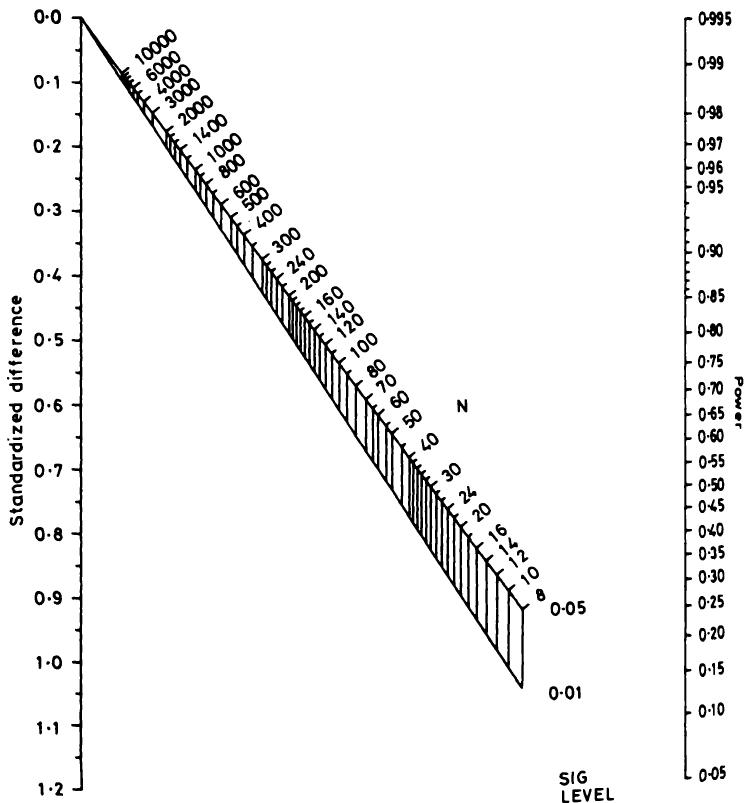

# 15 临床试验  15 Clinical trials  

在对照试验中，和所有实验工作一样，追求精确不应以牺牲常识为代价。  
In a controlled trial, as in all experimental work, there is no need for the search for precision to throw sense out of the window.  

Hill (1963)  
Hill (1963)  

## 15.1 引言  15.1 INTRODUCTION  

临床试验是一种针对人体的有计划实验，旨在评估一种或多种治疗方法的有效性。试验可以用于评估任何被视为潜在治疗手段的内容，范围广泛，包括药物、外科手术、物理治疗、饮食、针灸、健康教育等。本文将使用“临床试验”一词指代任何此类研究。  
A clinical trial is a planned experiment on human beings which is designed to evaluate the effectiveness of one or more forms of treatment. Trials can be carried out to evaluate anything that may be considered a potential treatment in its widest sense, such as drugs, surgical procedures, physiotherapy, diet, acupuncture, health education, and so on. I shall use the term clinical trial to refer to any such study.  

临床试验因其医学重要性、设计和分析中的特殊问题以及某些伦理问题而值得特别关注。该方法论约在50年前引入医学研究，最著名的早期例子是比较链霉素加卧床休息与单纯卧床休息治疗肺结核的试验（MRC，1948）。在1940年代之前，比较性临床试验几乎不为人知。Pocock（1983，第14页）对临床试验的发展历史做了总结。  
Clinical trials merit special attention because of their medical importance, some particular problems in design and analysis, and certain ethical problems. The methodology that is used was introduced into medical research about 50 years ago, with the most famous early example being a trial comparing streptomycin and bed rest with bed rest alone in the treatment of pulmonary tuberculosis (MRC, 1948). Comparative clinical trials were virtually unknown before the 1940s. Pocock (1983, p. 14) gives a summary of the historical development of clinical trials.  

在制药行业中，临床试验被划分为以下四类：  
Within the pharmaceutical industry clinical trials are classified into one of four categories:  

1. 第一阶段：临床药理学和毒理学；  
1. Phase I: Clinical pharmacology and toxicity;  

2. 第二阶段：初步临床调查；  
2. Phase II: Initial clinical investigation;  

3. 第三阶段：治疗的全面评估；  
3. Phase III: Full scale evaluation of treatment;  

4. 第四阶段：上市后监测。  
4. Phase IV: Postmarketing surveillance.  

本章我将仅讨论第三阶段试验。其显著特点是涉及两个或多个治疗方案的直接比较。它们通常被称为比较试验或对照试验。尽管有些对照试验设计用于比较多于两种治疗方案，我将重点关注常见的两组情况。通常，我会将这两种治疗视为一种实验性治疗，可能是一种新药，另一种为对照治疗，可能是  
In this Chapter I shall consider only Phase III trials. They have the distinguishing feature that they involve direct comparison between two or more treatments. They are often referred to as comparative trials or controlled trials. Although some controlled trials are set up to compare more than two treatments I shall concentrate on the common two group case. I shall usually consider the two treatments to be an experimental treatment, perhaps a new drug, and a control treatment, which may be a  

标准治疗、安慰剂，甚至完全不治疗，具体取决于具体情况。  
standard treatment, a placebo, or even no treatment at all, depending on circumstances.  

实际上，绝大多数比较临床试验具有某些共同特征，这使得我们能够对设计、分析和解释提供一般性指导。也许正因如此，临床试验可能是医学研究中统计学思想和方法论融合最为成功的领域。  
In practice the vast majority of comparative clinical trials have certain features in common which makes it possible to give general guidance on design, analysis and interpretation. Perhaps for this reason, clinical trials are probably the area of medical research where the integration of statistical ideas and methodology has been most successful.  

临床试验的核心理念是我们希望比较的患者组仅在所接受的治疗上有所不同。若组间在其他方面存在差异，则治疗比较存在偏倚。如果能够识别出偏倚，可能在分析中加以调整，但未知的偏倚无法处理。本章介绍的设计和分析方法旨在消除偏倚。  
The key idea of a clinical trial is that we wish to compare groups of patients who differ only with respect to their treatment. If the groups differ in some other way then the comparison of treatments is biased. If we can identify a bias then it may be possible to allow for its effect in the analysis, but unknown biases cannot be dealt with. The methods of design and analysis described in this chapter are aimed at the elimination of bias.  

对本章所涉及问题的更深入探讨，以及未涵盖的相关主题，可参阅多部专门论述临床试验的著作，其中尤以Pocock（1983年）一书推荐。此外，Peto等人（1976年）和Pocock（1985年）的论文讨论了一些较为棘手的问题。最后，Bradford Hill（1984年）著名著作中关于临床试验的章节也蕴含丰富智慧。  
Deeper consideration of the issues covered in this chapter, as well as topics not covered here, can be found in several books devoted to clinical trials, of which that by Pocock (1983) is particularly recommended. In addition, the papers by Peto et al. (1976) and Pocock (1985) discuss some of the trickier issues. Lastly, much wisdom can be found in the chapter on clinical trials in the famous book by Bradford Hill (1984).  

## 15.2 临床试验的设计  15.2 DESIGN OF CLINICAL TRIALS  

### 15.2.1 设立对照组的必要性  15.2.1 The need for a comparison group  

新治疗的引入是一个漫长而复杂的过程，许多看似有前景的疗法最终都未能成功。开始时，通常会先在一些患者身上尝试新治疗以观察效果。这类研究是无对照的，因此患者身上观察到的任何益处或不良反应自然都会被归因于该治疗。这类研究通常是开放性的，临床医生和患者都知道每位患者接受的治疗。研究者对新治疗的自然热情可能会影响他对患者病情进展的判断，也可能传递给患者，影响他们的健康状况，尤其是在症状主观的疾病中，如疼痛程度。许多早期这类研究曾显示新治疗效果显著，但经过更仔细的检验后，这种表面上的益处往往消失。有些情况下，早期结果甚至导致治疗被采用，而没有进行我们现在认为足够的调查。有多个例子表明，某些治疗在多年临床应用后被发现无效。其中一个例子是胃冷冻治疗十二指肠溃疡，这种方法在七年内被发现、采用又废弃（Miao，1977）。一个特别显著的例子是婴儿视网膜后纤维增生症流行导致失明的故事。  
The introduction of a new treatment is a long and complex affair, and many apparently promising therapies fall by the wayside. It is natural to begin investigation by trying a new treatment on some patients to see what happens. This type of study is uncontrolled, so that any benefits or harmful effects seen in the patients will naturally be ascribed solely to the treatment. Such studies are usually open, where the clinician and the patients know what treatment each patient is getting. The investigator's natural enthusiasm for the new treatment may well influence his judgement of the patients' progress, and may also be transmitted to the patients and affect their well- being, especially for conditions where symptoms are subjective, such as degree of pain. Many early studies of this type have suggested that new treatments were highly effective, only for this apparent benefit to disappear on more careful examination. In some cases early results may lead to a treatment being adopted without what we would now consider to be adequate investigation. There are several instances of treatments being investigated after many years' clinical use and being found ineffective. One such was gastric freezing as a treatment for duodenal ulcer, which was discovered, adopted and abandoned within the space of seven years (Miao, 1977). A particularly marked example is the story of the epidemic in babies of retrolental fibroplasia leading to  

20世纪50年代，极早产婴儿被给予高剂量氧气治疗。然而，用促肾上腺皮质激素治疗出现早期眼部变化的婴儿的成功率为75%。氧气和激素治疗都在没有对照试验的情况下被采用。经过数年临床使用后，迟来的临床试验发现激素治疗无效—75%的此类婴儿无需治疗即可恢复正常—而氧气治疗则明显有害；它实际上是导致失明的原因（Silverman，1985）。  
blindness. In the 1950s high doses of oxygen were given to very premature babies. However, the treatment of infants with early eye changes with adrenocorticotrophic hormone had a  $75\%$  success rate. Both the oxygen and hormone treatments had been adopted without the benefit of controlled trials. Only after several years of clinical use was it found, after clinical trials were belatedly carried out, that the hormone treatment was ineffective -  $75\%$  of such infants return to normal without treatment - and that the oxygen treatment was positively harmful; it caused the blindness in the first place (Silverman, 1985).  

非对照实验有其适用场合，上文称之为第二阶段试验，但它们往往给出过于乐观且因此存在偏倚的结果。对新治疗的最终评估应基于与替代治疗效果的比较。  
There is a place for uncontrolled experiments, designated above as Phase II trials, but they tend to give over- optimistic, and hence biased, results. Definitive assessment of a new treatment should be in relation to the effectiveness of an alternative treatment.  

正如我们将看到的，如果两种治疗同时进行研究，治疗分配采用随机过程，且患者和临床医生均不知道所接受的治疗，这将带来重大优势。随机双盲对照试验通常被视为评价试验设计质量的“金标准”。  
As we will see, there are major advantages if the two treatments are investigated concurrently, allocation of treatments to patients is by a random process, and neither the patient nor the clinician knows which treatment was received. The randomized double- blind controlled trial is usually taken as the 'gold standard' against which to judge the quality of the design of a trial.  

### 15.2.2 随机分配  15.2.2 Random allocation  

设计中的一个关键问题是确保治疗分配与患者特征无关—换言之，分配过程必须无偏。最广泛使用的无偏治疗分配方法是随机分配，决定每位患者接受哪种治疗。正如我们在第5章看到的，随机分配使所有受试者接受任一治疗的机会均等，因此从定义上讲是无偏的。使用随机抽样的另一个重要原因是统计分析方法基于对具有特定特征总体的随机样本的预期。  
A vital issue in design is to ensure that the allocation of treatments to patients is independent of the characteristics of the patients - in other words, it is carried out in an unbiased way. The most widely used method of unbiased treatment allocation is to use random allocation to determine which treatment each patient gets. As we saw in Chapter 5, random allocation gives all subjects the same chance of receiving either treatment and is thus unbiased by definition. Another important reason for using random sampling is that statistical methods of analysis are based on what we expect to happen in random samples from populations with specified characteristics.  

尽可能使接受不同治疗的患者组在可能影响预后特征上非常相似是高度期望的。例如，在大多数研究中，确保各组年龄分布相似非常重要，因为预后常与年龄相关。然而，随机化并不能保证各组必然非常相似。组间的差异可能由偶然引起，但这类差异至少会带来不便，甚至可能影响试验结果的解释。虽然可以通过调整分析方法来考虑组间起始差异（见第15.4节），但更好的是在设计阶段控制这一问题。最明显的方法是使用  
It is highly desirable that, as far as is possible, the groups of patients receiving the different treatments are very similar with regard to features that may affect how well they do, that is in their prognosis. For example. in most studies it is important that the age distribution of the groups similar, because prognosis is very often related to age. There is a guarantee, however, that randomization will in fact lead to the groups being very similar. Any differences between the groups will have arise a chance, but such differences can be at least inconvenient, and may lead to doubts being cast on the interpretation of the trial results. While it s possible to modify the analysis to take account of any differences between the groups at the start (see section 15.4), it is far better to try to control the problem at the design stage. Most obviously this can be done by using  

分层随机化，如第5.7.3节所述。如果我们事先知道有几个关键变量对预后有强烈影响，那么可以将它们纳入分层随机化方案中。如第5.7.3节所观察，分层随机化必须使用区组随机化，否则不会优于简单随机化。可能还有其他重要变量我们无法测量或未识别，必须依赖随机化来平衡它们。采用分层设计的好处并未被广泛接受（Peto等，1976；Meier，1981），尤其是因为增加的复杂性带来了更多执行错误的可能性。另一种获得匹配良好组的方法是使用下一节描述的最小化技术。  
stratified randomization, as described in section 5.7.3. If we know in advance that there are a few key variables that are strongly prognostic then they can be incorporated into a stratified randomization scheme. As observed in section 5.7.3, it is essential that stratified randomization uses blocking, otherwise there is no benefit over simple randomization. There may well be other important variables that we cannot measure or have not identified, and we must rely on the randomization to balance them out. The benefits of having a stratified design are not widely accepted (Peto et al., 1976; Meier, 1981), especially as the increased complexity gives more scope for errors in execution.A different method of obtaining well- matched groups is to use the technique of minimization described in the next section.  

另一种获得匹配良好组的方法是使用下一节描述的最小化技术。  
A different method of obtaining well- matched groups is to use the technique of minimization described in the next section.  

### 15.2.3 最小化  15.2.3 Minimization  

前一节强调了比较研究中随机分配的重要性。临床试验中使用非随机对照会严重降低结果的可信度。  
The desirability of random allocation in comparative studies was stressed in the previous section. The use of non- random controls in clinical trials severely lessens the credibility of the results.  

然而，最小化是一种可以安全使用的非随机方法。事实上，除非样本量很大，它比简单或分层随机抽样具有明显优势。使用最小化可以使治疗组在多个变量上非常相似，即使在小样本中也如此。它尤其适用于小型试验和从多个中心招募少量患者的试验。  
Minimization is one non- random method, however, that can be used safely. Indeed, it has definite advantages over both simple or stratified random sampling, unless the sample size is large. The use of minimization will provide treatment groups very closely similar for several variables, even in small samples. It is especially suitable for smaller trials and for trials where small numbers of patients are recruited from each of several centres.  

表15.1 乳腺癌患者胸腔积液控制中使用mustine与滑石粉对照试验的部分基线特征（Fentiman等，1983）  
Table 15.1 Some baseline characteristics of patients in a controlled trial of mustine versus talc in the control of pleural effusions in patients with breast cancer (Fentiman et al., 1983)  

<table><tr><td rowspan="2"></td><td colspan="2">治疗</td></tr><tr><td>Mustine (n = 23)</td><td>滑石粉 (n = 23)</td></tr><tr><td>平均年龄（标准误）</td><td>50.3 (1.5)</td><td>55.3 (2.2)</td></tr><tr><td>疾病分期：</td><td></td><td></td></tr><tr><td>1或2期</td><td>52%</td><td>74%</td></tr><tr><td>3或4期</td><td>48%</td><td>26%</td></tr><tr><td>乳腺癌诊断至积液诊断的平均间隔（月）（标准误）</td><td>33.1 (6.2)</td><td>60.4 (13.1)</td></tr><tr><td>绝经后</td><td>43%</td><td>74%</td></tr></table>  
<table><tr><td rowspan="2"></td><td colspan="2">Treatment</td></tr><tr><td>Mustine (n = 23)</td><td>Talc (n = 23)</td></tr><tr><td>Mean age (SE)</td><td>50.3 (1.5)</td><td>55.3 (2.2)</td></tr><tr><td>Stage of disease:</td><td></td><td></td></tr><tr><td>1 or 2</td><td>52%</td><td>74%</td></tr><tr><td>3 or 4</td><td>48%</td><td>26%</td></tr><tr><td>Mean interval in months between breast cancer diagnosis and effusion diagnosis (SE)</td><td>33.1 (6.2)</td><td>60.4 (13.1)</td></tr><tr><td>Postmenopausal</td><td>43%</td><td>74%</td></tr></table>  

表15.1显示了随机分配接受mustine或滑石粉治疗胸腔积液的乳腺癌患者的一些特征。该小规模试验采用了简单随机化，结果两组治疗在多个方面存在明显差异。分层随机化本可有所帮助，但在如此小的试验中对多个变量进行分层不可行。使用最小化方法，两组患者在所有这些变量上会非常相似，结果也会更具说服力。  
Table 15.1 shows some characteristics of breast cancer patients randomized to receive either mustine or talc as a treatment for pleural effusions. Simple randomization was used in the small trial, and by chance the two treatment groups were noticeably different. Stratified randomization would have helped, but it is not feasible to stratify on several variables in such a small trial. With minimization the two groups would have been very similar with respect to all of these variables, and the results would have been more convincing.  

最小化基于与随机化完全不同的原理。若将试验患者视为一个接一个到来，首位患者随机分配治疗。对于每位后续患者，确定哪种治疗能使各组在关注变量上达到更好的平衡。然后根据加权随机化（参见5.7.1节），倾向于分配能最小化不平衡的治疗。例如，可以采用4比1的加权，使患者有80%的概率接受使不平衡最小的治疗。该方法使得各组在所选变量上的相似性远高于简单随机化。  
Minimization is based on a completely different principle from randomization. If we regard the patients for the trial as arriving one at a time, then the first patient is given a treatment at random. For each subsequent patient we determine which treatment would lead to better balance between the groups with respect to the variables of interest. The patient is then randomized using a weighting (see section 5.7.1) in favour of the treatment which would minimize the imbalance. For example, we might use a weighting of 4 to 1, so that there is an  $80\%$  chance of each patient getting the treatment that minimizes the imbalance. The effect of this procedure is that the groups will be much more similar with regard to the chosen variables than they would be with simple randomization.  

假设mustine与滑石粉的试验采用了基于表15.1中四个变量的最小化方法。对于每个变量，我们将可能的取值分为两组，如下：  
Suppose that the mustine vs talc trial had used minimization based on the four variables shown in Table 15.1. For each variable we can divide the possible values into two groups, as follows:  

年龄（岁） ≤50 或 >50；疾病分期 1或2期 或 3或4期；癌症诊断至积液诊断间隔（月） ≤30 或 >30；绝经状态 绝经前 或 绝经后  
Age (years)  $\leq 50$  or  $>50$  Stage of disease 1 or 2 or 3 or 4 Time between diagnosis of cancer and  $\leq 30$  or  $>30$  diagnosis of effusions (months) Menopausal status Pre or Post  

假设在29名患者入组后，各治疗组中各亚组人数如表15.2所示。现有一名患者拟入组，特征为：57岁，3期，间隔22个月，绝经后。表15.3显示了两组中已具备该患者特征的女性人数。为使两组尽可能相似，该患者应分配至人数较少的治疗组。此处应采用加权随机化，权重倾向于滑石粉组。  
Suppose that after 29 patients had entered this trial the numbers in each subgroup in each treatment group were as shown in Table 15.2. We now wish to enter into the trial a patient with the following characteristics: 57 years old; stage 3; time interval 22 months; postmenopausal. The numbers of women with this patient's characteristics already in the two treatment groups are shown in Table 15.3. As we wish to have the two groups as similar as possible, the preferable treatment for the new patient is that with the smaller total. Here we would use weighted randomization with a weighting in favour of talc.  

患者分配后更新各组人数，并对下一位患者重复此过程。若某患者两组人数相同，则采用简单（无权重）随机化，如首位患者。该方法可简单推广至多类别变量及多于两种治疗的试验。  
After the patient is allocated to a treatment the numbers in each group are updated and the process is repeated for the next patient. If for any patient the totals for the two treatments are the same, then the choice should be made using simple (unweighted) randomization, as it is for the first patient. The method extends simply to variables with more than two categories and to trials of more than two treatments.  

表15.2 使用最小化方法分配治疗的临床试验中首29名患者的特征  
Table 15.2 Characteristics of the first 29 patients in a clinical trial using minimization to allocate treatments  

<table><tr><td></td><td></td><td>Mustine (n = 15)</td><td>滑石粉 (n = 14)</td></tr><tr><td rowspan="2">年龄</td><td>≤ 50</td><td>7</td><td>6</td></tr><tr><td>&gt; 50</td><td>8</td><td>8</td></tr><tr><td rowspan="2">分期</td><td>1 或 2 期</td><td>11</td><td>11</td></tr><tr><td>3 或 4 期</td><td>4</td><td>3</td></tr><tr><td rowspan="2">时间间隔</td><td>≤ 30 个月</td><td>6</td><td>4</td></tr><tr><td>&gt; 30 个月</td><td>9</td><td>10</td></tr><tr><td rowspan="2">绝经状态</td><td>绝经前</td><td>7</td><td>5</td></tr><tr><td>绝经后</td><td>8</td><td>9</td></tr></table>  
<table><tr><td></td><td></td><td>Mustine   
(n = 15)</td><td>Talc   
(n = 14)</td></tr><tr><td rowspan="2">Age</td><td>≤ 50</td><td>7</td><td>6</td></tr><tr><td>&amp;gt; 50</td><td>8</td><td>8</td></tr><tr><td rowspan="2">Stage</td><td>1 or 2</td><td>11</td><td>11</td></tr><tr><td>3 or 4</td><td>4</td><td>3</td></tr><tr><td rowspan="2">Time interval</td><td>≤ 30 m</td><td>6</td><td>4</td></tr><tr><td>&amp;gt; 30 m</td><td>9</td><td>10</td></tr><tr><td rowspan="2">Menopausal status</td><td>Pre</td><td>7</td><td>5</td></tr><tr><td>Post</td><td>8</td><td>9</td></tr></table>  

表 15.3 第三十位患者治疗分配中患者特征不平衡的计算  
Table 15.3 Calculation of imbalance in patient characteristics for allocating treatment to the thirtieth patient  

<table><tr><td></td><td></td><td>Mustine (n = 15)</td><td>滑石粉 (n = 14)</td></tr><tr><td>年龄</td><td>&gt; 50</td><td>8</td><td>8</td></tr><tr><td>分期</td><td>3 或 4 期</td><td>4</td><td>3</td></tr><tr><td>时间间隔</td><td>≤ 30 个月</td><td>6</td><td>4</td></tr><tr><td>绝经后</td><td></td><td>8</td><td>9</td></tr><tr><td></td><td></td><td>总计 26</td><td>24</td></tr></table>  

<table><tr><td></td><td></td><td>Mustine   
(n = 15)</td><td>Talc   
(n = 14)</td></tr><tr><td>Age</td><td>&amp;gt; 50</td><td>8</td><td>8</td></tr><tr><td>Stage</td><td>3 or 4</td><td>4</td><td>3</td></tr><tr><td>Time interval</td><td>≤ 30 m</td><td>6</td><td>4</td></tr><tr><td>Postmenopausal</td><td></td><td>8</td><td>9</td></tr><tr><td></td><td></td><td>Total 26</td><td>24</td></tr></table>  

治疗分配中可以省略随机成分，使每位患者自动接受能减少不平衡的治疗。尽管某位患者接受的治疗复杂地依赖于已入组患者的特征，但缺少随机因素会带来小概率的选择偏倚。因此，优选使用加权随机化。  
The random component can be omitted from the allocation of treatments, so that each patient is automatically given the treatment which leads to less imbalance. Although the treatment that a particular patient receives depends in a complicated way upon the characteristics of the patients already entered into the trial, the absence of a random element introduces a small possibility of selection bias. It is preferable therefore to use weighted randomization.  

最小化方法是普通随机化的有效替代方案，尤其在小样本试验中具有重要优势，即各组间在用于分配的变量上差异极小。该方法特别适合借助计算机程序执行，但若在每位新患者入组后更新各组患者特征计数，也不难手工操作。  
Minimization is a valid alternative to ordinary randomization, and it has the important advantage, especially in small trials, that there will be only minor differences between the groups with respect to those variables used in the allocation process. It is particularly suitable to be performed with the aid of a computer program, but it is not difficult to perform 'by hand' if the record of the numbers of patients with each characteristic in each group is updated after each new patient has entered the trial.  

### 15.2.4 其他治疗分配方法  15.2.4 Other methods of treatment allocation  

随机分配的替代方法可分为系统性（或伪随机）方法和非随机方法。非随机试验又可细分为同期对照和非同期（或历史）对照。  
Alternatives to random allocation may be divided into systematic (or pseudo- random) methods and non- random methods. Non- randomized trials can be further divided into those with concurrent or non- concurrent (or historical) controls.  

#### (a) Systematic allocation  <!-- 非数字标题，四级 -->  

一种常见的方法是根据患者的出生日期或入组试验的日期分配治疗（例如，给偶数日期的患者分配治疗A，奇数日期的患者分配治疗B），或者根据医院号码的末位数字，或者简单地交替分配到不同的治疗组。虽然原则上这些方法都是无偏的，但由于分配系统的公开性，问题随之而来。简单来说，分配被有权访问该程序的人更改是一个众所周知的现象。此外，知道患者将接受哪种治疗可能会影响是否将该患者纳入试验的决定。虽然这些行为通常出于利他动机，但结果是分配存在偏倚，且数据很可能毫无价值。  
A common approach is to allocate treatments to patients according to the patient's date of birth or date of enrolment in the trial (such as giving treatment A to those with even dates, and treatment B to those with odd dates), by the terminal digit of the hospital number, or simply alternately into the different treatment groups. While all of these approaches are in principle unbiased, problems arise from the openness of the allocation system. Put crudely, it is a well- known phenomenon for the allocation to be altered by someone with access to the procedure. Further, knowledge of which treatment a patient is destined to receive can affect the decision about whether to enter that patient into the trial. While such actions are often taken for altruistic motives, the result is a biased allocation and quite possibly a worthless set of data.  

尽管系统分配看似无偏，但容易被滥用，除非确实没有其他选择，否则不推荐使用。“伪随机”这一术语具有误导性，因为该方法没有随机成分，且明显不及真正的随机分配。  
Although systematic allocation appears unbiased, it is open to abuse and cannot be recommended unless there really is no alternative. The term 'pseudo- random' is misleading, as there is no random element and the method is definitely inferior to true random allocation.  

#### (b) Non-random concurrent controls  <!-- 非数字标题，四级 -->  

使用非随机对照会导致解释上的问题，因为通常无法确定各组是否可比。实际上，各组可能在已知方面存在差异，但其影响未知。例如，在关于维生素补充剂与安慰剂对神经管缺陷的试验中（Smithells 等，1980，后文将进一步讨论），对照组包括不符合试验资格的女性以及拒绝参与的女性。许多研究表明存在志愿者偏倚，志愿者通常预后优于拒绝者。只要不同治疗组之间存在系统性差异，例如患者来自不同医院，我们就应担心偏倚。由临床医生根据情况决定治疗的研究尤其不可靠。  
The use of non- random controls leads to problems of interpretation, because it will usually be impossible to establish that the groups are comparable. Indeed, the groups may specifically differ in known ways but with unknown effect. For example, in the trial of vitamin supplementation versus placebo in relation to neural tube defects (Smithells et al., 1980). discussed further below, the control group included women ineligible for the trial as well as women who refused to participate. Many studies have shown that there is a volunteer bias, with volunteers usually having a better prognosis than refusers. We should worry about bias whenever there is a systematic difference between the patients given different treatments, for example when the groups are taken from patients at different hospitals. Studies where the treatments are given as deemed appropriate by the clinician are especially unreliable.  

#### (c) Historical controls  <!-- 非数字标题，四级 -->  

评估新治疗最简单的方法可能是将接受新治疗的单一患者组与先前接受另一种治疗的患者组进行比较。这通常是同一家医院的两个连续患者系列。尽管有少数支持者，但这种方法存在严重缺陷，因为我们永远无法令人满意地排除随时间变化的其他因素带来的偏倚。  
Probably the simplest approach to evaluating a new treatment is to compare a single group of patients all given the new treatment with a group previously treated with an alternative treatment. Often these will be two consecutive series of patients in the same hospital(s). Despite a few  

Pocock（1977）显示，在同一机构连续进行的19例癌症化疗试验中，观察到的死亡率变化范围从$-46\%$到$+24\%$。尽管部分变化可能因样本量小，但其中四个差异在2%显著性水平上具有统计学意义。Sacks 等（1983）比较了使用随机对照和历史对照的同类治疗试验，发现历史对照试验倾向于给出更乐观的结果。仅在严格控制的罕见病情情况下，如评估晚期癌症治疗，使用历史对照才有正当理由。  
advocates, this approach is seriously flawed as we can never satisfactorily eliminate possible biases due to other factors that may have changed over time. Pocock (1977) showed that in 19 cases where the same therapy was used in two consecutive trials of cancer chemotherapy in the same institution there were large changes in the observed death rates, ranging from  $- 46\%$  to  $+24\%$ . While some of the variation was probably due to small sample sizes, four of the differences were statistically significant at the  $2\%$  level. Sacks et al. (1983) compared trials of the same therapies in which randomized or historical controls were used, and found a consistent tendency for historically controlled trials to yield more optimistic results than randomized trials. The use of historical controls can only be justified in tightly controlled situations of relatively rare conditions, such as in evaluating therapies for advanced cancer.  

目前，随机试验的观点已占主导地位，非随机试验的结果可能引发重大争议。一个近期例子是关于高风险孕妇在受孕时补充维生素是否有益的研究（Smithells 等，1980）。他们发现维生素组的神经管缺陷婴儿较安慰剂组少，但因研究非随机，结果未被广泛接受，医学研究委员会现正开展大型随机试验以获得确切答案。  
The balance of opinion has now swung so far towards randomized trials that the results of non- randomized trials may cause major controversy. A recent example was the study of the possible benefit of vitamin supplementation at the time of conception in women at high risk of having a baby with a neural tube defect (NTD) (Smithells et al., 1980). They found that the vitamin group subsequently had fewer NTD babies than the placebo control group, but because the study was not randomized the findings are not widely accepted, and the Medical Research Council is now running a large randomized trial to try to get a proper answer to the question.  

### 15.2.5 替代设计  15.2.5 Alternative designs  

临床试验最简单的设计称为平行组设计，即同时研究两个不同的患者组。这是本章迄今为止隐含的设计。最常见的替代设计是交叉设计，下面将介绍该设计及一些值得了解的其他较少见设计。  
The simplest design for a clinical trial is called the parallel group design, in which two different groups of patients are studied concurrently. This is the design that has been implicit in this chapter so far. The most common alternative is the crossover design, which is described below together with some other less common designs that are worth knowing about.  

#### (a) Crossover design  <!-- 非数字标题，四级 -->  

交叉试验是指同一组患者依次接受所有感兴趣的治疗。随机分配用于决定治疗顺序。交叉设计具有一些优点，尤其是治疗比较是“组内”而非“组间”，且所需样本量较小。然而，也存在一些重要缺点，以下以两期交叉试验为例说明：  
A crossover trial is one in which the same group of patients are given both (or all) treatments of interest in sequence. Here randomization is used to determine the order in which the treatments are received. The crossover design has some attractive features, in particular that the treatment comparison is 'within- subject' rather than 'between- subject', and that the sample size needed is smaller. There are some important disadvantages, however, which I shall describe in relation to a two- period crossover trial:  

【1】患者可能在接受第一期治疗后退出，未接受第二期治疗。退出可能与副作用有关。治疗期应尽量短，以减少因其他原因导致的退出风险。  
1. Patients may drop out after the first treatment, and so not receive the second treatment. Withdrawal may be related to side-effects. Treatment periods should be fairly short to minimize the risk of drop-out for other reasons.  

2. 可能存在治疗效果从一个时期延续到下一个时期的情况，因此第二个治疗期间获得的结果会受到第一个时期发生情况的影响。换句话说，观察到的治疗差异将取决于接受治疗的顺序。在存在这种治疗-时期交互作用的情况下，可能需要丢弃第二时期的数据，这会严重削弱试验的统计效能。  
2. There may be a carry-over of treatment effect from one period to the next, so that the results obtained during the second treatment are affected by what happened in the first period. In other words, the observed difference between the treatments will depend upon the order in which they were received. In the presence of such a treatment-period interaction the data for the second period may have to be discarded, severely weakening the power of the trial.  

3. 试验的两个时期之间可能存在某些系统性差异。例如，第二时期的观察值可能比第一时期略低，无论治疗如何。小的时期效应并不严重，因为它对两种治疗的影响是相等的。  
3. There may be some systematic difference between the two periods of the trial. For example, the observations in the second period may be somewhat lower than those in the first period, regardless of treatment. A small period effect is not too serious, as it applies equally to both treatments.  

4. 交叉设计不能用于可以治愈的疾病，且最适用于治疗效果能够迅速评估的情况。  
4. Crossover studies cannot be used for conditions which can be cured, and are most suitable when the effect of the treatment can be assessed quickly.  

理想情况下应事先确认不存在治疗效果的延续影响，但相关信息可能无法获得。有时会在治疗期之间引入洗脱期以试图消除延续效应。鉴于上述问题，交叉设计可能被过度使用。Woods 等人（1989）对此有进一步讨论。  
It is desirable to establish in advance that there will not be any carry- over treatment effect, but the information may be unavailable. A wash- out period is sometimes introduced between the treatment periods to try to eliminate carry- over effects. Because of the problems described, crossover studies are probably overused. Further discussion is given by Woods et al. (1989).  

交叉试验的分析方法在第15.4.10节中进行了说明和示例。  
The analysis of crossover trials is explained and illustrated in section 15.4.10.  

#### (b) Within group (paired) comparisons  <!-- 非数字标题，四级 -->  

另一种组内设计是同时在同一受试者身上研究交替治疗。此设计适用于可以独立施用于解剖匹配部位（如肢体或眼睛）的治疗。匹配设计具有交叉设计的所有优点，但没有其缺点，因此是一种非常有力的设计。不幸的是，适用场景较少。  
Another type of within group design is when alternative treatments are investigated in the same subjects at the same time. It can be used for treatments that can be given independently to matching parts of the anatomy, such as limbs or eyes. The matched design has all the advantages of the crossover design, but none of the disadvantages, so is a very powerful design. Unfortunately, there are few circumstances in which it can be used.  

与配对组内设计最接近的是匹配对设计，其中成对受试者根据年龄、性别及某些预后因素进行匹配，然后随机分配两种治疗给这对受试者。该设计仅在存在可供入组的受试者库时易于使用，以便找到匹配对。对于已知的重要预后变量，该设计减少了受试者间的变异，确保接受每种治疗的受试者特征非常相似。  
The nearest equivalent to the paired within subject design is the matched pairs design, where pairs of subjects are matched for, say, age, sex and certain prognostic factors, and the two treatments are then allocated to the pair of subjects at random. This design can only be used easily when there is a pool of subjects that can be entered into the trial, in order to be able to find matched pairs. Where there are known important prognostic variables the design removes much of the between subject variation, and ensures that the subjects receiving each treatment have very similar characteristics.  

#### (c) Sequential designs  <!-- 非数字标题，四级 -->  
另一种设计类型是序贯试验，其中研究平行组，但试验持续进行，直到观察到一种治疗明显优于另一种，或不太可能出现差异为止。  
Another type of design is the sequential trial, in which parallel groups are  

序贯试验的主要优点是当两种治疗效果差异较大时，试验时间会比固定长度试验更短。  
studied, but the trial continues until a clear benefit of one treatment is seen or it is unlikely that any difference will emerge. The main advantage of sequential trials is that they will be shorter than fixed length trials when there is a large difference in the effectiveness of the two treatments.  

在序贯试验中，每当有患者结果可用时都会进行数据分析。因此，其使用仅限于结果能够较快得知的情况。此设计存在盲法问题（见第15.2.6节），可能还存在伦理上的困难。  
In sequential trials the data are analysed after each patient's results become available. Their use is therefore restricted to conditions where the outcome is known relatively quickly. There are problems with blinding (see section 15.2.6), and possibly also ethical difficulties.  

这一原则的一个有用变体是分组序贯试验，在这种试验中，数据在每一组患者观察后进行分析，可能总共分析四到五次。这样不仅使试验的计划（尤其是时长）更容易，还能在观察到明显的治疗差异时提前终止试验。  
A useful variation on this principle is the group sequential trial, in which the data are analysed after each block of patients has been seen, perhaps four or five times in all. This allows the trial to be planned more easily (regarding length) but also enables the trial to be stopped early if a clear treatment difference is seen.  

在合适的情况下，序贯试验是一种良好的方法，应当更频繁地使用。  
In the right circumstances sequential trials are a good method, and they should be used more frequently.  

#### (d) Factorial designs  <!-- 非数字标题，四级 -->  

另一种设计类型称为因子设计，其中两个治疗方法（例如A和B）同时相互比较并与对照组比较。患者被分为四组，分别接受对照治疗、仅A治疗、仅B治疗以及同时接受A和B治疗。该设计允许研究A和B之间的交互作用（或“协同效应”）。因子设计在临床试验中较少使用，但Pocock（1983，第139页）描述了一些应用实例。  
One further type of design is called the factorial design, in which two treatments, say A and B, are simultaneously compared with each other and with a control. Patients are divided into four groups, who receive the control treatment, A only, B only, and both A and B. This design allows the investigation of the interaction (or 'synergy') between A and B. The factorial design is rarely used in clinical trials, but Pocock (1983, p. 139) describes some examples of its use.  

#### (e) Adaptive designs  <!-- 非数字标题，四级 -->  

伦理考虑促使一些人主张采用自适应设计，在这种设计中，接受较差治疗的受试者比例随着试验的进行而减少。换句话说，患者的治疗在某种程度上取决于之前试验患者的治疗结果。除了一些实际困难，如需要快速得知每位患者的结果外，这种设计是否解决了伦理问题仍有疑问。自适应设计很少被采用。  
Ethical considerations have led some people to advocate adaptive designs, in which the proportion of subjects getting the inferior treatment diminishes as the trial proceeds. In other words, a patient's treatment depends to some extent on the outcome of treatment in previous patients in the trial. Apart from practical difficulties, such as needing to know quickly the results from each patient, it is questionable whether this design resolves any ethical problems. Adaptive designs have rarely been used.  

#### (f) Zelen's design  <!-- 非数字标题，四级 -->  

最后，Zelen（1979）提出了一种随机试验的变体，似乎避免了获得知情同意相关的问题。半数受试者被随机分配接受标准治疗，并且被视为未参与试验。另一半受试者被提供新的实验治疗，但他们可以选择接受标准治疗。Zelen提议的一个关键特征是（Zelen，1979），无论第二组患者实际选择了哪种治疗，两个组都按最初的随机分组进行分析。虽然该设计有一些有用的特点，但只有在接受新治疗的比例很高时才有价值，而这一点事先无法确定。  
Lastly, Zelen (1979) proposed a variation on the randomized trial that seems to avoid problems associated with getting informed consent. Half of the subjects are allocated at random to receive the standard treatment, and are treated as if they were not in a trial. The other half are offered the new experimental treatment, but they can choose to have the standard treatment if they wish. An essential feature of Zelen's proposal (Zelen, 1979) is that the two groups are analysed as originally randomized, regardless of which treatment those in the second group actually opted for. While this design has some useful features, it can only be of value when a high proportion of those offered the new treatment take it, which cannot  

这种设计很少被采用，许多人认为不告知半数患者他们参与试验是不道德的。另一种变体是两组都被告知所分配的治疗，并被给予转换治疗的机会。虽然解决了伦理难题，但由于缺乏盲法和如果过多患者选择转换治疗会导致效能降低，这种设计存在潜在问题。总体来看，这种设计并不被推荐。Ellenberg（1984）对此有进一步讨论。  
be known in advance. This design has rarely been used, and many consider it unethical not to tell half the patients that they are in a trial. A variation is where both groups are told which treatment they have been allocated and are offered the chance to switch to the other. While resolving the ethical difficulty, there are possible difficulties associated with the necessary lack of blindness and loss of power if too many patients opt to change treatment. There does not seem to be much to recommend this design. Ellenberg (1984) gives further discussion.  

### 15.2.6 盲法  15.2.6 Blindness  

成功的临床试验关键在于避免组间比较的任何偏倚。随机化解决了治疗分配时的潜在偏倚，但偏倚也可能在试验进行中出现。患者和医生可能因知道所给予的治疗而在反应和观察上产生影响。因此，理想情况下，患者和评估者均不应知道所给予的治疗，这样的试验称为双盲试验。如果只有患者不知道，有时称为单盲试验。在某些领域，如外科，常常无法做到双盲。临床试验应尽可能采用最高程度的盲法。  
The key to a successful clinical trial is to avoid any biases in the comparison of the groups. Randomization deals with possible bias at the treatment allocation, but bias can also creep in while the study is being run. Both the patient and the doctor may be affected in the way they respectively respond and observe by knowledge of which treatment was given. For this reason, it is desirable that neither the patient nor the person evaluating the patient knows which treatment was given. Such a trial is called double- blind. If only the patient is unaware, as is sometimes the case, the trial is called single- blind. In several fields, such as surgery, it is often impossible for a study to be double- blind. Clinical trials should use the maximum degree of blindness that is possible.  

此外，治疗分配系统应设计成录入患者信息的人事先不知道下一位患者将接受哪种治疗。常用方法是使用一系列连续编号的密封不透明信封，每个信封内含治疗方案。对于分层随机化，需要两套或更多套信封。药物试验中，分配可能由药房执行，药房会提供编号瓶子，瓶子上不标明所含治疗。  
In addition, the treatment allocation system should be set up so that the person entering patients does not know in advance which treatment the next person will get. A common way of doing this is to use a series of consecutively numbered sealed opaque envelopes, each containing a treatment specification. For stratified randomization, two or more sets of envelopes are needed. For drug trials the allocation may be carried out by the pharmacy, who will produce numbered bottles which do not indicate the treatment contained.  

双盲试验明确要求不同治疗对患者和评估者均不可区分。对于比较两种有效药物的试验，可能需要采用双模拟技术，即每位患者同时服用一种有效药物和一种外观类似于另一种有效药物的安慰剂。  
Double- blind trials clearly require that the different treatments should be indistinguishable to the patient and to whoever assesses the patient. For drug trials comparing two active treatments this may require the double dummy technique, in which each patient receives one of the active drugs and a dummy tablet that looks like the alternative active drug.  

### 15.2.7 安慰剂  15.2.7 Placebos  

当我们希望评估一种新治疗方法时，面临的一个问题是给对照组提供什么治疗。如果（且仅当）没有现有的标准有效治疗时，不给对照组任何有效治疗是合理的。然而，有两个原因使得给对照组患者提供一种惰性虚拟治疗或安慰剂，而不是不给予任何治疗，是更为理想的。首先，服用治疗的行为本身  
When we wish to evaluate a new treatment for a condition there is the problem of what treatment to give to the control group. If (and only if) there is no existing standard beneficial treatment, then it is reasonable not to give the control group any active treatment. However, there are two reasons why it is desirable to give the control group patients an inert dummy or placebo treatment, rather than nothing. Firstly, the act of taking  

某些治疗本身可能对患者有一定益处，因此如果对照组什么都不给予，那么治疗组观察到的任何益处部分可能来自于他们知道或相信自己接受了治疗。这被称为安慰剂效应。其次，为了使研究达到双盲标准，两个治疗必须无法区分。因此，安慰剂药片在外观和口感上应与有效治疗药片完全相同，但在药理上无效。  
some treatment may itself have some benefit to the patient, so that if we give nothing at all to the control group then part of any benefit observed in the treated group could be due to the knowledge or belief that they had taken a treatment. This is known as the placebo effect. Secondly, in order for a study to be double- blind it is necessary for the two treatments to be indistinguishable. Placebo tablets should therefore be identical in appearance and taste to the active treatment, but pharmacologically inactive.  

许多临床试验实际上确实发现安慰剂组有某种表面上的治疗益处，而且通常也会出现副作用。如果没有一个比较组（该组可能接受另一种有效治疗或安慰剂），我们无法判断任何益处（或伤害）是否特异于正在研究的新治疗。例如，如果在有效治疗组和安慰剂组中报告的头痛数量相同，我们就不会将头痛视为有效治疗的副作用。  
Many clinical trials do, in fact, find some apparent benefit of treatment in the placebo group, and there are often side- effects too. Without a comparison group, who may be given an alternative active treatment or a placebo, we cannot know how specific any benefit (or harm) is to the new treatment being investigated. For example, if there are as many reported headaches in the active and placebo treated groups, we would not consider headache as a side- effect of the active treatment.  

安慰剂有时也可以用于非药物试验中。在第10.3节中，我描述了一个使用模拟电刺激作为对照治疗的试验。同样，针灸的对照组也可以通过在“错误”穴位插针来轻松设置。然而，侵入性安慰剂可能存在伦理问题。  
Placebos can sometimes be used in non- drug trials too. In section 10.3 I described a trial that had used mock electrical stimulation as a control treatment. Likewise a control for acupuncture is easily set up by having needles inserted at the 'wrong' points. There may however be ethical problems associated with invasive placebos.  

### 15.2.8 受试者的选择  15.2.8 Selection of subjects  

临床试验是一个典型例子，说明我们从样本中收集数据，并利用分析结果对所有此类受试者的总体进行推断。为了使这一过程有效，显然需要选择具有代表性的样本。然而在实际操作中，通常会对谁有资格参加试验施加许多限制，因此将结果外推到总体可能会很困难。例如，一项安慰剂对照试验在英国医生中进行，旨在观察每日服用阿司匹林是否能降低中风、心肌梗死及其他血管疾病的发生率和死亡率（Peto 等，1988）。研究者确定了20000名愿意参与的医生，但其中近四分之三因各种原因不符合资格—要么他们已经因某些原因在服用阿司匹林，要么因有服用阿司匹林的禁忌症，或者有消化性溃疡、中风或心肌梗死的病史。因此，参与研究的医生是一群健康状况较好的选定人群。  
Clinical trials are a prime example of the principle that we collect data from a sample and use the results of the analysis to make inferences about the population of all such subjects. In order for this process to work it is clearly necessary to select a representative sample. In practice, however, many restrictions are usually placed on who is eligible to take part in a trial, and so extrapolation of the results to the population may be difficult. For example, a placebo- controlled trial was carried out in British doctors to see if daily aspirin would reduce the incidence of and mortality from stroke, myocardial infarction and other vascular conditions (Peto et al., 1988). The investigators identified 20000 doctors who were willing to participate but almost three- quarters of them were ineligible, either because they were already taking aspirin for some reason, because there were reasons why they could not take aspirin, or because they had a history of peptic ulcer, stroke or myocardial infarction. The doctors who took part in the study were therefore a selected group of more healthy individuals.  

图15.1展示了低血压或高血压患者如何因为不同原因被排除在新型降压治疗试验之外。通常，伦理上合理且适合纳入试验的患者是那些如果治疗有效最有可能受益的患者。一般而言（但并非总是如此），我们不期望治疗对预后极佳的患者或预后极差的患者有显著作用。  
Figure 15.1 shows how patients with either low or high blood pressure would be excluded from a trial of a new hypertensive treatment, although for different reasons. Often the patients whom it is both ethical and reasonable to include in a trial are those most likely to benefit if the treatment is effective. In general, but not always, we do not expect treatment to do much for patients who already have an excellent prognosis, nor for those with a dreadful prognosis.  

  
图15.1 新型降压药物试验中患者资格的示意图（基于 Elwood，1982）。  
Figure 15.1 Diagram showing the eligibility of patients for a trial of a new antihypertensive agent (based on Elwood, 1982).  

Begg 和 Engstrom（1987）讨论了癌症临床试验中过于严格的资格标准问题，这可能导致大多数患病患者不符合试验资格。他们认为许多排除标准是不必要的。排除标准越严格，试验结果的推广性越差。尤其在大型试验中，不宜过于严格；尽管在小型试验中，如果采用简单随机化，保持受试者的同质性可能有一定优势。  
Begg and Engstrom (1987) discussed the problem of over- restrictive eligibility criteria in cancer clinical trials, which can lead to most patients with a disease being ineligible for a trial. They suggest that many exclusion criteria are unnecessary. The more restrictive the exclusion criteria, the less generalizable will be the results of the trial. In large trials especially it is better not to be too restrictive, although in small trials there may be some advantage in keeping the study subjects more homogeneous, especially if simple randomization is used.  

### 15.2.9 伦理问题  15.2.9 Ethical issues  

临床试验是对人体进行的实验，因此临床试验涉及若干重要的伦理问题不足为奇。其中之一是关于给予患者的信息量。一般来说，应邀请患者参加试验，并告知他们可选择的替代治疗方案（尽管他们通常不知道自己将接受哪种治疗）。患者可以拒绝参加试验，这种情况下他们将接受常规治疗。如果同意参加，通常需要签署一份表明他们理解试验内容的同意书。知情同意具有争议，因为许多患者可能并未真正理解所告知的内容，且他们并不总是被告知应有的全部信息。在某些情况下，无法获得知情同意，例如患者年龄非常小、非常大或处于昏迷状态时。此外，在某些情况下，获得患者同意随机分组可能很困难，比如比较乳腺切除术与化疗治疗乳腺癌的试验。  
A clinical trial is an experiment on human beings, so it is not surprising that there are several important ethical issues relating to clinical trials. One concerns the amount of information given to the patient. In general the patient should be invited to be in the trial, and should be told what the alternative treatments are (although they will usually not know which they will get). They can decline to be in the trial, in which case they will be treated normally. If they agree to participate they will often have to sign a form stating that they understand the trial. This informed consent is controversial, because it is likely that many patients do not really understand what they are told, and that they are not always told as much as they should be. There are some cases where it is not possible to get informed consent, for example when the patients are very young, very old, or unconscious. Also there are a few circumstances where it might be difficult to get people to agree to be randomized, such as in a trial comparing mastectomy with chemotherapy as a treatment for breast cancer.  

从临床角度看，如果医生认为正在研究的某种治疗优于其他治疗，则不应参与该临床试验，也不应让认为某种治疗更适合的患者参加试验。换句话说，理想的医学状态是无知状态：进行试验是因为我们不知道哪种治疗更好。有人可能认为，活性治疗在无对照的观察性研究中显示出有希望的结果，因此肯定优于安慰剂，但事实并非总是如此。此外，即使治疗有效，也可能存在不可接受的副作用。  
From the clinical side, no doctor should participate in a clinical trial if he/she believes that one of the treatments being investigated is superior, and they should not enter any patient for which they think that a particular treatment is indicated. In other words, the ideal medical state to be in is one of ignorance: the trial is carried out because we do not know which treatment is better. It may be thought that an active treatment, which will have yielded promising results in uncontrolled observational studies, would be certain to be better than a placebo, but this is not always so. Further, even if the treatment is beneficial there may be unacceptable side- effects.  

许多国家设有大量伦理委员会，负责审查临床试验（以及任何涉及人体的研究）提案。有趣的是，围绕围绕受孕期维生素补充剂试验设计的问题（Smithells 等，1980）主要源于伦理委员会拒绝批准最初提出的随机试验方案。当然，最终实施的研究得到了伦理委员会的批准。伦理委员会通常只关注患者福利，不涉及科学问题，包括统计学问题。  
In many countries there are a large number of ethics committees set up to consider proposals to carry out clinical trials (and, indeed, any research involving human subjects). Interestingly, the problems relating to the design of the trial of vitamin supplementation around conception (Smithells et al., 1980) stemmed largely from the refusal of ethics committees to sanction the randomized trial that was originally proposed. The study as performed did, of course, have the approval of the ethics committees. Ethics committees are usually concerned only with the welfare of the patient, and do not consider scientific, including statistical, issues.  

在设计方面，可以认为非随机试验，尤其是使用非同时（历史）对照的试验是不道德的，因为如前所述，这类试验结果极不可靠。类似的批评也适用于任何采用次优方法的试验，尽管无法明确划定伦理与非伦理研究的界限。  
Regarding design, it can be argued that non- randomized trials, especially those with non- concurrent (historical) controls, are unethical because, as shown earlier, the results of such trials are so unreliable. Similar comments can be levelled at any trial which uses suboptimal methodology, although it is not possible to draw a precise line between ethical and unethical studies.  

更广泛地说，任何使用低标准统计方法的研究（不一定是临床试验），尤其是在设计或分析方面，可能被视为不道德，原因有三（Altman，1982a）：  
More generally, any study (not necessarily a clinical trial) that uses substandard statistical methods, especially in design or analysis, may be deemed unethical for three reasons (Altman, 1982a):  

1.滥用患者，使其承受无正当理由的风险和不便；  
1. the misuse of patients by exposing them to unjustified risk and inconvenience;  
2.浪费资源，包括研究者的时间，这些时间本可用于更有价值的活动；  
2. the misuse of resources, including the researchers' time, which could be better employed on more valuable activities; and  
3.发表误导性结果的后果，可能导致进行不必要的后续研究。  
3. the consequences of publishing misleading results, which may include the carrying out of unnecessary further work.  

许多关于临床试验伦理问题的讨论见于 Bradford Hill（1963）。Silverman（1985，第153页）对主要问题进行了较新的综述。  
Many of the ethical issues relating to clinical trials were dealt with by Bradford Hill (1963). Silverman (1985, p. 153) gives a more recent review of the main issues.  

### 15.2.10 结局指标  15.2.10 Outcome measures  

在大多数临床试验中，关于治疗效果的信息是针对许多变量收集的，有时是在多个时间点。人们容易陷入分析每个变量并寻找治疗组间显著差异的诱惑。这种方法会导致误导性结果，因为多重检验会使假设检验的结果失效。  
In most clinical trials information about the effect of treatment is gathered in relation to many variables, sometimes on more than one occasion. There is the temptation to analyse each of the variables and look to see which differences between treatment groups are significant. This approach leads to misleading results, because multiple testing will invalidate the results of  

特别是，仅展示最显著的结果，仿佛这些是唯一进行的分析，是欺诈行为。  
hypothesis tests. In particular, presenting only the most significant results, as if these were the only analyses performed, is fraudulent.  

更可取的方法是在分析前预先确定主要关注的结局指标，并在数据分析时重点关注该变量。其他数据也可以且应当进行分析，但这些变量应被视为次要。次要变量中的任何有趣发现应谨慎解读，更应作为进一步研究的思路，而非确定性结论。治疗的副作用也应以此方式处理。  
A preferable approach is to decide in advance of the analysis which outcome measure is of major interest, and focus attention on this variable when analysing the data. Other data can and should be analysed too, but these variables should be considered to be of secondary importance. Any interesting findings among the secondary variables should be interpreted rather cautiously, more as ideas for further research than as definitive results. Side- effects of treatment should be treated in this way.  

有时确实会有多个主要结局指标。如果有两个，分析这两个指标通常不会带来太大问题，或许可以采用更严格的统计显著性阈值。有时可以将两个变量合并为一个，尤其当关注的变量是替代事件时，如死亡或心脏病发作。  
Sometimes there really will be more than one major outcome measure. If there are two, then no great harm will come from analysing them both, perhaps taking a stricter cut- off for statistical significance. Sometimes it is possible to combine two variables into one, in particular when the variables of interest are alternative events, such as death or heart attack.  

最后，注意样本量计算（见第15.3节）是基于单一变量的。  
Finally, note that sample size calculations (see section 15.3) are based on a single variable.  

### 15.2.11 研究方案  15.2.11 Protocols  

规划临床试验的重要方面是制定研究方案，研究方案是一份正式文件，概述了实施试验的拟定程序。  
An important aspect of planning a clinical trial is to produce a protocol, which is a formal document outlining the proposed procedures for carrying out the trial.  

Pocock（1983，第28-31页）建议研究方案应包括以下主要内容：  
Pocock (1983, pp. 28- 31) suggests the following main features of a study protocol:  

1. 背景和研究目标  
1. background and study objectives  

2. 具体目标  
2. specific objectives  

3. 患者选择标准  
3. patient selection criteria  

4. 治疗方案  
4. treatment schedules  

5. 患者评估方法  
5. methods of patient evaluation  

6. 试验设计  
6. trial design  

7. 患者登记与随机分组  
7. registration and randomization of patients  

8. 患者知情同意  
8. patient consent  

9. 研究所需样本量  
9. required size of study  

10. 试验进展监控  
10. monitoring of trial progress  

11. 表格与数据处理  
11. forms and data handling  

12. 方案偏差  
12. protocol deviations  

13. 统计分析计划  
13. plans for statistical analysis  

14. 行政职责  
14. administrative responsibilities.  

申请试验经费时必须提交方案，大部分上述信息也需提供给当地伦理委员会。此外，方案不仅有助于试验的实施，还能使结果撰写更为简便，因为论文的引言和方法部分应基本与上述第1至9节内容一致。  
A protocol is necessary when applying for a grant to carry out a trial. and most of the above information will be required by the local ethics committee. Further, as well as aiding in the carrying out of a trial. a protocol makes the writing up of the results much easier as the introduction and methods section of the paper should be substantially the same as sections 1 to 9 above.  

对于多中心研究，详细的方案是必不可少的，且强烈建议任何临床试验都应制定方案。事实上，我建议任何研究项目都应制定正式方案—上述大多数类别并非临床试验特有。  
For multicentre studies a detailed protocol is essential, and it is strongly recommended for any clinical trial. Indeed, I recommend the drawing up of a proper protocol for any research project - most of the above categories are not specific to clinical trials.  

## 15.3 样本量  15.3 SAMPLE SIZE  

### 15.3.1 引言  15.3.1 Introduction  

在第8.5.3节中，我介绍了与假设检验相关的检验效能（power）概念。检验效能是指在给定样本量的研究中，能够以统计学显著性检测到某一真实差异的概率。医学文献中存在许多样本量过小的试验，这些试验几乎无法有效检测治疗间临床有意义的差异。从多篇已发表试验的综述中可以明显看出，大多数试验在设计时未进行适当的样本量统计计算。除非真实治疗效应较大，否则小样本试验只有在样本中观察到的差异远大于真实差异时，才可能出现统计学显著结果。  
In section 8.5.3 I introduced the concept of power in relation to hypothesis testing. The power of a test is the probability that a study of a given size would detect as statistically significant a real difference of a given magnitude. The medical literature contains many trials that were far too small to have a good chance of detecting clinically worthwhile differences between the treatments being investigated. It is clear from many reviews of published trials that the majority have been carried out with no statistical calculation of the appropriate sample size. Unless the true treatment effect is large, small trials can yield a statistically significant result only if, by chance, the observed difference in the sample is much larger than the real difference.  

本节介绍用于计算比较两组独立受试者（平行组设计）或比较配对观察（配对或交叉设计）所需适当样本量的统计方法。这些方法不限于随机试验，而适用于一般的两组比较。尽管该方法存在一定的人工成分，但远优于常见的盲目试错方法。计算基于假设检验的原理。对于更复杂的试验（包括序贯试验）以及主要结局为生存时间的试验，样本量计算需要统计学支持。  
This section introduces statistical methods for calculating the appropriate sample size for comparing two independent groups of subjects (parallel group design), or for comparing paired observations (paired or crossover design). These methods are not specific to randomized trials, but apply to two group comparisons in general. While there is some artificiality in the approach, it is vastly preferable to the hit and miss approach that is so common. The calculations are based on the principles of hypothesis testing. Sample size calculations for more complicated trials, including sequential trials, will require statistical assistance, as will those where the main outcome of interest is survival time.  

### 15.3.2 样本量、假设检验与检验效能  15.3.2 Sample size, hypothesis tests and power  

如果我们能够确定治疗之间最小的、具有临床价值的真实差异，就可以利用假设检验的检验力来计算临床试验的合适样本量。这个要求在某种程度上较为人为且难以界定。然而在实际中，通常可以明确新治疗相较于旧治疗需要达到的效益程度，才能被认为是值得采用的治疗。  
We can use the power of a hypothesis test to calculate the appropriate sample size for a clinical trial if we can specify the smallest true difference between the treatments that would be clinically valuable. It is this requirement that is somewhat artificial and difficult to define. In practice, however, it is usually possible to specify the degree of benefit that the new treatment would need to have over the old one for it to be a worthwhile treatment.  

样本量计算的主要思想是，如果存在有意义的效应，能够以较高概率被统计学显著地检测出来；反之，如果试验未发现此类效益，则可以较为确信其不存在。研究的检验力越大，我们的信心越强，  
The main idea behind the sample size calculations is to have a high chance of detecting, as statistically significant, a worthwhile effect if it exists, and thus to be reasonably sure that no such benefit exists if it is not found in the trial. The greater the power of the study, the more sure we  

但更高的检验力需要更大的样本量，正如我们将看到的。通常要求的检验力在80%至90%之间。实际上，我们试图使临床重要性和统计显著性相一致，从而减少解释上的困难。  
can be, but greater power requires a larger sample, as we will see. It is common to require a power of between  $80\%$  and  $90\%$ . In effect, we try to make clinical importance and statistical significance agree, and thus reduce problems of interpretation.  

所需的样本量通常通过复杂的公式计算，或者查阅大量的表格（Machin 和 Campbell，1987），但使用图解法更为简便。图15.2展示了一个列线图，可用于计算本章所讨论所有情形下的合适样本量。使用起来简单，  
The necessary sample size is usually obtained from complicated formulae or there are extensive tables available (Machin and Campbell, 1987), but it is much simpler to use a graphical method. Figure 15.2 shows a nomogram that can be used to calculate the appropriate sample size for all the situations considered in this chapter. It is simple to use and has the added  

  
图15.2 用于计算样本量或检验力的列线图（经 Altman，1982b 授权转载）。  
Figure 15.2 Nomogram for calculating sample size or power (reproduced from Altman, 1982b, with permission).  

该方法还有一个优点，即反向使用同样简便，可用于确定给定样本量的研究的检验力。  
advantage of being equally easy to use in reverse for determining the power of a study of given sample size.  

我将首先考虑两组样本量相等的情况。但正如稍后所示，该列线图同样适用于样本量不等的情况。所有样本量计算均基于所谓的标准化差异。对于连续变量或分类变量，计算方法不同，但原则上均基于感兴趣差异与观测值标准差的比值。换言之，我们将感兴趣的差异表示为标准差的倍数。正如预期的那样，该比值越小，所需的试验样本量越大。  
I shall first consider the case where we intend to have two groups of equal size. The nomogram can be used, however, for unequal sample sizes, as I shall show later. All of the sample size calculations are based on the quantity known as the standardized difference. This is calculated in a different way for continuous or categorical outcome variables, but in principle it is based in each case on the ratio of the difference of interest to the standard deviation of the observations. In other words, we express the difference of interest as a multiple of the standard deviation. As we would expect, the smaller this ratio is the larger the required size of the trial.  

#### (a) Continuous data - two independent groups  <!-- 非数字标题，四级 -->  

对于两组独立患者且结局为连续变量的研究，我们需要指定以下量：  
For studies of two independent groups of patients with a continuous outcome measure we need to specify the following quantities:  

【1】变量的标准差（各组分别计算）$(s)$；   
1. standard deviation of the variable (in each group)  $(s)$ ;   
【2】临床相关差异$(\delta)$；   
2. clinically relevant difference  $(\delta)$ ;   
3. 显著性水平 $(\alpha - \text{双侧})$；   
3. the significance level  $(\alpha - \text{two-sided})$ ;   
4. 检验效能 $(1 - \beta)$；  
4. the power  $(1 - \beta)$ ;  

并假设该变量在总体中服从正态分布。总样本量为 $N$。  
and it is assumed that the variable has a Normal distribution in the population. The total sample size is  $N$ .  

标准化差异简单地计算为感兴趣差异与标准差的比值，即 $\delta /s$。我们可以使用图15.2，根据任意期望的效能，从标准化差异计算所需样本量，显著性水平可选 $5\%$ 或 $1\%$。  
The standardized difference is calculated simply as the ratio of the difference of interest to the standard deviation, that is  $\delta /s$ . We can use Figure 15.2 to calculate the necessary sample size from the standardized difference for any desired power, choosing either a  $5\%$  or  $1\%$  level of significance.  

例如，假设我们计划在五岁儿童中进行一项牛奶喂养试验，观察每天补充牛奶一年是否能使身高增长超过对照组。（实际上，由于实际和伦理原因，这样的研究较难实施。）根据已发表的数据，该年龄段儿童平均年增长约 $6 \text{cm}$，标准差为 $2 \text{cm}$。假设牛奶对身高增长的影响若达到至少 $0.5 \text{cm}$ 即视为重要。我们希望有较高的概率检测到此差异，因此设定效能为 $0.9 (90\%)$，显著性水平为 $1\%$。标准化差异为 $0.5 / 2.0 = 0.25$。现在我们可以使用图15.2计算所需样本量。我们从标准化差异刻度上的 $0.25$ 点画一条直线到效能刻度上的 $0.90$ 点，然后在对应 $\alpha = 0.01$ 的线段上读取总样本量 $N$，结果为 $900$，即每组 $450$。  
For example, suppose that we are planning a milk- feeding trial in five- year- old children, to see if a daily supplement of milk for a year will lead to an increased gain in height compared with a control group. (Such a study would in fact be difficult to carry out, for practical and ethical reasons.) We know from published data that at this age children grow on average about  $6 \text{cm}$  in a year, with a standard deviation of  $2 \text{cm}$ . Suppose that the effect of the milk on height gain will be considered important if it is at least  $0.5 \text{cm}$ . We want a high probability of detecting such a difference, so we set the power to be  $0.9 (90\%)$  and choose a  $1\%$  significance level. The standardized difference is  $0.5 / 2.0 = 0.25$ . We can now use Figure 15.2 to calculate the necessary sample size. We 'draw' a straight line from the value  $0.25$  on the scale for the standardized difference to the value  $0.90$  on the scale for power and read off the value for  $N$  on the line corresponding to  $\alpha = 0.01$ , which gives a total sample size of  $900$ , i.e.  $450$  in each group.  

如果没有标准差的估计值，有几种可能的方法。一种方法是开始试验并使用数据来  
There are several possible approaches if no estimate of the standard deviation is available. One way is to start the trial and use the data for the  

首批患者用于估计标准差，从而确定所需的样本量。或者，可以将问题重新定义为某一选定临界值上下比例的差异，然后使用下文描述的比例方法。例如，我们可以将一项抗高血压药物的试验重新表述为收缩压降至低于 $150 \mathrm{mmHg}$ 的受试者比例差异，而不是比较平均血压。另一种可能是直接以未知标准差来指定感兴趣的差异。例如，Guyatt 等人（1987）设计了一项比较氨溴索和安慰剂在慢性支气管炎患者中的试验，他们使用问卷得出症状严重度评分。由于不知道这些评分的标准差，他们指定希望能够检测出组间差异为一个标准差。因此，标准化差异为1.0，研究者避免了必须指定标准差的需求。所有这些解决方案都涉及一定程度的主观判断。  
first patients to estimate the standard deviation and thus the sample size needed. Alternatively, the problem can be redefined in terms of the difference between the proportions above and below some chosen cut- off level, and then use the methods for proportions described below. For example, we may recast a trial of an antihypertensive agent in terms of the difference in the proportion of subjects whose systolic blood pressure is reduced to below  $150 \mathrm{mmHg}$ , rather than a comparison of mean blood pressure. Another possibility is to specify the difference of interest directly in terms of the unknown standard deviation. For example, Guyatt et al. (1987) set up a trial to compare ambroxol and placebo in patients with chronic bronchitis, in which they used a questionnaire to derive a score for severity of symptoms. They did not know the standard deviation of these scores, so specified that they wished to be able to detect a difference between the groups of one standard deviation. The standardized difference was therefore 1.0, and the researchers had avoided the need to specify the standard deviation. All of these solutions involve some degree of subjectivity.  

计算任意输入值组合 $(s, \delta , \alpha , 1 - \beta)$ 的样本量非常容易，我们也可以通过改变输入值来调整样本量。然而，最好事先确定需求。虽然适度放宽这些要求是可以接受的，但一般来说，如果计算出的样本量超过实际可行范围，则研究可以通过延长时间或增加研究中心来扩大规模。如果无法接近所需的研究规模，最好放弃该研究。  
It is easy to calculate the sample size for any combination of input values  $(s, \delta , \alpha , 1 - \beta)$ , and we can always change the sample size by altering the input values. However, it is preferable to decide in advance what the requirements are. While some modest relaxation of these is acceptable, in general if the calculated sample size exceeds what seems practical, then the study can be extended either in time or by running the study at more centres. If it is not possible to get near to the required size of study, then the study may best be abandoned.  

#### (b) Continuous data - paired or within person studies  <!-- 非数字标题，四级 -->  

配对研究或个体内研究（如交叉试验）的适当样本量计算方法非常相似。主要区别在于我们使用的标准差是预期变化的标准差，我将其称为 $s_d$。不幸的是，这个标准差的估计值往往不可得。如果我们有一个合理的 $s_d$ 估计值，就可以计算标准化差异为 $2\delta / s_d$，然后像之前一样使用列线图。（注意，这与独立组的公式类似，唯一区别是乘以了2。）  
The appropriate sample size for paired studies, or within person studies such as crossover trials, is obtained in a very similar way. The main difference is that the standard deviation we use is the standard deviation of the changes expected, which I shall call  $s_d$ . Unfortunately, an estimate of this standard deviation is often not available. If we do have a reasonable estimate of  $s_d$ , we can calculate the standardized difference as  $2\delta /s_d$ , and then use the nomogram as before. (Note the similarity to the formula for independent groups, apart from the multiplier of 2. )  

#### (c) Categorical data  <!-- 非数字标题，四级 -->  

图15.2中的列线图也可用于二分类结局变量的研究。如果结局变量有多于两个类别，则需要创建一个感兴趣的二分类变量。例如，如果患者被评估为“改善”、“无变化”或“恶化”，那么样本量计算可以基于患者是否改善。  
The nomogram in Figure 15.2 can also be used for studies which have a binary outcome variable. If the outcome variable has more than two categories it is necessary to create a binary variable of interest. For example, if patients are to be assessed as 'improved', 'no change' or 'worse', then the sample size calculation could be based on whether or not the patient has improved.  

比较比例的样本量计算利用了二项分布的正态近似，详见第8.4.3节。  
The calculation of sample size for comparing proportions makes use of  

它基于以下信息：  
the Normal approximation to the Binomial distribution, discussed in section 8.4.3. It is based on the following information:  

【1】每组中预期具有特定结局的比例（$p_{1}$ 和 $p_{2}$）；  
1. the expected proportion with the specified outcome in each group  $(p_{1}$  and  $p_{2}$ );  

【2】显著性水平（$\alpha$，双侧）；  
2. the significance level (  $\alpha$  -two-sided);  

【3】检验效能（$1 - \beta$）。  
3. the power  $(1 - \beta)$  

通常指定 $p_{1}$ 和 $p_{2}$ 的思路是，已有知识应能预测对照组（如 $p_{1}$）中结局的比例，因此我们需要指定实验组中代表重要改善的结局比例。  
The usual way of thinking about specifying  $p_{1}$  and  $p_{2}$  is that previous knowledge should allow us to predict the proportion with the outcome in the control group (say  $p_{1}$ ), and so we need to specify the proportion with the outcome in the experimental group that would represent an important improvement.  

给定 $p_{1}$ 和 $p_{2}$ 的具体值，我们可以计算标准化差异为  
Given specified values of  $p_{1}$  and  $p_{2}$  we can calculate the standardized difference as  

$$  
\frac{p_{1} - p_{2}}{\sqrt{\bar{p}(1 - \bar{p})}}  
\frac{p_{1} - p_{2}}{\sqrt{\bar{p}(1 - \bar{p})}}  
$$  

其中 $\bar{p} = (p_{1} + p_{2}) / 2$  
where  $\bar{p} = (p_{1} + p_{2}) / 2$  

例如，假设我们计划一项试验，比较两种帮助吸烟者戒烟的方法。一组给予新型尼古丁口香糖，另一组接受医生建议和一本小册子。根据已发表的证据，预计建议组中6个月后仍不吸烟的比例为15%。我们希望口香糖组能提高到30%。比较的比例因此为0.30和0.15。假设我们希望以85%的概率检测到这样的差异（如果确实存在），并在5%的显著性水平下认为其具有统计学意义。我们可以使用列线图计算试验所需的样本量。  
For example, suppose we are planning a trial to compare two methods of helping smokers to give up smoking. One group is to be given a new kind of nicotine chewing gum and the other group will receive advice from their doctor and a booklet. On the basis of published evidence we expect that in the advice group  $15\%$  of smokers will remain non- smokers at 6 months. We would be interested in an improvement to  $30\%$  in the group given gum. The proportions to be compared are thus 0.30 and 0.15. Suppose that we want an  $85\%$  probability of detecting such a difference, if it really exists, as statistically significant at the  $5\%$  level. We can use the nomogram to work out the necessary sample size for the trial.  

我们有 $p_{1} = 0.30$ 和 $p_{2} = 0.15$，因此 $\bar{p} = (0.30 + 0.15) / 2 = 0.225$。使用上述公式，标准化差异为  
We have  $p_{1} = 0.30$  and  $p_{2} = 0.15$  so  $\bar{p} = (0.30 + 0.15) / 2 = 0.225$ . Using the above formula the standardized difference is given as  

$$  
\frac{0.30 - 0.15}{\sqrt{0.225(1 - 0.225)}}  
\frac{0.30 - 0.15}{\sqrt{0.225(1 - 0.225)}}  
$$  

或者为0.36。我们将标准化差异0.36与图15.2中的功效0.85连接，并从对应显著性水平0.05的中央轴读取试验所需的样本量，得到 $N = 280$。因此，为满足试验的条件，我们需要每组有140名吸烟者。  
or 0.36. We connect the standardized difference of 0.36 to the power of 0.85 in the nomogram in Figure 15.2 and read off the necessary sample size for the trial from the central axis corresponding to a significance level of 0.05, which gives  $N = 280$ . To meet the conditions specified for the trial we thus need to have 140 smokers in each group.  

#### (d) Unequal sample size  <!-- 非数字标题，四级 -->  

该对数图也适用于两组样本量不同的试验。有时出于需要或考虑，采用不等（加权）随机化是可取的。只要不平衡不大，功效损失也较小。  
The nomogram can be used for trials in which the sample size in the two groups will be different. Sometimes it is felt desirable or necessary to use unequal (weighted) randomization. As long as the imbalance is not great the loss in power is small.  

若要使用对数图规划不等组的研究，必须先假设两组样本量相等计算 $N$，然后计算调整后的样本量 $N^{\prime}$。若 $k = n_{1} / n_{2}$ 是两组样本量的比例，则所需总样本量为  
To use the nomogram to plan a study with unequal groups, we must first calculate  $N$  as if we were using equal groups and then calculate the modified sample size  $N^{\prime}$ . If  $k = n_{1} / n_{2}$  is the ratio of the sample sizes in the two groups, then the required total sample size is  

$$  
$N^{\prime} = N(1 + k)^{2} / 4k$  
N^{\prime} = N(1 + k)^{2} / 4k  
$$  

两组样本量分别为 $N^{\prime} / (1 + k)$ 和 $k N^{\prime} / (1 + k)$。例如，若希望实验组样本数是对照组的两倍，即 $k = 2$，则 $N^{\prime} = 9N / 8$，增加幅度较小；但若 $k = 3$，则 $N^{\prime} = 16N / 12$，比等样本量时增加了三分之一。  
and the two sample sizes are given by  $N^{\prime} / (1 + k)$  and  $k N^{\prime} / (1 + k)$ . So, for example, if we wish to put twice as many subjects on the experimental treatment than on the control, we have  $k = 2$ , and so  $N^{\prime} = 9N / 8$ , a fairly small increase, but for  $k = 3$  we have  $N^{\prime} = 16N / 12$  which is an increase of a third over equal sample sizes.  

#### (e) Calculating power  <!-- 非数字标题，四级 -->  

对数图也可用于计算给定样本量下的功效。只需用直线连接样本量和标准化差异的相关数值，即可从第三个刻度读取研究的功效。  
The nomogram can be used to calculate the power for a given sample size. We just connect by a straight line the relevant values for the sample size and standardized difference and read off the power of the study on the third scale.  

评估不等样本量 $n_{1}$ 和 $n_{2}$ 的研究功效时，使用“有效”样本量 $N$，其计算公式为  
To evaluate the power of a study with unequal sample sizes  $n_{1}$  and  $n_{2}$  we use the 'effective' sample size  $N$ , which is calculated as  

$$  
$N = 4N^{\prime}k / (1 + k)^{2}$  
N = 4N^{\prime}k / (1 + k)^{2}  
$$  

其中  $k = n_{1} / n_{2}$ ，且  $N^{\prime} = n_{1} + n_{2}$  
where  $k = n_{1} / n_{2}$  and  $N^{\prime} = n_{1} + n_{2}$  

#### (f) Getting enough patients  <!-- 非数字标题，四级 -->  

样本量计算常常显示所需样本量超过单个中心的招募能力。与其进行一项统计效能较低的试验，不如尝试让其他中心参与合作开展“多中心”试验，尽管组织上的困难需要与样本量增加的好处权衡。  
Often the sample size calculations reveal a required sample size that exceeds the recruiting capability of a single centre. Rather than carry out a trial that is low in power, it is often worth trying to get other centres to collaborate in a 'multicentre' trial, although there will be organizational difficulties to offset against the benefits of increased sample size.  

另一个问题是患者入组速度往往远低于试验组织者的预期。这部分可能源于过于乐观，但更多是因为未能充分考虑试验入组标准的影响。限制入组条件可能导致无法达到计划的样本量，从而影响试验的有效性和结果的普适性。另一个因素是符合条件的患者中拒绝参与的比例。如果这些比例无法可靠估计，规划样本量时应适当预留余地。  
A further problem is that the expected rate of accrual of patients to a trial can be much less than anticipated by the trial organizers. While this may be partly through over- optimism, it is often largely because of a failure to appreciate the effect of the trial's eligibility criteria. Restricting eligibility may lead to failure to achieve the planned sample size, and thus affect the usefulness of the trial as well as the generalizability of the results. Another factor here is the proportion of eligible patients who refuse to participate. If these rates cannot be reliably estimated, then it is prudent to make an allowance for them when planning the sample size for the trial.  

许多困难可以通过先进行一项试点研究来避免，试点研究还可用于评估数据收集表格的质量，以及检查试验的后勤安排，例如每位患者的预期检查时间，这会影响每次门诊可接诊的患者数量。试点研究还可能提供更可靠的样本量估计值。  
Many of the difficulties can be avoided by having a pilot study, which is also valuable for assessing the quality of the data collection forms, and for checking the logistics of the trial, such as the expected time to examine each patient which affects the number that can be seen in a session. A pilot study may also provide more reliable estimates for use in sample size calculations.  

## 15.4 分析  15.4 ANALYSIS  

众所周知，偏倚可能在治疗分配或试验执行过程中产生，但在临床试验数据分析阶段也存在若干不太为人所知的偏倚来源。  
The possibility of bias entering a trial at the treatment allocation or during the execution of a trial is well known, but there are also several less well known ways in which bias can arise during the analysis of clinical trial data.  

原则上，临床试验数据分析应较为直接，采用前几章介绍的相对简单的方法，如 $t$ 检验和 $\chi^{2}$ 检验。然而，临床试验分析中存在一些特殊问题。首先，我将讨论如何评估治疗组的可比性，随后探讨可能的偏倚来源，最后介绍比单纯比较两组均值或比例更复杂的分析方法。May 等人（1981）对分析中的偏倚有更全面的讨论。  
In principle the analysis of clinical trial data should be straightforward, using relatively simple methods outlined in earlier chapters, such as  $t$  tests and  $\chi^{2}$  tests. There are, however, several particular problems that arise in the analysis of clinical trials. I shall first consider the assessment of whether the treatment groups are comparable, then some possible causes of bias, and lastly analyses that are more complicated than simply comparing means or proportions in two groups. A fuller discussion of bias in analysis is given by May et al. (1981).  

### 15.4.1 入组特征比较  15.4.1 Comparison of entry characteristics  

随机化是消除治疗分配偏倚的方法，但并不能保证各组特征完全相似。第15.2节讨论了保持组间相似性的方法，但大多数试验采用简单随机化，可能导致组间特征差异较大。例如，在包含36名患者的试验中，即使每组各有18名受试者，任何在半数受试者中存在的特征，有6%的概率在某一治疗组中的出现频率至少是另一组的两倍。预后变量的这种不平衡可能显著影响试验结果及其可信度。  
Randomization is a method of eliminating bias in the way that treatments are allocated to patients, but it does not guarantee that the characteristics of the different groups are similar. Methods for trying to keep the groups similar were discussed in section 15.2, but most trials use simple randomization with which it is possible to produce groups with quite different characteristics. For example, in a trial including 36 patients, even when we have 18 subjects in each group, any characteristic that is present in half of the subjects has a  $6\%$  chance of being at least twice as common in one treatment group as in the other. Such imbalance for a prognostic variable could have a marked effect on the results of the trial, and on their credibility.  

临床试验数据的首要分析应是总结两组患者的入组或基线特征。重要的是要显示各组在可能影响患者反应的变量上相似。例如，我们通常希望确认不同组的年龄分布相似，因为许多结局与年龄相关。吸烟状况和疾病分期也是常被关注的变量。  
The first analysis that should be carried out with data from a clinical trial is to summarize the entry or baseline characteristics of the patients in the two groups. It is important to show that the groups are similar with respect to variables that may affect the patient's response. For example, we would usually wish to be happy that the age distribution was similar in the different groups, as many outcomes are age- related. Smoking and stage of disease are other variables often looked at in this way.  

比较组间基线特征的常用方法是进行假设检验，但稍加思考便可发现这并无助益（Altman，1985）。如果随机分组是公平进行的，我们知道两组治疗间的任何差异必然是偶然产生的。因此，假设检验没有意义。实际上，关注的问题是两组是否存在可能影响治疗反应的差异，这显然是临床重要性的问题，而非统计显著性。假设检验唯一的用途是判断随机分组是否公平，但这只能检测出重大失误。  
The usual way of comparing the baseline characteristics of the groups is by performing hypothesis tests, but a moment's thought should suffice to see that this is unhelpful (Altman, 1985). If the randomization is performed fairly we know that any differences between the two treatment groups must be due to chance. A hypothesis test thus makes no sense. In any case the question at issue is whether the groups differ in a way that might affect their response to treatment, which is clearly a question of clinical importance rather than statistical significance. The only use of hypothesis testing is to judge whether the randomization was performed  

我们期望有5%的检验在5%的显著性水平下呈现显著。  
fairly, but this will only detect major failures. We expect  $5\%$  of tests to be significant at the  $5\%$  level.  

尽管很少有试验结果能像Ueshima等人（1987年）的那样接近预期，即20次比较中只有1次在5%水平上显著，但我们不期望出现与偶然差异极大的偏离。Collins等人（1987年）举了一个极端不平衡的例子，表明随机分组不当。表15.4显示了两个参与早期乳腺癌随机试验中心中，患者分配到活性治疗组或对照组的淋巴结状态。中心2的巨大不平衡只能解释为该中心的随机分组不当，因此应忽略该中心的结果。  
While few trials will give results as close to expectation as that of Ueshima et al. (1987), in which 1 of 20 comparisons was statistically significant at the  $5\%$  level, we do not expect large discrepancies from chance. Collins et al. (1987) gave an example of extreme imbalance that is incompatible with proper randomization. Table 15.4 shows the nodal status of patients allocated to active treatment or control in two centres participating in a randomized trial in early breast cancer. The enormous imbalance in centre 2 can only be interpreted as indicating that the randomization at the centre was improper, and the results from that centre should be ignored.  

表15.4 两个参与早期乳腺癌随机试验中心中，患者不同淋巴结状态分配到治疗组或对照组的人数（来源：Collins等，1987年）  
Table 15.4 Number of patients with different nodal status allocated to treatment or control in two centres participating in a randomized trial in early breast cancer (from Collins et al., 1987)  

<table><tr><td rowspan="2"></td><td colspan="2">中心1</td><td colspan="2">中心2</td></tr><tr><td>治疗组</td><td>对照组</td><td>治疗组</td><td>对照组</td></tr><tr><td>淋巴结状态</td><td></td><td></td><td></td><td></td></tr><tr><td>0</td><td>62 (61%)</td><td>65 (64%)</td><td>27 (22%)</td><td>63 (50%)</td></tr><tr><td>1-3</td><td>29 (28%)</td><td>28 (28%)</td><td>39 (31%)</td><td>44 (35%)</td></tr><tr><td>4+</td><td>11 (11%)</td><td>7 (7%)</td><td>53 (42%)</td><td>18 (14%)</td></tr><tr><td>未知</td><td>0 (0%)</td><td>1 (1%)</td><td>6 (5%)</td><td>1 (1%)</td></tr><tr><td>总计</td><td>102 (100%)</td><td>101 (100%)</td><td>125 (100%)</td><td>126 (100%)</td></tr><tr><td></td><td colspan="2">卡方= 2.0，自由度2</td><td colspan="2">卡方= 35.4，自由度2</td></tr><tr><td></td><td colspan="2">P = 0.37</td><td colspan="2">P &lt; 0.00000001</td></tr><tr><td></td><td colspan="4">(不包括未知状态)</td></tr></table>  
<table><tr><td rowspan="2"></td><td colspan="2">Centre 1</td><td colspan="2">Centre 2</td></tr><tr><td>Treatment</td><td>Control</td><td>Treatment</td><td>Control</td></tr><tr><td>Nodal status</td><td></td><td></td><td></td><td></td></tr><tr><td>0</td><td>62 (61%)</td><td>65 (64%)</td><td>27 (22%)</td><td>63 (50%)</td></tr><tr><td>1-3</td><td>29 (28%)</td><td>28 (28%)</td><td>39 (31%)</td><td>44 (35%)</td></tr><tr><td>4+</td><td>11 (11%)</td><td>7 (7%)</td><td>53 (42%)</td><td>18 (14%)</td></tr><tr><td>Not known</td><td>0 (0%)</td><td>1 (1%)</td><td>6 (5%)</td><td>1 (1%)</td></tr><tr><td>Total</td><td>102 (100%)</td><td>101 (100%)</td><td>125 (100%)</td><td>126 (100%)</td></tr><tr><td></td><td colspan="2">X²= 2.0 on 2 df</td><td colspan="2">X²= 35.4 on 2 df</td></tr><tr><td></td><td colspan="2">P = 0.37</td><td colspan="2">P &amp;lt; 0.00000001</td></tr><tr><td></td><td colspan="4">(Excluding not knowns)</td></tr></table>  

基线变量的不平衡只有在该变量与结局变量相关时，才可能对试验的总体结果产生影响。通过适当的随机分组，大多数变量在不同治疗组中会有相似分布。如果存在一个或多个已知或疑似具有预后意义的变量未被很好平衡，我们可以检验这些变量是否确实与结局变量相关，或者如15.4.6节所述，直接在分析中进行调整。  
Imbalance in a baseline variable is only potentially important, in the sense of affecting the overall result of the trial, if that variable is related to the outcome variable. With proper randomization most variables will be distributed similarly in the different treatment groups. If there are one or more variables with known or suspected prognostic importance that are not very closely balanced we can see whether those variables really are related to the outcome variable, or we can simply adjust for them in the analysis, as discussed in section 15.4.6.  

### 15.4.2 主要分析  15.4.2 Main analysis  

临床试验的主要分析是比较预先指定的结局指标在不同治疗组之间的差异。如前所述，我们可以使用第9章和第10章介绍的简单分析方法。对于独立组试验，可以使用两样本t检验、Mann-Whitney U检验或卡方检验，并构建相应的置信区间。对于配对或匹配研究，可以使用配对t检验、Wilcoxon配对检验或McNemar检验。交叉试验需要特定的分析方法，后文将详细介绍。然而，可能存在一些需要考虑的复杂因素，接下来的几节将进行讨论。  
The main analysis of a clinical trial is the comparison of the pre- specified outcome measure(s) between the different treatment groups. As already  

然而，可能存在一些需要考虑的复杂因素，接下来的几节将进行讨论。  
noted, we can use the simple methods of analysis described in Chapters 9 and 10. For trials of independent groups we can use the two sample  $t$  test, Mann- Whitney  $U$  test, or  $\chi^{2}$  test as appropriate and construct the associated confidence intervals. For paired or matched studies we can use the paired  $t$  test, Wilcoxon paired test, or the McNemar test. Crossover trials require a particular form of analysis, which is described below. There are, however, various possible complicating factors that may need to be considered, which are discussed in the next few sections.  

（原文第10条与第9条内容重复，保持原文一致）  
There are, however, various possible complicating factors that may need to be considered, which are discussed in the next few sections.  

### 15.4.3 不完整数据  15.4.3 Incomplete data  

数据可能因多种原因不完整。例如，偶尔的实验室测量会缺失，因为采集的样本不足。重要的是要利用所有可用数据，并明确指出是否有观察值缺失。此外，有些信息可能根本未被记录。虽然看似合理地假设未记录的症状即为不存在，但这种推断通常不安全，只有在仔细考虑具体情况后才应作出。  
Data may be incomplete for several reasons. For example, occasional laboratory measurements will be missing because the samples taken were inadequate. It is important to use all the data available, and to specify if any observations are missing. Also, some information may simply not have been recorded. While it may seem reasonable to assume that a particular symptom was not present if it was not recorded, such inferences are in general unsafe and should be made only after careful consideration of the circumstances.  

缺失信息最重要的问题与患者在研究结束前退出有关。退出可能由临床医生决定，或许是因为副作用。另一种情况是患者迁移到其他地区，或无故未能返回。应尽力在试验结束时至少获得这些患者的一些状态信息，但仍可能存在数据缺失。一种可能的方法是对所有这些患者赋予最乐观的结局进行分析，然后再用最悲观的结局重复分析。如果两次分析结果相似，且与将这些患者简单排除后的分析结果也相近，则我们可以较为自信地接受研究结论。最常见的方法是直接排除所有此类患者，这在退出人数不多且各治疗组退出比例相似时是合理的。然而，如果某一治疗组的退出人数明显较多，试验结果将受到影响，因为退出很可能与治疗有关。  
The most important problem with missing information relates to patients who drop out of the study before the end. Withdrawal may be by the clinician, perhaps because of side- effects. Alternatively, the patient may move to another area or just fail to return without reason. Efforts should be made to obtain at least some information regarding the status of these patients at the end of the trial, but some data are still likely to be missing. One possible approach is to assign the most optimistic outcome to all these patients and analyse the data, and then repeat the analysis with the most pessimistic outcome. If the two analyses yield similar results, and results also similar to those from an analysis in which these patients are simply excluded, then we can be fairly confident in the findings. The most common approach is simply to omit all such patients, which is reasonable if the number of withdrawals is not too great, and if the proportion withdrawing is similar in each treatment group. However, if there are many more withdrawals in one treatment group the results of the trial will be compromised, as it is likely that the withdrawals are treatment- related.  

如果主要结局指标是某事件的发生时间，如死亡或疾病复发，那么即使患者退出，我们仍可利用部分数据（参见第13章）。  
If the main outcome measure is the time to some event, such as death or recurrence of disease, then we can use some data for all patients, even those who withdraw (see Chapter 13).  

### 15.4.4 方案违背  15.4.4 Protocol violations  

在许多试验中，一些患者可能未遵循方案，可能是故意的，也可能是无意的。这里包括实际接受错误治疗（即非分配的治疗）的患者，以及不服用治疗的患者，称为不依从者。  
In many trials some patients will not have followed the protocol, either deliberately or accidentally. Included here are patients who actually receive the wrong treatment (i.e. not the one allocated) and patients who do not  

另外，有时在试验开始后才发现某位患者实际上并不符合试验资格。  
take their treatment, known as non- compliers. Also it is sometimes discovered after the trial has begun that a patient was not after all eligible for the trial.  

处理所有这些情况的唯一安全方法是保留所有随机分配的患者参与试验。因此，分析基于随机分组，称为意向治疗分析。对方案违背的任何其他处理策略都涉及主观判断，可能引入偏倚。有时对仅遵守方案的患者进行额外分析是有用的，但这不能被视为完全公平的比较。例如，排除不依从方案的患者可能导致分析偏倚。以随机分组为基础的分析必须被视为主要分析。  
The only safe way to deal with all of these situations is to keep all randomized patients in the trial. The analysis is thus based on the groups as randomized, and is known as an intention to treat analysis. Any other policy towards protocol violations will involve subjective decisions and will thus create an opportunity for bias. It is sometimes useful to perform an additional analysis of only those patients adhering to the protocol, but this cannot be taken as a completely fair comparison. For example, the exclusion of patients who did not comply with the protocol may bias the analysis. The analysis of the groups as randomized must be considered the main analysis.  

### 15.4.5 排除某些事件  15.4.5 Excluding some events  

有时感兴趣的事件，如心肌梗死或死亡，发生在随机分组后但治疗开始前，或治疗尚未产生效果之前。将此类患者排除在分析之外是极不明智的，且可能引发争议。设计试验时应尽量缩短随机分组与治疗开始之间的延迟。Sackett 和 Gent（1979）对此问题进行了较详细的讨论。  
Sometimes the event of interest, such as myocardial infarction or death, occurs after randomization but before the treatment has commenced, or before it could have had an effect. The exclusion of such patients from the analysis is most unwise and may well lead to controversy. It is desirable to design a trial so that there is a minimal delay between randomization and the start of treatment. Sackett and Gent (1979) discuss this problem at some length.  

当关注的结局是特定原因导致的死亡（如癌症）时，会出现类似的问题。通常很难确定死亡是否确实与所治疗的疾病无关，因此通常不宜排除其他原因导致的死亡。  
A similar problem arises when the outcome of interest is death from a specific cause such as cancer. It is often unclear if a death is truly unrelated to the medical condition being treated and so it is generally unwise to exclude deaths from other causes.  

### 15.4.6 调整其他变量  15.4.6 Adjusting for other variables  

如果我们怀疑试验开始时各组间观察到的差异（不平衡）可能影响了结局，可以在分析中考虑这种不平衡。表15.1显示了一个试验中患者的基线特征，组间差异明显。作者未对这些较大差异进行调整，因为它们均无统计学意义。我们无法确定这种不平衡可能产生的影响。小样本试验中，出现统计学不显著但临床上可能重要的大不平衡是常见的。（因此，对于小样本试验，简单随机化并不是理想的治疗分配方法。）  
If we suspect that the observed differences (imbalance) between the groups at the start of the trial may have affected the outcome we can take account of the imbalance in the analysis. Table 15.1 showed some of the baseline characteristics of patients in a trial where the groups look markedly different. The authors did not adjust for the large differences because none of them is statistically significant. We do not know what effect the imbalance may have had. With small trials it is quite common to have large imbalances that are not statistically significant but which could well be clinically important. (For small trials, therefore, simple randomization is not a good method of treatment allocation.)  

大多数临床试验基于比较两组在单一主要变量上的差异，这种统计分析较为简单。然而，我们可能希望在分析中考虑一个或多个其他变量。原因之一可能是  
Most clinical trials are based on the simple idea of comparing two groups with respect to a single variable of prime interest, for which the statistical analysis is straightforward. We may, however, wish to take one or more other variables into consideration in the analysis. One reason might be that  

两组在基线变量上不相似，如表15.1所示。因此，我们可以进行调整和未调整的分析。如果结果相似，则可以推断不平衡影响不大，可引用简单比较结果；如果结果不同，则应采用调整后的分析。只有当变量与结局相关时，不平衡才会影响结果。如果一个组的平均身高远低于另一组，但身高与治疗反应无关，则无关紧要。表15.1显示多个变量存在不平衡，这些变量合理推测与结局相关，因此强烈建议进行调整分析。采用某种限制性随机化方法以获得相似的组别是可取的，这样可以简化后续数据分析。  
the two groups were not similar with respect to baseline variables, as in Table 15.1. We can thus perform the analysis with and without adjustment. If the results are similar we can infer that the imbalance was not important, and can quote the simple comparison, but if the results are different we should use the adjusted analysis. Imbalance will only affect the results if the variable is related to the outcome measure. It will not matter if one group is on average much shorter than the other if height is unrelated to response to treatment. Table 15.1 shows imbalance for several variables which we might reasonably suppose would be related to outcome, so an adjusted analysis is strongly indicated. The use of some form of restricted randomization that is designed to give similar groups is thus desirable as it simplifies the subsequent analysis of the data.  

即使两组特征非常相似，如果事先知道某变量与预后密切相关，仍然建议进行调整。年龄常是此类变量。对已知影响结局的变量进行调整可以提高试验的统计效能，尽管提升不大，主要是通过提高估计治疗效应的精确度。同样，调整的效果可以通过与未调整分析的比较来评估。更多讨论见Altman（1985）。  
Even if the groups had very similar characteristics it may still be desirable to adjust for another variable if we know in advance that the variable is strongly related to prognosis. Age is often such a variable. Adjustment for variables known to affect outcome can improve the power of the trial, although not greatly, by improving the precision with which we estimate the treatment effect. Again the effect of adjustment can be assessed by comparison with the unadjusted analysis. Further discussion is given in Altman (1985).  

调整其他变量需要使用协方差分析或某种多元回归分析，详见第12章。  
Adjusting for other variables requires the use of the analysis of covariance or some form of multiple regression analysis, as described in Chapter 12.  

### 15.4.7 多重结局指标  15.4.7 Multiple outcome measures  

我在15.2.10节中建议，尽可能将一个结局指标作为分析的主要关注点。可能还有其他结局指标，可以用相同方法分析，但结果给予较少强调。如果确实存在多个重要结局指标，则应将统计学显著性的$\mathbf{P}$值设定得比通常的5%更严格，以降低第一类错误风险。一种简单方法是使用Bonferroni校正，即若分析$k$个变量，则将$\mathbf{P}$值乘以$k$（见9.8.4节）。  
I suggested in section 15.2.10 that where possible one outcome measure should be treated as the main focus of attention in the analysis. There may be other outcome measures, and these can be analysed using the same methods, but the findings given less emphasis. If there are genuinely several outcome measures of importance, then the  $\mathbf{P}$  value considered statistically significant should be made smaller than the usual  $5\%$  to keep the risk of a Type I error small. One simple method is to use the Bonferroni correction, in which if there are  $k$  variables being analysed then the  $\mathbf{P}$  values are multiplied by  $k$  (see section 9.8.4).  

Smith等（1987）回顾了四个主要综合性期刊（Lancet、British Medical Journal、New England Journal of Medicine和Journal of the American Medical Association）发表的66个临床试验，发现平均分析的结局指标数为22。对多重比较风险的认识较少。对196份类风湿性关节炎非甾体抗炎药试验报告的回顾（Gøtzsche，1989）发现，使用了70多种不同的结局指标，每个试验中位数为8。仅有6%的试验事先选择了主要结局变量。  
Smith et al. (1987) reviewed 66 clinical trials published in four major general journals: Lancet, British Medical Journal, New England Journal of Medicine, and the Journal of the American Medical Association. They found that the mean number of outcome measures analysed was 22. Appreciation of the dangers of multiple comparisons was rare. A review of 196 reports of trials of nonsteroidal anti- inflammatory drugs in rheumatoid arthritis (Gøtzsche, 1989) found that over 70 different outcome measures were used, with a median of eight per trial. In only  $6\%$  of trials was a main outcome variable chosen in advance.  

Gøtzsche（1989）也指出了多次计数测量值或副作用的常见错误。临床试验的“抽样单位”（调查单位）是患者，因此结果应以患者为单位，而非例如关节或牙齿。  
Gøtzsche (1989) also highlighted the common error of multiple counting of measurements or side- effects. The 'sampling unit' (unit of investigation) of a clinical trial is the patient, so results should relate to patients rather than, for example, joints or teeth.  

### 15.4.8 基线变化  15.4.8 Changes from baseline  

我在第5.2节中观察到，临床试验是一种纵向研究。尽管通常以研究期末患者的状态作为关注的结局，有时更合适的是以治疗前或基线测量的变化作为主要结局指标。例如，在比较抗哮喘治疗的试验中，关注点应是每位个体肺功能的改善，而非研究结束时的肺功能。这种分析的重要优势在于消除了各组之间在治疗前结局变量水平上的差异。分析基线变化时，在每个治疗组内单独进行分析（无论是假设检验还是置信区间）是误导性的。更好的方法是计算每位患者的基线变化值，然后直接比较不同组的变化。  
I observed in section 5.2 that a clinical trial is a longitudinal study. Although it is common to take the patients' status at the end of the study period as the outcome of interest, sometimes it is more appropriate to take the change from the pre- treatment, or baseline, measurement as the prime outcome measure. For example, in a trial comparing anti- asthma treatments, the improvements in each individual's lung function would be the focus of attention rather than their lung function at the end of the study. This analysis has the important advantage of removing any differences between the groups with respect to pre- treatment levels of the outcome variable. When changes from baseline are analysed it is misleading to perform separate analyses (either hypothesis tests or confidence intervals) within each treatment group. A better approach is to calculate each patient's change from baseline, and then compare directly the changes in the different groups.  

### 15.4.9 亚组分析  15.4.9 Subgroup analyses  

人们常常关注哪些患者对治疗反应良好，哪些反应较差。我们可以通过对数据的子集分别分析来回答这类问题。例如，我们可能只分析男性患者、50岁以下患者或具有特定症状的患者。此类亚组分析在解释上存在与多重结局指标类似的问题。如果这些亚组分析在方案中已明确规定，进行少量亚组分析是合理的，但绝不可为了寻找显著差异而对数据进行多种不同方式的反复分析。Collins 等（1987）给出了多重亚组搜索风险的例子，他们在一项针对疑似急性心肌梗死患者的试验中发现，天蝎座出生的患者治疗获益是其他所有星座患者的四倍。  
There is often interest in identifying which patients do well on a treatment and which do badly. We can answer a question like this by analysing the data separately for subsets of the data. We may, for example, re- do the analysis including only male patients, only patients less than 50, or those with a particular symptom. Subgroup analyses like these pose problems of interpretation similar to those resulting from multiple outcome measures. It is reasonable to carry out a small number of subgroup analyses if these were specified in the protocol, but on no account should the data be analysed in numerous different ways in the hope of discovering some significant comparison. An example of the dangers of searching through multiple subgroups is given by Collins et al. (1987), who showed that in a trial on patients with suspected acute myocardial infarction the benefit of treatment was four times as great for patients born under Scorpio than for patients born under all other signs put together.  

在许多情况下，真正感兴趣的问题不是治疗间差异是否存在于患者的某个亚组中，而是治疗效果是否在两个或多个互补亚组之间存在差异。  
因此，例如，在安慰剂对照试验中，我们可能想知道活性治疗在年轻患者中是否比老年患者更有效。  
一种常见的方法是分别分析  
In many cases the real question of interest is not whether the difference between the treatments is present in a subgroup of patients, but whether the treatment effect differs among two or more complementary subgroups. Thus, for example, in a placebo- controlled trial we may wish to know if the active treatment is more effective among younger patients than older patients. A common approach is to analyse separately the data for the  

对年轻患者和年长患者分别进行分析并比较两个P值。这种分析基于在各组内分别进行的分析来比较两组，方法不正确。（类似情况已在上一节中描述。）正确的方法是比较两年龄组之间治疗效果的差异；换句话说，我们关注年龄与治疗之间的交互作用。无论结果变量是连续型、二分类还是生存时间，都可以在合适的多元回归模型中检验交互作用的可能性。我建议对此分析寻求专家意见。（另见Pocock，1983，第213页。）注意，这种分析更类似于观察性研究，因此我们不能从任何关联中推断因果关系。  
younger and older patients and compare the two P values. This analysis makes comparisons between the two groups based on analyses carried out separately within each group, and is not a valid method. (A similar situation was described in the previous section.) The correct approach is to compare the difference between the treatments for the two age groups; in other words we look at the interaction between age and treatment. The possibility of an interaction can be examined within an appropriate multiple regression model, whether the outcome variable is continuous, binary or survival time. I recommend expert advice for this analysis. (See also Pocock, 1983, p. 213. ) Note that this analysis is more like that from an observational study, and so we cannot infer causality from any association.  

### 15.4.10 交叉试验  15.4.10 Crossover trials  

交叉试验在第15.2.5节中已有描述。这里将使用一项比较钙通道阻滞剂尼卡地平与安慰剂治疗雷诺现象的试验数据（Kahan 等，1987）来说明交叉试验的分析方法。数据表示两周内的发作次数，分别列于表15.5中，区分先服用尼卡地平后服用安慰剂的组和先服用安慰剂后服用尼卡地平的组。  
Crossover trials were described in section 15.2.5. The analysis of a crossover trial will be illustrated using data from a trial comparing nicardipine, a calcium- channel blocker, and placebo in the treatment of Raynaud's phenomenon (Kahan et al., 1987). The data, representing the number of attacks in two weeks, are shown in Table 15.5 separately for the groups having nicardipine followed by placebo and vice versa.  

通过计算每个受试者在两个时期观察值的差值 $(d_{i})$ 和平均值 $(a_{i})$，并对每组数据取平均，如表15.5所示，分析得以简化。忽视研究设计，仅进行简单的治疗比较是不正确的。在比较治疗之前，应先进行另外两个检验。正确的分析包括三次两样本 $t$ 检验或 Mann-Whitney 检验；这里使用的是 $t$ 检验。（对于分类数据，我们使用 $\chi^{2}$ 检验。）  
The analysis is simplified by calculating for each subject the difference  $(d_{i})$  and average  $(a_{i})$  of the observations in the two periods, and averaging these for each group as shown in Table 15.5. It is incorrect to ignore the design of the study and just perform a simple comparison of treatments. Before comparing the treatments there are two other tests that should be carried out. The correct analysis consists of three two sample  $t$  tests or Mann- Whitney tests;  $t$  tests are used here. (For categorical data we use  $\chi^{2}$  tests.)  

通过两样本 $t$ 检验来测试周期效应的可能性，比较两组患者在两个周期之间的差异。如果患者在某一周期表现更好没有普遍趋势，我们期望两组之间周期差异的均值大小相同但符号相反。因此，周期效应的检验是比较 $\bar{d}_{1}$ 与 $-\bar{d}_{2}$ 的两样本 $t$$ 检验。  
The possibility of a period effect is tested by a two sample  $t$  test to compare the differences between the periods in the two groups of patients. If there was no general tendency for patients to do better in one of the periods we would expect the mean differences between the periods in the two groups to be of the same size but having opposite signs. The test for a period effect is thus a two sample  $t$  test comparing  $\bar{d}_{1}$  with  $- \bar{d}_{2}$ .  

我们通过观察治疗-周期交互作用的可能性来进行分析：如果不存在交互作用，患者对两种治疗的平均反应应与接受治疗的顺序无关。因此，交互作用的检验是比较 $\bar{a}_{1}$ 与 $\bar{a}_{2}$ 的两样本 $t$ 检验。  
We investigate the possibility of a treatment- period interaction by noticing that in the absence of an interaction a patient's average response to the two treatments would be the same regardless of the order in which they were received. The test for interaction is thus a two sample  $t$  test comparing  $\bar{a}_{1}$  with  $\bar{a}_{2}$ .  

如果不存在周期效应和治疗-周期交互作用，交叉试验的分析相对简单。然而，在进行治疗比较之前，调查可能存在的问题非常重要。显著的周期效应和治疗-周期交互作用都令人担忧，因为它们意味着观察到的治疗效果大小依赖于治疗的顺序。  
If there is no period effect and no treatment- period interaction the analysis of a crossover trial is simple. However, it is important to investigate possible problems before carrying out the treatment comparison. Both a marked period effect and a treatment- period interaction are worrying because they mean that the observed magnitude of the treatment  

表15.5 显示了一项随机双盲交叉试验的结果，该试验比较了尼卡地平（N）和安慰剂（P）对雷诺现象患者的影响（Kahan 等，1987）。数据为两周内的发作次数。两个治疗周期之间设有一周的洗脱期。  
Table 15.5 Results from a randomized double- blind crossover trial comparing nicardipine (N) and placebo (P) in patients with Raynaud's phenomenon (Kahan et al., 1987). The data are the number of attacks in two weeks. There was a one- week wash- out period between the two treatment periods  

A组：先用尼卡地平，后用安慰剂 $(n = 10)$  
Group A: Nicardipine followed by placebo  $(n = 10)$  

<table><tr><td></td><td>周期1 尼卡地平</td><td>周期2 安慰剂</td><td>(1) - (2)</td><td>(1) + (2) / 2</td><td>P - N</td></tr><tr><td rowspan="11">均值</td><td>16</td><td>12</td><td>4</td><td>14</td><td>-4</td></tr><tr><td>26</td><td>19</td><td>7</td><td>22.5</td><td>-7</td></tr><tr><td>8</td><td>20</td><td>-12</td><td>14</td><td>12</td></tr><tr><td>37</td><td>44</td><td>-7</td><td>40.5</td><td>7</td></tr><tr><td>9</td><td>25</td><td>-16</td><td>17</td><td>16</td></tr><tr><td>41</td><td>36</td><td>5</td><td>38.5</td><td>-5</td></tr><tr><td>52</td><td>36</td><td>16</td><td>44</td><td>-16</td></tr><tr><td>10</td><td>11</td><td>-1</td><td>10.5</td><td>1</td></tr><tr><td>11</td><td>20</td><td>-9</td><td>15.5</td><td>9</td></tr><tr><td>30</td><td>27</td><td>3</td><td>28.5</td><td>-3</td></tr><tr><td></td><td></td><td></td><td></td><td></td></tr><tr><td>均值</td><td>24.0</td><td>25.0</td><td>-1.0 (d1)</td><td>24.5 (d1)</td><td>1.0</td></tr><tr><td>标准差</td><td>15.61</td><td>10.84</td><td>9.87</td><td>12.50</td><td>9.87</td></tr></table>  
<table><tr><td></td><td>Period 1 Nicardipine</td><td>Period 2 Placebo</td><td>(1) - (2)</td><td>(1) + (2) 2</td><td>P - N</td></tr><tr><td rowspan="11">Mean</td><td>16</td><td>12</td><td>4</td><td>14</td><td>-4</td></tr><tr><td>26</td><td>19</td><td>7</td><td>22.5</td><td>-7</td></tr><tr><td>8</td><td>20</td><td>-12</td><td>14</td><td>12</td></tr><tr><td>37</td><td>44</td><td>-7</td><td>40.5</td><td>7</td></tr><tr><td>9</td><td>25</td><td>-16</td><td>17</td><td>16</td></tr><tr><td>41</td><td>36</td><td>5</td><td>38.5</td><td>-5</td></tr><tr><td>52</td><td>36</td><td>16</td><td>44</td><td>-16</td></tr><tr><td>10</td><td>11</td><td>-1</td><td>10.5</td><td>1</td></tr><tr><td>11</td><td>20</td><td>-9</td><td>15.5</td><td>9</td></tr><tr><td>30</td><td>27</td><td>3</td><td>28.5</td><td>-3</td></tr><tr><td></td><td></td><td></td><td></td><td></td></tr><tr><td>Mean</td><td>24.0</td><td>25.0</td><td>-1.0 (d1)</td><td>24.5 (d1)</td><td>1.0</td></tr><tr><td>SD</td><td>15.61</td><td>10.84</td><td>9.87</td><td>12.50</td><td>9.87</td></tr></table>  

B组：先用安慰剂，后用尼卡地平 $(n = 10)$  
Group B: Placebo followed by nicardipine  $(n = 10)$  

<table><tr><td></td><td>周期1 安慰剂</td><td>周期2 尼卡地平</td><td>(1) - (2)</td><td>(1) + (2) / 2</td><td>P - N</td><td></td></tr><tr><td rowspan="12">均值</td><td>18</td><td>12</td><td>6</td><td>15</td><td>6</td><td></td></tr><tr><td>12</td><td>4</td><td>8</td><td>8</td><td>8</td><td></td></tr><tr><td>46</td><td>37</td><td>9</td><td>41.5</td><td>9</td><td></td></tr><tr><td>51</td><td>58</td><td>-7</td><td>54.5</td><td>-7</td><td></td></tr><tr><td>28</td><td>2</td><td>26</td><td>15</td><td>26</td><td></td></tr><tr><td>29</td><td>18</td><td>11</td><td>23.5</td><td>11</td><td></td></tr><tr><td>51</td><td>44</td><td>7</td><td>47.5</td><td>7</td><td></td></tr><tr><td>46</td><td>14</td><td>32</td><td>30</td><td>32</td><td></td></tr><tr><td>18</td><td>30</td><td>-12</td><td>24</td><td>-12</td><td></td></tr><tr><td>44</td><td>4</td><td>40</td><td>24</td><td>40</td><td></td></tr><tr><td>均值</td><td>34.3</td><td>22.3</td><td>12.0 (d2)</td><td>28.3 (d2)</td><td>12.0</td></tr><tr><td>标准差</td><td>14.99</td><td>19.14</td><td>16.34</td><td>15.12</td><td>16.34</td></tr></table>  
<table><tr><td></td><td>Period 1 Placebo</td><td>Period 2 Nicardipine</td><td>(1) - (2)</td><td>(1) + (2) 2</td><td>P - N</td><td></td></tr><tr><td rowspan="12">Mean</td><td>18</td><td>12</td><td>6</td><td>15</td><td>6</td><td></td></tr><tr><td>12</td><td>4</td><td>8</td><td>8</td><td>8</td><td></td></tr><tr><td>46</td><td>37</td><td>9</td><td>41.5</td><td>9</td><td></td></tr><tr><td>51</td><td>58</td><td>-7</td><td>54.5</td><td>-7</td><td></td></tr><tr><td>28</td><td>2</td><td>26</td><td>15</td><td>26</td><td></td></tr><tr><td>29</td><td>18</td><td>11</td><td>23.5</td><td>11</td><td></td></tr><tr><td>51</td><td>44</td><td>7</td><td>47.5</td><td>7</td><td></td></tr><tr><td>46</td><td>14</td><td>32</td><td>30</td><td>32</td><td></td></tr><tr><td>18</td><td>30</td><td>-12</td><td>24</td><td>-12</td><td></td></tr><tr><td>44</td><td>4</td><td>40</td><td>24</td><td>40</td><td></td></tr><tr><td>Mean</td><td>34.3</td><td>22.3</td><td>12.0 (d2)</td><td>28.3 (d2)</td><td>12.0</td></tr><tr><td>SD</td><td>14.99</td><td>19.14</td><td>16.34</td><td>15.12</td><td>16.34</td></tr></table>  

治疗效果依赖于治疗给药的顺序。后一种情况更严重，因为它导致治疗效果的估计存在偏倚。（另见第15.2.5节）  
effect depends on the order in which the treatments were given. The latter is a more serious problem because it leads to a biased estimate of the treatment effect. (See also section 15.2.5. )  

我们可以通过对所有20个受试者在两种治疗间的差异进行单样本 $t$ 检验来测试治疗效果。由于两个交叉组的样本量可能不同，最好考虑两个周期的平均效应，这等价于进行两样本 $t$ 检验比较 $\vec{d}_{1}$ 和 $\vec{d}_{2}$。  
We can test the treatment effect by performing a one sample  $t$  test on all 20 within subject differences between the two treatments. Because the two crossover groups may not be the same size it is preferable to consider the average effect in the two periods, which is equivalent to performing a two sample  $t$  test to compare  $\vec{d}_{1}$  and  $\vec{d}_{2}$ .  

对于这个例子，周期效应和治疗-周期交互作用分别给出 $t = 1.82$ 和 $t = 0.613$，均在18个自由度下，分别对应 $\mathbf{P} = 0.09$ 和 $\mathbf{P} = 0.55$。由于两者均无统计学意义，我们可以继续使用另一个两样本 $t$ 检验来评估治疗效果，结果为 $t = 2.154$，自由度18，$(\mathbf{P} = 0.045)$。使用尼卡地平的两周内发作次数平均比安慰剂组少6.5次，95%置信区间为0.18到12.82。尽管在5%显著性水平下具有统计学意义，但尼卡地平效果的大小仍不确定，反映了样本量较小的局限。  
For this example the period effect and treatment- period interaction give  $t = 1.82$  and  $t = 0.613$  respectively, both on 18 degrees of freedom, giving  $\mathbf{P} = 0.09$  and  $\mathbf{P} = 0.55$ . As neither is statistically significant we can go on to evaluate the treatment effect using a further two sample  $t$  test, which gives  $t = 2.154$  on 18 degrees of freedom  $(\mathbf{P} = 0.045)$ . The number of attacks in two weeks on nicardipine was on average 6.5 fewer than during two weeks on placebo, with a  $95\%$  confidence interval from 0.18 to 12.82. Although statistically significant at the  $5\%$  level, the magnitude of the effect of nicardipine is uncertain, reflecting the small sample size.  

交叉试验分析的一个问题是，检测治疗-周期交互作用的重要检验通常统计效能不足。上述分析是一个很好的例子，因为表15.5显示第1组患者在安慰剂上的表现几乎与使用尼卡地平时相当，提示活性药物存在持久的“残留”效应。第2组患者从安慰剂转换到尼卡地平时表现出明显改善。这种表面上的交互作用并未达到统计学显著。仅考虑第1周期的数据，尼卡地平的真实效益可能比整体试验结果显示的更大。  
A problem with the analysis of crossover trials is that the important test for a possible treatment- period interaction is noted for its lack of statistical power. The above analysis is a good example, because Table 15.5 shows that patients in group 1 did nearly as well on placebo as they had on nicardipine, suggesting a long- lasting 'carry- over' effect of the active drug. Patients in group 2 showed a big improvement when they changed from placebo to nicardipine. This apparent interaction is not nearly statistically significant. The data from period 1 taken alone suggest that the true benefit of nicardipine might well be rather greater than indicated by the overall results of the trial.  

相反，Ueshima等（1987）在一项交叉试验中发现治疗-周期交互作用边缘显著（$0.05 < \mathbf{P} < 0.10$），该试验旨在研究减少酒精摄入对血压的可能影响。他们舍弃了第二周期的数据。  
In contrast Ueshima et al. (1987) found a marginally significant  $(0.05 < \mathbf{P} < 0.10)$  treatment- period interaction in a crossover trial to investigate the possible effect on blood pressure of reducing alcohol intake. They discarded the data from the second period.  

一种图形方法是绘制两周期差值与两周期平均值的散点图，使用不同符号区分两组（Clayton和Hills，1987）。两组垂直分离表明治疗间存在差异。如果无治疗-周期交互作用，两组在水平方向上应无差异，且两组数据应对称分布于 $y=0$ 线的两侧，如图15.3(a)所示。图15.3(b)展示了尼卡地平试验的此类图形，显示两组间存在水平和垂直差异，与前述结果一致。  
A graphical approach is to produce a scatter plot of the difference between the two periods against the average of the two periods, using different symbols to identify the two groups (Clayton and Hills, 1987). Vertical separation of the two groups is an indication of a difference between the treatments. If there is no treatment- period interaction there should be no horizontal difference between the groups, and the data for the two groups should lie symmetrically either side of the line  $y = 0$ , as in Figure 15.3(a). Figure 15.3(b) shows such a plot for the nicardipine trial, indicating both horizontal and vertical differences between the two groups, in line with the results already presented.  

比较每周期开始时的基线测量值可判断洗脱期是否成功。例如，表15.6  
A comparison of baseline readings taken at the start of each period can show whether the washout period was successful. For example, Table 15.6  

显示了一项随机交叉试验中比较利福平与苯巴比妥治疗胆汁性肝硬化瘙痒的基线数据。显然，第1组患者在第2周期开始时的瘙痒程度较研究开始时轻微。因此，要么  
shows baseline data from a randomized crossover trial comparing rifampicin with phenobarbitone for treatment of pruritus in biliary cirrhosis. It is clear that patients in the first group had less severe pruritis at the beginning of the second period than at the start of the study. Thus either  

  

表15.6 两周期交叉试验中每周期开始前瘙痒评分分布，评分范围0（轻微）至3（严重）（Bachs等，1989）  
Table 15.6 Distribution of pruritus scores, from 0 (mild) to 3 (severe) before each period in a two-period crossover trial (Bachs et al., 1989)  

<table><tr><td rowspan="2"></td><td colspan="4">瘙痒评分</td></tr><tr><td>0</td><td>1</td><td>2</td><td>3</td></tr><tr><td>第1组 (n = 12)</td><td></td><td></td><td></td><td></td></tr><tr><td>利福平前</td><td>0</td><td>2</td><td>5</td><td>5</td></tr><tr><td>苯巴比妥前*</td><td>3</td><td>3</td><td>1</td><td>4</td></tr><tr><td>第2组 (n = 10)</td><td></td><td></td><td></td><td></td></tr><tr><td>苯巴比妥前</td><td>0</td><td>2</td><td>2</td><td>6</td></tr><tr><td>利福平前</td><td>0</td><td>2</td><td>2</td><td>6</td></tr></table>  
<table><tr><td rowspan="2"></td><td colspan="4">Pruritus score</td></tr><tr><td>0</td><td>1</td><td>2</td><td>3</td></tr><tr><td>Group 1 (n = 12)</td><td></td><td></td><td></td><td></td></tr><tr><td>Before rifampicin</td><td>0</td><td>2</td><td>5</td><td>5</td></tr><tr><td>Before phenobarbitone*</td><td>3</td><td>3</td><td>1</td><td>4</td></tr><tr><td>Group 2 (n = 10)</td><td></td><td></td><td></td><td></td></tr><tr><td>Before phenobarbitone</td><td>0</td><td>2</td><td>2</td><td>6</td></tr><tr><td>Before rifampicin</td><td>0</td><td>2</td><td>2</td><td>6</td></tr></table>  

\*一名患者在第1周期后退出。  
\*One patient dropped out after period 1.  

瘙痒可能已被第一次治疗改善，因此交叉试验不适用，或者洗脱期过短。一般而言，将基线测量纳入分析是有利的，但这会使分析更加复杂。  
the pruritus had been improved by the first treatment, so that a crossover trial was inappropriate, or the washout period was too short. In general, it is advantageous to incorporate baseline readings into the analysis, but this makes the analysis more complex.  

交叉试验特别容易受到患者退出的影响。如果患者在第一阶段后退出，他们无法被纳入分析，因为他们从未接受过另一种治疗。因此，当出现退出时，随机分组的完整性受到破坏，尤其是当某一组的退出率较高时。如果退出人数较多，最好舍弃第二阶段的数据。  
Crossover trials are particularly vulnerable to the effects of patient withdrawal. If a patient withdraws after the first period they cannot be included in the analysis because they never received the other treatment. The randomized groups are thus compromised when there are withdrawals, especially when these are more common in one group. If there are many withdrawals it may be best to discard the data from the second period.  

在交叉试验的报告中，必须记录所有退出试验的患者及其原因。此外，应描述两个随机分组的基线特征。虽然这在平行组试验中是常规做法，但大多数已发表的交叉试验报告并未提供这些信息。  
In a report of a crossover trial it is essential that any withdrawals from the trial are documented, with reasons. Also, the baseline characteristics of the two randomized groups should be described. Although this is routine in parallel group trials, most published reports of crossover trials do not give this information.  

## 15.5 结果的解释  15.5 INTERPRETATION OF RESULTS  

### 15.5.1 单个试验  15.5.1 Single trials  

在大多数情况下，临床试验的统计分析相对简单，至少针对主要结局指标，可能仅涉及$t$检验或卡方检验。因此，解释似乎很直接，但存在一个难点。样本推断总体的前提是试验参与者能代表所有此类患者。然而，大多数试验的参与者都是根据特定纳入标准筛选的，因此将结果推广到其他类型患者可能不合理。例如，大多数抗高血压药物（如β受体阻滞剂）的试验是在中年男性中进行的。  
In most cases the statistical analysis of a clinical trial will be simple, at least with respect to the main outcome measure, perhaps involving just a  $t$  test or a Chi squared test. Interpretation seems straightforward, therefore, but for one difficulty. Inference from a sample to a population relies on the assumption that the trial participants are representative of all such patients. In most trials, however, participants are selected to conform to certain inclusion criteria, so extrapolation of results to other types of patient may not be warranted. For example, most trials of anti- hypertensive agents, such as beta- blocking drugs, are carried out on middle- aged men. Is it  

是否合理假设结果同样适用于女性，或年轻或高龄男性？在没有相反信息的情况下，通常会推断结果具有更广泛的适用性，但应考虑不同群体可能有不同反应的可能性。正是基于这种可能性，才进行亚组分析，因为它们可能揭示不同患者群体对治疗（或副作用）效果的差异。不幸的是，如上所述，进行多次此类分析存在得出误导性结果的风险。  
reasonable to assume that the results apply to women too, or to young or very old men？ In the absence of any information to the contrary it is common to infer wider applicability of results, but the possibility that different groups would respond differently should be borne in mind. It is because of this possibility that subgroup analyses are carried out, as they may give clues about variation in the effectiveness of a treatment (or side- effects) for different groups of patients. Unfortunately, as indicated above, there is a risk of coming up with a misleading result as a consequence of carrying out several such analyses.  

### 15.5.2 所有已发表的试验  15.5.2 All published trials  

在许多领域，存在多个类似的临床试验，自然希望一次性评估所有证据。观察同一治疗的一系列临床试验结果时，首先显现的是结果的差异，有时差异显著。我们当然预期治疗效果会有一定的随机变异，因此不必过度担忧。单个试验观察到的治疗效益的置信区间，提供了同样规模试验系列中可能观察到的治疗效益范围的概念。  
In many fields there have been several similar clinical trials, and it is natural to want to assess all the evidence at once. The first thing that becomes apparent when looking at the results of a series of clinical trials of the same treatment is that the results vary, sometimes markedly. We would of course expect to see some variation in treatment effect, because of random variation, and should not necessarily be worried by it. The confidence interval for the treatment benefit observed in a single trial gives an idea of the range of treatment benefit likely to be observed in a series of trials of the same size.  

近年来，出现了对所有已发表试验数据进行正式统计分析，以获得治疗效果总体评估的趋势。该分析称为综述或荟萃分析（Collins等，1987）。综述常常发现总体治疗效益高度显著，而大多数单个试验未达到显著结果。这并不令人惊讶，因为许多临床试验规模太小，只能检测到极其巨大的治疗效益。对综述的常见批评是，它们结合了患者特征和设计不同的试验信息。然而，任何试验都可视为一系列试验中的一个，代表疾病谱的一部分（Elwood，1982），因此综述得出的清晰结论，表明结果的推广性比单个试验更广泛。但重要的是评估结果是否因试验性质不同而异。  
A recent development has been a move towards the formal statistical analysis of data from all published trials to get an overall assessment of treatment effectiveness. The analysis is known either as an overview or a meta- analysis (Collins et al., 1987). Overviews have often found a highly significant overall treatment benefit when most of the individual trials did not get a significant result. Again, this is not surprising, as many clinical trials are too small to detect anything other than an unrealistically huge treatment benefit. A common criticism of overviews is that they combine information from trials with different patient characteristics and designs. However, any trial may be considered as one of a series, representing just part of the spectrum of disease (Elwood, 1982), and so a clear picture emerging from an overview will indicate wider generalizability of results than is warranted from a single trial. It is important, though, to assess whether the results differ according to the nature of the trial.  

进行综述时的一个问题是，它们通常基于所有已发表的试验。越来越多证据表明，医学期刊存在发表偏倚（Begg和Berlin，1988），可能是无意的，即如果治疗效果显著，临床试验结果更容易发表；反之则较难发表。此外，当结果不显著时，作者发表的积极性也较低。这种偏倚源于普遍但错误的观念，认为不显著结果无趣或无信息价值。这里我们看到，使用置信区间表达结果而非孤立的P值，可能带来的另一种优势。  
A problem in performing overviews is that they usually are based on all the published trials. There is increasing evidence that medical journals exert publication bias (Begg and Berlin, 1988), perhaps unintentionally, by which it is easier to publish the results of a clinical trial in a journal if the treatment effect was significant than if it was not. Also authors make less effort to publish when the results are not significant. Such bias stems from the widespread but mistaken belief that non- significant results are uninteresting or uninformative or both. Here we see another possible benefit of expressing results as a confidence interval rather than an isolated P value.  

汇总所有已发表的试验会放大任何发表偏倚，这也是反对综述的主要理由。然而，系统地利用现有信息总比依赖对各试验的主观评估要好。虽然更理想，但提取未发表试验的信息自然极为困难，不过已有少数案例实现了这一点（例如，Yusuf 等，1985年）。  
Pooling all published trials will magnify any publication bias, and this is the major argument against overviews. However, it is better to use the available information in a systematic way than to rely on subjective assessment of the various trials. Although preferable, it is naturally exceedingly difficult to extract information about unpublished trials, but there have been a few cases where it has been done (for example, by Yusuf et al., 1985).  

## 15.6 撰写与评估临床试验  15.6 WRITING UP AND ASSESSING CLINICAL TRIALS  

无论是撰写临床试验报告还是评估已发表试验的质量，拥有一份重要事项的检查表都非常有用。下一章的图16.2展示了英国医学杂志统计学审稿人用来评审临床试验的检查表。  
For both writing up a clinical trial and assessing the quality of a published trial it is useful to have a check list of the important issues. Figure 16.2 in the next chapter shows the check list used by statisticians refereeing clinical trials for the British Medical Journal.  

### 15.6.1 撰写临床试验论文  15.6.1 Writing a paper about a clinical trial  

图16.2中的检查表大致说明了报告试验设计和执行时应包含的信息。更多细节可参考Altman等（1989）、Chalmers等（1981）、Gardner等（1989）、Grant（1989）和Simon与Wittes（1985）。非常重要的是要说明所有最初随机分组的患者情况，指出各组中退出的人数。对于大型试验，更好的是展示所有考虑入组患者的最终情况—这可以通过流程图实现（Hampton，1981）。  
The check list in Figure 16.2 gives some idea of the information that should be included in a report about the design and execution of a trial. Further details can be found in Altman et al. (1989), Chalmers et al. (1981), Gardner et al. (1989), Grant (1989) and Simon and Wittes (1985). It is very important to account for all the patients that were originally randomized, indicating the numbers in each group that were withdrawn. It is better still, especially for large trials, to show what happened to all patients considered for entry to the trial - this can be done by a flow- chart (Hampton, 1981).  

结果部分应包括各组基线特征的信息，特别是已知预后因素的相关情况。需要对组间的可比性进行一些评论—这不应基于假设检验。  
The results section should include information about the baseline characteristics of the different groups, especially with respect to known prognostic factors. Some comment on the comparability of the groups is needed - this should not be based on hypothesis testing.  

随后应呈现组间比较的结果，同时注意前文讨论的多重结局指标和亚组分析的问题。  
Thereafter the results of between group comparisons should be presented, taking note of the problems of multiple outcome measures and subgroup analyses as discussed above.  

### 15.6.2 评估已发表的试验  15.6.2 Assessing published trials  

试验必须根据已发表报告中包含的信息进行判断。如果信息未提供，我们不能假设检查表上的任何问题都得到满意回答。正如Colton（1974，第269页）所指出：“作者有责任证明偏倚未发生或不太可能发生。”  
Trials must be judged on the information that is included in the published report. We cannot assume a satisfactory answer to any of the questions on the check list if the information is not given. As Colton (1974, p. 269) noted: 'It is the author's onus to demonstrate that bias did not occur or was unlikely to have arisen'.  

许多综述显示，已发表临床试验的质量仍有很大提升空间。如今大多数试验都是随机的，但并非  
Many reviews have shown that the standard of published clinical trials leaves a lot to be desired. Most trials these days are randomized, but not  

所有试验都尽可能地进行了盲法。很少有试验在设计时考虑了检测临床重要治疗效益所需的样本量。试验报告中常见的问题包括未说明用于分析数据的统计方法，以及未包含或未考虑所有随机分组的患者。我将在下一章中更全面地讨论已发表论文的质量。  
all are as blind as they could be. Few trials seem to have been planned with regard to the sample size necessary to detect a clinically important treatment benefit. Common problems in reports of trials are the omission of the statistical method used to analyse the data, and failure to include or account for all the patients that were randomized. I discuss the quality of published papers in general more fully in the next chapter.  

## 练习  EXERCISES  

【15】1 你将如何评估表3.5所示试验中治疗组在基线时的可比性？  
15.1 How would you assess the comparability of the treatment groups at baseline in the trial illustrated in Table 3.5？  

【15】2 在一项开放（非盲法）试验中，β受体阻滞剂阿普洛洛尔用于心肌梗死后患者，随机分组在入院时进行（Ahlmark和Saetre，1976）。用药开始于入院两周后，此时原始的393名患者中有60%已退出试验。退出原因主要是死亡、未确诊心肌梗死或β受体阻滞剂禁忌。在实际接受治疗的162名患者中，69名接受阿普洛洛尔，93名接受对照治疗。  
15.2 In an open (unblinded) trial of the beta- blocker alprenolol given to patients after myocardial infarction, randomization to alprenolol or the standard treatment was at the time of admission to hospital (Ahlmark and Saetre, 1976). The start of medication was two weeks after admission, by which time  $60\%$  of the original 393 patients had been withdrawn from the trial. Reasons for withdrawal were mostly death, non- confirmation of myocardial infarction or contraindication for the beta- blocker. Of the 162 patients actually treated, 69 received alprenolol and 93 the control treatment.  

(a) 为什么两组的退出人数可能不同？  
(a) Why might the numbers of withdrawals have been different in the two groups？  

(b) 比较两组退出比例的假设检验有何意义？  
(b) Is a hypothesis test to compare the proportions withdrawn in the two groups of any value？  

(c) 如何避免这个问题？  
(c) How could this problem have been avoided？  

【15】3 一项开放试验研究了13名慢性皮肤病患者阿司匹林对瘙痒的影响。第1、2晚未给予治疗，第3、4晚给予阿司匹林（900 mg），第5、6晚未给予治疗。每晚通过肢体运动计测量抓挠情况，患者次晨使用10厘米线性模拟量表评估瘙痒。每位患者的数据按每两天平均。结果以均值（标准误）形式发表于论文中（Daly和Shuster，1986）。  
15.3 Thirteen patients with chronic skin disorders were studied in an open trial to assess the effect of aspirin on pruritus. No treatment was given on nights one or two, aspirin  $(900~\mathrm{mg})$  was given on the third and fourth nights, and no treatment was given on the fifth and sixth nights. On each night scratching was measured by a limb movement meter, and an assessment of itching was made by the patient the following morning using a  $10~\mathrm{cm}$  linear analogue scale. For each patient the data were averaged over each two day period. The results were presented in the paper (Daly and Shuster, 1986) as means (SE).  

<table><tr><td></td><td>治疗前</td><td>治疗中</td><td>治疗后</td></tr><tr><td>线性模拟量表（厘米）</td><td>3.5 (0.5)</td><td>3.3 (0.4)</td><td>3.1 (0.5)</td></tr><tr><td>夜间肢体运动次数</td><td>46.3 (10.0)</td><td>38.8 (7.4)</td><td>38.7 (5.5)</td></tr></table>  
<table><tr><td></td><td>Before treatment</td><td>During treatment</td><td>After treatment</td></tr><tr><td>Linear analogue scale (cm)</td><td>3.5 (0.5)</td><td>3.3 (0.4)</td><td>3.1 (0.5)</td></tr><tr><td>Nocturnal limb movements</td><td>46.3 (10.0)</td><td>38.8 (7.4)</td><td>38.7 (5.5)</td></tr></table>  

对该表的完整评论如下：“研究期间瘙痒和抓挠存在个体间及个体内变异，但在阿司匹林治疗期间，两项测量均未记录到持续一致的变化。”  
The complete comment on this table was as follows: 'There was interindividual and intraindividual variation in itch and scratch throughout the study, but no consistent change in either measurement was recorded during aspirin treatment.'  

(a) 对该研究设计进行评论。  
(a) Comment on the design of this study.  

(b) 你如何评价夜间肢体运动评分在患者中的分布情况？  
(b) What can you say about the distribution across patients of the nocturnal limb movements score？  

(c) 数据是如何分析的？数据应当如何分析？  
(c) How were the data analysed？ How should the data have been analysed？  

(d) 结果应当如何呈现？  
(d) How should the results have been presented？  

(e) 作者声明：“我们发现口服阿司匹林无效……因此可以排除治疗剂量的阿司匹林对瘙痒有中枢作用的可能性。”为什么这个结论是错误的？  
(e) The authors stated: 'We found no effect of oral aspirin… We can therefore exclude the possibility that therapeutic doses of aspirin have a central effect on pruritus.' Why is this conclusion incorrect？  

15.4 下表显示了16名患者在接受卡托普利或安慰剂一周治疗前后的收缩压数据。数据来源于一项针对胰岛素依赖型糖尿病肾病患者的随机对照试验（Hommel 等，1986）。  
15.4 The table below shows the systolic blood pressures of 16 patients before and after one week's treatment with captopril or placebo. The data are from a randomized controlled trial carried out on insulin- dependent diabetic patients with nephropathy (Hommel et al., 1986).  

<table><tr><td rowspan="2"></td><td colspan="2">卡托普利</td><td colspan="2">安慰剂</td></tr><tr><td>基线</td><td>一周后</td><td>基线</td><td>一周后</td></tr><tr><td>1</td><td>147</td><td>137</td><td>1</td><td>133</td></tr><tr><td>2</td><td>129</td><td>120</td><td>2</td><td>129</td></tr><tr><td>3</td><td>158</td><td>141</td><td>3</td><td>152</td></tr><tr><td>4</td><td>164</td><td>137</td><td>4</td><td>161</td></tr><tr><td>5</td><td>134</td><td>140</td><td>5</td><td>154</td></tr><tr><td>6</td><td>155</td><td>144</td><td>6</td><td>141</td></tr><tr><td>7</td><td>151</td><td>134</td><td>7</td><td>156</td></tr><tr><td>8</td><td>141</td><td>123</td><td></td><td></td></tr><tr><td>9</td><td>153</td><td>142</td><td></td><td></td></tr></table>  
<table><tr><td rowspan="2"></td><td colspan="2">Captopril</td><td colspan="2">Placebo</td></tr><tr><td>Baseline</td><td>After 1 week</td><td>Baseline</td><td>After 1 week</td></tr><tr><td>1</td><td>147</td><td>137</td><td>1</td><td>133</td></tr><tr><td>2</td><td>129</td><td>120</td><td>2</td><td>129</td></tr><tr><td>3</td><td>158</td><td>141</td><td>3</td><td>152</td></tr><tr><td>4</td><td>164</td><td>137</td><td>4</td><td>161</td></tr><tr><td>5</td><td>134</td><td>140</td><td>5</td><td>154</td></tr><tr><td>6</td><td>155</td><td>144</td><td>6</td><td>141</td></tr><tr><td>7</td><td>151</td><td>134</td><td>7</td><td>156</td></tr><tr><td>8</td><td>141</td><td>123</td><td></td><td></td></tr><tr><td>9</td><td>153</td><td>142</td><td></td><td></td></tr></table>  

作者对每组数据进行了配对 $t$ 检验。结果显示卡托普利组血压显著下降，而安慰剂组变化不显著。他们由此得出结论：“卡托普利是治疗胰岛素依赖型糖尿病肾病患者高血压的有效新药”。  
The authors performed paired  $t$  tests on the data in each group. They found a significant drop in blood pressure in the captopril group, but the change in the placebo group was not significant. They concluded that 'captopril represents a valuable new drug for treating hypertension in diabetics dependent on insulin with nephropathy'.  

(a) 他们的分析和结果解释有什么错误？  
(a) What is wrong with their analysis, and their interpretation of the results？  

(b) 进行正确的分析。关于卡托普利对高血压的影响，可以得出什么结论？  
(b) Perform a correct analysis. What conclusions can be drawn about the effect of captopril on hypertension？  

【15】5 进行了一项随机安慰剂对照试验以调查  
15.5 A randomized placebo- controlled trial was carried out to investigate  

阿司匹林预防妊娠期高血压和子痫毒血症的能力（Schiff 等，1989）。该研究在高危妇女中进行。  
the capacity of aspirin to prevent pregnancy- induced hypertension and preeclamptic toxaemia (Schiff et al., 1989). The study was carried out on women at high risk of these conditions.  

(a) 需要多少患者，才能以 80% 的检验效能检测出高血压风险从 30% 降至 20%（降低三分之一）且显著性水平为 0.05（P < 0.05）？  
(a) How many patients would have been needed to have a  $80\%$  power of detecting as significant  $(\mathbf{P}< 0.05)$  a reduction of one-third in the risk of hypertension from  $30\%$  to  $20\%$ ？  

(b) 实际样本量为65。该研究检测(a)中考虑的差异的统计效能是多少？   
(b) The actual sample size was 65. What was the power of the study to detect the difference considered in   
(a)？  

(c) 该研究具有 80% 的检验效能，能够检测出多大程度的高血压风险降低？  
(c) What reduction in risk of hypertension did the study have an  $80\%$  power to detect？  

(d) 观察到的高血压发生率为安慰剂组 $\frac{11}{31}$（36%），阿司匹林组为 $\frac{4}{34}$（12%）；作者报告该差异的 $\mathbf{P} = 0.024$。他们还报告阿司匹林组的高血压相对风险（RR）为 0.33。计算该 RR 的 95% 置信区间，并对作者提出需要大规模临床试验的结论进行评论。（另见问题 10.7。）  
(d) The observed rates of hypertension were  $\frac{11}{31}$ $(36\%)$  in the placebo group and  $\frac{4}{34}$ $(12\%)$  in the aspirin group; the authors quoted  $\mathbf{P} = 0.024$  for this difference. They also quoted a relative risk (RR) of hypertension of 0.33 among the aspirin group. Calculate a  $95\%$  confidence interval for the RR, and comment on the authors' conclusion that large scale clinical trials are needed. (See also problem 10.7.)  
