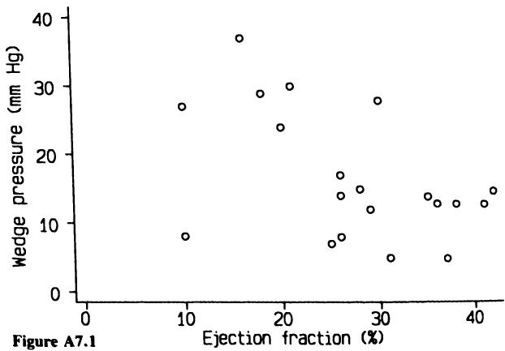
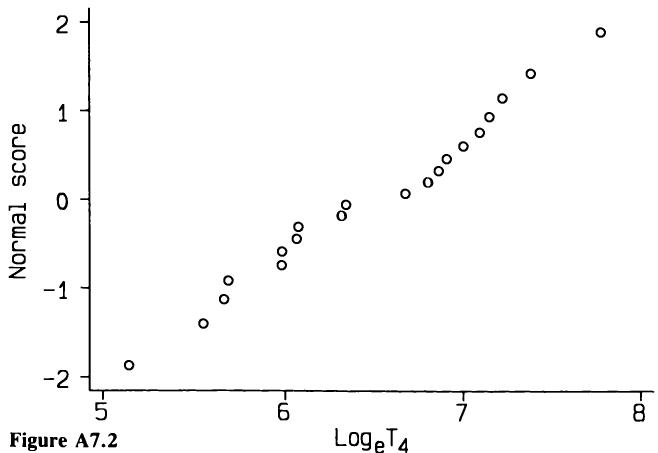
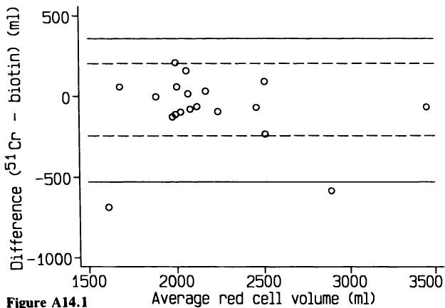
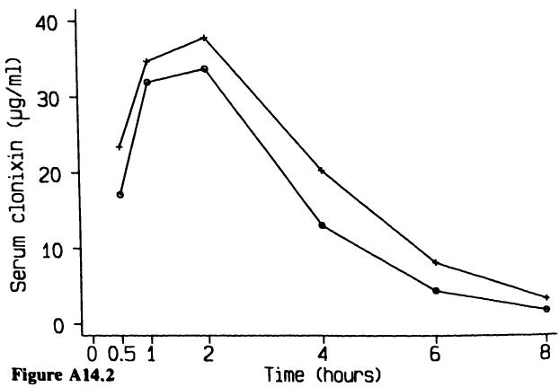
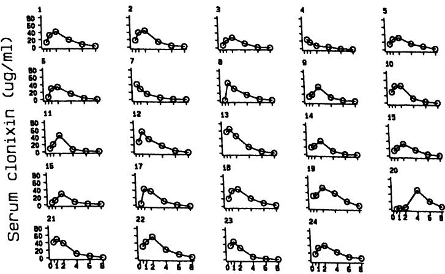

# 习题答案  Answers to exercises  

这些解答通常不包括作为分析常规部分通常会生成的图表。  
These solutions do not in general include the graphs that would usually be produced routinely as part of the analysis.

常用缩写有：  
Common abbreviations are:

SD 标准差  
SD standard deviation

SE 标准误  
SE standard error

CI 置信区间  
CI confidence interval

df 自由度  
df degrees of freedom

# 第3章  
# CHAPTER 3

3.1 (a) 截尾数据。  
3.1 (a) Censored.

(b) 我们不知道SI的上限。未截尾的数据表明分布呈正偏态（偏右）。  
(b) We do not know the upper limit of SI. The uncensored data show that the distributions are positively skewed (skewed to the right).

(c) 数据呈偏态分布，且部分值被删失。  
(c) The data are skewed and some values are censored.

(d) 分别为3.8和22.3。  
(d) 3.8 and 22.3 respectively.

(e)  $1135\mathrm{mg}$  
(e)  $1135\mathrm{mg}$

(f) 无不良反应 有不良反应  
(f) Without adverse reactions With adverse reactions

2 2 99

3 135799 3 89

4 1234489 4 1244669999

5 1337899 5 01113333347799

6 11457 6 12237788

7 122 7 4

(g) 两组的中位年龄可从茎叶图中轻松得出，分别为52岁和53岁，表明不良反应与年龄无关。  
(g) The median ages of the two groups are easily obtained from the stem-and-leaf diagrams as 52 and 53, suggesting that adverse reactions are not age-related.

3.2 (a) 答案取决于“更可能”的解释。图表显示涉及职业飞行员的事故多于其他任何群体，但未提供个体风险的信息。  
3.2 (a) The answer depends upon the interpretation of 'more likely'. The Figure shows that more accidents involve professional pilots than any other group, but gives no information of the risk per individual.

(b) 当根据各组飞行量调整数据后，显然职业飞行员的风险最低。风险最高的是家庭主妇和学生。不同的答案可由飞行量与事故风险之间的强负相关关系解释。  
(b) When the figures are adjusted for the amount of flying in each group it is clear that professional pilots had much the lowest risk. The highest risks were among housewives and students. The different answers are explained by the strong negative relation between the amount of flying and the risk of an accident.

3.3 图3.12显示了 $2_{2}^{1}$ 、25、50、75 和 $97_{2}^{1}$ 百分位数。所需观察值的排名是样本量加1（299）乘以0.025、0.25、0.5、0.75 和 0.975。  
3.3 Figure 3.12 shows the  $2_{2}^{1}$ , 25, 50, 75 and  $97_{2}^{1}$  centiles. The ranks of the

这些值分别为7.475、74.75、149.5、224.25 和 291.525。可从表3.4中找到这些排名两侧的观察值（计算累计频数列有助于查找），并通过插值法获得所需的百分位数。然而，在每种情况下，所需排名两侧的观察值相同，因此IgM分布的百分位数简单地为0.2、0.5、0.7、1.0 和 $2.0 \mathrm{g} / \mathrm{l}$。  
required observations are thus the sample size plus 1 (299) multiplied by 0.025, 0.25, 0.5, 0.75 and 0.975. These values are 7.475, 74.75, 149.5, 224.25 and 291.525. The observations with ranks either side of these values can be found from Table 3.4 (it helps to calculate a column of cumulative frequencies), and interpolation used to get the required centiles. However, in each case the observations with ranks either side of the required rank are the same, so the centiles of the distribution of IgM are obtained simply as 0.2, 0.5, 0.7, 1.0 and  $2.0 \mathrm{g} / \mathrm{l}$ .

# 第4章  
# CHAPTER 4

4.1 0.023 或 $2.3\%$（来自表 B1）。  
4.1 0.023 or  $2.3\%$  (from Table B1).

4.2 按照第 4.9.1 节给出的方法，我们需要计算获得 0、1 或 2 品脱 B 型血的概率。因此，我们需要计算从 100 个样本中选出这些数量的方法数，即：  
4.2 Following the method given in section 4.9.1, we need to calculate the probabilities of obtaining 0, 1, or 2 pints of group B blood. We thus need to calculate the number of ways of choosing these numbers from a sample of 100, which are:

$$
\begin{array}{l}{{\binom{100}{0}~=~1}}\\ {{\binom{100}{1}~=~\binom{100}{0}\times100/1=100}}\\ {{\binom{100}{2}~=~\binom{100}{1}\times99/2=4950}}\end{array}
\begin{array}{l}{{\binom{100}{0}~=~1}}\\ {{\binom{100}{1}~=~\binom{100}{0}\times100/1=100}}\\ {{\binom{100}{2}~=~\binom{100}{1}\times99/2=4950}}\end{array}
$$

使用第 4.9.1 节中的公式，所需概率为  
Using the formula in section 4.9.1, the required probability is

$$
\begin{array}{l}{{(0.08)^{0}(0.92)^{100}+100(0.08)^{1}(0.92)^{99}+4950(0.08)^{2}(0.92)^{98}}}\\ {{=0.00024+0.00208+0.00895=0.0113.}}\end{array}
\begin{array}{l}{{(0.08)^{0}(0.92)^{100}+100(0.08)^{1}(0.92)^{99}+4950(0.08)^{2}(0.92)^{98}}}\\ {{=0.00024+0.00208+0.00895=0.0113.}}\end{array}
$$

获得少于三品脱 B 型血的概率约为 1/100，即 0.01。  
The probability of getting fewer than three pints of group B blood is about 1 in 100, or 0.01.

4.3 由于男孩的概率略高于女孩，男孩最多的序列最可能出现，即最后一个序列。其他两个序列出现的概率相等。  
4.3 As the probability of a boy is slightly greater than the probability of a girl, the sequence with the most boys is most likely, which is the last sequence. The other two sequences are equally likely.

4.4 (a) 0.0013。  
4.4 (a) 0.0013.

(b) $20000 \times 0.0013 = 26$  
(b)  $20000 \times 0.0013 = 26$

4.5 (a) 这个问题可以反过来考虑，即我们希望评估必要的样本量，使得所有儿童检测结果均为阴性的概率小于 0.05。数学上，我们需要样本量 $m$，使得 $0.9^{m} < 0.05$。通过反复试验可知，$m=29$。（如果数学功底扎实，你可能会计算出 $m$ 是大于 $\log(0.05) / \log(0.9)$ 的最小整数。）  
4.5 (a) The question can be reversed, so that we wish to evaluate the necessary sample size so that the probability of all the children being negative to the test is  $< 0.05$ . In mathematics, we require the sample size  $m$ , such that  $0.9^{m} < 0.05$ . It is simple to show, by trial and error, that we need  $m = 29$ . (If your maths is good, you might have evaluated  $m$  as the smallest integer greater than  $\log (0.05) / \log (0.9)$ .)

(b) 它没有影响。  
(b) It has no effect.

4.6 一开始的最小高度是 $(172 - 175.8) / 5.84 = - 0.65$  
4.6 At the start the minimum height was  $(172 - 175.8) / 5.84 = - 0.65$

距离均值的标准差。从表B1中，身高超过该值的男性比例为0.7422（约74%）。在25年期末，最低身高为$(172 - 179.1) / 5.84 = -1.22$个标准差。从表B1中，身高高于最低值的男性比例现在为0.8888，约89%。不合格男性的比例减少了一半以上。  
standard deviations from the mean. From Table B1, the proportion of men taller than this would be 0.7422 (about  $74\%$ ). At the end of the 25 year period the minimum height was  $(172 - 179.1) / 5.84 = - 1.22$  standard deviations from the mean. From Table B1, the proportion of men above the minimum is now 0.8888, or about  $89\%$ . The proportion of ineligible men has more than halved.  

4.7 如果真实血压没有变化，三次测量中任意一次位于另外两次之间的概率相等。第三次测量不在前两次之间的概率为三分之二（0.67），不考虑测量值相等的可能性。没有理由期望第三次测量一定在前两次之间，也没有理由因为不在其中就认为测量不可靠。如果分析中使用三次读数的平均值，只有两次测量者的平均值估计会较差。  
4.7 If there is no change in the true blood pressure, each of a sequence of three measurements is equally likely to be in between the other two. The probability that the third measurement will not fall between the first two is thus two thirds (0.67), discounting the possibility of equal measurements. There is no reason to expect the third measurement to be between the first two and no reason to discard measurements as unreliable if they do not. If the intention is to use the average of the three readings in an analysis, the averages would be less well estimated for those with only two values.  

4.8 (a) 每个孩子未受影响的概率是0.75。两个孩子均未受影响的概率是$0.75^{2} = 0.56$，因为这些事件相互独立。  
4.8 (a) The probability of each child being unaffected is 0.75. The probability of two children being unaffected is  $0.75^{2} = 0.56$ , as these are independent events.  

(b) 概率是0.75。每个孩子的概率相同，与前面孩子的结果无关。  
(b) The probability is 0.75. Each child has the same probability, regardless of the outcome for previous children.  

(c) 双方父母均为异常基因杂合子的概率是$\frac{1}{22} \times \frac{1}{22} = 0.0021$。因此，每年预期患囊性纤维化的婴儿数为$0.25 \times 3500 \times 0.0021$，约为2个。  
(c) The probability of both parents being heterozygous for the abnormal gene is  $\frac{1}{22} \times \frac{1}{22} = 0.0021$ . The expected number of babies with cystic fibrosis per year is thus  $0.25 \times 3500 \times 0.0021$ , which is about 2.  

## 第5章  CHAPTER 5  

5.1 (a) 不，这绝对是错误的。如果我们想观察一组受试者行为是否发生变化，应重新检查整组。只研究选定的子集会导致重新检查的样本有偏，从而使结果有偏。  
5.1 (a) No, it is definitely wrong. If we want to see if a group of subjects has shifted its behaviour in some way we should re- examine the whole group. To study only a selected subset is to bias the sample being re- examined and thus to bias the results.  

(b) 第二次研究的响应率为69%，相当低。未响应者占近三分之一，可能具有非典型特征（这通常是事实），可能包括饮酒量较大者。例如，有些人可能因饮酒相关疾病而病重无法响应。因此，高未响应率可能导致结果偏倚。作者应比较首次调查中响应者与未响应者的特征。论文未给出首次调查的响应率。如果首次调查响应率也约为70%，这很可能，那么第二次调查的最终样本将更加高度选择性。  
(b) The response rate in the second study was  $69\%$  which is rather poor. The non-responders, nearly a third of the sample, might well be atypical (this is what is usually found), and could well include heavier drinkers. For example, some may have been too ill to respond through a drink-related illness. Thus the high rate of non-response could have biased the results. The authors should have compared the characteristics of responders and non-responders with respect to their responses to the first survey. The paper does not give the response rate to the first study. If it was also around  $70\%$ , which is quite likely, then the final sample interviewed at the second survey would be even more highly selected.  

(c) 这不是好主意，因为饮酒习惯全年并不一致。  
(c) It is not a good idea, because drinking habits are not consistent throughout the year.  

(d) 不。首先，我们不能简单地将两个同时发生的时间变化解释为因果关系。  
(d) No. First, we cannot necessarily interpret two simultaneous  

其次，我们会预期他们发现报告的酒精消费量有所减少，因为样本被偏向只包括第一项研究中饮酒的人。如果他们只重新采访第一项研究中不饮酒的人，我们会预期发现饮酒量有所增加。这是所谓“回归均值”现象的一种表现，发生在我们对先前某次测量中在某一限定范围内选取的样本重新测量同一变量时。因此，即使时间上没有变化，这项研究也可能显示出酒精消费的减少。  
changes over time as being causally related. Second, we would expect them to have found a reduction in the reported alcohol consumption, because the sample was biased to include only those drinking in the first study. If they had re- interviewed only those not drinking in the first study, we would expect them to have found an increase. This is one form of the phenomenon known as 'regression to the mean', and occurs when we remeasure a quantity on a sample selected by a restricted range of the same quantity on a previous occasion. Thus even when there has been no change over time, this study would be expected to have shown a decrease in alcohol consumption.  

(e) 不。基于上述理由，他们绝非具有代表性。此外，他们是样本，而非总体。  
(e) No. For reasons given above, they are by no means representative. Further, they are a sample, not a population.  

(f) 由于上述原因，该解释无效。  
(f) The interpretation is not valid for the reasons noted above.  

(g) 不。  
(g) No.  

5.2 (a) 这是一项横断面研究。  
5.2 (a) It was a cross- sectional study.  

(b) 如果目标人群是所有英国绝经期女性，那么该全科诊所的代表性就很重要。我们没有相关信息，尽管在单一诊所进行此类研究似乎并不不合理。所有1930年出生的132名女性均被调查，因此不存在选择偏倚。然而，我们假设患者登记册准确完整，且有21/132人无法联系，这对准确性提出了质疑。在这132名女性中，只有31人实际参与了研究，原因各异。大多数排除理由合理，但为何排除未婚女性尚不清楚。样本似乎相当具有代表性。  
(b) If the population of interest is taken as all menopausal British women, then the representativeness of this general practice is relevant. We have no information about this, although it does not seem unreasonable to carry out this type of study in a single practice. All 132 women born in 1930 were investigated, so there was no selection bias. However, we are assuming that the register of patients is accurate and complete, and the fact that 21/132 were not contactable casts some doubt on this. Of these 132 women, only 31 were actually studied, for the various reasons stated. Most of the exclusions are reasonable, although it is not clear why the unmarried women were excluded. The sample appears reasonably representative.  

(c) 该研究的主要问题是，如果服用避孕药会延迟绝经，那么在研究时，一些绝经被延迟的女性仍处于绝经前期，因此被排除在研究之外。该设计无法实现研究目标。  
(c) The major problem with this study is that if the use of the pill delays the menopause then at the time of the study some women who will have had their menopause delayed will still have been premenopausal and so excluded from the study. The design does not allow the research objective to be investigated.  

(d) 这可以通过队列研究来回答。例如，研究者可以选取所有1930年出生的女性，等待她们全部绝经后再进行比较，这样可以得出有效结论。然而，应注意，不应将所有避孕药使用者简单合并，无论其使用时长或使用年龄如何。队列设计允许探讨这些因素与绝经年龄的关系。  
(d) This is a question that could be answered by a cohort study. If the researcher had taken, for example, all the women born in 1930 and waited until they had all reached the menopause, then he could make a valid comparison. However, it should be noted that it is not really good practice to lump together all pill users regardless of the length of pill use or the age at which it was taken. The cohort design would allow these factors to be investigated in relation to the age of menopause.  

5.3 (a) 棒球运动员显然不能真正代表总体，但无法判断这在本例中是否重要。然而，左撇子比例可能较一般人群偏高（14%）。  
5.3 (a) Baseball players are clearly not truly representative of the population, but it is impossible to assess whether it matters in this particular case. However, it appears that there might have been a higher proportion of left- handers (14%) than we would expect in the population.  

(b) 如果左撇子的流行率在二十世纪有所增加，或者不同社会群体（具有不同死亡率）中的流行率发生了变化。这两种情况都是可能的。  
(b) If the prevalence of left-handedness had increased during the twentieth century, or if the prevalence within different social groups (with different mortality rates) had changed. Both of these are likely.  

(c) 分析会偏向包含出生较早的人，因为大多数最近的球员仍然健在。很可能在世纪初左撇子较少见。这两个事实意味着分析会偏向于左撇子较早死亡。此外，排除仍然健在者来分析平均死亡年龄是误导的。正确的生存数据分析方法（同时考虑幸存者数据）在第13章中有描述。  
(c) The analysis would be biased towards including those born a long time ago as most recent players would still be alive. It is likely that left-handedness was less common earlier in the century than it is now. These two facts mean that the analysis would be biased towards earlier death among left-handers. Further, it is misleading to analyse mean age at death excluding those still alive. The correct analysis of survival data, which takes account of data for survivors too, is described in Chapter 13.  

(d) 理想情况下，应选择一批出生时间相近的人群，例如同一年入学的学生。为了获得合理的死亡比例，幸存者年龄应至少达到70岁。这样的数据极不可能存在，且前瞻性研究耗时极长！如果采用适当方法分析棒球数据，并在分析中考虑出生年份，结果会更有效。  
(d) It would be desirable to take a cohort of people born at about the same time, for example all those in the same year at school. In order to get a reasonable proportion of deaths, the survivors would need to be at least 70. It is most unlikely that such data are available and a prospective study would take a very long time! The baseball data would yield a more valid answer if analysed using an appropriate method, and if year of birth was considered in the analysis.  

## 第7章  CHAPTER 7  

7.1 图A7.1显示了数据的散点图。最偏离总体趋势的点位于左下角，对应患者19。该患者的楔压实际为 $28 \mathrm{mmHg}$。  
7.1 Figure A7.1 shows a scatter diagram of the data. The point that is most distant from the general trend is in the bottom left- hand corner, corresponding to patient 19. This patient's wedge pressure was actually  $28 \mathrm{mmHg}$ .  

  

7.2 下表显示了计算过程：  
7.2 The following table shows the calculations:  

<table><tr><td>T4</td><td>logcT4</td><td>P</td><td>正态分数</td></tr><tr><td>171</td><td>5.14</td><td>0.0309</td><td>-1.868</td></tr><tr><td>257</td><td>5.55</td><td>0.0802</td><td>-1.403</td></tr><tr><td>288</td><td>5.66</td><td>0.1296</td><td>-1.128</td></tr><tr><td>295</td><td>5.69</td><td>0.1790</td><td>-0.919</td></tr><tr><td>396</td><td>5.98</td><td>0.2284</td><td>-0.744</td></tr><tr><td>397</td><td>5.98</td><td>0.2778</td><td>-0.589</td></tr><tr><td>431</td><td>6.07</td><td>0.3272</td><td>-0.448</td></tr><tr><td>435</td><td>6.08</td><td>0.3765</td><td>-0.315</td></tr><tr><td>554</td><td>6.32</td><td>0.4259</td><td>-0.187</td></tr><tr><td>568</td><td>6.34</td><td>0.4753</td><td>-0.062</td></tr><tr><td>795</td><td>6.68</td><td>0.5247</td><td>0.062</td></tr><tr><td>902</td><td>6.80</td><td>0.5741</td><td>0.187</td></tr><tr><td>958</td><td>6.86</td><td>0.6235</td><td>0.315</td></tr><tr><td>1004</td><td>6.91</td><td>0.6728</td><td>0.448</td></tr><tr><td>1104</td><td>7.01</td><td>0.7222</td><td>0.589</td></tr><tr><td>1212</td><td>7.10</td><td>0.7716</td><td>0.744</td></tr><tr><td>1283</td><td>7.16</td><td>0.8210</td><td>0.919</td></tr><tr><td>1378</td><td>7.23</td><td>0.8704</td><td>1.128</td></tr><tr><td>1621</td><td>7.39</td><td>0.9198</td><td>1.403</td></tr><tr><td>2415</td><td>7.79</td><td>0.9691</td><td>1.868</td></tr></table>  
<table><tr><td>T4</td><td>logcT4</td><td>P</td><td>Normal score</td></tr><tr><td>171</td><td>5.14</td><td>0.0309</td><td>-1.868</td></tr><tr><td>257</td><td>5.55</td><td>0.0802</td><td>-1.403</td></tr><tr><td>288</td><td>5.66</td><td>0.1296</td><td>-1.128</td></tr><tr><td>295</td><td>5.69</td><td>0.1790</td><td>-0.919</td></tr><tr><td>396</td><td>5.98</td><td>0.2284</td><td>-0.744</td></tr><tr><td>397</td><td>5.98</td><td>0.2778</td><td>-0.589</td></tr><tr><td>431</td><td>6.07</td><td>0.3272</td><td>-0.448</td></tr><tr><td>435</td><td>6.08</td><td>0.3765</td><td>-0.315</td></tr><tr><td>554</td><td>6.32</td><td>0.4259</td><td>-0.187</td></tr><tr><td>568</td><td>6.34</td><td>0.4753</td><td>-0.062</td></tr><tr><td>795</td><td>6.68</td><td>0.5247</td><td>0.062</td></tr><tr><td>902</td><td>6.80</td><td>0.5741</td><td>0.187</td></tr><tr><td>958</td><td>6.86</td><td>0.6235</td><td>0.315</td></tr><tr><td>1004</td><td>6.91</td><td>0.6728</td><td>0.448</td></tr><tr><td>1104</td><td>7.01</td><td>0.7222</td><td>0.589</td></tr><tr><td>1212</td><td>7.10</td><td>0.7716</td><td>0.744</td></tr><tr><td>1283</td><td>7.16</td><td>0.8210</td><td>0.919</td></tr><tr><td>1378</td><td>7.23</td><td>0.8704</td><td>1.128</td></tr><tr><td>1621</td><td>7.39</td><td>0.9198</td><td>1.403</td></tr><tr><td>2415</td><td>7.79</td><td>0.9691</td><td>1.868</td></tr></table>  

正态分数可以通过许多统计软件获得。否则，可通过反向使用表B1获得。这些数据的正态图非常直，如图A7.2所示。  
The Normal scores can be obtained in many statistics packages. Otherwise they can be obtained by using Table B1 'in reverse'. The Normal plot of these data is very straight, as is shown in Figure A7.2.  

  

7.3 末位数字（剂量SA时为倒数第二位数字）的分布如下：  
7.3 The terminal digits (or penultimate digits in the case of dose of SA) are distributed as follows:  

<table><tr><td></td><td>0</td><td>1</td><td>2</td><td>3</td><td>4</td><td>5</td><td>6</td><td>7</td><td>8</td><td>9</td><td>总计</td></tr><tr><td>年龄</td><td>1</td><td>11</td><td>6</td><td>10</td><td>7</td><td>2</td><td>2</td><td>7</td><td>5</td><td>14</td><td>65</td></tr><tr><td>SA</td><td>2</td><td>24</td><td>0</td><td>6</td><td>0</td><td>10</td><td>20</td><td>0</td><td>0</td><td>3</td><td>65</td></tr><tr><td>SI</td><td>16</td><td>0</td><td>5</td><td>3</td><td>4</td><td>2</td><td>3</td><td>4</td><td>7</td><td>4</td><td>48</td></tr></table>  
<table><tr><td></td><td>0</td><td>1</td><td>2</td><td>3</td><td>4</td><td>Digit 5</td><td>6</td><td>7</td><td>8</td><td>9</td><td>Total</td></tr><tr><td>Age</td><td>1</td><td>11</td><td>6</td><td>10</td><td>7</td><td>2</td><td>2</td><td>7</td><td>5</td><td>14</td><td>65</td></tr><tr><td>SA</td><td>2</td><td>24</td><td>0</td><td>6</td><td>0</td><td>10</td><td>20</td><td>0</td><td>0</td><td>3</td><td>65</td></tr><tr><td>SI</td><td>16</td><td>0</td><td>5</td><td>3</td><td>4</td><td>2</td><td>3</td><td>4</td><td>7</td><td>4</td><td>48</td></tr></table>  

数字偏好在测量中是一种可能出现的现象，但对于诸如年龄之类的信息则不应出现。然而，大量年龄以9结尾的情况相当奇怪。  
Digit preference is a likely phenomenon for measurements, but would not be expected for information such as age. Nevertheless, the large number of ages ending in 9 is rather odd.  

SA和SI都显示出明显的数字偏好，这很难解释。特别是SA的总剂量，这种偏好尤为奇特，尤其因为它代表了至少六个月内剂量的总和。SI是两个百分比的比值，因此大量的零表明记录不够精确。  
Both SA and SI show dramatic digit preference which is hard to explain. That for the total dose of SA is peculiar, especially as it represents the sum of doses given over at least six months. The SI is the ratio of two percentages, so the surfeit of zeros suggests imprecise recording.  

【7】4 近一半（27/60）的数值以零结尾。其他末尾数字分布较为均匀。这种现象可能是由于不同观察者报告数据时的精确度不同所致。  
7.4 Almost half (27/60) of the values end in zero. The other terminating digits are fairly evenly spread. This effect may be due to different observers reporting data to different precision.  

## 第8章  CHAPTER 8  

【8】1 (a) 较大的医院，仅仅因为分娩数量更多。  
8.1 (a) The larger hospital, simply because there are more births.  

(b) 较小医院中男婴比例的日常波动更大，因此在任何一天男婴比例超过60%的可能性更高。  
(b) The day to day variation in the proportion of boys will be greater in the smaller hospital, so it is more likely to have more than  $60\%$  of babies being boys on any day.  

【8】2 (a) 均值的标准误差（SE）是 $\mathrm{SD} / \sqrt{n}$，即 $2.3629 / \sqrt{8} = 0.8354$。  
8.2 (a) The SE of the mean is  $\mathrm{SD} / \sqrt{n}$ , which is  $2.3629 / \sqrt{8} = 0.8354$  

(b) 均值的95%置信区间（CI）范围是均值减去1.96倍SE到均值加上1.96倍SE，因此CI的宽度是 $2 \times 1.96 \times \mathrm{SE}$。若该宽度等于 $0.5 \mathrm{mmol / l}$，则需要 $\mathrm{SE} = \frac{0.5}{2 \times 1.96} = 0.1276$。假设标准差仍为 $2.3629$，则有 $2.3629 / \sqrt{N} = 0.1276$，解得 $N = (2.3629 / 0.1276)^2 = 343$。  
(b) The  $95\%$  CI for the mean is the range from mean  $-1.96$  SE to mean  $+1.96$  SE, so the width of the CI is  $2 \times 1.96 \times \mathrm{SE}$ . For this to be equal to  $0.5 \mathrm{mmol / l}$  we need  $\mathrm{SE} = \frac{0.5}{2 \times 1.96} = 0.1276$ . Assuming that we still have  $\mathrm{SD} = 2.3629$ , then we would have  $2.3629 / \sqrt{N} = 0.1276$  which gives  $N = (2.3629 / 0.1276)^2 = 343$  

【8】3 另一种表述问题的方式是：“一组中数值小于40或大于60的概率是多少？”患者分配到某种治疗的比例的抽样分布是二项分布。该分布的标准差是 $\sqrt{np(1 - p)}$。这里 $p = 0.5$，所以标准差是 $\sqrt{100 \times 0.5 \times 0.5} = 5$。使用正态近似（对于 $p = 0.5$ 非常合适），所需概率是对应于 $z = (60 - 50) / 5 = 2.0$ 的双尾面积，根据表B2为0.0455，约为5%。  
8.3 Another way of phrasing the question is, 'What is the probability of the number in one group being less than 40 or more than 60？'. The sampling distribution for the proportion of patients allocated a particular treatment is the Binomial distribution. The SD of the distribution is  $\sqrt{np(1 - p)}$ . Here  $p = 0.5$ , so the SD is  $\sqrt{100 \times 0.5 \times 0.5} = 5$ . Using the Normal approximation, which is excellent for  $p = 0.5$ , the required probability is the two- tailed area corresponding to  $z = (60 - 50) / 5 = 2.0$ , which from Table B2 is 0.0455, or about  $5\%$ .  

【8】4 使用单尾检验时应始终明确说明并加以理由。  
8.4 The use of a one- tailed test should always be specified and justified.  

这种理由，我认为很少合适，是实验者只对某一特定方向的差异感兴趣。以前分析的结果不足以作为进行单尾检验的充分理由。  
The justification, which I believe is rarely appropriate, is that the experimenters are only interested in a difference in a particular direction. Results of previous analyses are not an adequate justification for performing a one- tailed test.  

## 第9章  CHAPTER 9  

【9】1 (a) 如果变化量近似服从正态分布，那么可以使用第9.4.1节和9.5.1节中描述的$t$分布来获得置信区间，并可使用配对$t$检验（或等价地，对差值进行单样本$t$检验）。如果差值呈现近似对称但非正态分布，则可以使用匹配数据的Wilcoxon检验。  
9.1 (a) If the changes have a reasonably Normal distribution, then a CI could be obtained using the  $t$  distribution as described in sections 9.4.1 and 9.5.1, and a paired  $t$  test could be used (or, equivalently, a one sample  $t$  test of the differences). A Wilcoxon test for matched data could be used if the differences had a reasonably symmetric but non- Normal distribution.  

变化量的正态概率图相当直线，$W'$检验结果为$W' = 0.98$，$P = 0.96$，因此上述任一方法均适用。由于变化量近似正态分布，两种方法结果非常接近。采用参数方法，反措施组仰卧心率平均变化的95%置信区间为1.38至12.38次/分钟。配对$t$检验得$t = 2.65$（$P = 0.017$）。数据表明反措施可能降低了心率，但正确的做法是将此组与未采用反措施的组进行比较，详见下文。  
A Normal plot of the changes is quite straight, and the  $W'$  test gives  $W' = 0.98$ ,  $P = 0.96$ , so either of the above methods is appropriate. Because the changes have a nearly Normal distribution they will give very similar results. Using the parametric approach, the  $95\%$  confidence interval for the mean change in supine heart rate in the countermeasure group is 1.38 to 12.38 beats/min. The paired  $t$  test gives  $t = 2.65$  ( $P = 0.017$ ). The data thus appear to show that the countermeasure has reduced heart rate, but the correct approach is to compare this group with a group who did not adopt the countermeasure, as discussed below.  

(b) 未采用反措施组的心率变化未显著偏离正态分布（$W' = 0.865$，$P = 0.10$），且两组的标准差非常相似，因此可以使用两样本$t$检验比较两组心率变化的差异。平均变化差为10.56，95%置信区间为1.62至19.50，提供了反措施有效性的部分证据。两样本$t$检验结果为$t = 2.44$（$P = 0.023$）。  
(b) The changes in heart rate in the group not adopting the countermeasure were not significantly non-Normal ( $W' = 0.865$ ,  $P = 0.10$ ), and the SDs in the two groups were very similar, so we can use a two sample  $t$  test to compare the changes in heart rate in the two groups. The difference between the mean changes is 10.56 and the  $95\%$  CI is 1.62 to 19.50, giving some evidence in support of the effectiveness of the countermeasure. The two sample  $t$  test gives  $t = 2.44$  ( $P = 0.023$ ).  

(c) 将同一人的多次观察当作来自不同个体的数据进行分析是不正确的。这里这种影响可能很小，因为只有两名宇航员被重复计入。论文中未标明重复数据。  
(c) It is incorrect to analyse multiple observations on the same individuals as if they were from different people. Here the effect is likely to be minimal as only two astronauts were included twice. The duplicate data were not identified in the paper.  

(d) 在临床研究中，允许受试者自行选择治疗方案是极不理想的。以这种方式进行的任何临床试验都不会具备可信度。理想情况下（从研究角度看），宇航员应被随机分配接受饮食对策，但这项研究并非设计为前瞻性研究。宇航员之间可能存在的同质性，例如体能方面，或许会减弱志愿者效应。显然，两组的飞行前心率非常相似，这增强了研究结果的可信度。最终，结果的有效性仍需依赖判断。  
(d) In clinical research it is highly undesirable to let subjects choose their own treatments. No clinical trial conducted in this way would have credibility. Ideally (from the research point of view) the astronauts should have been randomized to receive the dietary countermeasure, but this was not set up as a prospective study. The likely homogeneity of the astronauts, for example with respect to fitness, would probably lessen the volunteer effect. Clearly the pre-flight heart rates in the two groups were very similar, which strengthens the findings. In the end the validity of the results is a matter of judgement.  

9.2 (a) 配对  $t$ 检验得到  $t = 1.85$ ，  $P = 0.08$ 。然而，该检验假设差值服从近似正态分布，而这里显然不满足这一条件。  
9.2 (a) The paired  $t$  test gives  $t = 1.85$ ,  $P = 0.08$ . However, the test  

assumes that the differences have a reasonably Normal distribution, which is clearly not the case here.  

(b) 即使对原始数据进行了对数转换，差值的对数值仍呈偏态分布。虽然配对  $t$  检验给出  $t = 2.77$ ，  $\mathbf{P} = 0.01$ ，但更合适的方法是使用威尔科克森配对符号秩检验，该检验给出  $z = 2.91$ ，  $\mathbf{P} = 0.004$ 。  
(b) Even after log transformation of the original data the differences between the log values have a skewed distribution. Although the paired  $t$  test gives  $t = 2.77$ ,  $\mathbf{P} = 0.01$ , it is better to use the Wilcoxon matched pairs signed ranks test, which gives  $z = 2.91$ ,  $\mathbf{P} = 0.004$ .  

9.3 如图9.2和9.3所示，取对数变换使这些数据更接近正态分布。霍奇金病和非霍奇金病患者的$\log_{e} \mathbf{T}_{4}$计数均值分别为6.487和6.089，差值为0.398（标准误=0.212）。90%置信区间为0.041到0.756。这些值的反对数分别为1.04和2.13，给出了两组$\mathbf{T}_{4}$计数比率的90%置信区间。比率的最佳估计为$\exp(0.398) = 1.49$。  
9.3 As was shown in Figures 9.2 and 9.3, log transformation makes these data much nearer to Normal. The mean  $\log_{e} \mathbf{T}_{4}$  counts for the Hodgkin's and non- Hodgkin's disease patients were 6.487 and 6.089 respectively, giving a difference of 0.398 (SE = 0.212). The 90% CI is 0.041 to 0.756. The antilogs of these values are 1.04 and 2.13, which give a 90% CI for the ratio of the  $\mathbf{T}_{4}$  counts in the two groups. The best estimate of the ratio is  $\exp (0.398) = 1.49$ .  

9.4 线性类比量表数据不满足基于$t$分布的参数方法的分布假设。可以使用非参数的Mann-Whitney检验比较两组，结果为$z=3.29$，$\mathbf{P}=0.001$。因此，有强有力的证据表明接受主动治疗的患者恶心症状较轻。  
9.4 The linear analogue scale data do not meet the distributional assumptions for parametric methods based on the  $t$  distribution. The groups can be compared using the non- parametric Mann- Whitney test, which gives  $z = 3.29$ ,  $\mathbf{P} = 0.001$ . There is thus strong evidence that nausea was less severe in patients receiving the active treatment.  

中位数差异的95%置信区间可用Campbell和Gardner（1989）的方法获得，为15到49毫米。总体而言，对于此类数据，估计值和置信区间的价值有限，因为测量值没有直接的解释意义。  
A 95% confidence interval for the difference in median scores can be obtained using the method described by Campbell and Gardner (1989), and is 15 to 49 mm. In general estimates and confidence intervals are of limited value for data like these as the measurements have no straightforward interpretation.  

9.5 (a) 标准差可通过将标准误乘以$\sqrt{n}$计算得到，如下：  
9.5 (a) The SDs can be calculated by multiplying the SEs by  $\sqrt{n}$  to give  

<table><tr><td>香烟数</td><td>样本量 n</td><td>均值</td><td>标准差 SD</td></tr><tr><td>1-9</td><td>25</td><td>0.31</td><td>0.40</td></tr><tr><td>10-19</td><td>57</td><td>0.42</td><td>0.75</td></tr><tr><td>20-29</td><td>99</td><td>0.87</td><td>1.89</td></tr><tr><td>30-39</td><td>38</td><td>1.03</td><td>1.54</td></tr><tr><td>> 40</td><td>28</td><td>1.56</td><td>3.02</td></tr><tr><td>未说明</td><td>25</td><td>0.56</td><td>0.80</td></tr></table>  
<table><tr><td>Cigarettes</td><td>n</td><td>Mean</td><td>SD</td></tr><tr><td>1-9</td><td>25</td><td>0.31</td><td>0.40</td></tr><tr><td>10-19</td><td>57</td><td>0.42</td><td>0.75</td></tr><tr><td>20-29</td><td>99</td><td>0.87</td><td>1.89</td></tr><tr><td>30-39</td><td>38</td><td>1.03</td><td>1.54</td></tr><tr><td>&amp;gt; 40</td><td>28</td><td>1.56</td><td>3.02</td></tr><tr><td>Unspecified</td><td>25</td><td>0.56</td><td>0.80</td></tr></table>  

如同所有情况一样，标准差大于均值（且不可能出现负值），尿液中可替宁排泄值呈明显右偏分布。  
As in all cases the SD is greater than the mean (and negative values are impossible), the urinary cotinine excretion values are highly skewed to the right.  

(b) 某种趋势分析方法，比如单因素方差分析中的趋势检验。  
(b) Some form of analysis of trend, such as within a one way analysis of variance.  

(c) 如果数据将通过方差分析进行处理，那么我们要求各组的标准差相似（理论上，各组是来自同一标准差总体的样本）。而标准误则没有此要求，因为它们部分依赖于  
(c) If the data are to be analysed by analysis of variance then we require standard deviations to be similar (in theory the groups are samples from populations with the same standard deviation). There is no such requirement for standard errors, which are partly dependent  

关于样本量。如上所示，数据不满足这一要求。如果对数转换能产生相似的标准差且分布近似正态，那么可以在单因素方差分析中应用线性趋势。必须排除“未指定”组。最简单的方法是计算吸烟数量与尿液中可替宁水平之间的秩相关。  
on sample size. As shown above, the data do not meet this requirement. If log transformation would yield similar SDs and reasonably Normal distributions, then a linear trend could be applied in a one way analysis of variance. The 'unspecified' group would have to be excluded. The simplest approach would be to calculate the rank correlation between number of cigarettes smoked and urinary cotinine level.  

（d）该分析无效的原因有三：  
(d) There are three reasons why this analysis is not valid:  

(i) 数据在每个组内高度偏斜；  
(i) the data are highly skewed within each group;  

(ii) 标准差变化巨大；  
(ii) the SDs vary enormously;  

(iii) 使用多重成对组比较来评估吸烟与尿液可替宁水平之间的关系是一种较差的方法，因为它没有考虑组的顺序性。  
(iii) the use of multiple comparisons of pairs of groups is an inferior method of assessing whether there is a relation between smoking and urinary cotinine levels as it takes no account of the ordering of the groups.  

9.6 组1和组2数据的成对Wilcoxon检验的P值分别为0.01和0.09，相差不大。更具启示性的是变化的均值和标准差：  
9.6 The P values associated with paired Wilcoxon tests of the data for Groups 1 and 2 are 0.01 and 0.09, which are not so far apart. More revealing are the means and standard deviations of the changes:  

<table><tr><td></td><td>均值</td><td>标准差</td></tr><tr><td>组1</td><td>-0.078</td><td>0.073</td></tr><tr><td>组2</td><td>-0.071</td><td>0.129</td></tr></table>  
<table><tr><td></td><td>Mean</td><td>SD</td></tr><tr><td>Group 1</td><td>-0.078</td><td>0.073</td></tr><tr><td>Group 2</td><td>-0.071</td><td>0.129</td></tr></table>  

两组的平均变化几乎相同。  
The mean changes in the two groups are almost the same.  

比较组的正确方法是直接检验两组变化的差异。两样本$t$检验在22个自由度下得到$t=0.16$（$\mathbf{P}=0.88$）。标准差差异较大，因此$t$检验的假设可能不合理。然而，Mann-Whitney检验得到类似结果（$z=0.89, \mathbf{P}=0.37$）。因此，没有证据支持组间存在差异。  
The correct way to compare the groups is by testing directly the difference between the changes in the two groups. A two sample  $t$  test gives  $t = 0.16$  on 22 degrees of freedom  $(\mathbf{P} = 0.88)$ . The SDs are rather different, so that the assumptions of the  $t$  test may not be considered reasonable. A similar result is, however, obtained from a Mann- Whitney test  $(z = 0.89, \mathbf{P} = 0.37)$ . There is thus no evidence to support the idea that the groups differ.  

9.7 (a) 由于数据不适合$t$检验，治疗后评分应使用Mann-Whitney检验比较。该分析得到$z=3.22$（$\mathbf{P}=0.001$），强烈支持 gestrinone 比安慰剂更有效改善患者评分。  
9.7 (a) The post- treatment scores should be compared by the Mann- Whitney test because the data are not suitable for the  $t$  test. This analysis gives  $z = 3.22$ $(\mathbf{P} = 0.001)$ , strong evidence that gestrinone is more effective than placebo in improving the scores of these patients.  

(b) 同样的方法可用于评分变化的比较。该分析得到$z=2.71$（$\mathbf{P}=0.007$），结果略弱。或者，可用符号检验比较组间正负变化。  
(b) The same method can be applied to the changes in scores. This analysis gives  $z = 2.71$ $(\mathbf{P} = 0.007)$ , a result which is only slightly weaker. Alternatively the sign test could be used to compare the groups with respect to positive or negative changes.  

9.8 可使用Mann-Whitney检验。由于该检验基于秩次，记录为$>80.0$的截尾值将具有相同秩次。由于该值有大量并列，调整并列秩次是必要的。此外，SI值显然呈偏斜分布，  
9.8 The Mann- Whitney test could be used. As it is a test based on ranks, the censored values recorded as  $>80.0$  would all have the same rank. As there are so many ties at this value the adjustment for ties would be desirable. Also, the SI values clearly have a skewed distribution,  

表明非参数方法是合适的。另一种替代但不太理想的方法是使用下一章中描述的方法，比较超过某一给定阈值的比例。  
indicating that a non- parametric method would be suitable. An alternative, but less satisfactory, approach would be to compare the proportions above a given cut- off using methods described in the next chapter.  

## 第10章  CHAPTER 10  

【10】1 (a) 必须使用适合配对数据的分析方法。对蓖麻油和DNCB呈阴性的比例分别为 $44 / 173 = 25.4\%$ 和 $69 / 173 = 39.9\%$ 。使用第10.4节中给出的方法计算这两个比例差异的 $95\%$ 置信区间为从 $5\%$ 到 $24\%$ 。检验两个皮肤试验阴性患者比例相同的假设，通过计算  
10.1 (a) It is essential to use an analysis appropriate for paired data. The proportions negative to croton oil and DNCB were  $44 / 173 = 25.4\%$  and  $69 / 173 = 39.9\%$  respectively. A  $95\%$  CI for the difference between these proportions, using the method given in section 10.4, is from  $5\%$  to  $24\%$ . The hypothesis test that the proportions of patients negative to the two skin tests are the same is evaluated by calculating  

$$  
z = \frac{48 - 23}{\sqrt{48 + 23}} = 2.97  
z = \frac{48 - 23}{\sqrt{48 + 23}} = 2.97  
$$  

根据表B2，该值对应的 $\mathbf{P} = 0.003$ 。因此，有强有力的证据表明，这些患者中对蓖麻油呈阴性的比例低于对DNCB的比例。  
which, from Table B2, corresponds to  $\mathbf{P} = 0.003$ . There is thus strong evidence that fewer of these patients show negative reactions to croton oil than DNCB.  

(b) 对DNCB呈阳性反应的患者比例分别为：第I期为75%，第II期为67%，第III期为41%。趋势卡方检验结果为 $X_{\text{trend}}^{2} = 14.04$ ，自由度为1，$\mathbf{P} = 0.0002$。因此，有强有力的证据表明DNCB反应性与癌症分期相关。  
(b) The proportions of patients with a positive reaction to DNCB are  $75\%$ ,  $67\%$  and  $41\%$  for stages I, II and III respectively. The Chi squared test for trend gives  $X_{\text{trend}}^{2} = 14.04$  on 1 degree of freedom  $(\mathbf{P} = 0.0002)$ . There is strong evidence therefore that DNCB reactivity is related to stage of cancer.  

10.2 (a) 作者似乎得出结论认为 $\mathbf{P} > 0.05$ 表示不存在效应。然而，$\mathbf{P}$ 值为0.08，仅略大于0.05。  
10.2 (a) The author seems to have concluded that  $\mathbf{P} > 0.05$  means that there is no effect present. However, the  $\mathbf{P}$  value is 0.08 and so only slightly greater than 0.05.  

(b) 所考虑的检验   
(b) The test considered in   
(a) 不合适，因为它忽略了组别是有序的这一事实。研究的目的是明确探讨睾酮水平（通过兄弟姐妹性别比例这一代理指标来考察）与歌唱声音水平之间的关系，因此应使用趋势卡方检验。该检验在1个自由度下得出 $X^{2} = 8.92$，具有高度显著性 $(\mathbf{P} = 0.003)$。因此，我们可以推断歌唱声音水平与兄弟姐妹性别比例之间存在关系，前提是该检验是有效的（但见下文）。当然，这并不直接回答关于睾酮水平的问题，因为该样本中未测量睾酮水平。  
(a) is not appropriate because it ignored the fact that the groups were ordered. The aim of the study was explicitly to study the relation between testosterone level (examined by the proxy measure of the sex ratio of siblings) and level of singing voice, so the Chi squared test for trend should be used. The test gives  $X^{2} = 8.92$  on 1 degree of freedom, which is highly significant  $(\mathbf{P} = 0.003)$ . We can therefore infer that there is a relation between level of singing voice and sex ratio of siblings, assuming that the test is a valid one (but see below). This does not, of course, directly answer the question about testosterone levels as they were not measured on this sample.  

(c) 这是在检查数据后选择的，因此 $\mathbf{P}$ 值无效。无论如何，忽略顺序是不合理的—趋势检验更为合适。  
(c) It was chosen after inspecting the data, so the  $\mathbf{P}$  value is not valid. In any case, it is not sensible to ignore the ordering - the trend test is far preferable.  

(d) 表格部分的 $X^{2}$ 值不能超过整个表格的值。该比较的正确值是自由度为2时 $X^{2} = 9.44$。  
(d) The value of  $X^{2}$  for part of the table cannot exceed the value for the whole table. The correct value for this comparison is  $X^{2} = 9.44$  on 2 degrees of freedom.  

(e) 观察值不是独立的，因为422个兄弟姐妹仅涉及195名歌手。大家庭的影响力会大于小家庭。  
(e) The observations are not independent, as the 422 siblings related to only 195 singers. Large families will carry more influence than small ones.  

(f) 很难说非独立性的重要性。如果这被视为一项初步研究，若结果具有提示性（确实如此），将引导进行直接分析睾酮水平的研究，那么这可能不是太重要。无论如何，没有简单的统计方法可以绕过这个问题。我们可以只研究有一个兄弟姐妹的歌手；为每位歌手随机选择一个兄弟姐妹；或选择每位歌手的长兄弟姐妹，但这些方法都不够理想。完全有效的统计分析将非常复杂。  
(f) It is not easy to say how important the non-independence is. If this is considered to be a preliminary study, leading to a study with direct analysis of testosterone levels if the results look suggestive (as they do), then it is probably not too important. In any case, there is no simple statistical way round the problem. We could study only singers with one sibling; choose one sibling at random for each singer; take each singer's oldest sibling, none of which would be very satisfactory. A completely valid statistical analysis would be highly complex.  

10.3 (a) 是的，但并非必要。观察频数为2和20，而在原假设下的期望频数约为10，因此可以使用卡方检验。  
10.3 (a) Yes, but it was not necessary. The observed frequencies were 2 and 20, but the expected frequencies (under the null hypothesis) were about 10 so the Chi squared test could have been used.  

(b) 置信区间基于正态近似。对于安慰剂组中极小的比例，这种近似不成立，导致了不可能的负下限。更根本的是，单独给出每组的置信区间并无帮助。差异比例的95%置信区间更有用，为16%到39%。  
(b) The confidence intervals are based on the Normal approximation. This is not valid for the very small proportion in the placebo group, and has led to an impossible negative lower limit. More fundamentally, it is not helpful to give confidence intervals for each group separately. The  $95\%$  confidence interval for the difference in proportions is much more useful; it is  $16\%$  to  $39\%$ .  

10.4 (a) 可使用Mann-Whitney检验或趋势卡方检验。两者都需要为每列赋予分数，这些分数可以合理地均匀分布；最明显的是使用1到8的值。  
10.4 (a) The Mann- Whitney test or the Chi squared test for trend could be used. Each would require scores to be given to each column. These could reasonably be equally spaced; most obviously the values 1 to 8 could be used.  

(b) 当样本量如此庞大时，Mann-Whitney检验难以应用（大多数计算机程序无法对表格执行该检验，而需要3469名儿童的原始数据）。卡方检验无论样本大小都同样容易应用。八组的整体比较得出自由度7时 $X^{2} = 7.83$ （$\mathbf{P} = 0.35$），趋势检验得出自由度1时 $X_{\text{trend}}^{2} = 0.04$ （$\mathbf{P} = 0.84$）。这些数字表明观察到的变异很可能是偶然的，而非男孩睡眠时间长于女孩或反之的趋势。  
(b) The Mann-Whitney test is hard to apply when the samples are so large (most computer programs cannot perform the test on a table, but would require data for the 3469 children). The Chi squared test can be applied equally easily regardless of sample size. The overall comparison of the eight groups gives  $X^{2} = 7.83$  on 7 degrees of freedom  $(\mathbf{P} = 0.35)$ , and the trend test gives  $X_{\text{trend}}^{2} = 0.04$  on 1 degree of freedom  $(\mathbf{P} = 0.84)$ . These figures indicate that the variation seen is likely to be due to chance and not to a tendency for boys to sleep longer than girls or vice versa.  

10.5 (a) 对于 $2 \times 2$ 表只有一个卡方检验，该检验既可解释为比较各行比例，也可解释为比较各列比例。文中描述的两个检验应给出相同的结果。  
10.5 (a) There is only one Chi squared test for a  $2 \times 2$  table, which can be interpreted as either a comparison of the proportions in each row or in each column. The two tests described should have given the same answer.  

(b) 正确的检验统计量是 $X^{2} = 15.90$ （$\mathbf{P} = 0.0001$）或使用Yates校正时的 $X_{c}^{2} = 13.93$ （$\mathbf{P} = 0.0002$）。因此，引用的两个结果均不正确。  
(b) The correct test statistic is either  $X^{2} = 15.90$ $(\mathbf{P} = 0.0001)$  or  $X_{c}^{2} = 13.93$ $(\mathbf{P} = 0.0002)$  depending on whether Yates' correction is used. Thus both of the quoted results were incorrect.  

10.6 从表中可以看出，一些患者有三种习惯中的多种，正如预期的那样。因此，计算完整的 $4 \times 3$ 表的 $X^{2}$ 是不正确的。如果我们知道每个患者的习惯，  
10.6 It is clear from the table that some patients had more than one of the three habits, as would be expected. It is incorrect, therefore, to calculate  $X^{2}$  for the full  $4 \times 3$  table. If we knew each patient's habits,  

然后可以进行复杂的回归分析，使用第12章中描述的方法。根据现有数据，我们可以为每种习惯构建 $3 \times 2$ 表，并计算自由度为2的检验统计量 $X^{2}$。  
then a complex regression analysis could be performed, using methods described in Chapter 12. From the available data we could construct  $3 \times 2$  tables for each habit and calculate the test statistic  $X^{2}$  on 2 degrees of freedom.  

【10】7 阿司匹林组中发展为高血压的女性比例为0.1176（4/34），安慰剂组为0.3548（11/31）。两组差异为0.24，95%置信区间宽泛，为0.04到0.44。采用Yates校正的卡方检验得出 $X^{2} = 3.89$ （$\mathbf{P} = 0.049$）。因此，有迹象表明阿司匹林可能降低孕妇高血压的风险，但宽泛的置信区间表明对效应大小存在较大不确定性。  
10.7 The proportions of women developing hypertension were 0.1176 (4/34) in the aspirin group and 0.3548 (11/31) in the placebo group. The difference is 0.24 with a wide  $95\%$  CI from 0.04 to 0.44. The Chi squared test with Yates' correction gives  $X^{2} = 3.89$ $(\mathbf{P} = 0.049)$ . There is thus a suggestion that aspirin may reduce the risk of hypertension among pregnant women, but the wide CI points to considerable uncertainty about the magnitude of the effect.  

【10】8 根据所给信息，可以构建如下 $2 \times 2$ 表：  
10.8 From the information given a  $2 \times 2$  table can be constructed as follows:  

<table><tr><td rowspan="2"></td><td colspan="4">病例</td></tr><tr><td>+</td><td>-</td><td>总计</td><td></td></tr><tr><td rowspan="2">对照</td><td>+</td><td>38</td><td>8</td><td>46</td></tr><tr><td>-</td><td>20</td><td>20</td><td>40</td></tr><tr><td>总计</td><td></td><td>58</td><td>28</td><td>86</td></tr></table>  
<table><tr><td rowspan="2"></td><td colspan="4">Cases</td></tr><tr><td>+</td><td>-</td><td>Total</td><td></td></tr><tr><td rowspan="2">Controls</td><td>+</td><td>38</td><td>8</td><td>46</td></tr><tr><td>-</td><td>20</td><td>20</td><td>40</td></tr><tr><td>Total</td><td></td><td>58</td><td>28</td><td>86</td></tr></table>  

其中 $+$ 和 $-$ 分别表示是否暴露于工作中的噪声。  
where  $+$  and  $-$  refer to presence or absence of exposure to loud noise at work.  

(a) 报告暴露于噪声的病例和对照比例分别为0.674（58/86）和0.535（46/86）。比例差为0.14，95%置信区间为0.02到0.26。比例差可用McNemar检验比较，结果为  
(a) The proportions of cases and controls reporting exposure to loud noise were 0.674 (58/86) and 0.535 (46/86). The difference in proportions is 0.14, with the  $95\%$  CI of 0.02 to 0.26. The proportions can be compared using McNemar's test, which gives  

$$   
z_{c} = 11 / \sqrt{28} = 2.08 (\mathrm{P} = 0.04).  
$$  

(b) 估计的优势比为 $20 / 8 = 2.5$。95%置信区间（第10章未给出方法）为1.05到6.56。  
(b) The odds ratio is estimated as  $20 / 8 = 2.5$ . The  $95\%$  CI (method not given in Chapter 10) is 1.05 to 6.56.  

## 第11章  CHAPTER 11  

【11】1 (a) 是的。删失的生存时间也是最长的，因此获得最高排名。该方法通常不能用于生存数据，因为删失数据导致生存时间的顺序无法确定。  
11.1 (a) Yes. The censored survival time was also the longest and thus gets the highest rank. The method cannot generally be used for survival data because the censored data mean that the order of survival times cannot be determined.  

(b) 可以计算皮尔逊相关系数，但由于极长的生存时间（即使忽略删失）会严重夸大结果。生存时间的分布高度偏斜，因此秩相关更为合适。  
(b) The Pearson correlation coefficient could be calculated but it would be severely inflated by the very long survival time (even ignoring the censoring). The distribution of survival times is highly skewed, so rank correlation is far preferable here.  

(c) 乳酸、碳酸氢盐和pH的变化与生存时间的Spearman等级相关系数分别为0.63、$-0.67$和$-0.42$，因此变化与碳酸氢盐的关系最强。  
(c) The changes in lactate, bicarbonate and pH have Spearman rank  

注意碳酸氢盐和$\mathbf{pH}$与生存时间呈负相关，而乳酸的相关性为正相关。  
correlation coefficients with survival time of 0.63,  $- 0.67$  and  $- 0.42$  respectively, so the strongest relation is with changes in bicarbonate. Note that bicarbonate and  $\mathbf{pH}$  have negative associations with survival while for lactate the correlation is positive.  

11.2 (a) 线性回归方程为  
11.2 (a) The linear regression equation is  

$$  
\mathbf{RMR} = 811.23 + 7.0595\times \mathrm{weight}  
\mathbf{RMR} = 811.23 + 7.0595\times \mathrm{weight}  
$$  

残差标准差为157.91千卡/24小时。  
and the residual SD is 157.91 kcal/24hr.  

(b) 散点图显示残差与体重之间无明显关系。残差的正态性检验结果为 $W' = 0.955$，$P > 0.05$。分布基本符合正态—最大残差对应的是基础代谢率最高的女性。总体来看，没有理由拒绝该分析的有效性。  
(b) A scatter diagram shows no obvious relation between the residuals and weight. The test of Normality of the residuals gives  $W' = 0.955$ ,  $P > 0.05$ . The distribution is reasonably Normal - the largest residual relates to the woman with the highest RMR. Overall, there is no reason to reject the validity of the analysis.  

(c) 回归线斜率的标准误为0.9776千卡/24小时，因此95%置信区间为  
(c) The SE of the slope of the regression line is 0.9776 kcal/24 hr, so the 95% CI is  

$$  
【7】0595 - 2.018\times 0.9776 \mathrm{to} 7.0595 + 2.018\times 0.9776  
7.0595 - 2.018\times 0.9776\mathrm{to}7.0595 + 2.018\times 0.9776  
$$  

或者为5.09到9.03千卡/24小时。  
or 5.09 to 9.03 kcal/24 hr.  

(d) 残差的标准差为157.91 kcal/24小时，因此在体重均值处的最窄预测区间大约是预测值上下各两倍该数值。因此，不可能将静息代谢率（RMR）从体重预测到250 kcal/24小时以内的精度。  
(d) The SD of the residuals is 157.91 kcal/24 hr, so the narrowest prediction interval (at the mean value of body weight) is about twice this amount either side of the predicted value. Thus it is not possible to predict RMR from body weight to within 250 kcal/24 hr.  

11.3 (a) 以血糖为自变量对  $\log_{e}Vcf$  进行回归，得到方程  
11.3 (a) The regression of  $\log_{e}Vcf$  on blood glucose gives the equation  

$$  
\log_{e}Vcf = 0.115 + 0.0148\times \mathrm{blood~glucose}。  
\log_{e}Vcf = 0.115 + 0.0148\times \mathrm{blood~glucose}.  
$$  

残差标准差为0.2167。  
The residual SD is 0.2167.  

(b) 对该回归线残差的正态性检验给出  $W' = 0.936$ ，  $P > 0.1$ 。经过对数转换后，残差比原始数据分析的残差更接近正态分布。  
(b) The test of Normality of the residuals from this regression line gives  $W' = 0.936$ ,  $P > 0.1$ . The residuals after log transformation are thus more nearly Normal than those from the analysis of the raw data.  

(c) 使用原始Vcf值的回归方程（表11.6），预测的Vcf为  $1.10 + 0.0220\times 16 = 1.45\% /\mathrm{sec}$ 。95%预测区间为  $1.45\pm 2.080\times 0.229$ ，即0.97到  $1.93\% /\mathrm{sec}$ 。使用对数转换Vcf的回归方程，预测的Vcf为  $\exp (0.115 + 0.0148\times 16) = e^{0.352} = 1.42\% /\mathrm{sec}$ 。95%预测区间为  $\exp (0.352\pm 2.080\times 0.164)$ ，即1.01到  $2.00\% /\mathrm{sec}$ 。这两个方程对血糖为16 mmol/l的个体给出相似的预测结果。  
(c) From the regression equation using the raw values of Vcf (Table 11.6) the predicted Vcf is  $1.10 + 0.0220\times 16 = 1.45\% /\mathrm{sec}$ . The 95% prediction interval is  $1.45\pm 2.080\times 0.229$  or 0.97 to  $1.93\% /\mathrm{sec}$ . From the above regression equation using log transformed Vcf, the predicted Vcf is  $\exp (0.115 + 0.0148\times 16) = e^{0.352} = 1.42\% /\mathrm{sec}$ . The 95% prediction interval is  $\exp (0.352\pm 2.080\times 0.164)$  or 1.01 to  $2.00\% /\mathrm{sec}$ . The two equations thus give similar answers for someone with a blood glucose of 16 mmol/l.  

11.4 最后两个受试者的数值完全相同，提示可能存在抄录错误或同一患者被重复纳入。  
11.4 The values for the last two subjects are identical, suggesting a transcription error or the inadvertent inclusion of the same patient twice.  

11.5 对数肌酐清除率（CC）、对数地高辛清除率（DC）和尿流量之间的相关系数如下：  
11.5 The correlations between log creatinine clearance (CC), log digoxin clearance (DC) and urine flow are:  

<table><tr><td></td><td>r</td><td>P</td></tr><tr><td>DC CC</td><td>0.838</td><td>&lt; 0.0001</td></tr><tr><td>DC flow</td><td>0.515</td><td>0.002</td></tr><tr><td>CC flow</td><td>0.322</td><td>0.06</td></tr></table>  
<table><tr><td></td><td>r</td><td>P</td></tr><tr><td>DC CC</td><td>0.838</td><td>&amp;lt; 0.0001</td></tr><tr><td>DC flow</td><td>0.515</td><td>0.002</td></tr><tr><td>CC flow</td><td>0.322</td><td>0.06</td></tr></table>  

这些数据支持第一个陈述，但似乎不支持第二个。通过同时考虑这三个变量，计算偏相关系数，可以得到更好的答案。调整尿流量后的DC与CC的偏相关系数为0.83  $(\mathbf{P}< 0.0001)$ ，调整CC后的DC与尿流量的偏相关系数为0.47 (0.005)，与简单相关系数几乎无异。因此数据支持关于地高辛清除率的第一个陈述，而不支持第二个。  
These figures support the first statement but do not appear to support the second. A better answer is obtained by considering all three variables at once, by calculating the partial correlation coefficients. The partial correlation coefficient between DC and CC adjusting for urine flow is 0.83  $(\mathbf{P}< 0.0001)$  , and that between DC and flow adjusting for CC is 0.47 (0.005), hardly different from the simple correlation coefficients. The data thus support the first but not the second of the statements about digoxin clearance.  

## 第12章  CHAPTER 12  

12.1 (a) (i) 配对t检验，或等价地，双因素方差分析。  
12.1 (a) (i) A paired t test or, equivalently, a two way analysis of variance.  

(ii) 同(i)。  
(ii) Same as (i).  

(b) 感兴趣的数据可重写为  
(b) The data of interest can be rewritten as  

<table><tr><td rowspan="2">受试者</td><td colspan="2">饮食</td></tr><tr><td>N</td><td>O</td></tr><tr><td>1</td><td>0.31</td><td>0.77</td></tr><tr><td>2</td><td>0.26</td><td>0.43</td></tr><tr><td>3</td><td>0.16</td><td>0.25</td></tr><tr><td>4</td><td>0.27</td><td>0.39</td></tr><tr><td>5</td><td>0.18</td><td>0.25</td></tr></table>  
<table><tr><td rowspan="2">Subject</td><td colspan="2">Diet</td></tr><tr><td>N</td><td>O</td></tr><tr><td>1</td><td>0.31</td><td>0.77</td></tr><tr><td>2</td><td>0.26</td><td>0.43</td></tr><tr><td>3</td><td>0.16</td><td>0.25</td></tr><tr><td>4</td><td>0.27</td><td>0.39</td></tr><tr><td>5</td><td>0.18</td><td>0.25</td></tr></table>  

两种饮食（O-N）差值的均值和标准差分别为0.182和0.160，因此配对t检验得出$t=2.545$。自由度为4时，t分布的适当临界值$(t_{0.07})$为2.776。该差异在5%显著性水平下尚不完全显著$(\mathbf{P}=0.06)$。均值差的95%置信区间为0.12 ± 2.776 × 0.160 / √5，即-0.02到0.38。以饮食和受试者为因素的双因素方差分析比较饮食差异，得到$F=6.48$，该值是t值的平方，符合预期。  
The mean and SD of the differences between the diets (O- N) are 0.182 and 0.160, so the paired t test gives  $t = 2.545$  . The appropriate value of the t distribution  $(t_{0,07})$  on 4 degrees of freedom is 2.776. to the difference is not quite statistically significant at the  $5\%$  level  $(\mathbf{P} = 0.06)$  . The  $95\%$  CI for the mean difference is 0.1222.776 x 0.160/ V5 or - 0.02 to 0.38. The two way analysis of variance, with factors diet and subject, gives  $F = 6.48$  for the comparison between the diets - this is the square of the t value expected.  

12.2 反向逐步多元回归得到以下模型  
12.2 Backwards stepwise multiple regression yields the following model  

$$  
FRC = 286.94 - 4.1965 × 年龄 - 2.0386 × FEV1  
FRC = 286.94 - 4.1965 x age - 2.0386 x FEV1  
$$  

残差标准差为26.7，而原始FRC的标准差为43.7，  
The residual SD is 26.7, compared with the SD of the raw FRC  

表明该模型解释了FRC变异性的较大部分。$R^{2}$值为$66\%$。  
values which was 43.7, indicating that the model explains a good proportion of the variability in FRC. The value of  $R^{2}$  is  $66\%$ .  

残差的正态性检验给出 $W' = 0.966$，$P > 0.2$，表明残差近似服从正态分布。  
A test of Normality of the residuals gives  $W' = 0.966$ ,  $P > 0.2$ , indicating that the residuals have a closely Normal distribution.  

【12】3 (a) 受体和供体年龄可以通过两个样本 $t$ 检验进行比较，log 指数值也可以（原始指数值偏态）。结果如下：  
12.3 (a) Recipient and donor ages can be compared by two sample  $t$  tests, as can the log index values (the raw index values are skewed). The results of these are  

<table><tr><td rowspan="2"></td><td colspan="2">无GvHD</td><td colspan="2">有GvHD</td><td></td><td></td></tr><tr><td>均值</td><td>标准差</td><td>均值</td><td>标准差</td><td>t值</td><td>P值</td></tr><tr><td>受体年龄</td><td>22.4</td><td>5.18</td><td>28.4</td><td>8.10</td><td>2.73</td><td>0.01</td></tr><tr><td>供体年龄</td><td>23.1</td><td>6.69</td><td>29.0</td><td>8.07</td><td>2.43</td><td>0.02</td></tr><tr><td>Log 指数</td><td>0.111</td><td>0.860</td><td>1.115</td><td>0.662</td><td>3.92</td><td>0.0006</td></tr></table>  
<table><tr><td rowspan="2"></td><td colspan="2">No GvHD</td><td colspan="2">GvHD</td><td></td><td></td></tr><tr><td>Mean</td><td>SD</td><td>Mean</td><td>SD</td><td>t</td><td>P</td></tr><tr><td>Recip age</td><td>22.4</td><td>5.18</td><td>28.4</td><td>8.10</td><td>2.73</td><td>0.01</td></tr><tr><td>Donor age</td><td>23.1</td><td>6.69</td><td>29.0</td><td>8.07</td><td>2.43</td><td>0.02</td></tr><tr><td>Log index</td><td>0.111</td><td>0.860</td><td>1.115</td><td>0.662</td><td>3.92</td><td>0.0006</td></tr></table>  

白血病类型和供体是否怀孕可通过卡方检验与GvHD相关联：  
The type of leukaemia and whether the donor had been pregnant can be related to GvHD by Chi squared tests:  

<table><tr><td></td><td colspan="3">白血病类型</td><td colspan="2">供体怀孕情况</td></tr><tr><td></td><td>AML</td><td>ALL</td><td>CML</td><td>否</td><td>是</td></tr><tr><td>无GvHD</td><td>6</td><td>12</td><td>2</td><td>18</td><td>2</td></tr><tr><td>有GvHD</td><td>5</td><td>4</td><td>8</td><td>9</td><td>8</td></tr></table>  
<table><tr><td></td><td colspan="3">Type of leukaemia</td><td colspan="2">Donor pregnancy</td></tr><tr><td></td><td>AML</td><td>ALL</td><td>CML</td><td>No</td><td>Yes</td></tr><tr><td>No GvHD</td><td>6</td><td>12</td><td>2</td><td>18</td><td>2</td></tr><tr><td>GvHD</td><td>5</td><td>4</td><td>8</td><td>9</td><td>8</td></tr></table>  

$X^{2} = 7.497$，自由度2，$(\mathbf{P} = 0.02)$；$X^{2} = 4.66$，自由度1，$(\mathbf{P} = 0.03)$  
$X^{2} = 7.497$  on 2 df  $(\mathbf{P} = 0.02)$ $X^{2} = 4.66$  on 1 df  $(\mathbf{P} = 0.03)$  

因此，所有五个变量在是否发生GvHD的患者组间均有显著差异。这提示可能构建一个有用的逻辑回归模型以区分这两组。  
Thus all five variables are significantly different between the groups of patients who did and did not develop GvHD. This suggests that it might be possible to find a logistic regression model that discriminates usefully between the groups.  

(b) 此处结果基于向后逐步多元逻辑回归，潜在解释变量包括：受体年龄、供体年龄、供体怀孕、log 指数，以及两个虚拟变量表示患者是否患有ALL和CML。   
(b) The results given here relate to backward stepwise multiple logistic regression with the following potential explanatory variables: recipient's age, donor's age, donor pregnancy, log index, and two dummy variables indicating whether the patient did   
(1) 表示患有，   
(1) or did not   
(0) 表示未患。以5%显著性水平决定变量是否保留，得到以下模型：  
(0) have ALL and CML. Using the  $5\%$  level of statistical significance to decide whether to retain a variable in the analysis, the following model is obtained:  

<table><tr><td>变量</td><td>系数</td><td>标准误</td><td>z值</td><td>P值</td></tr><tr><td>常数项</td><td>-2.546</td><td></td><td></td><td></td></tr><tr><td>慢性髓性白血病（CML）</td><td>2.251</td><td>1.106</td><td>2.035</td><td>0.04</td></tr><tr><td>妊娠</td><td>2.496</td><td>1.101</td><td>2.266</td><td>0.02</td></tr><tr><td>对数指标</td><td>1.488</td><td>0.720</td><td>2.067</td><td>0.04</td></tr></table>  
<table><tr><td>Variable</td><td>Coefficient</td><td>SE</td><td>z</td><td>P</td></tr><tr><td>Constant</td><td>-2.546</td><td></td><td></td><td></td></tr><tr><td>CML</td><td>2.251</td><td>1.106</td><td>2.035</td><td>0.04</td></tr><tr><td>Pregnancy</td><td>2.496</td><td>1.101</td><td>2.266</td><td>0.02</td></tr><tr><td>Log index</td><td>1.488</td><td>0.720</td><td>2.067</td><td>0.04</td></tr></table>  

该模型中的三个变量均仅具有中等显著性。  
All three variables in this model are only moderately significant.  

对于每位患者，我们可以基于此模型计算移植物抗宿主病（GvHD）的概率，并将其与实际发生情况进行比较。概率$p$由逻辑回归模型获得：  
For each patient we can calculate the probability of GvHD on the basis of this model, and relate these to what actually happened. The probability  $p$  is obtained from the logistic regression model:  

$l = \mathrm{logit}(p) = -2.546 + 2.251 \times \mathrm{CML} + 2.496 \times \mathrm{pregnancy} + 1.488 \times \mathrm{log\ index}$  
$l = \mathrm{logit}(p)$ $= - 2.546 + 2.251\times \mathrm{CML} + 2.496\times \mathrm{pregnancy} + 1.488\times \mathrm{log}$  index  

或者  
or  

$$
p = \exp {(l)} / [1 + \exp {(l)}].
$$  

需要记住的是，使用同一组数据来评估模型（即用于建立模型的数据）会略显乐观。最好使用新的数据来验证模型。  
It should be remembered that the assessment of a model using the same data that were used to derive the model will give a slightly optimistic picture. It is best to use new data to test a model.  

(c) 对于逻辑回归模型中的二元变量，优势比（odds ratio）由$\mathbf{e}^b$给出，其中$b$是估计的回归系数。这对应于编码为1的组相较于编码为0的组的优势增加。  
(c) For a binary variable in a logistic regression model, the odds ratio is given by  $\mathbf{e}^{b}$  where  $b$  is the estimated regression coefficient. This corresponds to the increased odds associated with being in the group coded 1 compared to the group coded 0.  

对于CML，$\mathbf{OR} = \mathbf{e}^{2.251} = 9.5$；对于妊娠，$\mathbf{OR} = \mathbf{e}^{2.496} = 12.1$。90%置信区间（CI）计算公式为$\mathbf{e}^{b \pm 1.645 \mathrm{SE}(b)}$。CML的置信区间为1.54到58.6；妊娠的置信区间为1.98到74.2。两个置信区间都非常宽，表明从如此小的样本中无法获得精确估计。  
For CML we have  $\mathbf{OR} = \mathbf{e}^{2.251} = 9.5$  and for pregnancy we have  $\mathbf{OR} = \mathbf{e}^{2.496} = 12.1$  .  $90\%$  CIs are obtained as  $\mathbf{e}^{b\pm 1.645\mathrm{SE}(b)}$  . For CML these values are 1.54 and 58.6; for pregnancy they are 1.98 and 74.2. Both CIs are extremely wide, showing that precise estimates cannot be obtained from a sample this small.  

12.4 (a)  $\mathbf{e}^{1.167} = 3.21$  
12.4 (a)  $\mathbf{e}^{1.167} = 3.21$  

(b)  $1000\times 1.167 / 0.0106 = 110094$ 。每天吸烟20支相当于每年吸烟 $20\times 365 = 7300$ 支，所以总计约11万支香烟相当于每天吸烟20支约15年。  
(b)  $1000\times 1.167 / 0.0106 = 110094$  . Smoking 20 cigarettes per day is equal to  $20\times 365 = 7300$  per year, so a total of about 110000 cigarettes is equivalent to smoking 20 per day for about 15 years.  

(c) 吸烟的总支数为 $20\times 365\times 30 = 219000$，因此优势比为 $\exp(1.167 + 219 \times 0.0106) = 32.7$。这比非吸烟者有家族史的优势比高出十倍。  
(c) The total number of cigarettes smoked is  $20\times 365\times 30 =$  219000, so the odds ratio is exp  $(1.167 + 219\times 0.0106) = 32.7$  . This is ten times the odds ratio for family history in a non-smoker.  

12.5 (a) 多元回归模型为  
12.5 (a) The multiple regression model is  

<table><tr><td>变量</td><td>系数</td><td>标准误</td><td>t值</td><td>P值</td></tr><tr><td>常数项</td><td>-6.7459</td><td>4.3923</td><td>-1.536</td><td>0.14</td></tr><tr><td>年龄</td><td>-0.0260</td><td>0.0241</td><td>-1.080</td><td>0.29</td></tr><tr><td>性别</td><td>-0.8029</td><td>0.5120</td><td>-1.568</td><td>0.13</td></tr><tr><td>身高</td><td>0.0880</td><td>0.0252</td><td>3.497</td><td>0.002</td></tr></table>  
<table><tr><td>Variable</td><td>Coefficient</td><td>SE</td><td>t</td><td>P</td></tr><tr><td>Constant</td><td>-6.7459</td><td>4.3923</td><td>-1.536</td><td>0.14</td></tr><tr><td>Age</td><td>-0.0260</td><td>0.0241</td><td>-1.080</td><td>0.29</td></tr><tr><td>Sex</td><td>-0.8029</td><td>0.5120</td><td>-1.568</td><td>0.13</td></tr><tr><td>Height</td><td>0.0880</td><td>0.0252</td><td>3.497</td><td>0.002</td></tr></table>  

在该模型中，只有身高具有统计学显著性。残差标准差为1.185， $R^{2} = 0.54$。残差标准差是观测值与回归模型预测值差异的标准差。与肺活量原始值的标准差1.657相比，这表示了显著的减少，但仍表明某些情况下预测误差较大。对于 $5\%$ 的病例，我们将  
Only height is statistically significant in this model. The residual SD is 1.185 and  $R^{2} = 0.54$  . The residual SD is the SD of the differences between the observed values and those predicted by the regression model. This represents a considerable reduction in comparison with the SD of 1.657 for the raw lung capacity values, but still indicates a large prediction error in some cases. For  $5\%$  of cases we would  

预计模型的误差不会超过约2.37升（残差标准差的两倍），这超过了平均肺容量的三分之一（平均肺容量为6.05升）。  
expect the model to err by more than about 2.37 l (twice the residual SD), which is more than a third of the mean lung volume (which is 6.05 l).  

(b) 肺容量对身高的线性回归方程为  
(b) The linear regression equation of lung volume on height is  

$$  
\mathrm{lung~volume} = -9.869 + 0.0951\times \mathrm{height}。  
\mathrm{lung~volume} = -9.869 + 0.0951\times \mathrm{height}.  
$$  

斜率的标准误差为0.0184，残差标准差为1.227，且 $R^{2} = 0.47$。这些数值表明，多元回归模型对数据的拟合仅略优于以身高为自变量的线性回归，正如第一个模型中年龄和性别系数不显著所示。  
The SE of the slope is 0.0184 and the residual SD is 1.227, and  $R^{2} = 0.47$ . These values suggest that the multiple regression model fits the data only marginally better than the linear regression on height, as was indicated by the non- significant coefficients for age and sex in the first model.  

(c) 利用上述肺容量对身高的线性回归结果，对于具有平均肺容量的个体，$95\%$ 预测区间为  
(c) Using the above results of linear regression of lung volume on height, the  $95\%$  prediction interval for someone with average lung capacity is  

$$  
6.047 \pm 2.042 \times 1.227 \sqrt{1 + 1 / 32}  
6.047 \pm 2.042 \times 1.227 \sqrt{1 + 1 / 32}  
$$  

或者 3.50 到 8.59 升。  
or 3.50 to 8.59 l.  

(d) 简单的方法是分别对男性和女性进行回归，得到的斜率分别为 0.0736 和 0.0745。  
(d) The simple way is to carry out separate regressions for males and females, which give slopes of 0.0736 and 0.0745.  

然而，检验斜率是否相同的正确方法是拟合包含交互项的多元回归模型。正如我们从上述相似的斜率所预期的那样，交互作用远未达到统计显著水平。正如我们也看到的，在多元回归模型中性别没有显著影响，我们可以合理地得出结论，肺活量与身高的关系在男性和女性中是相同的。  
However, the correct way to test the hypothesis that the slopes are the same is by fitting a multiple regression model including an interaction term. As we would expect from the similar slopes just given, the interaction is nowhere near to being statistically significant. As we have also seen that there was no significant effect of sex in the multiple regression model, we can reasonably conclude that the relation between lung volume and height is the same for males and females.  

## 第13章  
##CHAPTER 13  

13.1 如果我们将实验结束前被删失的三个值视为事件，则得到  
13.1 If we take the three values censored before the end of the experiment as events, we get  

$$  
O_{1} = 7; \quad E_{1} = 10.2339; \quad O_{2} = 15; \quad E_{2} = 11.7661  
$$  

$X^{2} = 1.91$ ， $P = 0.17$ 。差异的证据现在弱得多。  
giving  $X^{2} = 1.91$ ,  $P = 0.17$ . The evidence for a difference is now much weaker.  

13.2 (a) 由于最长的生存时间远大于第二长时间，曲线左侧的有意义的早期部分将被严重压缩。如果排除该患者，图形会更有用。如13.8.2节所述，当仅剩五名患者存活时停止绘制曲线，通常能提供更可靠的视觉印象。  
13.2 (a) Because the longest survival time is so much greater than the next longest, the meaningful early part of the curve will be severely compressed at the left hand side. The graph is much more useful if this patient is excluded. As noted in section 13.8.2, stopping the curve when there are only five patients still alive will usually give a more reliable visual impression.  

(b) 对数秩检验用于比较不同患者组的生存情况。当感兴趣的变量是连续型时，如本例中，  
(b) The logrank test is used to compare survival in different groups of patients. Where the variable of interest is continuous, as here, we can  

可以将患者分组为对应广泛数值范围的组，并进行趋势的对数秩检验。  
create groups of patients corresponding to broad ranges of values and perform the logrank test for trend.  

一种常见的方法是将患者分成三个大小相等的组。组大小为10、10和9，结果如下：  
A common approach is to divide the patients into three equal sized groups. Groups of size 10, 10 and 9 give the following results:  

<table><tr><td rowspan="2">变量</td><td colspan="3">Logrank X²</td></tr><tr><td>总体（2 自由度）</td><td>趋势（1 自由度）</td><td>P值</td></tr><tr><td>乳酸</td><td>10.19</td><td>9.47</td><td>0.002</td></tr><tr><td>碳酸氢盐</td><td>17.26</td><td>15.01</td><td>0.0001</td></tr><tr><td>pH值</td><td>6.10</td><td>4.62</td><td>0.03</td></tr></table>  
<table><tr><td rowspan="2">Variable</td><td colspan="3">Logrank X²</td></tr><tr><td>Overall (2 df)</td><td>Trend (1 df)</td><td>P</td></tr><tr><td>Lactate</td><td>10.19</td><td>9.47</td><td>0.002</td></tr><tr><td>Bicarbonate</td><td>17.26</td><td>15.01</td><td>0.0001</td></tr><tr><td>pH</td><td>6.10</td><td>4.62</td><td>0.03</td></tr></table>  

对每个变量，趋势均具有统计学显著性，且组间的大部分差异归因于趋势。因此，三个变量的变化均与生存时间相关。  
For each variable the trend is statistically significant, and most of the variation between groups is due to the trend. Thus the changes in all of the three variables are related to survival time.  

(c) 对三个变量分别构建Cox回归模型，变量既作为连续变量处理，也按前述方法分为三组，结果汇总如下表：  
(c) Cox regression models of each of the three variables treated either as continuous or split into three groups as in the previous analysis are summarized in the following table:  

<table><tr><td rowspan="2"></td><td rowspan="2">b</td><td colspan="2">连续变量</td><td rowspan="2">P值</td><td rowspan="2">b</td><td colspan="2">分组变量</td><td rowspan="2">P值</td></tr><tr><td>SE(b)</td><td></td><td>SE(b)</td><td></td></tr><tr><td>乳酸</td><td>-0.071</td><td>0.019</td><td>0.001</td><td>-0.061</td><td>0.022</td><td>0.01</td><td></td><td></td></tr><tr><td>碳酸氢盐</td><td>0.186</td><td>0.051</td><td>0.001</td><td>0.087</td><td>0.022</td><td>0.0001</td><td></td><td></td></tr><tr><td>pH值</td><td>3.921</td><td>1.704</td><td>0.03</td><td>0.965</td><td>0.395</td><td>0.02</td><td></td><td></td></tr></table>  
<table><tr><td rowspan="2"></td><td rowspan="2">b</td><td colspan="2">Continuous</td><td rowspan="2">P</td><td rowspan="2">b</td><td colspan="2">Grouped</td><td rowspan="2">P</td></tr><tr><td>SE(b)</td><td></td><td>SE(b)</td><td></td></tr><tr><td>Lactate</td><td>-0.071</td><td>0.019</td><td>0.001</td><td>-0.061</td><td>0.022</td><td>0.01</td><td></td><td></td></tr><tr><td>Bicarbonate</td><td>0.186</td><td>0.051</td><td>0.001</td><td>0.087</td><td>0.022</td><td>0.0001</td><td></td><td></td></tr><tr><td>pH</td><td>3.921</td><td>1.704</td><td>0.03</td><td>0.965</td><td>0.395</td><td>0.02</td><td></td><td></td></tr></table>  

回归系数$b$不应直接比较两种分析方法。三变量均与生存显著相关，但显著性水平不同。通常，分组分析的结果与趋势的logrank检验非常相似。  
The regression coefficients,  $b$ , should not be directly compared for the two types of analysis. All three variables are significantly associated with survival by either method, but the level of significance differs. In general, the grouped analysis will give a very similar answer to the logrank test for trend.  

若将三变量同时纳入Cox模型，只有碳酸氢盐具有统计学显著性。  
If the three variables are all entered into a Cox model together only bicarbonate is statistically significant.  

【13】3 (a) 符号相反意味着一个变量高值和另一个变量低值均与死亡风险增加相关。正回归系数表示该变量高值与较差生存相关，负系数则相反。因此，模型预测非CML患者及有移植物抗宿主病（GvHD）患者生存较差。  
13.3 (a) The opposite signs mean that high values of one variable and low values of the other variable are associated with an increased risk of dying. A positive regression coefficient means that high values of that variable are associated with worse survival, and conversely for a negative coefficient. Thus the model predicts that survival is worse for non- CML patients and those with GvHD.  

(b) 需要计算每组患者的预后指数，具体如下：  
(b) We need to calculate the prognostic index for each group of patients. These are as follows:  

预后指数（PI）非GvHD非CML 0.000，非GvHD CML -2.508，GvHD非CML 2.306，GvHD CML -0.202（= -2.508 + 2.306）  
PI non- GvHD non- CML 0.000 non- GvHD CML - 2.508 GvHD non- CML 2.306 GvHD CML - 0.202 (= - 2.508 + 2.306)  

相对于非GvHD非CML组，死亡的相对风险简单地表示为 $\mathbf{e}^{\mathbf{PI}}$，因为该组的PI为零。因此，其他组相对于非GvHD非CML患者的死亡风险为  
The relative risk of dying relative to the non- GvHD non- CML group is simply  $\mathbf{e}^{\mathbf{PI}}$  as the PI for that group is zero. Thus the risks of dying in the other groups relative to non- GvHD non- CML patients are  

非GvHD CML 0.08，GvHD 非CML 10.03，GvHD CML 0.82  
non- GvHD CML 0.08 GvHD non- CML 10.03 GvHD CML 0.82  

(c) 95% 置信区间由区间 $e^{2.306 - 1.96 \times 0.5898}$ 到 $e^{2.306 + 1.96 \times 0.5898}$ 给出，即 3.16 到 31.9。  
(c) The  $95\%$  CI is given by the range  $e^{2.306 - 1.96 \times 0.5898}$  to  $e^{2.306 + 1.96 \times 0.5898}$ , or 3.16 to 31.9.  

(d) 基于如此小样本的Cox模型极其不可靠，正如上述宽置信区间所示。Cox分析的统计效能取决于“事件”的数量，这里指死亡事件，而非受试者人数。  
(d) A Cox model based on such a small sample would be extremely unreliable, as is indicated by the wide CI given above. It is the number of 'events', here deaths, that determines the power of a Cox analysis, not the number of subjects.  

## 第14章  CHAPTER 14  

【14】1 (a) Wilcoxon检验（或$t$检验）评估两种方法获得的值在平均水平上是否存在差异。同时必须考虑两种方法对个体患者的一致性，这一点假设检验无法完成。  
14.1 (a) The Wilcoxon test (or the  $t$  test) assesses whether the values obtained by the two methods differ on average. It is essential also to consider how well they agree for individual patients, which cannot be done by a hypothesis test.  

(b) 简单分析基于计算两种方法差值的均值和标准差，从而得出95%一致性限，并绘制差值与两值平均数的散点图。  
(b) A simple analysis is based on calculating the  $95\%$  limits of agreement from the mean and SD of the differences between the two methods, and by plotting the differences against the average of the two values.  

差值（$^{51}\mathrm{Cr}$ - 生物素）的均值和标准差分别为 $-85.0$ 和 $221.9 \mathrm{ml}$，因此95%一致性限为 $-529$ 到 $+359 \mathrm{ml}$。这一非常宽的范围被Wilcoxon检验的非显著结果所掩盖。图A14.1展示了差值与两值平均数的关系图，未见差值大小随红细胞容量变化的证据。95%一致性限以实线表示。  
The mean and SD of the differences ( $^{51}\mathrm{Cr}$ - biotin) are  $- 85.0$  and  $221.9 \mathrm{ml}$  respectively, so the  $95\%$  limits of agreement are  $- 529$  to  $+359 \mathrm{ml}$ . This very wide range is completely disguised by the non- significant Wilcoxon test. Figure A14.1 shows the differences plotted against the average of the two values. There is no evidence that the magnitude of the differences varies with red cell volume. The  $95\%$  limits of agreement are shown as solid lines.  

(c) 这些患者的红细胞容量可能系统性地不同于健康人群。这并不必然意味着在红细胞容量范围不同的其他人群中，两种方法的一致性会同样差或同样好。  
(c) The red cell volumes of these patients may be systematically different from those in the healthy population. It does not necessarily follow that the methods would agree equally badly (or equally well) in a different population with a different range of red cell volumes.  

(d) 如果某种方法受食用鸡蛋影响，则建议排除食用过鸡蛋的患者。相反，仅仅因为某些患者…  
(d) If one method is affected by consumption of eggs then it would be advisable to exclude patients who had eaten eggs. In contrast, it would be completely invalid to omit some patients simply because  

  

他们的数据存在差异。作者的评论令人好奇，因为他们没有说明哪位患者吃过鸡蛋。如果排除两名疑似数值异常的患者，两种方法间差异的均值和标准差变为 $-20.2$ 和 $112.2 \mathrm{ml}$，有了显著改善。修正后的协议限如图 A14.1 中的虚线所示。  
their data were discrepant. The authors' comment is curious, as they do not say which of the patients had eaten an egg. If the two patients with suspect values are excluded, the mean and SD of the between method differences become  $- 20.2$  and  $112.2 \mathrm{ml}$  , a considerable improvement. The revised limits of agreement are shown in Figure A14.1 as dashed lines.  

【14】2 (a) 均值绘制在图 A14.2 中。两组的均值显示出非常相似的模式。  
14.2 (a) The means are plotted in Figure A14.2. The means for the two groups show a very similar pattern.  

  

(b) 两组的峰值均值和标准差以及曲线下面积的均值和标准差如下：  
(b) The mean and SD of the peak values and areas under the curves for the two groups are  

<table><tr><td rowspan="3"></td><td colspan="2">类风湿关节炎</td><td colspan="2">对照组</td></tr><tr><td colspan="2">患者</td><td rowspan="2">标准差</td><td rowspan="2">标准差</td></tr><tr><td>均值</td><td>标准差</td></tr><tr><td>峰值</td><td>39.96</td><td>9.13</td><td>46.12</td><td>10.58</td></tr><tr><td>曲线下面积</td><td>120.05</td><td>33.61</td><td>154.93</td><td>48.23</td></tr></table>  
<table><tr><td rowspan="3"></td><td colspan="2">Rheumatoid arthritis</td><td colspan="2">Controls</td></tr><tr><td colspan="2">patients</td><td rowspan="2">SD</td><td rowspan="2">SD</td></tr><tr><td>Mean</td><td>SD</td></tr><tr><td>Peak</td><td>39.96</td><td>9.13</td><td>46.12</td><td>10.58</td></tr><tr><td>AUC</td><td>120.05</td><td>33.61</td><td>154.93</td><td>48.23</td></tr></table>  

两组可以通过两样本 $t$ 检验比较，分别得到 $t = 1.53$ （$\mathbf{P} = 0.14$）和 $t = 2.06$ （$\mathbf{P} = 0.052$）。(Mann-Whitney 检验结果非常相似。）因此，有一定证据表明类风湿关节炎患者的曲线下面积较低。  
The two groups can be compared by two sample  $t$  tests, which give  $t = 1.53$  ( $\mathbf{P} = 0.14$ ) and  $t = 2.06$  ( $\mathbf{P} = 0.052$ ) respectively. (Mann- Whitney tests give very similar results.) There is thus some evidence that the area under the curve is lower among patients with rheumatoid arthritis.  

(c) 图 A14.3 中显示的个体曲线变化较大—许多曲线与平均曲线差异明显。均值是否能很好地代表整体模式，仍需判断。  
(c) The individual curves shown in Figure A14.3 show considerable variation - many look very different from the mean curves. It is a matter of judgement whether the means are a good representation of the overall pattern.  

  
图 A14.3 时间（小时）  
Figure A14.3 Time (hours)  

【14】3 (a) 三分之二承认吸毒的使用者将不允许献血。在剩余的三分之一中，预计有 0.24（24%）会通过检测，从而献血。在非吸毒者中，预计有 0.63（63%）会通过检测并献血。  
14.3 (a) The two thirds of drug users who admitted the fact would not be allowed to give blood. Among the other third we would expect 0.24 (24%) to pass the test, and thus give blood. Among the non- drug users we would expect 0.63 (63%) to pass the test and give blood.  

因此，献血者中吸毒者的比例为  
Thus the proportion of blood donors who would be drug users is  

$$  
\frac{0.24 \times 0.33 \times 0.05}{0.24 \times 0.33 \times 0.05 + 0.63 \times 0.95} = 0.007。  
\frac{0.24 \times 0.33 \times 0.05}{0.24 \times 0.33 \times 0.05 + 0.63 \times 0.95} = 0.007.  
$$  

(b) 在三分之二的说谎的药物使用者中，我们预计有0.76（76%）会未通过测谎测试。在非药物使用者中，我们也预计有0.37（37%）会未通过测试。因此，未通过测试者中药物使用者的预期比例为  
(b) Among the two thirds of drug users who lied, we would expect 0.76 (76%) to fail the polygraph test. Among non-drug users we would expect 0.37 (37%) to fail the test too. Thus the expected proportion of drug users among those failing the test is  

$$  
\frac{0.76 \times 0.33 \times 0.05}{0.76 \times 0.33 \times 0.05 + 0.37 \times 0.95} = 0.035。  
\frac{0.76 \times 0.33 \times 0.05}{0.76 \times 0.33 \times 0.05 + 0.37 \times 0.95} = 0.035.  
$$  

换句话说，几乎所有被测试拒绝的人（约96%）都是非药物使用者。为了筛查出一个药物使用者，必须错误地拒绝大约27名真正的捐赠者。  
In other words, almost all of those rejected by the test (about 96%) would be non- drug users. To pick up one drug user it would be necessary to reject falsely about 27 genuine donors.  

14.4 (a) 以呼吸频率小于或等于30、40、50或60次/分钟作为截断值，结果如下：  
14.4 (a) Taking the cut- off as respiratory rates less than or equal to 30, 40, 50 or 60 breaths/min gives  

<table><tr><td>截断值</td><td>敏感性</td><td>特异性</td></tr><tr><td>30</td><td>141/142 = 99%</td><td>16/151 = 11%</td></tr><tr><td>40</td><td>137/142 = 96%</td><td>93/151 = 62%</td></tr><tr><td>50</td><td>127/142 = 89%</td><td>139/151 = 92%</td></tr><tr><td>60</td><td>86/142 = 61%</td><td>148/151 = 98%</td></tr></table>  
<table><tr><td>Cut-off</td><td>Sensitivity</td><td>Specificity</td></tr><tr><td>30</td><td>141/142 = 99%</td><td>16/151 = 11%</td></tr><tr><td>40</td><td>137/142 = 96%</td><td>93/151 = 62%</td></tr><tr><td>50</td><td>127/142 = 89%</td><td>139/151 = 92%</td></tr><tr><td>60</td><td>86/142 = 61%</td><td>148/151 = 98%</td></tr></table>  

最佳截断值为50次/分钟，整体正确评估率为 $266 / 293 = 91\%$ 的婴儿。  
The best cut- off is 50 breaths/min, with an overall correct assessment for  $266 / 293 = 91\%$  of infants.  

(b) 使用第14.4.5节中给出的阳性预测值（PPV）和阴性预测值（NPV）公式，计算得到所需值为：  
(b) Using the formulae for the positive and negative predictive values (PPV and NPV) given in section 14.4.5, the required values are  

<table><tr><td>截断值</td><td>PPV</td><td>NPV</td></tr><tr><td>30</td><td>3.3%</td><td>99.8%</td></tr><tr><td>40</td><td>7%</td><td>99.8%</td></tr><tr><td>50</td><td>26%</td><td>99.6%</td></tr><tr><td>60</td><td>49%</td><td>98.8%</td></tr></table>  
<table><tr><td>Cut-off</td><td>PPV</td><td>NPV</td></tr><tr><td>30</td><td>3.3%</td><td>99.8%</td></tr><tr><td>40</td><td>7%</td><td>99.8%</td></tr><tr><td>50</td><td>26%</td><td>99.6%</td></tr><tr><td>60</td><td>49%</td><td>98.8%</td></tr></table>  

在低患病率情况下，如本例所示，NPV通常无太大帮助。PPV随着截断值的升高而增加，因此最大化正确预测的“最佳”选择是60次/分钟的截断值。然而，如我们所见，使用该截断值会漏诊近一半的下呼吸道感染（LRI）婴儿。50次/分钟的截断值几乎能识别出所有LRI婴儿，但相比60次/分钟的截断值，测试识别出的婴儿中假阳性（无LRI）会更多。需注意的是，研究样本中约有一半患有LRI—他们是住院患者，因此不代表急性呼吸道感染婴儿的一般人群，而后者的LRI患病率要低得多。  
With low prevalence, as here, the NPV is usually not helpful. The PPV increases as the cut off level rises, so the 'best' choice to maximize correct predictions is a cut- off of 60 breaths/min. However, as we have seen, with this cut- off nearly half of the infants with LRI would be missed. A cut- off of 50 breaths/min would mean that nearly all infants with LRI would be identified, but that more of the infants identified by the test would not have LRI (false positives) compared with a cut- off of 60 breaths/min. Note that about half of the study  

sample had LRI - they were inpatients and thus unrepresentative of the general population of infants with acute respiratory infection where the prevalence of LRI is much lower.  

(c) 阳性预测值（PPV）是指呼吸频率超过  $50$  的婴儿中患有下呼吸道感染（LRI）的比例，为  $26\%$ 。因此，如果所有呼吸频率超过该临界值的婴儿都接受抗生素治疗，则其中有  $74\%$  的婴儿将被“不必要地”治疗。该临界值下的敏感度为  $89\%$ ，意味着  $89\%$  的LRI婴儿会接受抗生素治疗，而  $11\%$  则不会。在较低的临界值 40 次/分钟下，接受抗生素治疗的LRI婴儿比例会更高（ $96\%$ ），但接受治疗的婴儿中只有  $7\%$  是LRI患者。显然，临界值的选择必须基于非统计学的考虑。  
(c) The PPV is the proportion of those infants with respiratory rate  $>50$  who have LRI, which is  $26\%$ . Thus if all infants with a respiratory rate above the cut-off are treated with antibiotics,  $74\%$  of them will have been treated 'unnecessarily'. The sensitivity is  $89\%$  at this cut-off, which means that  $89\%$  of LRI infants would receive antibiotics. Thus  $11\%$  would not get antibiotics. At the lower cut-off of 40 breaths/min the proportion with LRI treated with antibiotics would be rather higher  $(96\%)$  but only  $7\%$  of those treated would have LRI. It should be clear that the choice of cut-off must be made on non-statistical considerations.  

(d) 如果所有超过临界值的婴儿都接受治疗，则  $89\%$  的LRI婴儿和  $8\%$  的上呼吸道感染（URI）婴儿将被治疗。假设LRI患儿比例为  $3\%$ ，则接受治疗的总体比例为  $0.89 \times 0.03 + 0.08 \times 0.97 = 0.10$ 。因此，只有  $10\%$  的婴儿会接受抗生素治疗，这将大幅节省成本。即使使用 40 次/分钟的临界值，接受治疗的比例也为  $0.96 \times 0.03 + 0.38 \times 0.97 = 0.40$ ，成本也仅为现有政策的一半。  
(d) If all infants above the cut-off are treated then  $89\%$  of LRI infants and  $8\%$  of URI infants would be treated. Taking the proportion with LRI as  $3\%$ , the proportion treated would be  $0.89 \times 0.03 + 0.08 \times 0.97 = 0.10$ . Thus only  $10\%$  of infants would be treated with antibiotics, representing an enormous saving in cost. Even using a cutoff of 40 breaths/min the proportion treated would be  $0.96 \times 0.03 + 0.38 \times 0.97 = 0.40$ , which would cost half as much as the existing policy.  

14.5 (a) 对于每对牙医，每颗牙齿可以通过汇总表中相关行归类为 SS、SC、CS 或 CC。由此得到的  $2 \times 2$  表格可以通过计算 kappa 值进行评估，具体如下：  
14.5 (a) For each pair of dentists each tooth can be categorized SS, SC, CS or CC by aggregating the relevant rows of the table. The resulting  $2 \times 2$  tables can be assessed by calculating kappa, as follows:  

<table><tr><td></td><td>SS</td><td>SC</td><td>CS</td><td>CC</td><td>kappa</td><td>% agree</td></tr><tr><td>1 v 2</td><td>3520</td><td>280</td><td>123</td><td>216</td><td>0.46</td><td>97%</td></tr><tr><td>1 v 3</td><td>2182</td><td>1348</td><td>43</td><td>296</td><td>0.18</td><td>64%</td></tr><tr><td>2 v 3</td><td>2164</td><td>1209</td><td>61</td><td>435</td><td>0.26</td><td>67%</td></tr></table>  
<table><tr><td></td><td>SS</td><td>SC</td><td>CS</td><td>CC</td><td>kappa</td><td>% agree</td></tr><tr><td>1 v 2</td><td>3520</td><td>280</td><td>123</td><td>216</td><td>0.46</td><td>97%</td></tr><tr><td>1 v 3</td><td>2182</td><td>1348</td><td>43</td><td>296</td><td>0.18</td><td>64%</td></tr><tr><td>2 v 3</td><td>2164</td><td>1209</td><td>61</td><td>435</td><td>0.26</td><td>67%</td></tr></table>  

表中还显示了百分比一致率。因此，牙医1和2之间的一致性最好。牙医3认为龋齿数量（1644颗）远多于另外两位观察者（分别为339和496颗）。(b) kappa值为0.46通常不被认为是一致性特别好，但牙医1和2对检查的牙齿达成了约  $97\%$  的一致。这种差异是因为他们都认为绝大多数牙齿是健康的。在至少有一位牙医（1或2）认为龋齿的619颗牙齿中，他们仅就  $216$ 颗（35%）达成一致。良好的一致性取决于具体情况，而非kappa值（更不用说P值—由于样本量巨大，上述所有kappa值均具有高度统计学显著性）。  
Also shown is the percentage agreement. Thus the best agreement is between dentists 1 and 2. Dentist 3 considered that there were many more carious teeth (1644) than the other two observers (339 and 496). (b) A kappa value of 0.46 is not usually considered to be especially good agreement, but dentists 1 and 2 agreed about  $97\%$  of the teeth examined. This discrepancy is because they both considered the large majority of teeth to be sound. Among the 619 teeth which at least one of dentists 1 and 2 considered carious, they agreed on only  $216$ $(35\%)$ . Good agreement depends upon circumstances, not upon the kappa value (and certainly not upon the P value - because of the huge sample size, all the above kappa values are highly statistically significant).  

## 第15章  CHAPTER 15  

15.1 治疗组基线变量中可能影响患者预后的差异可能影响试验结果。重要的是不平衡的程度—统计显著性无关紧要。在表3.5中，除了初诊时的疼痛外，其他差异都微不足道。由于疼痛评分也是试验的结局指标，这种不平衡可能很重要。因此，分析疼痛的基线变化而非试验结束时的值可能更合理。（实际上，该研究作者指出基线疼痛评分并无预后价值。）当预后价值未知的变量存在不平衡时，可以根据该变量的值分别检验各治疗组的结局。通过回归分析调整预后变量的不平衡以比较治疗组，详见15.4节。  
15.1 Differences in baseline values in the treatment groups for variables which might affect patient prognosis could affect the result of the trial. It is the magnitude of the imbalance that is important - statistical significance is irrelevant. In Table 3.5, the differences are trivial except perhaps for pain at presentation. As pain score was also the outcome measure for the trial this imbalance could be important. It may therefore be reasonable to analyse the change in pain from baseline rather than the value at the end of the study. (In fact, in this study the authors noted that the baseline pain score was not prognostic.) When there is imbalance in a variable for which the prognostic value is unknown, the outcome can be examined in relation to the values of that variable for each treatment group. Imbalance in a prognostic variable is handled by adjusting the comparison of treatment groups using regression analysis, see section 15.4.  

15.2 (a) 只有分配到阿普洛洛尔组的患者会因β受体阻滞剂禁忌而退出。因此，两个组除了大小不等外，还不可比，试验结果将不可靠。  
15.2 (a) Only those allocated alprenolol would have been withdrawn because of contraindication for the beta- blocker. The two groups, apart from being of unequal size, would thus have been non- comparable, and the trial results would be unsound.  

(b) 不可。  
(b) No.  

(c) 通过直到开始治疗前才随机分配治疗（即随机化）。  
(c) By not allocating treatments (randomizing) until immediately before starting treatment.  

15.3 (a) 这是一个无对照试验，这并不是评估治疗效果的正确方法。该研究的另一个很差的特点是研究是“开放式”的，因此患者知道自己何时服用了阿司匹林。此外，考虑到测量结果高度变异，研究样本量极小。  
15.3 (a) This was an uncontrolled trial, which is not a proper way to evaluate a treatment. Another very poor feature of this study was that the study was 'open', so that the patients knew when they were taking aspirin. Further, the study was extremely small, especially bearing in mind that the measurements were highly variable.  

(b) 标准差通过  $\mathrm{SE} \times \sqrt{13}$  计算，三组观察值分别为36.1、26.7和19.8。因此，数据呈偏态分布，尤其是在治疗前，因为标准差超过均值的一半。  
(b) The standard deviations are obtained as  $\mathrm{SE} \times \sqrt{13}$ , or 36.1, 26.7 and 19.8 for the three sets of observations. The data are thus skewed, especially before treatment, because the SD is more than half the mean.  

(c) 论文未说明数据是如何分析的（如果有分析的话）。合适的分析方法是配对Wilcoxon检验以比较任意两组数据，或者如果差异近似正态分布，则采用配对$t$检验。也可使用双因素方差分析同时比较三组数据。然而，如前所述，这些分析价值有限，因为缺乏对照组。  
(c) The paper gives no indication about how the data were analysed (if at all). An appropriate analysis would be a paired Wilcoxon test to compare any two sets of data, or a paired  $t$  test if the differences were reasonably Normal. Two way analysis of variance could be used to compare all three groups simultaneously. As noted, however, these analyses would be of limited value because there was no comparison group.  

(d) 受试者内变化的均值和标准差（或标准误）将非常有价值，变化的置信区间同样重要。  
(d) The mean and SD (or SE) of the within-subject changes would be valuable, as would a CI for the changes.  

(e) 基于之前的理由，该研究设计不适合回答问题。数据确实显示了一些改善，尽管暗示这些改善在统计上不显著。置信区间将非常宽。完全错误地认为基于这项小规模研究可以排除阿司匹林可能有效的可能性。  
(e) For the reasons already given, the design of this study was inappropriate to answer the question. The data do in fact show some improvement, although it is implied that this was not statistically  

（续）  
significant. Confidence intervals would be very wide. It is totally wrong to suggest that on the basis of this small study the possibility of an effect of aspirin can be excluded.  

15.4 (a) 两组的配对$t$检验结果分别为  $t=4.23$  （8自由度；$\mathbf{P}=0.003$）和  $t=1.58$  （6自由度；$\mathbf{P}=0.17$）。仅一组出现高度显著变化可能表明两组之间确实存在差异。然而，这些是组内分析，而临床试验的核心在于直接比较组间差异。我们应使用两样本$t$检验比较治疗一周后的数值或收缩压变化，而非通过独立分析的$\mathbf{P}$值间接比较。作者的解释不成立。  
15.4 (a) Paired  $t$  tests for the two groups give  $t = 4.23$  (on 8 df;  $\mathbf{P} = 0.003$ ) and  $t = 1.58$  (on 6 df;  $\mathbf{P} = 0.17$ ). The highly significant changes in one group only may suggest that there is indeed a difference between the groups. However, these are within group analyses whereas the whole point of a clinical trial is to compare the groups directly. We should do this using a two sample  $t$  test on the values after one week of treatment or on the changes in systolic blood pressure, not via an indirect comparison of  $\mathbf{P}$  values from independent analyses. The authors' interpretation is not valid.  

(b) 两组变化的均值（标准差）分别为12.67（8.99）和4.71（7.91），$t$检验结果为  $t=1.85$  （14自由度；$\mathbf{P}=0.09$）。同样，一周后血压比较为  $t=1.65$  （14自由度；$\mathbf{P}=0.12$）。因此，有一定弱证据表明两组可能存在差异—作者的结论未被正确分析支持。  
(b) The means (SD) of the changes for the two groups are 12.67 (8.99) and 4.71 (7.91) respectively, and the  $t$  test gives  $t = 1.85$  (14 df;  $\mathbf{P} = 0.09$ ). (Likewise, a comparison of the one week blood pressures gives  $t = 1.65$  (14 df;  $\mathbf{P} = 0.12$ ).) There is thus some weak evidence that the groups may differ - the conclusion drawn by the authors is not supported by a correct analysis.  

15.5 (a) 如15.3节所述，此处的标准化差异为  
15.5 (a) As described in section 15.3, the standardized difference here is  

$$  
\frac{0.3 - 0.2}{\sqrt{0.25 \times 0.75}} = 0.23。  
\frac{0.3 - 0.2}{\sqrt{0.25 \times 0.75}} = 0.23.  
$$  

使用图15.2中的列线图，所需的样本量为600（每组300）。  
Using the nomogram in Figure 15.2, the required sample size is 600 (300 per group).  

(b) 大约为  $15\%$ 。  
(b) About  $15\%$ .  

(c) 标准化差异为0.7时，样本量为65可达到  $80\%$  的检验效能。假设安慰剂组高血压的风险为0.3，则有  
(c) A standardized difference of 0.7 gives  $80\%$  power with a sample of size 65. Taking the risk of hypertension in the placebo group as 0.3, we have  

$$  
\frac{0.3 - p_{\mathrm{a}}}{\sqrt{\bar{p}(1 - \bar{p})}} = 0.7  
\frac{0.3 - p_{\mathrm{a}}}{\sqrt{\bar{p}(1 - \bar{p})}} = 0.7  
$$  

其中  $p_{\mathrm{a}}$  是阿司匹林组发生高血压的比例，  $\bar{p}$  是0.3和  $p_{\mathrm{a}}$  的平均值。该方程可通过数学方法或反复试验求解，结果为  $p_{\mathrm{a}} = 0.04$ 。显然，该试验样本量过小，除非治疗效果非常显著，否则难以检测出治疗的益处。  
where  $p_{\mathrm{a}}$  is the proportion developing hypertension in the aspirin group and  $\bar{p}$  is the average of 0.3 and  $p_{\mathrm{a}}$ . This equation can be solved mathematically or by trial and error; the answer is  $p_{\mathrm{a}} = 0.04$ . The trial was clearly too small to have a good chance of detecting all but a very large benefit of treatment.  

(d) 采用Yates校正的卡方检验得  $X^{2} = 3.89$  （$\mathbf{P} = 0.049$）。文中给出的  $\mathbf{P}$  值是单侧的，但未加以说明。因此结果仅边缘显著。相对风险（RR）为0.33，95%置信区间非常宽，从0.12到0.93。作者谨慎解读结果，并建议需要更大规模的试验以确认阿司匹林在此情境下的益处。  
(d) The Chi squared test with Yates' correction gives  $X^{2} = 3.89$  ( $\mathbf{P} = 0.049$ ). The  $\mathbf{P}$  value quoted is one-sided, although there is no comment to that effect in the paper. The result is thus only marginally significant. The RR of 0.33 has a very wide  $95\%$  CI from 0.12 to 0.93. The authors are right to interpret their findings cautiously, and to suggest that a larger trial would be needed to confirm (or not) the benefit of aspirin in this setting.  

## 第16章  CHAPTER 16  

【16】1  $\mathbf{P}$  值是反对原假设证据强度的度量，不代表观察效应的大小。两个不同规模的临床试验可能观察到相同的治疗效果，但  $\mathbf{P}$  值不同。对于连续变量，  $\mathbf{P}$  值还取决于变异性（参见练习9.6）。  
16.1 The  $\mathbf{P}$  value is a measure of the strength of evidence against the null hypothesis. It does not indicate the magnitude of the observed effect. Two clinical trials of different sizes may yield the same treatment effect but different  $\mathbf{P}$  values. For continuous variables the  $\mathbf{P}$  value also depends upon the variability (see exercise 9.6).  

【16】2 如果不将“相同”理解为样本量相同，那么一个原因可能是研究患者数量的差异。两个相同规模的研究不太可能得出完全相同的结果。研究规模越大，观察效应（及  $\mathbf{P}$  值）越趋近。大型研究结果差异显著，可能说明研究并非如声称的那样“相同”，例如不同国家患者或实验室间存在差异。  
16.2 If we do not consider 'identical' to refer to sample size, then one reason could be variation in the numbers of patients studied. Two identical studies of the same size would not be expected to yield exactly the same results. The observed effects (and  $\mathbf{P}$  values) would tend to be closer if the studies were large than if they were small. Dramatically different results for large studies may mean that the studies were not as 'identical' as claimed. For example, there may be differences between patients in different countries or between laboratories.  

【16】3 (a) 假设服从正态分布，男性平均身高可表示为（179.1 - 171.7）/ 5.75 个标准差，高于女性平均身高。该值为1.287。根据表B1，标准正态分布中1.25和1.30的上尾概率分别为0.1056和0.0968，因此所需值为0.10，即  $10\%$ 。  
16.3 (a) Assuming a Normal distribution, the average height of men can be expressed as (179.1 - 171.7)/5.75 standard deviations above the mean height of women. This value is 1.287. From Table B1 the upper tail areas corresponding to standard Normal deviates of 1.25 and 1.30 are 0.1056 and 0.0968, so the required value is 0.10 or  $10\%$ .  

(b) 一个男性身高超过 $182.9\mathrm{~cm}$ 的概率是正态分布上对应于 $z = (182.9 - 179.1) / 5.84 = 0.65$ 的上尾面积，根据表B1，该概率为0.2578。对于女性，我们需要对应于 $z = (182.9 - 171.7) / 5.75 = 1.95$ 的尾部面积，为0.0256。如果成年人中60%是女性，那么身高超过 $182.9\mathrm{~cm}$ 的成年人中女性所占比例为  
(b) The probability of a man being taller than  $182.9\mathrm{~cm}$  is the upper tail area of the Normal distribution corresponding to  $z = (182.9 - 179.1) / 5.84 = 0.65$ , which from Table B1 is 0.2578. For women we require the tail area corresponding to  $z = (182.9 - 171.7) / 5.75 = 1.95$ , which is 0.0256. If  $60\%$  of adults are women the proportion of adults taller than  $182.9\mathrm{~cm}$  who are women is given by  

$$  
\frac{0.6 \times 0.0256}{0.4 \times 0.2578 + 0.6 \times 0.0256}  
\frac{0.6 \times 0.0256}{0.4 \times 0.2578 + 0.6 \times 0.0256}  
$$  

$= 0.1296$ 或 $13\%$。  
$= 0.1296$  or  $13\%$ .  

16.4 人口的年龄结构发生了显著变化，老年人比例远高于过去。总死亡率是通过将年龄特异性死亡率与相应风险人数相乘计算得出，尽管年龄特异性死亡率有所下降，但由于老年人口数量增加，总死亡率保持不变。  
16.4 The age- structure of the population has changed markedly, with the proportion of older people being much higher than it was. The total death rate, which is calculated by multiplying the age- specific rates and the numbers at risk, is unchanged because the age- specific reductions in rates are counterbalanced by the greater numbers of elderly people.  

16.5 (a) 不，因为这些数字是百分比。虽然这是比较比例（或百分比）的方法，但卡方检验必须基于频数进行。  
16.5 (a) No, because the figures are percentages. Although it is a method of comparing proportions (or percentages) the Chi squared test must be performed on frequencies.  

(b) 百分比分别为 $73 / 457 = 16.0\%$ 和 $138 / 370 = 37.3\%$，差异为 $21\%$。95%置信区间为15%至27%。由于样本较大，区间较窄。  
(b) The percentages are  $73 / 457 = 16.0\%$  and  $138 / 370 = 37.3\%$ , so the difference is  $21\%$ . The  $95\%$  confidence interval is  $15\%$  to  $27\%$ . Because the sample is large the interval is quite narrow.  

(c) 评估趋势最简单的方法是使用趋势卡方检验。合理地给三个社会阶层组赋予等距分值（如 $-1$、0 和 1）。未分类的儿童应被排除。比较的比例已在问题开头给出。卡方检验结果为 $X_{\text{trend}}^{2} = 3.64 \quad (\mathbf{P} = 0.06)$ 和 $X_{\text{trend}}^{2} = 7.69$ $(\mathbf{P} = 0.006)$。  
(c) The simplest way to assess a trend is to use the Chi squared test for trend. It is reasonable to give equally spaced scores to the three social class groups (such as  $-1$ , 0 and 1). Those children whose social class was unclassified must be excluded. The proportions being compared were shown at the beginning of the problem. The Chi squared tests give  $X_{\text{trend}}^{2} = 3.64 \quad (\mathbf{P} = 0.06)$  and  $X_{\text{trend}}^{2} = 7.69$ $(\mathbf{P} = 0.006)$ .  

(d) 尽管一个组的趋势在5%显著性水平下显著，而另一个组不显著，但我们不应推断该关系仅存在于无氟化区域。比较趋势的最简单方法是使用回归方法估计社会阶层变化对应的 % dmft 变化（见11.15.2节），并比较斜率（见11.12.1节）。或者，可以对所有数据进行复杂的逻辑回归分析。  
(d) Although the trend is significant (at the  $5\%$  level) in one group but not the other, we should not infer that the relation is present only within the non-fluoridated area. The simplest way to compare the trends is to use the regression approach to estimate the change in  $\%$  dmft for each change in social class category (section 11.15.2) and compare the slopes (section 11.12.1). Alternatively, all the data could be analysed at once in a complicated logistic regression analysis.  

(e) 这种效应异质性的技术术语是“交互作用”。  
(e) The technical term for such a heterogeneity of effect is 'interaction'.  

16.6 (a) 画出间接测量与直接测量差值与其平均值的图，未见差值随血压水平变化的趋势。差值的均值和标准差分别为 $-4.80$ 和 12.46，因此95%一致性限为 $-29.72$ 到 $20.12 \mathrm{mmHg}$。  
16.6 (a) A graph of the differences between the indirect and direct measurements against their average shows no tendency for the differences to be related to the level of blood pressure. The mean and SD of differences were  $-4.80$  and 12.46 respectively, so  $95\%$  limits of agreement are  $-29.72$  to  $20.12 \mathrm{mmHg}$ .  

(b) 值 $-10$ 和 $+10$ 分别是距离均值 $-0.42$ 和 1.18 个标准差。假设差值来自正态分布，则差值绝对值大于10的概率是小于 $-10$ 的概率加上大于10的概率，根据表B1，这一概率为 $0.3372 + 0.1190 = 0.4562$，约为 $46\%$。另一种方法是以观察到的比例作为估计，即 $22 / 50 = 0.44$，或 $44\%$。（当差值服从正态分布时，此方法的可靠性较低。）  
(b) The values  $-10$  and  $+10$  are respectively  $-0.42$  and 1.18 SDs from the mean. Assuming that the differences come from a Normal population, the probability of a difference larger than 10 in either direction is the probability of being less than  $-10$  plus the probability of being greater than 10, which (from Table B1) is  $0.3372 + 0.1190 = 0.4562$ , or about  $46\%$ . Alternatively, we can take the observed proportion as an estimate, which is  $22 / 50 = 0.44$  or  $44\%$ . (This method is less reliable when the differences are Normal.)  

(c) Pearson相关系数分别为：与体重0.32 $(\mathbf{P}< 0.01)$，与臂围0.18 $(\mathbf{P} > 0.10)$，与年龄 $-0.24 (\mathbf{P} > 0.05)$。因此，有一定证据表明直接测量与间接测量之间的差异随体重增加而增大。回归线的斜率为0.394 $(\mathbf{SE} = 0.167)$，表明每增加10公斤体重，两种方法的差异估计增加约 $4 \mathrm{mmHg}$。  
(c) Pearson correlation coefficients are 0.32  $(\mathbf{P}< 0.01)$  with weight, 0.18  $(\mathbf{P} > 0.10)$  with arm circumference and  $-0.24 (\mathbf{P} > 0.05)$  with age. There is thus some evidence that the discrepancy between the direct and indirect measurements increases with body weight. The slope of the regression line is 0.394  $(\mathbf{SE} = 0.167)$ , indicating an estimated increase in the difference between the methods of  $4 \mathrm{mmHg}$  per  $10 \mathrm{kg}$  additional body weight.  

(d) 这可能是新直接测量方法的“学习效应”所致。差异与测量顺序的秩相关系数为0.37 $(\mathbf{P}< 0.01)$。  
(d) It could be due to a 'learning effect' with the new direct method of measurement. The rank correlation between the differences and the order of measurement is 0.37  $(\mathbf{P}< 0.01)$ .  

(e) 最后40名女性测量差异的均值和标准差分别为 $-2.93$ 和 $11.47 \mathrm{mmHg}$，因此 $95\%$ 一致性限为 $-25.87$ 和 20.01。这些限值与全部50名女性数据所得的限值相差不大。  
(e) The Mean and SD of the differences between the measurements from the last 40 women are  $-2.93$  and  $11.47 \mathrm{mmHg}$ , so that the  $95\%$  limits of agreement are  $-25.87$  and 20.01. These limits are not much narrower than those derived using the data from all 50 women.  

16.7 (a) 三天的数据可以用双因素方差分析检验。三天的均值和标准差如下：  
16.7 (a) The data for the three days can be examined by a two way  

analysis of variance. The means and SDs for the three days are:  

<table><tr><td></td><td>均值</td><td>标准差</td></tr><tr><td>第1天</td><td>151.27</td><td>62.37</td></tr><tr><td>第2天</td><td>194.40</td><td>78.77</td></tr><tr><td>第3天</td><td>111.47</td><td>61.14</td></tr></table>  
<table><tr><td></td><td>Mean</td><td>SD</td></tr><tr><td>Day 1</td><td>151.27</td><td>62.37</td></tr><tr><td>Day 2</td><td>194.40</td><td>78.77</td></tr><tr><td>Day 3</td><td>111.47</td><td>61.14</td></tr></table>  

由于标准差相近，参数分析的假设可能成立，但拟合模型后应检查残差。方差分析中三次测量的比较得 $F = 7.24$，自由度为2和28，$(\mathbf{P} = 0.003)$。Shapiro-Francia $W^{\prime}$ 残差正态性检验为 $W^{\prime} = 0.992$，$(\mathbf{P} = 0.97)$，表明残差分布非常接近正态。  
As the SDs are similar it is likely that the assumptions for a parametric analysis will be met, but the residuals should be checked after fitting the model. The comparison of the three times within the analysis of variance gives  $F = 7.24$  on 2 and 28 degrees of freedom  $(\mathbf{P} = 0.003)$ . The Shapiro- Francia  $W^{\prime}$  test of the residuals from this model gives  $W^{\prime} = 0.992$ $(\mathbf{P} = 0.97)$ , showing that the residuals have a distribution very close to Normal.  

由于各天间差异显著，有理由用基于方差分析残差标准差（59.7175 mmol/l）的标准误进行 $t$ 检验比较各天两两之间的差异。检验结果如下：  
As there is highly significant variation among the days it is reasonable to examine each pair of days using  $t$  tests with the SE based on the residual SD from the analysis of variance (which is 59.7175 mmol/l). These tests give:  

<table><tr><td></td><td>差异</td><td>t值</td><td>P值</td><td>调整后P值*</td></tr><tr><td>第1天 vs 第2天</td><td>43.13</td><td>1.98</td><td>0.06</td><td>0.17</td></tr><tr><td>第1天 vs 第3天</td><td>-39.80</td><td>-1.82</td><td>0.08</td><td>0.24</td></tr><tr><td>第2天 vs 第3天</td><td>-82.93</td><td>-3.80</td><td>0.0007</td><td>0.002</td></tr></table>  
<table><tr><td></td><td>Difference</td><td>t</td><td>P</td><td>P*</td></tr><tr><td>Day 1 v Day 2</td><td>43.13</td><td>1.98</td><td>0.06</td><td>0.17</td></tr><tr><td>Day 1 v Day 3</td><td>-39.80</td><td>-1.82</td><td>0.08</td><td>0.24</td></tr><tr><td>Day 2 v Day 3</td><td>-82.93</td><td>-3.80</td><td>0.0007</td><td>0.002</td></tr></table>  

其中，$\mathbf{P}^{*}$ 是 $\mathbf{P}$ 乘以3（Bonferroni校正）。第2天和第3天之间的差异即使经过Bonferroni校正后仍高度显著。其他差异不显著，但血浆醛固酮的平均变化相当大。  
where  $\mathbf{P}^{*}$  is  $\mathbf{P}$  multiplied by 3 (the Bonferroni adjustment). Days 2 and 3 are highly significantly different, even after the Bonferroni correction. The other differences are not significant, but the mean changes in plasma aldosterone are quite large.  

(b) 残差标准差也应用于构建任意两组均值差异的置信区间。第1天和第2天均值差异的95%置信区间为 $43.13 \pm 2.048 \times 59.7175 \times \sqrt{\frac{1}{13} + \frac{1}{13}}$，即从 $-1.53$ 到 $87.79 \mathrm{mmol / l}$。这个较宽的置信区间表明，血浆醛固酮可能确实随着从低海拔到高海拔的快速变化而发生变化，但需要更大规模的研究来验证这一可能性。  
(b) The residual SD should also be used to construct a CI for the difference between any pair of means. The  $95\%$  CI for the difference between the means on days 1 and 2 is given by  $43.13 \pm 2.048 \times 59.7175 \times \sqrt{\frac{1}{13} + \frac{1}{13}}$ , or  $-1.53$  to  $87.79 \mathrm{mmol / l}$ . This wide CI suggests that there may well be a real change in plasma aldosterone associated with a rapid change from low to high altitude, but a larger study would be needed to investigate this possibility.  

(c) 高山病评分（AMS）与血浆醛固酮变化的相关系数为 $-0.36$（$\mathbf{P} = 0.19$）。几乎没有证据表明这两个变量之间存在关联。  
(c) The correlation coefficient between the mountain sickness score (AMS) and the change in plasma aldosterone is  $-0.36$ $(\mathbf{P} = 0.19)$ . There is little evidence that the two variables are related.  

【16】8 不，这不是一个合理的论点。确实置信区间会很宽，这并非毫无意义，而是表明研究样本量过小，无法得出精确的结论。  
16.8 No, this is not a reasonable argument. It is true that the confidence interval will be wide. This is not meaningless, but rather indicates that the study was too small to enable precise conclusions to be drawn.  
