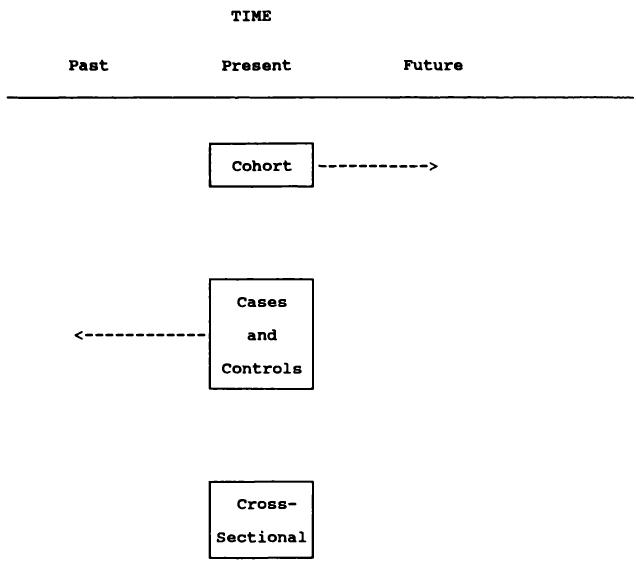

# 5 研究设计  5 Designing research  

临床研究中，可能没有哪一方面比研究设计更容易被忽视。热心的年轻研究者参加医学统计课程，学会了无数计算 $P$ 值的方法，却很少学会如何正确组织一个临床研究项目。然而，严谨的研究设计是高质量临床研究的基础。  
Probably no aspect of clinical research is as neglected as study design. Eager young investigators attend classes on medical statistics, find dozens of ways to compute  $P$  values, but rarely learn how to organize a clinical research project properly. Yet careful study design is the foundation of quality clinical research.  

Noller 和 Melton (1985)  
Noller and Melton (1985)  

正确做研究的方法屈指可数，但做错的方式却有千千万万。  
There are only a handful of ways to do a study properly but a thousand ways to do it wrong.  

Sackett (1986)  
Sackett (1986)  

## 5.1 引言  5.1 INTRODUCTION  

所有医学研究都是围绕一个或多个目标进行的，这些目标应当指导研究的计划或设计。在某些情况下，推进研究有明确的最佳路径，但更多时候存在多种合理的设计方案。设计中的统计学内容主要涉及研究结构及数据收集的各个方面，包括测量指标的选择及其频率。虽然本章涵盖的许多一般性问题也适用于临床试验，但临床试验有许多特殊之处，详见第15章。  
All medical research is carried out in relation to one or more objectives, which should focus the plan or design of the research. In some cases there is a clear best way to proceed, but more often there is a choice of reasonable ways of designing a study. The statistical aspects of design relate mainly to the structure of the study and all aspects of the collection of data, including the choice of measurements to make and their frequency. Although many of the general issues covered in this chapter apply to clinical trials, these have many special features and are discussed in detail in Chapter 15.  

研究大致可分为观察性研究和实验性研究。观察性研究中，我们收集一个或多个受试者群体的信息，但不干预他们。观察性研究可以是前瞻性的，即招募受试者并收集其后续事件的数据；也可以是回顾性的，即收集过去事件的信息。观察性研究包括普查、调查、病例对照研究和队列研究，相关内容见第5.9至5.12节。  
Research can be crudely divided into observational and experimental studies. In observational studies we collect information about one or more groups of subjects, but do nothing to affect them. Observational studies can be prospective, where subjects are recruited and data are collected about subsequent events, or retrospective, where information is collected about past events. Observational studies include censuses, surveys, casecontrol studies and cohort studies; they are considered in sections 5.9 to 5.12.  

实验性研究是指研究者对所有或部分个体所发生的情况进行干预（控制）。类似的问题也出现在对人类、动物及实验室样本的研究中，尽管本章重点在临床研究。第5.4至5.8节讨论实验性研究的设计。  
Experimental studies are those in which the researcher affects (controls) what happens to all or some of the individuals. Similar problems arise in studies of humans, animals and laboratory samples, although the emphasis  

in this chapter is on clinical studies. Sections 5.4 to 5.8 consider the design of experimental studies.  

大多数研究旨在回答相对简单的问题，但这并不意味着它们需要相对简单的设计。关键在于将研究设计与研究目标相匹配。没有充分的规划，研究者无法期望得出有意义的结论。本章后面将讨论一些重要的设计通则。  
Most studies aim to answer fairly simple questions but it does not necessarily follow that they require fairly simple designs. The key point is to tailor the research design to the study objective(s). Without adequate planning the researcher cannot expect to be able to make meaningful conclusions. Some important general principles of design are discussed later in this chapter.  

在大多数研究中，我们希望将研究结果推广到总体。对此有两个方面需要特别关注。首先，所研究的样本应具有代表性，能够反映感兴趣的总体；这点对观察性研究尤为重要。其次，比较的各组应尽可能相似，除了直接关注的特征外；这点在实验性研究（如临床试验）中特别重要，但在许多观察性研究（如病例对照研究）中也同样适用。下面我将回到这些问题进行讨论。  
In most research we wish to extrapolate the results from a study to the population in general. There are two aspects that require particular attention in this respect. First, the sample(s) studied should be representative of the population(s) of interest; this applies especially to observational studies. Secondly, groups being compared should be as alike as possible apart from the features of direct interest; this applies particularly in experimental studies, such as clinical trials, but is also relevant in many observational studies, such as case- control studies. I return to these issues below.  

研究设计可以说是统计学对医学贡献中最重要的部分。正因如此，50 多年来，统计学家一直敦促医学研究者在研究的规划阶段而非分析阶段就与他们沟通。一项良好设计的研究所产生的数据可以通过多种方式分析，但再巧妙的分析也无法弥补设计上的缺陷。  
Research design is arguably the most important aspect of the statistical contribution to medicine. It is for this reason that for over 50 years statisticians have been urging medical researchers to consult them at the planning stage of their study, rather than at the analysis stage. The data from a good study can be analysed in many ways, but no amount of clever analysis can compensate for problems with the design of a study.  

## 5.2 研究设计的类别  5.2 CATEGORIES OF RESEARCH DESIGN  

研究设计可以按多种方式分类，部分分类如下：  
Research designs can be classified in several ways, some of which are:  

【1】观察性或实验性 observational or experimental;   
【2】前瞻性或回顾性 prospective or retrospective;   
【3】纵向或横断面 longitudinal or cross-sectional.  

这些术语将在下文解释。第一种分类与研究目的相关，而其他分类描述数据的收集方式。并非所有分类的组合都是可能的，但大多数是。  
These terms are explained below. The first classification relates to the purpose of the study, while the others describe the way in which the data are collected. Not all combinations of these classifications are possible, but most are.  

### 5.2.1 观察性或实验性  5.2.1 Observational or experimental  

在观察性研究中，研究者收集感兴趣的属性或测量数据，但不干预事件。例如，一项旨在发现小儿听力障碍患病率的研究即为观察性研究。观察性研究包括调查和大多数流行病学研究。相比之下，在实验性研究中，研究者有意干预事件并调查干预的效果。实验性研究包括临床试验以及许多动物和实验室研究。一般来说，实验性研究所能得出的推论比观察性研究更有力。实验性研究通常用于比较不同组别；观察性研究也可能具有比较性质，但往往本质上是描述性的。  
In an observational study the researcher collects information on the attributes or measurements of interest, but does not influence events. An example would be a study to discover the prevalence of hearing difficulties in small children. Observational studies include surveys and most epidemiological studies. By contrast, in an experimental study the researcher  

deliberately influences events and investigates the effects of the intervention. Experimental studies include clinical trials and many animal and laboratory studies. In general stronger inferences can be made from experimental studies than from observational studies. Experimental studies are usually carried out to make comparisons between groups; observational studies may also be comparative, but they are often essentially descriptive.  

### 5.2.2 前瞻性或回顾性  5.2.2 Prospective or retrospective  

前瞻性研究与回顾性研究有明显区别：前瞻性研究从研究开始起向前收集数据；回顾性研究则涉及过去事件的数据，可能来自现有资料，如病历，或通过访谈获得。实验通常是前瞻性的，但观察性研究既可以是前瞻性的，也可以是回顾性的。当然，可以获取回顾性数据来比较不同治疗方法，例如不同类型的乳房切除术，但这类研究不属于实验，因为它不是在标准化条件下预先设定的研究。回顾性研究包括病例对照研究（见第5.10节）。  
There is a clear distinction between prospective studies, in which data are collected forwards in time from the start of the study, and retrospective studies, in which data refer to past events and may be acquired from existing sources, such as hospital notes, or by interview. Experiments are prospective, but observational studies may be prospective or retrospective. Of course, retrospective data can be obtained to compare different treatments, for example different types of mastectomy, but such a study would not be an experiment as it was not a pre- specified study performed under standardized conditions. Retrospective studies include case- control studies (see section 5.10).  

### 5.2.3 纵向研究或横断面研究  5.2.3 Longitudinal or cross-sectional  

纵向研究是指调查随时间变化的研究，可能与某种干预有关。观察在多个时间点进行，尽管并非所有观察数据都会用于分析。临床试验属于纵向研究，因为我们关注的是某一时间点开始的治疗对后期结果的影响。横断面研究是指对个体仅观察一次的研究。大多数调查都是横断面的，构建参考范围的研究也是如此。观察性研究可以是纵向的，也可以是横断面的，但实验通常是纵向的。  
Longitudinal studies are those which investigate changes over time, possibly in relation to an intervention. Observations are taken on more than one occasion, although they may not all be used in the analysis. Clinical trials are longitudinal because we are interested in the effect of treatment commencing at one time point on outcome at a later time. Cross- sectional studies are those in which individuals are observed only once. Most surveys are cross- sectional, as are studies to construct reference ranges. Observational studies may be longitudinal or cross- sectional, but experiments are usually longitudinal.  

还有一种“伪纵向”研究，即每个受试者仅被观察一次，但数据被用来描述随时间的变化。例子包括用于绘制儿童横断面生长曲线的研究以及月经周期中激素水平的研究（参见第5.13节）。  
There is also the 'pseudo- longitudinal' study in which each subject is seen at only one time, but the data are used to describe changes over time. Examples are studies to derive cross- sectional growth charts for children and studies of hormone levels during the menstrual cycle (see section 5.13).  

### 5.2.4 设计特征之间关系的总结  5.2.4 Summary of inter-relationships  

图5.1总结了设计特征最可能的组合。实验研究几乎全部是前瞻性和纵向的，这与观察性研究形成了明显的区别，后者既可以是回顾性的，也可以是前瞻性的，还可以是横断面或纵向的。  
Figure 5.1 summarizes the most likely possible combinations of design features. There is a clear distinction between experimental studies which are nearly all prospective and longitudinal, and observational studies which can be either retrospective or prospective and also either cross- sectional or  

  
图5.1 研究设计类型。  
Figure 5.1 Types of research design.  

纵向研究。因此，本章后面将分别讨论实验研究和观察性研究。  
longitudinal. For this reason experiments and observational studies are considered separately later in this chapter.  

可以构建更复杂的研究设计分类（Bailar 等，1984），但图5.1描述了大多数研究的主要特征。  
It is possible to construct more complex categorizations of research designs (Bailar et al., 1984), but Figure 5.1 describes the main features of most research studies.  

到目前为止，设计的讨论涉及的是广泛的问题。接下来的章节将更详细地探讨设计，特别强调从样本到总体统计推断的两个重要方面—样本的代表性和对任何发现的关联的解释。  
So far discussion of design has related to broad issues. The following sections look at design in more detail with particular emphasis on two important aspects of statistical inference from the sample to the population - the representativeness of the sample and the interpretation of any associations found.  

### 5.2.5 对照  5.2.5 Control  

无论何种实验，必须设有对照组，即不接受实验处理的组。通常科学上或伦理上都不能接受“让我们在一些患者身上试用这种新治疗，看看结果如何”的做法。更好的方法是设立对照组，这些患者接受常规治疗（或以某种不同方式治疗），以便进行比较。如果我们想评估孕妇数胎动的益处，就应设立一个同期对照组，这组孕妇不数胎动。这是医学中新疗法或新程序评估的关键组成部分。  
Whatever the experiment, it is essential to have a comparison, or control, group to which the experimental procedure is not applied. It is not usually scientifically or ethically acceptable to say 'Let's try this new treatment on some patients and see what happens'. It is far better to have a control group who are treated normally (or in some way differently), against which comparisons can be made. If we wish to evaluate the benefits of mothers counting fetal movements in pregnancy we should have a concurrent control group of mothers who do not count movements. This is a key component of the evaluation of new therapies or procedures in medicine.  

观察性研究中也建议设立对照组。如果我们询问使用视觉显示终端（VDT）的员工是否有眼睛疲劳或背痛，也应对一组不使用VDT的相似员工提出相同问题。  
Controls are also advisable in observational studies. If we ask users of visual display terminals (VDTs) if they get eye strain or backache, we should also ask the same questions of a group of comparable employees who do not use VDTs.  

在每种情况下，对照组的存在都增强了研究结果推断的力度。然而，正如我下面将讨论的，观察性研究中选择合适的对照组并不容易。  
In each case the presence of the control group strengthens the inferences that may be made from the results of the study. However, as I shall discuss below, the choice of suitable controls in observational studies is not easy.  

## 5.3 变异来源  5.3 SOURCES OF VARIATION  

第3章和第4章都开始于关于变异性对统计方法重要性的评论。行为或对某种刺激（如烟草或抗生素药物）的反应的变异是常态。如第3章所述，有些变异来源是已知或怀疑的，但仍有大量变异无法解释。例如，我们知道几个影响出生体重的变量，如妊娠期长短、胎儿性别、产次、母亲吸烟情况、海拔高度等，但包含这些信息的统计模型仅能解释出生体重变异的约四分之一。虽然无疑还有未被识别的其他因素影响变异，但重要因素很可能已被发现。因此，观察到的大部分变异必须被视为无法解释的，我们称之为随机变异。大多数临床测量中存在相当大的随机变异。有些测量如体温，变异较小；而出生体重、血压或许多血清成分则存在巨大变异。在设计比较组间某临床测量水平的研究时，必须考虑这种自然变异。我们可以将这种随机变异视为“背景噪声”，我们试图在其上检测某种感兴趣的“信号”效应。这与其他领域使用的“信噪比”概念有很好的类比。如果结果测量高度变异，我们需要更大的样本量以检测系统性效应。另一种可能的设计是通过研究个体基线水平的变化来消除个体间差异。  
Chapters 3 and 4 both began with comments about the importance of variability to the statistical approach. Variability in behaviour or response to some stimulus, be it tobacco or an antibiotic drug, is the norm. As noted in Chapter 3, some sources of variability may be known, or suspected, but much remains unexplained. For example, we know several variables that affect birth weight, such as length of gestation, fetal sex, parity, maternal smoking, height above sea level, and so on, but statistical models incorporating such information explain only about a quarter of the variability in birth weight. While there are undoubtedly other factors not yet identified that contribute to the variability, it is most unlikely that any important factors remain unidentified. The bulk of the observed variability must therefore be considered unexplainable, which we call random variation. There is considerable random variation in most clinical measurements. For some, such as body temperature, there is relatively little variation, but for others, such as birth weight, blood pressure, or many serum constituents, there is enormous variation. When we are designing a study to compare groups with respect to levels of some clinical measurement, this natural variability must be borne in mind. We can think of this random variability as 'background noise', against which we are trying to detect some effect, or 'signal', of interest. There is a good analogy here with the concept of the 'signal to noise' ratio used in other fields. If the outcome measurement is highly variable we will need a larger study to be able to detect a systematic effect of interest. Another possible design to consider is that in which we remove between subject variation by studying within subject changes from a baseline level.  

此外，个体在未直接研究但可能影响感兴趣变量的其他特征上也表现出类似的变异。实验设计的许多原则旨在控制我们不感兴趣的变异，从而使我们能集中关注感兴趣的变异。这种总体变异对研究设计有两个相关的后果：  
Further, individuals will exhibit similar variation in other characteristics not directly being studied but which might affect the variables of interest. Many of the principles of experimental design are aimed at trying to control variation that we are not interested in, so that we can focus our attention on the variability that we are interested in. Two consequences of this general variability relevant to the design of studies are:  

1. 采样时需谨慎，确保样本具有代表性。   
Care is needed to make samples representative of the population.   
2. 在比较研究中，需谨慎使各组在已知变异来源上保持相似。  
In comparative studies care is needed in making groups similar with respect to known sources of variation.  

此外，我们需牢记，当感兴趣的测量值变异较大时，需要较大的样本量以获得可靠结果。  
In addition, we need to bear in mind that when the measurement of interest is highly variable, large samples are needed to get reliable results.  

这些问题将在下文讨论，先针对实验研究，再针对观察性研究。然而，第15章提供了比较研究中计算合适样本量的方法，因为这些方法多用于临床试验设计。  
These issues are discussed below, firstly for experimental studies and then for observational studies. However, methods for calculating the appropriate sample size for comparative studies are given in Chapter 15. as they are most often used when designing clinical trials.  

在详细探讨不同类型的实验设计之前，考虑一个真实研究有助于说明许多相关问题。  
Before examining different types of experimental design in detail it should help to consider a real study that illustrates many of the issues.  

一个实验：两臂血压是否相同？79  
An experiment: is the blood pressure the same in both arms？ 79  

## 5.4 一个实验：两臂血压是否相同？  5.4 AN EXPERIMENT: IS THE BLOOD PRESSURE THE SAME IN BOTH ARMS？  

血压是一项特别具有变异性的测量。不仅个体间差异显著（部分原因已知），且个体内部随时间变化巨大。血压存在明显的24小时节律变化（日夜变化）以及日间波动。此外，血压测量本身也较为困难。近年来，发展了通过手臂内置导管连接小型录音设备连续记录血压的新技术。动态血压监测更具信息量，因为它提供24小时数据，且测量直接，避免了观察者误差。许多人将这种动脉内测量技术视为“金标准”，用以评估新方法，尤其是间接（即非侵入性）动态血压监测仪。鉴于血压的变异性，重要的是同时用两种设备测量，因此需同时测量双臂。由此产生的问题是，左右臂血压是否存在系统性差异。  
Blood pressure is a particularly variable measurement. Not only does it vary considerably between individuals, for which we have partial explanation, but it varies greatly over time for each individual. There is marked variation over 24 hours (circadian variation) as well as day- to- day variation. In addition, blood pressure is difficult to measure. In recent years new technology has been developed to allow continuous recording of blood pressure via an indwelling catheter in the arm linked to a small tape recorder. Ambulatory blood pressure monitoring is more informative, as it gives data for 24 hours, and also potentially more accurate as it measures blood pressure directly and without observer error. Many people regard this intra- arterial technique as the 'gold standard' against which to judge new methods, in particular indirect (i.e. non- invasive) ambulatory recorders. Because of the variability referred to it is important to take simultaneous measurements using the two devices, and thus to use both arms. The question then arises as to whether there might be any systematic difference in blood pressure between the left and right arms.  

Gould等人（1985）描述了一项旨在回答该问题的研究。设计如下：所用设备为“随机零”血压计，一种旨在消除观察者偏差的仪器（观察值需加上一个事后才知的“随机”量）。每臂绑上袖带，两袖带连接同一血压计，使用电动气泵平衡两袖带压力。显然需要两名观察者，各负责一臂。尽管使用特殊血压计，仍须避免观察者只测一臂，以防观察者间存在系统差异。因此，每观察者需对左臂和右臂各测半数样本，且建议（非必须）每观察者测量每位患者的双臂。类似地，两袖带可能略有差异，故每袖带需均等应用于两臂，每位患者均如此。鉴于血压已知变异性，决定每观察者在每位患者的每臂用每袖带测量两次，共16次测量。最后，患者血压在测量过程中可能系统性变化，因此袖带应用顺序及观察者测量顺序均采用随机化方法，详见5.7节。观察者间不交流测量结果。  
A study to answer this question was described by Gould et al. (1985). The design was as follows. The equipment used to measure the blood pressure was a 'random zero' sphygmomanometer, a machine designed to remove observer bias. (To the reading observed must be added another 'random' quantity not known until afterwards.) A cuff was attached to each arm, and both were connected to the same sphygmomanometer. An electric air pump was used to equalize the pressure to the two cuffs. Clearly it was necessary to have two observers - one to each arm. Despite the use of a special sphygmomanometer it was important that the observers did not measure only one arm in case there was a systematic difference between the observers. Thus each observer had to take half of the observations on the left arm and half on the right, and it was felt sensible (although it was not essential) for each observer to measure both arms of each patient. A similar argument applied to the two cuffs, which might have been slightly different. Thus each cuff had to be applied equally to each arm and again this was carried out for each patient. In view of the known variability of blood pressure it was decided that each observer would take two measurements using each cuff on each arm of each patient, giving 16 measurements per patient. Finally, there might have been a tendency for a patient's blood pressure to change systematically during the series of measurements. Thus the order in which the cuffs were applied to the arms and the order in which the observers measured the two arms was varied using randomization. A detailed explanation of randomization is given in section 5.7. There was no communication of results between observers.  

该研究在91名原发性高血压患者中进行。  
The study was carried out on 91 subjects with essential hypertension.  

上述设计旨在尽可能纯粹地比较左臂和右臂的血压。此外，还记录了每条手臂的周长，并记录了每位受试者测量的顺序。本研究展示了实验设计的许多特征，其中一些将在第5.5节中详细讨论：  
The above design was used to try to get as pure a comparison as possible of the blood pressure in the left and right arms. In addition the circumference of each arm was recorded, and a record was kept of the order in which the measurements were taken for each subject. This study illustrates many features of the design of an experiment, some of which will be discussed in more detail in section 5.5:  

观察者数量 每位受试者需要两名观察者，但即使不是必要，通常也建议有多个观察者，因为这可以量化观察者之间的差异（见第14.2节）。  
Number of observers It was necessary to have two observers per subject, but it is often a good idea to have more than one observer even when it is not necessary, as it allows the differences between observers to be quantified (see section 14.2).  

重复测量 在每种实验条件组合下进行多次测量是理想的，因为这能提高对感兴趣效应的估计精度。然而，重复测量需要是独立的。在臂部比较研究中，测量是独立的，因为所用仪器类型使观察者不知道他们之前的测量结果。  
Replicated measurements It is desirable to take more than one reading in each combination of experimental conditions as it gives greater precision for estimating the effects of interest. The replicates need to be independent readings, however. They were independent in the arm comparison study because the type of machine used meant that the observers did not know what their previous measurement was.  

平衡设计 各实验因素组合下不必一定采集相同数量的观察值，但如果一切平衡，如上述研究所示，分析会简单得多。  
Balanced design It is not essential that the same number of observations is taken for each combination of experimental factors, but if everything is balanced, as in the above study, the analysis is very much simpler.  

随机化 每位患者的两臂分配观察者和袖带的顺序是随机确定的。随机化是实验设计的关键要素之一。  
Randomization The order in which the observers and cuffs were allocated to the two arms for each patient was determined at random. Randomiza­ tion is one of the key elements of experimental design.  

协变量 有时存在非实验特征（协变量）需要记录，因为它们可能影响结果。虽然这些特征可能在不同观察间变化，比如环境温度，但也可能只在不同受试者间变化，比如年龄。在本研究中，臂围被认为是一个可能的协变量，因为它影响袖带的贴合度。臂围介于上述两种情况之间，在同一受试者内（即两只手臂之间）会变化，但不会在不同观察间变化。另一个潜在的协变量是观察顺序。设计采用随机和平衡方法，因为预期重复测量时记录的血压会下降。然而，在分析中考虑测量顺序可以提高精确度。  
Covariates Sometimes there are non- experimental features (covariates) that need to be recorded as they might have affected the results. While they may vary from observation to observation, such as ambient tem­ perature, they may vary only from subject to subject, such as age. In this study arm circumference was considered to be a possible covariate as it affects the fit of the cuff. Arm circumference is intermediate between the two examples given, varying within subject (i.e. between arms) but not from observation to observation. Another potential covariate was the order of observations. The design was randomized and balanced because it was anticipated that recorded blood pressure would fall over repeated measure­ ments. However, it is possible to take account of the order of measure­ ments in the analysis to improve precision.  

样本量 采用了较大样本量，以提供两臂间差异的精确估计。  
Sample size A large sample was taken to provide a precise estimate of the difference between the arms.  

## 5.5 实验设计  5.5 THE DESIGN OF EXPERIMENTS  

实验的设计应尽可能简单明了地回答所关注的问题。考虑数据的获取方式非常重要  
An experiment should be designed to answer the question of interest as simply and clearly as possible. It is important to consider the way the data  

在设计实验时会进行分析，因为这可以避免后续的复杂情况。本章讨论一般的实验设计。第15章将深入探讨临床试验，因为其中涉及许多特殊问题。  
will be analysed when designing an experiment as this can save complications later. This chapter considers experiments in general. Chapter 15 considers clinical trials in depth, as there are many special issues involved.  

本节讨论设计实验时需要考虑的一些重要方面。  
In this section I discuss some of the more important aspects to consider when designing an experiment.  

### 5.5.1 偏倚  5.5.1 Bias  

任何研究，无论是实验性还是观察性，都是为了解答一个或多个具体问题而设立的。结果的可靠性及其对发现的解释至关重要。实验提供了最有力的机会去接近真相，但必须采取若干预防措施以确保结果不带偏倚。例如，在比较实验中，如臂部比较研究，重要的是被比较的观察组在除实验操控因素外的所有方面都应具有可比性。臂部比较研究的多个设计特征正是基于这一考虑。  
Any study, whether experimental or observational, will be set up to answer one or more specific questions. The reliability of the results, and thus the interpretation of the findings, is crucial. An experiment provides the best opportunity to get at the truth, but there are several precautions that should be taken to ensure that the results are not biased. For example, in a comparative experiment, such as the arm comparison study, it is important that the groups of observations being compared are comparable in all aspects other than that being manipulated by the experimenter. Several of the design features of the arm comparison study were included for this reason.  

偏倚可能源于研究的结构性缺陷。例如，如果一位观察者负责所有左臂的测量，另一位负责所有右臂的测量，那么臂间差异将无法与观察者间差异区分开，这种效应称为混杂。事实上，该研究正是为了检验在不同仪器分别测量单侧臂时是否存在混杂效应。确保不同观察者-臂-袖带组合在第1、2、3、4顺序中均等使用，是避免偏倚的又一例证。  
Bias can occur through structural deficiencies in a study. For example, if one observer had taken all measurements on the left arm and the other all those on the right arm, the between arm differences would have been inseparable from any between observer differences, an effect called confounding. In fact, that study was carried out expressly to see if there would be confounding when different machines were compared one to an arm. Making sure that the different observer- arm- cuff combinations were used equally in the 1st, 2nd, 3rd and 4th orders is another example of avoiding bias.  

### 5.5.2 随机化  5.5.2 Randomization  

偏倚的一个重要来源是受试者在设计中未考虑的特征上的差异。例如，如果在一组患者中仅测量左臂血压，另一组仅测量右臂血压，那么观察到的左右臂平均差异可能受两组间与血压相关变量（如年龄）差异的影响。显然，在同一患者身上使用双臂测量更好，但大多数研究中程序或治疗无法同时施加于同一受试者。常用方法是将治疗随机分配给患者。如第5.7节所述，随机一词在统计学中有特定含义。随机分配是实验设计的基本原则之一。另一方法是找到特征相似的受试者配对，并将治疗随机分配给配对对象。匹配方法详见第5.8节。  
An important possible source of bias is the way in which subjects vary in features that are not part of the design. For example, if we had measured blood pressure in the left arm only in one group of patients and in the right arm only in another group, then the average difference observed between left and right arms could be affected by differences between the groups with respect to any variable related to blood pressure, such as age. Clearly it is better to use both arms in the same patients, but in most studies the procedures or treatments cannot be given to the same individuals. The usual approach here is to allocate treatments to patients at random. As described in section 5.7, the word random has a specific statistical meaning. Random allocation is one of the fundamental principles of experimental design. Another device is to find pairs of subjects with closely similar characteristics and allocate treatments to the matched pair at random. Matching is discussed in section 5.8.  

在臂部比较研究中，观察者测量左右臂的顺序及两种袖带的使用顺序均采用随机化。虽然没有具体理由认为例如观察者1总是先测左臂会产生偏倚，但随机排序作为防范潜在未知微妙影响的保障措施被采用。  
In the arm comparison study the order in which the observers measured the left and right arms and the order of use of the two cuffs were randomized. There was no specific reason to expect a bias from, for example, observer 1 always starting on the left arm, but random ordering was used as a safeguard against possible subtle unknown effects.  

### 5.5.3 盲法  5.5.3 Blinding  

偏倚也可能通过潜意识效应产生。例如，观察者的判断可能受知晓受试者所接受治疗或之前测量结果的影响。臂部比较研究通过选择血压测量仪器避免了后者问题。前者问题在临床试验中特别重要，通常希望患者和评估者均不知晓所用治疗，这一过程称为盲法（详见第15章）。  
Bias can also occur through subconscious effects. For example, observers' judgements may be affected by knowing the treatment that a subject is getting, or by knowledge of a previous measurement for that subject. The latter problem was avoided in the arm comparison study by the choice of blood pressure measuring machine. The former problem is especially relevant in clinical trials, where it is desirable to keep both patients and assessors in ignorance of the treatment given, a procedure known as blinding (see Chapter 15).  

### 5.5.4 重复  5.5.4 Replication  

对于高度变异或难以准确测量的指标，可能需要对每个个体进行多次测量。这些重复测量可以在分析中作为独立观察值处理，虽然这会使分析更复杂，但能更有效地发现感兴趣的效应。只有当重复测量相互独立时，这种分析才有效，而如果观察者知道第一次测量结果，通常不满足独立性的要求。  
For measurements that are highly variable or difficult to measure accurately it may be useful to take more than one measurement on each individual. These replicates can be treated in the analysis as separate observations, which may make the analysis more complicated but gives greater potential to detect effects of interest. This analysis is only valid if the replicates are independent, which is often not the case if the observer knows what measurement they obtained the first time.  

更常见的做法是使用重复测量的平均值进行分析。这种方法更接近临床实践—一些“噪声”较大的变量，如血压、最大呼气流量和超声测量，通常会重复测量。  
More often the average of the replicates is used in the analysis. This latter approach may mirror clinical practice - some 'noisy' variables such as blood pressure, peak expiratory flow rate, and ultrasound measurements are usually repeated.  

### 5.5.5 样本选择  5.5.5 Sample selection  

研究中样本应尽量代表目标人群，但在实验研究中这一点不如观察性研究重要。例如，手臂差异研究中样本的选择不太可能影响结果。更重要的是确保比较的亚组尽可能相似。  
It is always desirable for the sample in a study to be representative of the population of interest, but this is not as important in experiments as in observational studies. For example, it is unlikely that the choice of the sample for the arm difference study would have affected the results. It is much more important to ensure that the sub- groups being compared are as similar as possible.  

虽然原则上代表性样本应通过从总体中随机抽取获得，但实际中几乎无法做到这一点。然而，样本应尽量与相关总体相似，因此必须清楚描述样本的选择方法。  
Although in principle representative samples are best obtained by random selection from the population, this ideal is virtually never met in practice. However, the sample should be chosen to be as similar as possible to the relevant population, so it is essential to be able to describe just how the sample was chosen.  

这些考虑对大多数动物实验可能并不适用。  
These considerations are probably irrelevant for most animal experiments.  

### 5.5.6 样本量  5.5.6 Sample size  

另一种应对变异性的方法是增加样本量。更大的样本能更精确地评估感兴趣的效应。确定合适的样本量在临床试验中尤为常见，第15.3节介绍了比较研究中选择样本量的正式方法。类似原则适用于所有研究，但方法较复杂，需专家协助。  
Another way of combating variability is to increase the sample size. Larger samples enable us to evaluate effects of interest more precisely. The determination of an appropriate sample size is most common in clinical trials and section 15.3 describes formal methods for choosing an appropriate sample size in comparative studies. Similar principles apply to all studies, but the methods can be complicated so expert assistance is required.  

## 5.6 实验的结构  5.6 THE STRUCTURE OF AN EXPERIMENT  

在设计实验中，如手臂比较研究，研究者可能控制多个条件（称为因素）。绘制设计结构图有助于理清设计思路，同时指导数据分析方法。  
In a designed experiment such as the arm comparison study there may be several conditions (called factors) being controlled by the investigator. It may be helpful to draw a diagram to show the structure of the design. As well as clarifying the design the diagram will show how the data should be analysed.  

一个简单的例子是比较三组接受不同止痛药治疗偏头痛的受试者的实验。图5.2展示了该设计的简单结构。每个x代表一个观测值。在此设计中，三组的大小不必相等，但在更复杂的设计中，组大小相等是非常理想的。如果研究设计  
A simple example is an experiment to compare three separate groups of subjects given different analgesics to combat migraine. Figure 5.2 shows the simple structure of this design. Each x denotes an observation. In this design there is no need for the three groups to be of equal size but in more complicated designs equal sizes are highly desirable. If the study design  

  
图5.2 比较接受止痛药A、B或C的三组受试者的研究结构。每个x表示一名受试者。  
Figure 5.2 Structure of a study to compare three groups of subjects receiving analgesics A, B or C. Each x indicates one subject.  

改为每名受试者以随机顺序接受所有三种止痛药时，设计如图5.3所示。此处同一受试者的观测值用线连接。  
were changed so that each subject received all three analgesics in random order, the design would be as shown in Figure 5.3. Here observations on the same subject are connected.  

一项研究可能结合这两种特征，即受试者被多次测量，但不同组的受试者接受不同处理。例如，我们可能想比较不同饮食前后受试者的体重；图5.4展示了相应的设计。图5.2至5.4说明了“组内比较”与“组间比较”的重要区别。  
A study may combine both these features, so that subjects are examined more than once but different groups of subjects are treated differently. For example, we may wish to compare subjects' weights before and after different diets; Figure 5.4 shows the appropriate design. Figures 5.2 to 5.4 illustrate the important distinction between within subject and between subject comparisons.  

比较左右臂血压的研究更为复杂。有三个因素—臂、观察者和袖带—并且对每种组合进行了两次测量（重复）。该研究设计如图5.5所示，称为因子设计，因为使用了所有因素的组合。  
The study comparing blood pressure in the left and right arms was more complicated. There were three factors - arms, observers and cuffs - and two measurements (replicates) were taken for each combination. The design of this study, which is shown in Figure 5.5, is known as a factorial design as all combinations of factors are used.  

在具体情况下无法断言哪种设计最佳。选择控制哪些因素、哪些因素为组间、哪些为组内，以及每个受试者应进行多少次观测都很困难，通常需要深入思考才能得出满意的设计。此阶段专家统计学帮助尤为重要。设计中的任何缺陷事后都无法弥补。  
It is not possible to say what the best design is in any given circumstance. The choice of factors to control, which factors are between subject and which within, and how many observations to take for each subject is difficult, and it will often take much thought to arrive at a satisfactory design. Expert statistical help is particularly valuable at this stage. Any weaknesses in the design cannot be rectified later.  

  
图5.3 比较同一组受试者接受三种治疗的研究结构。线条连接同一受试者的观测值，观测顺序为随机。  
Figure 5.3 Structure of a study to compare three treatments in one group of subjects. Lines join observations on the same subject, which are made in random order.  

  
图5.4 比较两个组在治疗前后测量的研究结构。  
Figure 5.4 Structure of a study to compare two groups measured before and after treatment.  

  
图5.5 比较左右臂血压的研究结构—三因素因子设计。  
Figure 5.5 Structure of the study to compare blood pressure in the left and right arms - a three way factorial design.  

## 5.7 随机分配  5.7 RANDOM ALLOCATION  

本章前面多次提到随机分配。本节讨论实验研究中随机化的原理和方法。  
There have been several mentions of random allocation earlier in this chapter. The rationale for and methods of randomization in experimental studies are discussed in this section.  

使用随机化有两个主要原因。第一个原因是防止偏倚。如前所述，我们希望比较的治疗组之间不存在系统性差异。如果受试者接受由研究者（或受试者本人）选择的治疗，通常会产生偏倚—通常是无意识的，但有时也可能是有意的。我们可以通过随机分配治疗给受试者来避免这种可能性。  
There are two main reasons for using randomization. The first reason is to prevent bias. As noted earlier, we want to compare treatments between groups which do not differ in any systematic way. If subjects receive treatments chosen by the investigator (or indeed the subject) there is the likelihood of bias arising - usually subconscious but occasionally intentional. We can avoid this possibility by allocating treatments to subjects at  

随机分配。关于临床试验中这一问题的进一步讨论见第15.2.2节。  
random. There is further discussion of this issue with regard to clinical trials in section 15.2.2.  

偏倚也可能源于未知效应。例如，当对每个受试者使用两种或多种治疗（或实验条件）时，建议随机化它们施加给受试者的顺序，以防时间或测量顺序相关的未知偏倚存在。这也是手臂比较研究中测量顺序随机化的依据。  
Bias can also arise through unknown effects. For example, when two or more treatments (or experimental conditions) are used for each subject it is advisable to randomize the order in which they are applied to each subject in case there is any unknown bias associated with time or the order of measurements. This argument was behind the randomization of the order of measurements in the arm comparison study.  

随机化的另一个原因是统计理论基于随机抽样的理念。在随机分配的研究中，治疗组间的差异表现得像随机样本之间的差异。如第4章所述，我们知道随机样本的预期表现，因此可以将观察结果与预期进行比较，例如假设各治疗效果相等。  
The other reason for randomizing is that statistical theory is based on the idea of random sampling. In a study with random allocation the differences between treatment groups behave like the differences between random samples. As noted in Chapter 4, we know how random samples are expected to behave, and so can compare the observations with expectation, for example assuming that the treatments are equally effective.  

### 5.7.1 简单随机化  5.7.1 Simple randomization  

随机并不等同于随意，这一点常被忽视。随机分配意味着每位患者接受每种治疗的机会是已知的，通常是相等的，但治疗的具体分配不可预测。因此，交替给患者分配两种治疗并非随机分配。最简单的随机分配方法是抛硬币—正面为治疗A，反面为治疗B。等效的方法是使用随机数字表，如表B13。这些表中每个数字出现的频率相等，排列顺序随机且完全不可预测。另一种选择是使用计算机的随机数生成器。  
It is not always appreciated that random does not mean the same as haphazard. By random allocation we mean that each patient has a known chance, usually an equal chance, of being given each treatment, but the treatment to be given cannot be predicted. Thus alternately allocating two treatments to a series of patients is not random allocation. The simplest method of random allocation is tossing a coin - heads is treatment A, tails is treatment B. An equivalent method is to use a table of random numbers, such as that in Table B13. In these tables each number occurs equally often, and the ordering is random, and so completely unpredictable. Another option is to use a random number generator on a computer.  

第一步是确定随机数字与不同实验组的对应关系。例如，若用表B13将两种治疗平均分配给受试者，可将奇数视为一种治疗，偶数视为另一种。然后选择一个起始点，可以用针或其他同样随意的方法确定。还可以选择读取表格的方向。  
The first step is to decide the correspondence between the random numbers and the different experimental groups. For example, if we wish to allocate equally two treatments to subjects using Table B13 we could take odd numbers to indicate one treatment and even numbers to indicate the other. We must then choose a place to start, and this can be done using a pin or some equally arbitrary method. In addition we can choose the direction in which to read the table.  

假设我们从起始点开始，表中前几个两位数是  
Suppose that the first two digit numbers in the table from our starting place are  

12 19 20 52 81 30 74 93 02 67 41 50，依此类推。  
12 19 20 52 81 30 74 93 02 67 41 50, etc.  

如果我们将奇数分配给治疗A，偶数分配给治疗B，那么这些数字表示的序列是  
If we take odd numbers for treatment A and even numbers for treatment B, then these numbers indicate the sequence  

 **BABBABBABAAB**  
**BABBABBABAAB**  

用于前12名受试者。或者我们也可以单独取每一位数字，得到  
for the first 12 subjects. Alternatively we could take each digit on its own. to give  

 **ABAABBABBAABABAABBBABAAB**  

用于前24名受试者。第三种方法是将数字00到49分配给A，50到99分配给B，当然还有无数其他可能的策略。使用哪种方法都没有区别。  
for the first 24 subjects. A third approach would be to take numbers 00 to 49 for A and 50 to 99 for B, and there are countless other possible strategies. It makes no difference which is used.  

我们可以很容易地将最后一种方法推广到两个以上的治疗或实验条件。例如，我们可以为三组使用以下方案：  
We can easily generalize the last approach to situations with more than two treatments or experimental conditions. For example, we could use the following scheme for three groups:  

01到33：治疗A  
01 to 33: treatment A  

34到66：治疗B  
34 to 66: treatment B  

67到99：治疗C  
67 to 99: treatment C  

00：忽略  
00 : ignored  

其他设计也类似。请注意，在序列中的任意时刻，分配给每个治疗组的患者数量可能会不同。我们有时希望各组人数始终非常接近，这可以通过区组随机化实现。此外，简单随机化使得各组受试者特征的分布完全依赖于随机机会。我们常常知道或怀疑某些受试者的表现会不同，例如他们可能有不同的预后，因此希望在不同治疗组中保持这些类别内的受试者数量相似。我们可以通过分层随机化或最小化方法实现这一点。以下将介绍这些技术。显然，上述方法很容易调整为加权随机化，从而导致不同组间人数不等。例如，我们可以通过将01到66分配给A，67到99分配给B，实现治疗A和B按2比1的比例分配。  
and similarly for other designs. Notice that at any point in the sequence the numbers of patients allocated to each treatment will probably differ. We sometimes wish to keep the numbers in each group very close at all times, which we can achieve by block randomization. Further, with simple randomization the distribution of the characteristics of the subjects in each group is left completely to chance. We often know or suspect that some subjects will behave differently, for example they may have different prognoses, and so it is desirable to keep the numbers within these classes similar in the different treatment groups. We can achieve this by stratified randomization or minimization. These techniques are all described below.Clearly it is very easy to adapt the above method to give a weighted randomization, leading to unequal numbers in the different groups. For example, we could allocate treatments A and B in proportions 2 to 1 by using 01 to 66 for A and 67 to 99 for B.  

显然，很容易调整上述方法以实现加权随机化，从而导致不同组之间的样本数量不相等。例如，我们可以通过将01到66分配给A，67到99分配给B，实现A和B按2比1的比例分配治疗。  
Clearly it is very easy to adapt the above method to give a weighted randomization, leading to unequal numbers in the different groups. For example, we could allocate treatments A and B in proportions 2 to 1 by using 01 to 66 for A and 67 to 99 for B.  

### 5.7.2 区块（或受限）随机化  5.7.2 Block (or restricted) randomization  

区块（或受限）随机化用于保持不同组的受试者数量始终接近平衡。例如，如果我们每次考虑四个受试者为一个区块，有六种方法可以分配治疗，使得两个受试者接受A，两个接受B：  
Block (or restricted) randomization is used to keep the numbers of subjects in the different groups closely balanced at all times. For example, if we consider subjects in blocks of four at a time, there are six ways in which we can allocate treatments so that two subjects get A and two get B:  

1 AABB 4 BBAA 2 ABAB 5 BABA 3 ABBA 6 BAAB  
1 AABB 4 BBAA 2 ABAB 5 BABA 3 ABBA 6 BAAB  

如果我们仅使用这六种治疗分配方式的组合，那么任意时刻两组人数的差异不会超过  
If we use combinations of only these six ways of allocating treatments then the numbers in the two groups at any time can never differ by more than  

两个，且通常相同或相差一个。我们随机选择区块以创建分配序列。使用前面的随机序列开始  
two, and they will usually be the same or one apart. We choose blocks at random to create the allocation sequence. Using the previous random sequence beginning  

121920528130749302674150  

我们可以省略范围外的数字（1到6之外），得到  
we can omit those numbers outside the range 1 to 6 to get  

12122134326415  

从中我们可以构造区块分配序列  
from which we can construct the block allocation sequence  

AABB ABAB AABB ABAB ABAB AABB ABBA ABBA  
AABB ABAB AABB ABAB ABAB AABB ABBA ABBA  

等等。注意序列开头看似非随机的部分—121221—其中仅出现了六个数字中的两个。随机数字列表总会出现这样的奇怪序列—如果没有，这些数字就不是真正随机的。查看表B13可以发现许多类似序列。  
and so on. Notice the apparently non- random beginning of the sequence - 121221 - in which only two of the six numbers appear. Lists of random numbers always throw up peculiar sequences like this one - they would not be random if they did not. Inspection of Table B13 shows many such sequences.  

随机区组的大小可以是任意的，但使用治疗组数的倍数更为合理。应避免使用较大的区组，因为它们对平衡的控制较差。在临床试验中，随机分配序列对实际给药人员保持保密是非常重要的。通常通过准备一叠不透明、编号且密封的信封来实现，每个信封内包含一名患者的分配信息。即便如此，知道使用了限制性随机化的人仍可能提前推断出每隔四名患者的治疗分配。因此，最好让随机数的使用者不知道序列的构造方式，并且可能还需要随机变换区组长度，例如混合使用大小为2、4或6的区组。当治疗组超过两个时，也采用类似的方法。例如，三种治疗可使用大小为3、6或9的区组。显然，这些考虑不适用于动物实验或人体样本的实验室研究。  
Randomized blocks can be of any size, but using a multiple of the number of treatments is more logical. Large blocks are best avoided as they control balance less well. In clinical trials it is highly desirable for the randomization sequence to be kept hidden from those actually giving the treatments. This is often achieved by creating a pile of opaque numbered sealed envelopes each containing the allocation for one patient. Even so, with the knowledge that restricted randomization is being used, it is possible to deduce in advance the treatment to be given to every fourth patient. For this reason it is better for the users of the random numbers not to know how the sequence was constructed, and it may also be desirable to vary the block length, again at random, perhaps using a mixture of blocks of size 2, 4, or 6. A similar approach is used when there are more than two treatments. For example, blocks of size 3, 6, or 9 can be used for three treatments. Obviously these considerations do not apply to experiments on animals or laboratory experiments on human samples.  

关于临床试验中治疗分配相关问题的进一步讨论见第15.2节。  
There is further discussion in section 15.2 of the problems associated with treatment allocation in clinical trials.  

### 5.7.3 分层随机化  5.7.3 Stratified randomization  

虽然简单随机化可以消除分配过程中的偏倚，但它不能保证各组受试者的年龄分布相似。实际上，在小规模研究中，很可能出现某些偶然的不平衡，这可能使结果解释复杂。即使在超过100名受试者的研究中，某些罕见特征也可能因偶然因素存在显著差异。在许多临床研究中，事先已知患者的某些亚组对治疗的反应不同。  
While simple randomization removes bias from the allocation procedure, it does not guarantee, for example, that the subjects in each group have similar age distributions. Indeed in small studies it is highly likely that some chance imbalance will occur, which might complicate the interpretation of results. Even in studies with over 100 subjects there may be some substantial variations by chance, especially for characteristics that are quite rare. In many clinical studies it is known beforehand that subgroups of  

在这种情况下，建议确保接受各治疗的受试者具有相似的特征。  
patients are expected to respond differently to treatment. Here it is advisable to ensure that the subjects receiving each treatment have similar characteristics.  

我们可以使用分层随机化，在不牺牲随机化优势的前提下，实现重要特征的近似平衡。方法是为每个亚组（层）生成独立的区组随机化列表。例如，在比较两种乳腺癌替代治疗的研究中，按绝经状态分层非常重要。应获取两组独立的随机数列表，据此为绝经前和绝经后女性分别准备两堆密封信封。必须基于每个层内的区组随机化进行分层治疗分配，而非简单随机化；否则无法控制各层内治疗的平衡，分层的目的将无法实现。  
We can use stratified randomization to achieve approximate balance of important characteristics without sacrificing the advantages of randomization. The method is to produce a separate block randomization list for each subgroup (stratum). For example, in a study to compare two alternative treatments for breast cancer it would be important to stratify by menopausal status. Two separate lists of random numbers should be obtained, from which two separate piles of sealed envelopes can be prepared, for premenopausal and postmenopausal women. It is essential that stratified treatment allocation is based on block randomization within each stratum rather than simple randomization; otherwise there will be no control of balance of treatments within strata, and so the object of stratification will be defeated.  

分层随机化可以扩展到两个或更多的分层变量。例如，我们可能希望在乳腺癌试验中将分层扩展到肿瘤大小和阳性淋巴结数。必须为每种类别组合生成独立的随机化列表。如果我们有两个肿瘤大小组（例如 $\leq 4$ 和 $>4 \mathrm{cm}$），三个淋巴结受累组（$0, 1 - 4, > 4$），以及绝经状态，则共有 $2 \times 3 \times 2 = 12$ 个层，这可能超出实际可行的范围。多层分层还有一个问题，即某些类别组合可能很少见，导致区组随机化预期的治疗平衡无法实现。  
Stratified randomization can be extended to two or more stratifying variables. For example, we might wish to extend the stratification in the breast cancer trial to tumour size and number of positive nodes. We have to produce a separate randomization list for each combination of categories. If we had two tumour size groups (say  $\leq 4$  and  $>4 \mathrm{cm}$ ) and three groups for node involvement  $(0, 1 - 4, > 4)$  as well as menopausal status, then we have  $2 \times 3 \times 2 = 12$  strata, which may exceed the limit of what is practical. There is the further problem with multiple strata that some of the combinations of categories may be rare, so that the treatment balance expected from the use of block randomization does not occur.  

应仔细考虑用于分层的变量，限制选择那些已知具有预后重要性的变量。许多试验以年龄和性别作为分层变量。虽然年龄通常具有预后意义，但性别往往不具预后价值，因此不必用于分层。  
Some thought should be given to which variables are used for stratification, restricting the choice to variables known to be prognostically important. Many trials stratify using age and sex. While age is frequently known to be prognostic, sex is often not prognostic and need not be used for stratification.  

在多中心研究中，除非有集中协调的随机分配服务，否则每个中心内的患者需单独随机分配。因此，“中心”是一个分层变量，且可能还有其他分层变量。  
In a multicentre study the patients within each centre will need to be randomized separately unless there is a central coordinated randomizing service. Thus 'centre' is a stratifying variable, and there may be other stratifying variables as well.  

在小规模研究中，分层变量不宜超过一或两个，因为层数很快会接近受试者总数。当确实需要在多个变量上实现治疗组间的高度相似时，可以使用最小化方法（见第5.8节）。  
In small studies it is not practical to stratify on more than one or perhaps two variables, as the number of strata can quickly approach the number of subjects. When it is really important to achieve close similarity between treatment groups for several variables minimization can be used (see section 5.8).  

### 5.7.4 随机化的其他用途  5.7.4 Other uses of randomization  

在某些研究中，将治疗分配给个体受试者是不可能或不切实际的。假设我们希望评估  
In some studies it is either impossible or impractical to allocate treatments to individual subjects. Suppose that we wish to evaluate the effectiveness of  

一项通过电视或报纸进行的健康教育宣传活动在提高对毒品危害的认识，甚至改变行为方面的有效性。我们无法随机针对个体，而是可以随机分配整个区域接受不同的媒体报道。对于大量小区域，这种集群随机化应能提供可靠的结果，但对于数量较少且面积很大的区域（如上述例子中可能出现的情况），确保区域间的可比性存在问题。在这里，研究开始前获得基线数据非常重要，以便比较研究期间各区域内的变化。实验研究中有时使用的其他集群包括学校、医院和家庭。  
a health education campaign on television or in the newspapers to increase awareness of the dangers of drugs, or indeed to change behaviour. We cannot target individuals at random, but rather we can randomly assign whole areas to receive different media coverage. With a large number of small areas this cluster randomization should give reliable results, but with a small number of very large areas, as would be likely in the example given, there are problems in ensuring the comparability of the areas. Here it is valuable to obtain baseline data before the study starts so that changes within areas over the time of the study can be compared. Other clusters sometimes used in experimental research are schools, hospitals and families.  

与对个体的治疗比较一样，对区域的随机研究比非随机研究能提供更可靠的结果，但随机化常常是不可能的。美国关于饮用水氟化与癌症可能关联的大部分争议，源于有无氟化的区域特征不同。  
As with treatment comparisons on individuals, randomized studies on areas will give more reliable results than non- randomized studies, but randomization is often impossible. Much of the controversy over the possible association between the fluoridation of drinking water and cancer in the United States was due to the different characteristics of areas which did or did not have fluoride.  

随机化也可以在实验中以其他方式使用。在臂部比较研究中，两个观察者和两个袖带在每只手臂上的使用顺序是随机的，以防存在某种系统性的顺序效应。在可能存在某种系统性不良效应（即偏倚）的情况下，采用平衡随机化是个好主意。如果最终发现没有这种效应，也不会造成任何损害。  
Randomization can also be used in other ways in experiments. In the arm comparison study the order in which the two observers and two cuffs were used on each arm was randomized in case there was some systematic order effect. It is a good idea to use balanced randomization in situations where there is the possibility of some systematic unwanted effect (that is, a bias). No harm will be done if it turns out that there was no such effect.  

在动物实验中使用随机化也是可取的（Gart 等，1986）。例如，如果要给小鼠施以两种或多种不同的处理，最好一次选取一只，并使用随机序列来决定其接受的处理。因为从笼子中先取出的动物与最后留下的动物之间，体型可能存在差异（Festing，1981）。不同笼子中的动物也可能存在系统性差异，因此每个笼子应包含接受各处理的动物。  
It is also advisable to use randomization in animal experiments (Gart et al., 1986). For example, if mice are to be given one of two or more different treatments it is best to select them one at a time and use a random sequence to determine the treatment. There are likely to be size differences between those animals pulled out first from the cage and those left to the end (Festing, 1981). There may also be systematic differences between animals in different cages, so that each cage should contain some animals given each treatment.  

同样，随机化在实验室实验中也有作用，比如分析经过不同处理（如照射）的样本时。如果样本是在一个连续过程中分析的，比如使用库尔特计数器测量全血样本中的血红蛋白和白细胞计数，那么分析顺序最好相对于不同处理的样本进行随机化。  
Likewise randomization has a role in laboratory experiments, such as when analysing samples that have been treated differently (e.g. by irradiation). If the samples are analysed in a continuous process, such as when using a Coulter counter to measure haemoglobin and white cell counts in samples of whole blood, then the order of analysis should preferably be randomized in relation to the differently treated samples.  

在某些实验中，样本是分批分析的，并且一次处理的样本数量受到物理限制。建议每批中各类型样本的数量相等。此外，如果不同位置之间可能存在系统性差异，则样本的位置也应随机化。例如，不同类型的样本可以随机分配到一个 $6 \times 6$ 板中编号的孔位。  
In some experiments samples are analysed in batches and there are physical constraints on the number that can be dealt with in one go. It is advisable to have equal numbers of each type of sample in each batch. Further, if there is the possibility of systematic differences between the different locations, then the positions of the samples should also be randomized. For example, different types of sample can be randomly allocated to the numbered wells in a  $6 \times 6$  plate.  

## 5.8 最小化  5.8 MINIMIZATION  

【5】8 最小化唯一可接受替代随机化的分配方法是最小化，这是一种巧妙的方法，能够确保即使在小样本中，各组在多个预后因素上都保持良好的平衡。其原理是：下一位进入试验的患者将以大于0.5的概率接受能够使试验各组间总体不平衡最小的处理。通常该概率取为1，但取一个大于0.75的值也能达到类似效果，同时带有随机成分的优势。该方法的详细内容见第15.2.3节，因为该技术主要用于临床试验。  
5.8 MINIMIZATIONThe only form of allocation that is an acceptable alternative to randomization is minimization, which is a clever method of ensuring excellent balance between the groups for several prognostic factors, even in small samples. It is based on the idea that the next patient to enter the trial is given, with probability greater than 0.5, whichever treatment would minimize the overall imbalance between the groups at that stage of the trial. Often the probability is taken as 1, but a value greater than, say 0.75, should achieve much the same result with the advantages of a random component. Details of the method are given in section 15.2.3, as the technique is mainly used in clinical trials.  

## 5.9 观察性研究  5.9 OBSERVATIONAL STUDIES  

如图5.1所示，观察性研究可以采取不同的形式。许多研究旨在探讨各种因素与特定疾病或状况发展的可能关联。例如，研究被动吸烟与肺癌的关系、使用视觉显示终端与流产的关系、饮酒与自杀的关系。比较接受不同治疗的两组患者的结果与比较接受不同暴露的两组结果在逻辑上没有区别。然而，流行病学研究领域如上述例子通常不适合通过随机试验来研究。我们无法随机分配个体是否吸烟或从事特定工作，年龄和种族等因素也无法由个体控制。因此，我们必须使用观察性研究来研究调查者无法控制的因素或暴露。然而，正如Gray-Donald和Kramer（1988）所言，“观察性研究的目标应是得出与实验试验相同的结论”。  
As shown in Figure 5.1, observational studies can take different forms. Many studies are carried out to investigate possible associations between various factors and the development of a particular disease or condition. Examples are studies of the relation between passive smoking and lung cancer, the use of visual display terminals and miscarriage, and alcohol consumption and suicide. There is no logical difference between comparing the outcome of two groups of patients given alternative treatments and comparing the outcome of groups receiving different exposures. In general, however, areas of epidemiological research such as those listed above are not amenable to being investigated by randomized trials. We cannot randomize individuals to smoke or not to smoke nor to work in particular jobs, and other factors such as age and race are not controllable by the individual. We must use observational studies, therefore, to study factors or exposures which cannot be controlled by the investigators. Nevertheless, as stated by Gray- Donald and Kramer (1988), 'the goal of an observational study should be to arrive at the same conclusions that would have been obtained by an experimental trial'.  

用于调查因果因素的观察性研究主要有两种类型—病例对照研究和队列研究。图5.6展示了这些设计的基本结构。在回顾性病例对照研究中，确定一组患有相关疾病的受试者（病例）及一些未受影响的受试者（对照），然后比较这两组在感兴趣暴露因素方面的既往历史。相比之下，前瞻性队列研究中，确定一组受试者并进行长期随访，记录其后续的病史。队列可在研究开始时按不同特征进行分组，或用于调查哪些受试者最终发展为特定疾病。（还有历史队列研究，即确定过去的队列，且  
There are two main types of observational study that are used to investigate causal factors - the case- control study and the cohort study. Figure 5.6 indicates the basic structure of these designs. In a retrospective case- control study a number of subjects with the disease in question (the cases) are identified along with some unaffected subjects (controls). The past history of these groups in relation to the exposure(s) of interest is then compared. In contrast, in a prospective cohort study a group of subjects is identified and followed prospectively, perhaps for many years, and their subsequent medical history recorded. The cohort may be subdivided at the outset into groups with different characteristics, or the study may be used to investigate which subjects go on to develop a particular disease. (There is also the historical cohort study, in which a past cohort is identified, and  

  

* 队列研究:*  
* Cohort Study:*  

疾病经历是前瞻性收集的  
disease experience is collected prospectively  

* 病例对照研究:*  
* Case-Control Study:*  

病例和对照的既往经历被回顾性收集  
past experience of cases and controls is recalled  

* 横断面研究:*  
* Cross-Sectional Study:*  

既往经历和当前疾病状态同时收集  
past experience and current disease status are collected at the same time  

图5.6 病例对照研究、队列研究和横断面研究的基本结构。  
Figure 5.6 Basic structure of the case- control study, the cohort study and the cross- sectional study.  

他们迄今为止的经历被收集。这样的研究很少进行，因为所需数据很少可得。）图5.6中还显示了横断面研究，其中受试者仅在一次时间点接受调查。回顾性病例对照研究、前瞻性队列研究和横断面研究的优缺点将在接下来的三节中描述。  
their experience up to the present is obtained. Few studies like this are carried out as the necessary data are rarely available.) Also shown in Figure 5.6 is the cross- sectional study, in which subjects are investigated on one occasion only. The advantages and disadvantages of the retrospective  

病例对照研究、前瞻性队列研究和横断面研究的优缺点将在接下来的三节中描述。  
case- control study, the prospective cohort study and the cross- sectional study are described in the next three sections.  

## 5.10 病例对照研究  5.10 THE CASE-CONTROL STUDY  

如图5.6所示，在病例对照研究中，我们确定一组患有感兴趣疾病或状况的受试者（病例），如肺癌，以及一组未受影响的受试者（对照），并比较他们过去对一个或多个感兴趣因素的暴露情况，如胡萝卜摄入量。如果病例报告的暴露量高于对照组，我们可能推断该暴露与疾病存在因果关系，例如胡萝卜摄入影响肺癌的发病风险。  
As shown in Figure 5.6, in the case- control study we identify a group of subjects (cases) with the disease or condition of interest, say lung cancer, and an unaffected group (controls), and compare their past exposure to one or more factors of interest, such as consumption of carrots. If the cases report greater exposure than the controls we may infer that exposure is causally related to the disease of interest, for example that consumption of carrots affects the risk of developing lung cancer.  

病例对照方法的主要优势是实用性：相对简单，因此快速且成本低廉。当感兴趣的疾病非常罕见时，病例对照设计也非常有价值。然而，这种设计的缺点也很重要，主要涉及病例与对照比较时可能出现的偏倚。Sackett（1979）指出病例对照研究中可能出现多达35种不同的偏倚；下面描述了一些主要偏倚。  
The prime advantages of the case- control approach are practical: it is relatively simple, and thus quick and cheap. The case- control design is also valuable when the condition of interest is very rare. The disadvantages of this design are important, however, and relate to possible biases in the comparison of cases and controls. Sackett (1979) identified as many as 35 different biases that can occur with case- control studies; some of the main ones are described below.  

### 5.10.1 对照组的选择  5.10.1 Selection of controls  

病例对照研究的主要难点是选择合适的对照组。如果借鉴随机临床试验的类比，我们希望对照组与病例尽可能相似，唯一不同的是他们没有被研究的疾病。然而，获得这样一组对照并不简单。没有感兴趣结局的受试者在其他方面可能与病例不同，尤其是在暴露因素方面可能不典型。例如，当病例是患有特定疾病的住院患者时，常用同一家或多家医院中患有不同疾病的患者作为对照。住院患者可能患有其他也受暴露因素影响的疾病。例如，在肺癌与吸烟的研究中，使用医院对照可能导致关系的低估，因为许多其他疾病也与吸烟有关。在肺癌与胡萝卜摄入的研究中，这种偏倚则不太可能出现（Pisani等，1986），但饮食可能受其他疾病影响或导致其他疾病。  
The main difficulty with the case- control study is the selection of an appropriate control group. If we follow the analogy with the randomized clinical trial, we want the controls to be as similar as possible to the cases, except that they do not have the disease being investigated. Obtaining such a group, however, is not straightforward. Subjects who do not have the outcome of interest may well differ in other ways from the cases, and in particular may be atypical with regard to the exposure of interest. For example, when the cases are hospital patients with a particular condition it is common to take as controls patients in the same hospital(s) with different conditions. Patients in hospital may be expected to have other conditions that are also affected by the exposure of interest. For example, in a study of lung cancer and smoking, use of hospital controls may well lead to an underestimate of the relation because many other medical conditions are related to smoking. This bias would not appear so likely in a study of lung cancer and consumption of carrots (Pisani et al., 1986), but diet may be affected by or may lead to other medical conditions.  

尤其是，四组之间不同的住院率可能引发问题：暴露且为病例、未暴露且为病例、暴露且为对照以及未暴露且为对照。Berkson于1946年从理论上提出了这种偏倚，但直到1978年才有实证证明（Roberts等，1978）。  
In particular, problems can arise from different hospital admission rates among four groups: exposed and unexposed cases and exposed and unexposed controls. This bias was postulated on theoretical grounds by Berkson in 1946, but was not demonstrated empirically until 1978 (Roberts et al., 1978).  

另一种方法是选择社区对照，从非住院人群中挑选受试者。然而，从普通人群中选择具有代表性的对照组并不简单，尤其是在需要特定年龄和性别分布时。  
The alternative approach is to select community controls, choosing subjects from the non- hospitalized population. It is, however, not straightforward to select a representative control group from the general population, especially if, for example, a certain age and sex distribution is required.  

健康人参与研究的意愿通常低于住院患者，这会引入进一步偏倚。有些研究同时使用医院对照和社区对照，当对医院对照的有效性存疑时，这是一种理想的做法。  
There is also likely to be less willingness among healthy people to participate in a study than among hospital patients, which would introduce a further bias. Some studies use both hospital controls and community controls, which is a desirable approach when there is doubt about the validity of hospital controls.  

使病例组和对照组更具可比性的一种方法是对某些可能混淆比较的变量进行匹配。匹配意味着每个病例都与一个对照个体一一配对。例如，对于每个病例，我们可能会寻找一个年龄、性别和职业相同的对照对象。然而，匹配仅对那些与暴露和感兴趣的结局均有强相关性的变量有用。此外，重要的是要理解，任何用于匹配的变量都不能作为可能的结局风险因素进行研究。因此，如果我们针对是否为素食者对心肌梗死（MI）患者（病例）与非MI对照进行个体匹配，那么即使存在心肌梗死与食肉习惯之间的关联，我们也无法发现。  
One way to make the cases and controls more comparable is to match for some variables that might confuse the comparison. Matching means that each case is individually paired with a control subject. For example, for each case we might seek a control subject of the same age, sex and occupation. Matching is only useful, however, for variables that are strongly related to both the exposure and the outcome of interest. Further, it is important to appreciate that any variable used for matching cannot be investigated as a possible risk factor for the outcome. Thus if we individually match post myocardial infarct (MI) patients (cases) with non- MI controls with respect to whether or not they are vegetarian, we cannot find an association between MI and meat- eating if there is one.  

对于罕见事件，可以通过增加对照数量来增强研究的力量。在使用匹配时，每个病例可以有多个匹配的对照。例如，Cuckle 等人（1986年）比较了唐氏综合征婴儿脐带血清中甲胎蛋白的水平及对照组。对于每个唐氏综合征婴儿，他们选择了三个在婴儿出生时的孕周和血清样本储存时间上匹配的对照。  
For rare events, the strength of the study can be increased by having more controls than cases. Where matching is used each case can have several matched controls. For example Cuckle et al. (1986) compared the level of alpha- fetoprotein in stored serum from the umbilical cords of Down's syndrome babies and controls. For each Down's baby they took three controls matched for the baby's gestational age at delivery and duration of storage of the serum samples.  

### 5.10.2 病例的选择  5.10.2 Selection of cases  

对照组的选择是一个主要问题，但病例的选择也应仔细考虑。虽然将所有糖尿病患者归为一组可能合理，但许多疾病（如大多数癌症）在病因、性质和程度上是异质的。病例的选择（包括疾病类型和年龄等因素）决定了结果的推广性程度。  
The selection of controls is a major problem, but the selection of cases should also be considered carefully. While it may be reasonable to group together all diabetics, many diseases such as most cancers are heterogeneous in cause, nature and degree. The choice of cases with respect to type of disease and other factors such as age determines the degree of generalizability of results.  

### 5.10.3 回忆偏倚  5.10.3 Recall bias  

另一个重要的偏倚来源是病例组与对照组之间的回忆差异偏倚。在许多病例对照研究中，回顾性信息是通过访谈受试者获得的。患有某种疾病或状况的人可能会更多地思考其过去行为与疾病之间的可能联系，尤其是针对广泛宣传的风险因素。  
Another important source of bias is that due to differential recall by cases and controls. In many case- control studies retrospective information is obtained by interviewing the subjects. People with a particular disease or  

例如，经历流产的女性可能比妊娠足月的女性更倾向于报告接触可能的危险因素，如使用视频显示终端。因此，这类研究可能反映的是风险的感知，而非真实的风险。  
condition may have thought a lot about a possible link with their past behaviour, especially with respect to widely publicized risk factors. For example, women having a miscarriage may be more likely to report exposure to possible hazards, such as use of a video display terminal, than women whose pregnancies went to term. Such a study may thus reflect perception of risk rather than a true risk.  

尽管这种偏倚不一定总是存在（Mackenzie 和 Lippman，1989），但病例对照研究中回忆偏倚的可能性极大。通常，这种偏倚源于对照组暴露情况的低报告。通常缺乏可供核查的记录，但应努力评估并尽量减少回忆偏倚的影响。  
Although it may not always be present (Mackenzie and Lippman, 1989), there is enormous scope for recall bias in case- control studies. In general the bias is due to under- reporting of exposure in the control group. Usually there are no records against which to check reports, but efforts should be made to evaluate and minimize the effect of recall bias.  

### 5.10.4 回顾性数据的不准确性  5.10.4 Inaccuracy of retrospective data  

除了偏倚的事件回忆外，回忆信息的一般性不准确性也是可能存在的问题。需要回忆详细饮食或吸烟习惯的研究容易出现此类问题，要求对受试者工作历史进行精确划分以评估对某种危害的总暴露的研究亦然。  
In addition to biased recall of events, there is the possibility of a general inaccuracy in recalled information. Studies requiring recall of detailed dietary or smoking habits are prone to this problem, as are those requiring a precise breakdown of subjects' working history to evaluate total exposure to a hazard.  

虽然在大量受试者的回忆信息中，暴露的回忆通常不会有普遍的高估或低估倾向，但回忆错误引入的“噪声”确实会导致暴露与感兴趣结局之间的关联被低估（Breslow 和 Day，1987，第41页）。通常很难改善长期回忆数据的准确性。  
While there may be no general tendency to over- or under- estimate exposure in the recalled information from a large number of subjects, the 'noise' introduced by errors in recall do have the effect of leading to an underestimate of the association between the exposure and the outcome of interest (Breslow and Day, 1987, p. 41). There is not usually much that can be done to improve the accuracy of long- term recall data.  

一个相关的问题是，从医院病历中获得的数据常因信息缺失和病历缺失而不完整。  
A related problem is that data obtained from hospital notes will suffer from incompleteness due to missing information and missing notes.  

### 5.10.5 确认偏倚  5.10.5 Ascertainment bias  

另一种偏倚形式可能源于暴露与检测感兴趣事件概率之间的关系。例如，服用口服避孕药的女性比未服用者更频繁接受宫颈涂片检查，因此如果存在宫颈癌，更可能被早期发现（且往往在更早阶段被发现）。因此，在比较宫颈癌患者与对照组的病例对照研究中，病例组中避孕药使用过多可能（至少部分）是由于与更频繁筛查相关的确认偏倚（或检测偏倚）。  
Another form of bias can arise through a relation between the exposure and the probability of detecting the event of interest. For example, women taking the oral contraceptive pill will have more frequent cervical smears than women not on the pill, and as a consequence are more likely to have cervical cancer detected if it is present (and it is likely to be detected at an earlier stage). Thus in a case- control study comparing women with cervical cancer and a control group, an excess of pill taking among the cases may be (at least partly) due to the ascertainment bias (or detection bias) related to more frequent screening.  

### 5.10.6 评述  5.10.6 Comment  

上述问题仅是病例对照研究中最明显的困难。更详细的讨论可见于  
The problems discussed are only the most obvious difficulties associated with case- control studies. More detailed discussion can be found in  

流行病学教科书，如 Breslow 和 Day（1980）及 Schlesselman（1982）。病例对照研究非常有价值，但在设计、分析和解释时需极其谨慎。偏倚的广泛可能性是规划阶段寻求流行病学和统计学专家合作的重要原因。有人指出，同一课题的病例对照研究结果多有矛盾，原因在于设计时未严格遵循科学原则（Mayes 等，1988）。  
epidemiology textbooks, such as Breslow and Day (1980) and Schlesselman (1982). Case- control studies can be very valuable, but much care is needed in their planning, analysis and interpretation. The considerable scope for bias is a strong reason for seeking expert epidemiological and statistical collaboration at the planning stage. It has been suggested that many contradictory results from case- control studies of the same topic are due to the lack of adherence to rigorous scientific principles in their design (Mayes et al., 1988).  

无论多么仔细排除偏倚来源，病例对照研究中观察到的结局与风险因素的关联都必须谨慎解读。特别是，不能将此类发现视为必然的因果关系。观察性研究只能提示可能的因果联系—还需其他研究深入探讨。例如，Mattila 等（1989）发现牙齿健康差与急性心肌梗死相关。虽然作者提出了可能的因果解释，但观察到的关联可能是因为牙齿健康差的人通常整体自我照顾较差，例如饮食方面。显然，收集可能的混杂变量信息并纳入分析是有益的。  
However carefully sources of bias have been excluded the observation in a case- control study of an association between an outcome and a risk factor must be interpreted with much care. Specifically, it is wrong to take such a finding as necessarily indicating a causal link. Observational studies cannot do more than suggest possible causal links - other research is needed to investigate these ideas more deeply. For example, Mattila et al. (1989) found an association between poor dental health and acute myocardial infarction. While the authors advanced a possible explanation for a causal link, the observed association might be because people with poor dental health tend to look after themselves poorly in general, for example with respect to their diet. Clearly it helps to collect information on possible confounding variables, which can be incorporated into the analysis.  

## 5.11 队列研究  5.11 THE COHORT STUDY  

前瞻性队列研究（或随访研究、纵向研究）是观察性研究的首选方法，但此设计也存在一定困难。队列研究的核心是确定一组感兴趣的受试者并随访观察其结局。由于需观察未受影响个体直到相当比例发生感兴趣结局，队列研究时间较长，费用较高。它们通常不适合研究罕见结局，因为需要随访大量受试者才能获得足够事件数。  
The prospective cohort study (or follow- up or longitudinal study) is the method of choice for an observational study, but there are certain difficulties with this design too. The essence of the cohort study is to identify a group of subjects of interest and then follow them up to see what happens. Because of the need to observe unaffected individuals until a fair proportion develop the outcome of interest, cohort studies can take a long time and may thus be very expensive. They are usually unsuitable for studying rare outcomes as it would be necessary to follow a huge number of subjects to get an adequate number of events.  

通常关注的是一个特定事件，如死亡或疾病复发，但也可能有多个事件。研究开始时可能会确定若干子群体，其经历将被比较，比如吸烟者与非吸烟者，或不同乳腺癌分期的患者。或者，研究目的可能是利用获得的信息，试图识别最有风险发生感兴趣结局的个体。例如，我们可以随访肝硬化患者，识别在十年内发展为肝癌的患者，并将其特征与未患癌者进行比较。由于研究是前瞻性的，数据记录的性质和质量可以被严格控制。  
There is usually one particular event of interest, such as death or recurrence of disease, but there may be several. There may be subgroups of subjects identified at the outset whose experience is to be compared. such as smokers and non- smokers or patients with different stages of breast cancer. Alternatively the purpose of the study may be to use the information gained to try to identify those subjects most at risk of developing the outcome of interest. For example, we could follow patients with cirrhosis of the liver, identify those developing carcinoma of the liver over, say, ten years, and compare their characteristics with those who do not get a carcinoma. Because the study is prospective the nature and quality of the data recording can be carefully controlled.  

Breslow 和 Day（1987，第15-20页）总结了队列研究相较于病例对照研究的优势。  
Breslow and Day (1987, pp. 15- 20) summarize the advantages of cohort  

然而，队列研究也存在一些问题。研究对象的选择是所有研究中常见的问题，下面将与随访研究中三个特有的问题一起讨论。  
studies over case- control studies. There are some problems with cohort studies, however. Selection of the subjects to study is a common problem with all research, and is discussed below along with three problems specific to follow- up studies.  

### 5.11.1 研究对象的选择  5.11.1 Selection of subjects  

研究对象的选择在所有研究中都非常重要。在随访研究中，感兴趣事件发生的概率可能与样本的获取方式密切相关。Ellenberg 和 Nelson（1980）对儿童发热性惊厥不良预后频率的已发表研究进行了综述，清晰地体现了这一点。他们观察到发热性惊厥发生于2%至4%的幼儿中，鉴于长期抗惊厥治疗可能带来不良后果，量化再次发作的风险显得尤为重要。  
The selection of subjects to study is important in all research. In follow- up studies the probability of the event of interest occurring may be strongly related to how the sample was obtained. The issues are clearly seen in a review by Ellenberg and Nelson (1980) of published studies of the frequency of an adverse prognosis in children having a febrile seizure. They observed that such seizures occur in  $2\%$  to  $4\%$  of all young children, and as there may be harmful consequences of long- term anti- convulsant therapy it was important to quantify the risk of further seizures.  

他们回顾了23项确定非发热性惊厥后续风险的研究。其中17项研究的儿童是在专科门诊或医院急诊室中识别的，另外6项则采用了人群样本，试图识别并随访特定时间内在特定人群中经历发热性惊厥的所有儿童。发热性惊厥的患病率可能因地区而异，不同研究采用的方案也可能影响结果。然而，我们预期不同的人群基础研究结果应相似。相比之下，基于门诊的研究不可避免地偏向高风险儿童，因为它们仅收治较严重病例。偏倚程度会因当地转诊模式和替代设施而异。因此，我们预期门诊研究显示的复发率较高且变异较大，Ellenberg 和 Nelson的发现正是如此。七项基于人群的研究报告的复发率为1.5%至4.6%（中位数3.0%），而17项基于门诊的研究复发率介于2.6%至76.9%（中位数16.9%）。这些较高的复发率估计导致许多儿童接受预防性治疗；而人群基础研究获得的较低复发率则反对这种治疗。  
They reviewed 23 studies in which the risk of subsequent nonfebrile seizures had been ascertained. In 17 studies the children had been identified in special clinics or hospital emergency rooms. The other six had taken population samples, in which the investigators attempted to identify and follow up all children in a defined population who experienced a febrile seizure in a certain time period. It is likely that the prevalence of febrile seizures varies from one area to another, and we would expect some effect of different protocols in the different studies. Nevertheless we would expect different population- based studies to give similar results. In contrast, the clinic- based studies will inevitably be biased towards higher risk children because they will only see the more serious cases. The extent of the bias will be variable according to local referring patterns and alternative facilities. We would thus expect the clinic- based studies to show higher and more variable recurrence rates than the population based studies, and this is exactly what Ellenberg and Nelson found. The seven population- based studies obtained recurrence rates of from 1.5 to  $4.6\%$  (median  $3.0\%$ ), whereas the 17 clinic- based studies found rates between  $2.6\%$  and  $76.9\%$  (median  $16.9\%$ ). These large estimated recurrence rates had led to many children being treated prophylactically; the much smaller rates obtained in the population- based studies argued against such treatment.  

在其他疾病的随访研究中，样本选择同样可能导致类似的结果差异。然而，在某些情况下，研究专科门诊患者可能呈现出乐观的结果。例如，新生儿囊性纤维化和心肌梗死患者中，部分病例可能因病情严重而无法活到门诊就诊。人群样本调查难度大且费用高，但高度选择性对象的研究可能产生误导性结果，尤其是在疾病自然史方面。  
Similar differences in outcome in relation to sample selection would be likely in follow- up studies of other medical conditions. In some cases, however, studying attenders at special clinics may give an optimistic picture. Examples are cystic fibrosis in newborn babies and myocardial infarction, for both of which some cases will not live long enough to be able to attend a clinic. Population samples are difficult and expensive to carry out, but studies of highly selected subjects may well give misleading results, especially regarding the natural history of disease.  

### 5.11.2 随访失访  5.11.2 Loss to follow-up  

队列研究中遇到的主要困难是部分受试者无法完成整个随访周期。他们可能搬迁、失去兴趣，甚至死亡。研究时间越长，失访人数越多。失访减少了提供信息的样本量，稍微削弱了分析的效力。但主要担忧是失访与研究的结局或预先定义的风险类别相关联。这种偏倚风险较大，因此必须尽力联系尽可能多的受试者。虽然部分失访不可避免，但比较失访者入组时的特征与保持联系者的特征是有益的。  
The main difficulty specifically encountered in cohort studies is that some subjects will not be followed up for the full length of the study. They may move to another area or lose interest, or they may even die. The longer the study, the more subjects will be lost. Losses to follow- up reduce the numbers supplying information, and thus weaken the analysis slightly. The main worry, however, is that subjects are lost to follow- up for some reason that is related to the outcomes being studied or to pre- defined risk categories. There is a considerable risk of this type of bias, and so strenuous efforts are needed to try to contact as many people as possible. Some losses are inevitable, and it is useful to compare the characteristics of these subjects on entry to the study with those with whom contact is maintained.  

即使随访时间较短，也会因各种原因出现失访，其中部分可能与研究目标相关。Martin 和 Bracken（1987）在纽黑文识别了6219名孕妇，作为研究母亲咖啡因摄入与出生体重关系的潜在对象。其中5331名同意接受联系，4926名符合研究资格。用于主要分析的数据人数减少至3858人，排除原因如下：  
Even with a short follow- up period there will be losses for various reasons, some of which might be related to the aim of the research. Martin and Bracken (1987) identified 6219 pregnant women in New Haven for possible inclusion in a study to investigate the relation between maternal caffeine consumption and birth weight. Of these, 5331 women agreed to be contacted, and 4926 were eligible for the study. The number yielding data for the main analysis was reduced to 3858, with the following reasons for exclusion:  

4926 符合条件且愿意参与研究  
4926 eligible and willing to be in study  

473 拒绝接受访谈  
473 refused to be interviewed  

263 无法联系上  
263 could not be reached  

4 访谈不可靠  
4 unreliable interviews  

4186 获得有效访谈  
4186 valid interviews obtained  

76 妊娠结局未确定  
76 pregnancy outcome not ascertained  

56 在其他医院分娩  
56 delivered at a different hospital  

116 非活产  
116 not a live birth  

46 非单胎分娩  
46 not singleton deliveries  

33 未记录出生体重  
33 birth weight not recorded  

获得了3858份关于咖啡因摄入量和出生体重的数据。  
3858 caffeine consumption and birth weight obtained.  

这项研究展示了随访不完整的多种原因。虽然看起来这些失访原因与咖啡因摄入量或出生体重的重要关联性不大，但偏倚的可能性始终应予考虑。  
This study illustrates the wide range of reasons for incomplete follow- up. It may not seem likely that any of these reasons for loss to follow- up would have been related to either caffeine consumption or birth weight to an important degree, but the possibility of bias should always be considered.  

在多年进行的研究中，尤其在人口流动性大的群体中，大量受试者可能失访，这会严重削弱结果的可靠性。邮寄问卷的无响应尤为常见。然而，如果关注的结局是死亡，国家登记系统可以提供未保持联系受试者的信息。同样，在某些国家，疾病登记系统几乎实现了完全随访。例如，在一项针对1969-70年所有瑞典应征者的研究中，  
In studies carried out over many years large numbers of subjects may be lost, especially in highly mobile populations, severely weakening the reliability of the results. Non- response to postal questionnaires is particularly common. If the outcome of interest is death, however, national registers can provide information about subjects who have not maintained contact. Similarly, in some countries disease registers allow virtually complete follow- up. For example, in a study of all Swedish conscripts in  

登记系统被用来识别精神病护理入院和死亡情况（Andréasson等，1987）。  
1969- 70, registers were used to identify both admissions for psychiatric care and deaths (Andréasson et al., 1987).  

### 5.11.3 其他问题  5.11.3 Other problems  

长期研究可能面临习惯变化带来的问题。例如，人们可能更换工作（从而改变风险暴露），失业，或改变香烟、酒精或特定食物的摄入量。然而，队列研究的优势之一是可以对风险状态进行重复评估。  
Long- term studies may suffer from problems associated with change in habits. For example, people may change jobs (and hence exposure to risk) or become unemployed, or may change the consumption of cigarettes, alcohol or specific items of food. It is, though, a strength of the cohort study that repeated assessments of risk status can be made.  

也许更严重的问题是不同群体可能未被同等仔细地调查。特别是高风险群体可能被更细致地研究，导致医疗问题更早被发现，从而获得优势。相反，对高风险群体的深入调查可能导致发现的疾病实际上在低风险群体中同样常见。只有当所有受试者接受相同的调查，且评估者对每个人的风险状态一无所知时，监测偏倚才能被消除。  
Perhaps a more serious problem is that different groups may not be investigated equally closely. In particular a high risk group may be studied more carefully, resulting in advantageous earlier detection of medical problems. Conversely, intensive investigation of the high risk group may lead to the greater discovery of conditions that are actually equally common in the low risk group. Surveillance bias is eliminated when all subjects are investigated identically, preferably with the assessors being unaware of each person's risk status.  

## 5.12 横断面研究  5.12 THE CROSS-SECTIONAL STUDY  

在队列研究中，识别具有不同特征的受试者并随访观察其结果。相比之下，横断面研究在同一时间收集所有信息，因为受试者只被联系一次。许多横断面研究是描述性的，通常称为调查。例如，我们可能询问本科生的酒精消费情况，进行某一地区替代医学使用的调查，或研究某种血液检测在有特定症状住院患者中提供正确“诊断”的能力。  
In a cohort study subjects with different characteristics are identified and followed to see what happens. By contrast, in a cross- sectional study all the information is collected at the same time because subjects are only contacted once. Many cross- sectional studies are descriptive, and these are often called surveys. For example, we might ask undergraduates about their alcohol consumption, carry out a survey of the use of alternative medicine in a particular area, or investigate the ability of a particular blood test to give a correct 'diagnosis' in inpatients with certain symptoms.  

然而，一些横断面研究旨在调查疾病与可能风险因素之间的关联，因此这种设计是病例对照和队列研究的替代方案。横断面研究避免了许多影响其他设计的困难，如回忆偏倚和失访。它相对便宜且易于实施。当然，横断面研究也存在其特有的问题。  
Some cross- sectional studies are, however, carried out to investigate associations between a disease and possible risk factors, so that this design is an alternative to the case- control and cohort approaches. The cross- sectional study does not suffer from many of the difficulties that affect these other designs, such as recall bias and loss to follow- up. It is relatively cheap and easy to carry out. Needless to say, there are different special problems associated with cross- sectional studies.  

### 5.12.1 样本选择  5.12.1 Sample selection  

横断面研究在样本选择上与队列研究存在相同的问题。尽管研究是在有限的个体上进行，但结果的解释通常会被广泛推广。例如，对某一县全科医生转诊行为或健康教育的调查，往往被视为全国情况的代表。然而，医院住院患者、门诊就诊者、全科就诊者及未就诊者的性质可能差异极大。  
Cross- sectional studies share the problems of sample selection with cohort studies. Although research is carried out on a limited number of individuals, the interpretation of results is usually extended widely. A survey of GP referral practices or health education in one county will probably be taken as an indication of what happens nationally. However, the nature of  

除了影响观察到的疾病患病率外，样本的选择还可能对观察到的与其他因素的关系产生强烈影响。显然，推断的有效性关键取决于样本的代表性。大多数观察性研究的一个内在弱点是样本不具代表性。然而，在某些情况下，我们可以为调查选择随机样本，这是理想的方法。  
hospital inpatients, clinic attenders, general practice attenders and those not attending anywhere may vary enormously. Apart from affecting the observed prevalence of a disorder, the choice of sample may have a strong effect on the observed relation with other factors. Clearly, the validity of the extrapolation depends crucially on the representativeness of the sample. It is an inherent weakness of most observational studies that the sample is not representative of the population. In some cases, however, we can select a random sample for a survey, which is the ideal method.  

### 5.12.2 反应率  5.12.2 Response rates  

许多横断面研究的信息主要或全部来自邮寄问卷。非应答是一个大问题，问卷回收率可能只有50%到80%。许多研究发现，回应者与未回应者在人口学和健康相关特征上存在显著差异，未回应者通常健康状况较差。这种现象有时被称为志愿者偏倚。如果对未回应者有部分信息—例如基本人口学资料—评估回应者与未回应者之间是否存在明显差异是有价值的。然而，年龄和性别分布相似并不一定意味着不存在偏倚。  
Many cross- sectional studies obtain all or most of their information from postal questionnaires. Non- response can be a big problem, with perhaps only  $50\%$  to  $80\%$  of questionnaires being returned. Many studies have found that there are marked differences (demographic and health- related) between those who do or do not respond to a questionnaire, with the non- responders usually being less healthy. This is sometimes known as volunteer bias. If some information is available for non- responders - perhaps basic demographic details - it is valuable to assess whether there are any apparent differences between responders and non- responders. Similar age and sex distributions will not, however, necessarily indicate a lack of bias.  

例如，在一项针对老年人的健康状况调查中，反应率与年龄相关，85岁及以上组反应率最高（84%），65至74岁组最低（74%）（Rockwood等，1989）。然而，未回应者住院时间较回应者更长，这种差异在最高龄组尤为明显。  
For example, in a health status survey of elderly people the response rate was age related, being highest in those aged 85 and over  $(84\%)$  and lowest in those aged 65 to 74  $(74\%)$  (Rockwood et al., 1989). However, non- responders were found to spend more time in hospital than responders, and this difference was most marked in the oldest group.  

在任何研究中，都应尽最大努力提高反应率。例如，在通过邮寄问卷收集数据的研究中，通常会对未回应第一封信的人进行第二次和第三次邮寄。  
In any study strenuous efforts should be made to get as high a response rate as possible. For example, in studies collecting data by postal questionnaire it is common to have second and third mailings for those who do not respond to the first letter.  

### 5.12.3 因果关系？  5.12.3 Cause or effect？  

横断面研究在探讨疾病相关性时的一个特殊难点是疾病与可能风险因素的时间顺序。例如，如果我们研究就业状况与健康的关系，可能会发现失业者健康状况比在职者差。我们可能得出失业导致健康变差的结论，但同样合理的可能是健康状况差导致失业，或者两者都成立。由于我们是在同一时间收集两组信息，无法明确推断因果关系。类似情况在疾病发展缓慢或暴露时间较长（或两者兼有）的情况下经常出现。一些病例对照研究也存在同样的缺陷。前瞻性研究是调查此类问题的最佳方法。  
The particular difficulty associated with cross- sectional studies looking at associations with disease concerns the sequence in time of the disorder of interest and the possible risk factor. For example, if we were to carry out a study of the relation between employment status and health we would probably find that the unemployed have worse health than those in employment. We might conclude that being unemployed leads to poorer health, but an equally valid possibility is that poor health leads to being unemployed, or both statements might be true. Because we have collected both sets of information at the same time we cannot draw a clear inference of causality. Similar situations arise in many circumstances where either the  

疾病发展缓慢或暴露长期存在的情况下（或两者兼有），类似的问题也会出现。一些病例对照研究同样存在这一弱点。前瞻性研究是探讨此类问题的最佳途径。  
disorder develops slowly or the exposure is long- term (or both). Some case- control studies suffer from the same weakness. A prospective study is the best way to investigate such questions.  

## 5.13 时间变化的研究  5.13 STUDIES OF CHANGE OVER TIME  

本章最后讨论的研究设计类型是利用两个或多个独立的横断面数据集来推断随时间的变化。两个使用该设计的情境将说明许多困难。  
The last type of study design considered in this chapter is that in which two or more independent sets of cross- sectional data are used to make inferences about changes over time. Two situations where this design is used will illustrate many of the difficulties.  

第一个例子是研究生长模式时，无法对每个个体进行多次测量的情况。例如，胎儿的超声测量现在在许多医院已成为常规，了解胎儿大小各项测量（如头围）的通常变异性非常重要。已经进行了许多此类研究。除了样本选择的常见问题外，这些研究往往包含来自不同胎儿的测量次数不等。大多数孕妇在妊娠15-20周左右仅做一次超声检查。重复扫描通常仅在临床有疑虑（如生长明显迟缓）时进行。因此，纳入这些数据会使样本偏向这些胎儿，尤其影响妊娠后半期的数据。另一个问题是，这类数据通常被绘图处理，连接各妊娠周均值的线被视为平均“生长曲线”。然而，均值反映的是平均大小，而非平均生长；根据定义，我们需要对每个胎儿进行两次或以上的测量，才能研究生长。单次大小测量无法有效推断生长；不能从横断面数据创造出纵向研究。  
The first example is in the study of growth patterns when it is not possible to take many measurements from each individual. For example, ultrasound measurements of the fetus are now routine in many hospitals, and it is important to know the usual variability of the various measurements of fetal size such as head circumference. Many such studies have been performed. Apart from the usual problem of sample selection these studies often include variable numbers of measurements from different fetuses. Most pregnant women have just a single ultrasound scan at about 15- 20 weeks of gestation. Repeat scans are usually performed only if there is some reason for clinical concern, such as apparently poor growth. Inclusion of such data will therefore bias the sample towards these fetuses, which will particularly affect data in the second half of pregnancy. A further problem is that data collected in this way are usually plotted and the line joining the means at each week of gestation is taken as the average 'growth curve'. The means do not, however, indicate average growth but average size; by definition we need measurements of each fetus on two or more occasions in order to study growth. We cannot make valid inferences about growth from single measurements of size; we cannot create a longitudinal study from cross- sectional data.  

当我们考虑的是群体而非个体时，情况同理，且在涉及可能的因果关系时会出现更多问题。例如，多个国家对机动车事故死亡率在安全带立法前后的变化进行了比较。这类研究推断死亡率的任何下降都归因于安全带的引入，但两个时间段之间可能存在其他差异，如饮酒驾驶的减少。当考察多个时间段的数据时，这一问题更为明显。1950年至1984年的数据显示，平均每日监狱人口稳步上升，而精神病床位患者数量下降。这被解释为因果关系，即长期住院的精神病患者被释放后最终进入监狱（Weller和Weller，1986）。然而，任何两个随时间变化的量都可能显示统计关联，例如啤酒价格与牧师薪资（Gibbons和Davis，1984）或未婚母亲比例与剖宫产率。关联不等于因果；对此类数据需非常谨慎的统计分析。  
The same applies when we consider populations rather than individuals, and further problems arise when we are concerned with a possible causal relation. For example, the change in the death rate from motoring accidents has been compared in several countries for the periods before and after the introduction of seat- belt legislation. The inference of such studies is that any reduction in the death rate is due to the introduction of seat- belts, but there may have been other differences between the two time periods, such as a reduction in drinking and driving. The problem is seen more clearly when data for many time periods are examined. Data from 1950 to 1984 show a steady rise in the average daily prison population and a fall in the number of patients in psychiatric beds. This was interpreted as a causal link, with discharged long- stay psychiatric patients ending up in prison (Weller and Weller, 1986). However, any two quantities changing over time will show a statistical association, such as the price of beer and the salaries of priests (Gibbons and Davis, 1984) or the proportion of  

unmarried mothers and the rate of Caesarean section. Association is not necessarily causation; very careful statistical analysis of such data is required.  

## 5.14 选择研究设计  5.14 CHOOSING A STUDY DESIGN  

在实验研究与观察性研究之间的选择通常较为直接。如果在伦理和操作上都可行，进行实验研究是首选方法。特别是，对于替代治疗方案的评估，随机对照试验是最佳选择（参见第15章）。大多数研究并非实验研究。对1978-79年《新英格兰医学杂志》发表论文的回顾发现，在332篇原创文章中，只有90篇是对照实验（Bailar等，1984），而且这一比例在该杂志中可能偏高。其余大多数是观察性研究，其中大部分为横断面研究。前面章节讨论了病例对照、队列和横断面研究的优缺点，尤其是缺点。尽管如此，如果可行，前瞻性队列研究通常是最佳选择。  
The choice between an experiment and an observational study is usually straightforward. If it is possible, both ethically and logistically, to carry out an experiment, then this is the preferred approach. In particular, the evaluation of alternative treatments is best addressed by a randomized controlled trial (see Chapter 15). Most studies are not experiments. A review of papers published in the New England Journal of Medicine in 1978- 79 found that only 90 of 332 original articles were controlled experiments (Bailar et al., 1984), and the proportion is probably unusually high in that journal. The majority of the remainder were observational studies, and most of those were cross- sectional studies. The previous sections have discussed the advantages and (especially) the disadvantages of case- control, cohort and cross- sectional studies. All have their weak points, although the prospective cohort study is usually the best bet if feasible.  

观察性研究中可能存在大量偏倚，导致对同一现象的类似研究结果差异较大。这在关于高消费咖啡、啤酒、茶、甜味剂等与癌症风险增加之间的反复恐慌中表现明显。Feinstein（1988）认为，这种混乱很大程度上源于未能建立观察性流行病学研究的科学标准。Lichtenstein等（1987）提出了阅读病例对照研究报告的指导原则。  
The large number of possible biases in observational studies can lead to considerable variation in the findings from similar studies of the same phenomenon. This is seen in the regular series of scares about an increased risk of cancer associated with high consumption of coffee, beer, tea, sweeteners, and so on. Feinstein (1988) argued that much of the confusion can be attributed to the failure to develop adequate scientific standards for observational epidemiological studies. Lichtenstein et al. (1987) gave guidelines for reading reports of case- control studies.  

选择最合适的设计并不容易，因为需要权衡许多因素。强烈建议在规划阶段邀请统计学家参与。除了就设计选择提供建议外，统计学家还能在选择合适的研究对象样本方面提供宝贵帮助，这一问题在任何研究设计中都必须面对，但在观察性研究中尤为重要。统计学家还可以（且应当）就合适的样本量提供建议。第15章介绍了临床试验的样本量计算方法；观察性研究也有类似的方法。  
The choice of the most appropriate design is not easy, as there are many considerations to weigh up. The involvement of a statistician at the planning stage is strongly recommended. As well as advising on the choice of design, they can give valuable assistance regarding the selection of suitable samples of individuals for study, a problem that must be confronted with any study design but is especially important in observational studies. The statistician can (and should) also advise on the appropriate sample size. Chapter 15 describes sample size calculations for clinical trials; similar methods are available for observational studies.  

本章及后续章节反复强调，观察到的关联与因果推断之间存在巨大鸿沟。只有在随机试验和其他实验中，由于研究的控制性质，我们才能合理地将观察到的效应归因于因果关系。（但第15章也描述了临床试验中可能出现的一些问题。）在规划观察性研究时，重要的是要牢记将获得的信息及其用途。  
A recurring theme in this and later chapters is the considerable gulf between an observed association and inference of a causal mechanism. Only in randomized trials and other experiments can we reasonably ascribe an observed effect to be causal, because of the controlled nature of the investigation. (But Chapter 15 describes some of the possible problems that can arise in clinical trials.) When planning an observational study it is important to bear in mind the information that will be obtained, and how  

结果越容易解释越好。在观察性研究中，对观察到的关联进行解释需要非常谨慎。例如，瑞典征兵者的研究发现大麻消费与随后患精神分裂症之间存在强关联（Andréasson 等，1987）。然而，报告的作者非常谨慎地考虑了这种关系是否具有因果性。特别是，他们考虑过但谨慎地排除了大麻消费可能是由精神分裂症初现引起的可能性。第1.1节提到的关于寿命与左撇子的研究则是一个对比的例子（Halpern 和 Coren，1988）。虽然作者承认观察到的左撇子寿命略短不一定是因果关系，但他们没有考虑偏倚作为解释的可能性。他们的发现很可能是因为分析了死亡年龄，却忽略了仍然健在的人群，这些棒球运动员出生于一个左撇子比例因社会态度变化而上升的长时间段。因此，死亡的左撇子预期比死亡的右撇子年龄更小。（第13章描述了分析此类数据的正确方法。）  
easily the results will be able to be interpreted. In observational studies the interpretation of observed associations needs great care. For example, the study of Swedish conscripts found a strong association between cannabis consumption and subsequent schizophrenia (Andréasson et al., 1987). The authors of the report were very careful, however, to consider whether the relation was causal or not. In particular they considered, but cautiously rejected, the possibility that cannabis consumption might be caused by emerging schizophrenia. The study of longevity and left- handedness referred to in section 1.1 is a contrasting example (Halpern and Coren, 1988). Although the authors acknowledged that the observed small reduction in longevity of left- handers is not necessarily causal, they did not consider the possibility of bias as an explanation. Their finding could well be explained by having analysed age at death, ignoring those still alive, for baseball players born over a long period during which the prevalence of left- handedness would have risen through changes in social attitudes. Those left- handers who died would thus be expected to have died younger than right- handers who had died. (The correct way to analyse this type of data is described in Chapter 13. )  

本章介绍了研究设计中的各种问题，但远非全面。关于设计问题的更详细讨论可参见Gehlbach（1982），临床试验见Pocock（1983），病例对照研究见Breslow和Day（1980）或Schlesselman（1982），队列研究见Breslow和Day（1987）。  
This chapter has introduced various issues in the design of research, but is by no means comprehensive. Lengthier discussion can be found in Gehlbach (1982) for a general discussion of design issues, Pocock (1983) for clinical trials, Breslow and Day (1980) or Schlesselman (1982) for case- control studies, and Breslow and Day (1987) for cohort studies.  

## 练习  EXERCISES  

【5】1 1978-79年，对洛锡安地区（爱丁堡周边）1007名居民（608名男性和399名女性）进行了随机抽样调查，询问他们过去七天内具体饮用了哪些酒精饮料。1981年3月，税收和酿酒商价格的双重上涨导致酒精饮料价格首次在30多年内超过零售价格指数的涨幅。因此，在1981年秋季，对676名受访者（484名男性和192名女性）进行了再次访谈，这些人是在最初调查的七天内至少饮用过一次酒精饮料的“常规饮酒者”。  
5.1 In 1978- 79 a random sample of 1007 residents (608 men and 399 women) of the Lothian region (around Edinburgh) had been asked precisely what alcohol they had drunk in the previous seven days. In March 1981 the combination of an increase in taxation and brewers' prices meant that, for the first time in over 30 years, the price of alcoholic beverages increased faster than the retail price index. So in the autumn of 1981 the 676 respondents (484 men and 192 women) who had had at least one alcoholic drink in the seven days on which the original survey had been based - the so- called 'regular drinkers' - were reinterviewed.  

第一次调查在1978年7月至1979年2月间进行，第二次调查在1981年9月至1982年3月间进行。在这三年间，酒精饮料价格上涨了61%，而零售价格指数上涨了52%。平均收入（及可支配收入）涨幅超过零售价格指数，表明常规就业者的经济状况略有改善。然而，爱丁堡地区1978至1982年间男女失业率均大幅上升。  
The first survey was carried out between July 1978 and February 1979 and the second between September 1981 and March 1982. Over the three years, the cost of alcoholic beverages had risen by  $61\%$  while the retail price index had risen by  $52\%$ . Average earnings (and disposable income) had risen more than the retail price index, suggesting that those in regular employment were marginally better off than in 1981. Unemployment in the Edinburgh area, however, had risen steeply between 1978 and 1982 for both men and women.  

第二次调查结果报告如下：  
The results of the second survey were reported as follows:  

“在最初的676名常规饮酒者中，成功访谈了463人（69%）。未能访谈的213人中，85人无法联系，48人已知离开该地区，39人拒绝参与，23人已死亡或病重无法访谈。失访者中，30岁以下、未婚及无固定职业者比例过高。尽管如此，重新访谈的463人中男女比例及第一次调查时的男女酒精消费情况仍具有代表性。”（Kendell 等，1983）  
'Of the original 676 regular drinkers, 463  $(69\%)$  were successfully interviewed. Of the 213 who were not, 85 could not be traced, 48 were known to have left the region, 39 refused, and 23 were either dead or too ill to be interviewed. A disproportionate number of lost respondents were under the age of 30, unmarried, and not in regular employment. Nevertheless, the sex ratio and both male and female alcohol consumption at the time of the first survey of the 463 who were reinterviewed were representative of the original sample.' (Kendell et al., 1983).  

(a) 作者关注酒精摄入量的减少，因此未对第一次调查中未报告饮酒的受试者进行访谈。这合理吗？   
(a) The authors were interested in reduction in alcohol intake, and so did not interview those subjects not reporting drinking in the first survey. Is this reasonable？   
(b) 第二次调查的响应率是多少？未响应者可能与响应者有何不同？这对调查结果的解释可能产生什么影响？   
(b) What was the response rate to the second survey？ How might non-respondents differ from respondents？ What is the likely effect on the interpretation of the results of the survey？   
(c) 两次调查未在完全相同的季节进行，这重要吗？   
(c) Does it matter that the two surveys were not carried out at exactly the same time of year？   
(d) 如果数据显示在463名再次访谈的受试者中酒精消费量有所减少，作者是否可以合理地得出这是由于酒精消费税的提高所致？  
(d) If the data showed a reduction in alcohol consumption among the 463 reinterviewed subjects, could the authors reasonably conclude that it was due to the rise in excise duty on alcohol？  

论文的讨论部分开始于：  
The Discussion of the paper begins:  

“这项前后对比调查的核心发现是，洛锡安地区463名定期饮酒者在1978-79年至1981-82年间减少了18%的酒精消费量，同时经历了16%的不良影响减少。这种消费下降的主要原因很可能是酒精饮料价格相对于生活成本和平均收入在这三年期间的上涨。”  
'The central finding of this before and after survey is that a representative population of 463 regular drinkers in the Lothian region reduced their alcohol consumption by  $18\%$  between 1978- 9 and 1981- 2 and simultaneously experienced a  $16\%$  reduction in adverse effects. The main cause of this fall in consumption was probably the rising cost of alcoholic beverage relative to the cost of living and average incomes during that three year period.'  

(e) 这463名“定期饮酒者”真的构成了“具有代表性的人群”吗？   
(e) Were the 463 'regular drinkers' really a 'representative population'？   
(f) 请评论作者对结果的解释。如果他们在第二次调查中采访了全部1007名受试者，你的看法会有所不同吗？  
(f) Comment on the authors' interpretation of the results. Would your opinion be different if they had interviewed all 1007 subjects in the second survey？  

在最后一段，作者写道：  
In the final paragraph the authors wrote:  

“因此，这项研究的结果表明，提高酒精饮料的消费税可以成为减少过度饮酒不良影响的有效手段。”  
'The findings of this study indicate, therefore, that an increase in excise duty on alcoholic beverages can be an effective means of reducing the ill effects of excessive alcohol consumption.'  

(g) 这些结论是否具有任何有效性？  
(g) Do these conclusions have any validity？  

5.2 一位研究者希望了解服用口服避孕药的女性是否比其他女性更早或更晚进入更年期。他决定研究一组1930年出生的女性，因为这组女性年龄既足够年轻，有些可能服用了避孕药，也足够年长，有些可能已进入更年期。他通过诊所的年龄-性别登记册获得了该诊所所有1930年出生的132名女性的名单。声称已进入更年期的女性通过测量促卵泡激素（FSH）水平进行确认。在这132名女性中，有101名因以下原因被排除在研究之外：  
5.2 A researcher wished to see if women who have taken the oral contraceptive pill have an earlier or later menopause than other women. He decided to study a group of women born in 1930 as these would be young enough for some to have taken the pill but old enough for some to have reached the menopause. He obtained the names of all 132 women in one general practice who were born in 1930, using the practice's age- sex register. Women claiming to have had the menopause were checked by measuring their follicle stimulating hormone (FSH) levels.Of the 132 women, 101 were excluded from the study for the following reasons:  

在这132名女性中，有101名因以下原因被排除在研究之外：  
Of the 132 women, 101 were excluded from the study for the following reasons:  

22人未获得资料（21人无法联系，1人拒绝）60人处于绝经前期，14人做过子宫切除术，1人因放射治疗导致绝经，2人未婚，2人$\mathrm{FSH}< 30\mathrm{IU} / \mathrm{l}$  
22 not available (21 not contactable, 1 refusal) 60 premenopausal 14 hysterectomy 1 radium- induced menopause 2 unmarried 2  $\mathrm{FSH}< 30\mathrm{IU} / \mathrm{l}$  

(a) 这项研究的设计是什么？  
(a) What was the design of this study？  

(b) 这31名女性的样本是否具有代表性？  
(b) Is the sample of 31 women representative of the population of interest？  

研究者发现31名女性中有12人曾服用口服避孕药，19人未服用。他获得了两组绝经年龄的以下结果，并得出结论：服用避孕药不会延迟绝经。  
The researcher found that 12 of the 31 women had taken the oral contraceptive pill at some time, while 19 had not. He obtained the following results relating to age at menopause in the two groups, and concluded that taking the pill does not delay the menopause:  

<table><tr><td rowspan="2"></td><td rowspan="2">样本数</td><td colspan="2">绝经年龄（岁）</td></tr><tr><td>平均值</td><td>标准差</td></tr><tr><td>服用避孕药者</td><td>12</td><td>47.2</td><td>2.1</td></tr><tr><td>未服用避孕药者</td><td>19</td><td>47.5</td><td>2.1</td></tr></table>  
<table><tr><td rowspan="2"></td><td rowspan="2">n</td><td colspan="2">Age at menopause (years)</td></tr><tr><td>Mean</td><td>SD</td></tr><tr><td>Pill users</td><td>12</td><td>47.2</td><td>2.1</td></tr><tr><td>Non pill users</td><td>19</td><td>47.5</td><td>2.1</td></tr></table>  

(c) 这项研究设计中的根本错误是什么？   
(c) What was the fundamental error in the design of this study？   
(d) 需要什么样的设计才能回答最初提出的问题？  
(d) What design is needed to answer the question originally posed？  

（本练习基于Davis 1985年对一项有缺陷研究项目的坦诚描述。）  
(This exercise is based on a frank account of a flawed research project by Davis, 1985. )  

【5】3 Halpern和Coren（1988）希望探究左撇子和右撇子在寿命上的差异。关于个体惯用手的信息极少，其中一个来源是棒球百科全书。他们从百科全书中记录了1472名右撇子和236名左撇子球员的出生和死亡日期。  
5.3 Halpern and Coren (1988) wished to see if there was a difference in longevity between left- handed and right- handed people. One of the few sources of handedness of individuals is a baseball encyclopaedia. From an encyclopaedia they recorded the dates of birth and death of 1472 right- handed and 236 left- handed players.  

(a) 这是一个具有代表性的人群样本吗？  
(a) Was this a representative sample of the population？  

(b) 作者没有说明数据的时间跨度，但由于他们记录了直到99岁死亡的情况，数据很可能涵盖了整个二十世纪。如此长的时间跨度会如何影响左右手使用者的比较偏倚？  
(b) The authors did not state the time span of the data, but as they note deaths up to age 99 it is likely to cover the whole of the twentieth century. How might the long time span bias the comparison of left- and right-handers？  

(c) 他们比较了两组的平均死亡年龄。为什么这种比较具有误导性？  
(c) They compared the mean age at death in the two groups. Why is this a misleading comparison？  

(d) 假设有更广泛的左右手使用数据，什么样的设计更适合回答这个问题？  
(d) What would be a better design to answer this question, assuming that handedness data were more widely available？  
